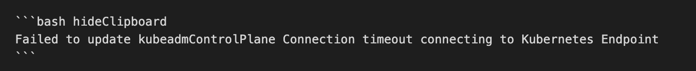
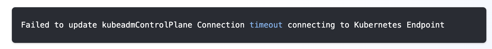

<!-- vale off -->
# Overview


Welcome to the Spectro Cloud documentation repository. To get started with contributions, please review the entire README. 

For internal Spectro Cloud users, please review the [contributions](https://spectrocloud.atlassian.net/wiki/spaces/DE/pages/1765572627/Contribution) section of the Documentation & Education's teams home page. 

There are two local development paths available; Docker based, and non-Docker based. To reduce complexities, we recommended the Docker based development approach. 

## Prerequisites

To contribute, we recommend having the following software installed locally on your workstation.

- Text Editor
- [Docker](https://docs.docker.com/desktop/)
- git configured and access to github repository
- node and npm (optional)

## Local Development (Docker)

To get started with the Docker based local development approach ensure you are in the root context of this repository. 

Next, issue the following command to build the Docker image.

**Note**: The first time issuing the command may take several minutes.

```shell
make docker-image
```

To start the Dockererized local development server, issue the command:

```
make docker-start
```

The local development server is ready when the following output is displayed in your terminal.

```shell
You can now view root in the browser.
⠀
  Local:            http://localhost:3000/
  On Your Network:  http://172.17.0.2:3000/
⠀

Visit [http://localhost:3000](http://localhost:3000) to view the local development documentation site.

To exit from the local development Docker container. Press `Ctrl + Z`.

## Local Development Setup (Non-Docker)

Make a folder somewhere you can easily find

```sh
mkdir ~/Work
```

Clone the repository and run the initialization script

```sh
cd Work
git clone https://github.com/spectrocloud/librarium.git
cd librarium
make initialize
```

# Documentation Content

Create a branch if needed. This will keep your work separated from the rest of your changes.

```sh
git checkout -b <branch_name>
```

To preview your changes use the following.

```sh
make start
```

This will open your browser to this address: http://localhost:3000

Open `~/Work/librarium/content/docs` in your editor and make changes. They should be synced up in the browser window.

When you are done with some changes you can create a commit

```sh
make commit MESSAGE="<your message here>"
```

This will open your browser with the commit. Once the pull request is created a link will be added in the comments to preview the change in a staging environment.

## Creating pages

The documentation website is structured in a sidebar with main pages and sub-pages. Main pages will contain an overview of the its sub pages.

### Anatomy of a documentation page

The **navigation** sidebar will be something across all pages.

The **header** will have a search bar and some links to different other sections of the documentation (api)

The page **content** will be displayed under the header and next to the sidebar.
On it's right there will be a **table of contents** menu that will extract all of the headers inside the content and display them in a list.
This will follow the user as he scroll the page.
On top of the table of contents there will be a **github link** to the content of the file. This can be used by users to submit changes to different sections of our documentation

### Main pages

Create a page with the filename `<url-using-dashes>.md` in the `docs-content` folder of the `content` directory. For positioning the document in the sidebar, you can use `sidebar_position: 1` in the front matter. To manage folders, create a `_category_.json` file with `{position: 1}` inside the desired directory.

**Example of attributes**

```markdown
---
title: "Introduction"
sidebar_label: "Introduction"
description: "Palette API Introduction"
hide_table_of_contents: false
sidebar_custom_props: 
  icon: "graph"
---
```

| attribute                      | type    | description                                                                                                 |
| ------------------------------ | ------- | ----------------------------------------------------------------------------------------------------------- |
| sidebar_label                  | string  | used as the label for navigation                                                                            |
| title                          | string  | will appear on the browser window / tab as the title                                                        |
| description                    | string  | the text to display when a page is shared in social media platforms                                         |
| `sidebar_custom_props:`<br>` icon: "graph"`  | string  | one of icons from https://fontawesome.com/icons?d=gallery                                                   |      
| hide_table_of_contents         | boolean | setting this to `false` will hide the page from the navigation                                              |

### Sub pages

Create a folder using the **same name** of the main page. Inside of it use the same name convention (`<url-using-dashes>.md`) to create subpages.

The index document for a folder follows the naming convention below. Here are some examples:

- Named as index (case-insensitive): `docs/Guides/index.md`
- Named as README (case-insensitive): `docs/Guides/README.mdx`
- Same name as the parent folder: `docs/Guides/Guides.md`

#### Referencing a page

The url of a page will be composed from the path of the file relative to the `content` directory.

**Example** docs/content/1-introduction/1-what-is.md will have http://localhost:3000/introduction/what-is as the url

In markdown you can reference this page relatively to the root of the domain using this syntax:

```md
[Go to introduction](/introduction/what-is)
```

You can also reference pages that reside in the document folder, such as index pages. An example is the Dev Engine index page `/docs/04.5-devx.md`. To reference the Dev Engine index page in a documentat page, referce the page by the title.

```md
[Go to Dev Enging](/devx)
```
### Redirects

To add a redirect to an existing documentation page you must add an entry to the [redirects.js](/src/shared/utils/redirects.js) file. Below is an example of what a redirect entry should look like.

```js
  {
    from: `/clusters/nested-clusters/`,
    to: `/clusters/sandbox-clusters`,
  },
```

#### Multi Object Selector

The Packs integration page and the Service Listings page use a component to display the various offerings. 
Packs intergations use the `<Packs />` component, whereas the Service Tiers from App Mode use the `<AppTiers />` component.

To add a Pack to the list complete the following actions:

- Add a new markdown page for the Pack.
- In the frontmatter set the type to the following value: `type: "integration"`.
- Populate the page with content.


To add a Service to the Service List complete the following actions:

- Add a new markdown page for the App Mode Service.
- In the frontmatter set the type to the following value: `type: "appTier"`.
- Populate the page with content.


#### Images or other assets

All images must reside in the [`assets/docs/images`](./assets/docs/images/) folder.

```md

```

You can add a directory to to the images folder.

```md

```

**Image Loading**
Image size loading can be customised. You can provide eager-load to images in the first fold of the image with high priority as LCP (Largest contentful Paint) for the page will not be affected

```md

```

#### Tabs component

To use the tabs component you have to import it from the _shared_ folder

After that, you can use it like this

```js
<Tabs>
  <TabItem label="AWS" value="aws">
    # AWS cluster Lorem ipsum dolor sit amet, consectetur adipiscing elit.
  </TabItem>
  <TabItem label="VMware" value="vmware">
    # VMware cluster Lorem ipsum dolor sit amet, consectetur adipiscing elit.
  </TabItem>
</Tabs>
```

**Note**: If you want to navigate from one page to another(which has tabs) and default tab to specific key then you must

- provide an identifier to the `Tabs` component `<Tabs queryString="clusterType">...</Tabs>`
- when creating the link to this page, include (in the query) the identifier provided and the **value** you want (eg: /clusters?clusterType=aws#section1)
- the values can be one of the tab panel keys
- additionally you may refer to different sections from the inner tab using the anchor points(using the #section-1)

#### YouTube Video

To use a Youtube video us the YouTube component.

In your markdown file, use the component and ensure you specify a URL.

```js
<YouTube url="https://www.youtube.com/embed/wM3hcrHbAC0" title="Three Common Kubernetes Growing Pains  - and how to solve them" />
```
### Points of interest component


```js
<PointsOfInterest
  points={[
    {
      x: 20,
      y: 20,
      label: 1,
      description: "Lorem ipsum dolor sit amet, consectetur adipiscing elit.",
      tooltipPlacement: "rightTop",
    },
    {
      x: 80,
      y: 100,
      label: 2,
      description: "Lorem ipsum dolor sit amet, consectetur adipiscing elit.",
    },
    {
      x: 220,
      y: 230,
      description: "Lorem ipsum dolor sit amet, consectetur adipiscing elit.",
      tooltipPlacement: "rightTop",
    },
  ]}
>
  *Markdown content*
</PointsOfInterest>
```

**x** and **y** properties refer to the coordinates of the point starting from the **top-left corner** of the markdown container.

**Note**: **_x_**, **_y_**, **_description_** properties are **mandatory**. **_label_** and **_tooltipPlacement_** properties are optional.

If no label is specified, the default one is "+".

Possible placements are: _topLeft_, _top_, _topRight_, _rightTop_, _right_ (default), _rightBottom_, _bottomRight_, _bottom_, _bottomLeft_, _leftBottom_, _left_, _leftTop_.

### Tooltip

```js
<Tooltip>tooltip content</Tooltip>
```

**Notes**

- The tooltip icon can be customized by sending a [font awesome](https://fontawesome.com/icons?d=gallery) icon

```js
<Tooltip icon="atom">tooltip content</Tooltip>
```

- If needed, the icon can be replace with text or other html tags using the trigger property:

```js
<Tooltip trigger={<button>This is a button</button>}>
  <h1>This is a h1 inside the tooltip</h1>
</Tooltip>
```

- If used inside a paragraph or other md elements the entire "block" needs to be on the same line

```js
Hello <Tooltip trigger="world">tooltip content</Tooltip>! It's me Mario
```

### Code lines highlighter

You can highlight specific lines in a block of code by adding **coloredLines** prop.

_Example_: ` ```js {2-4,5-7}`.
This will color the lines from 2 to 4 and from 5 to 7.

_Components_:

- `2-4` - lines interval to be colored
- `,` - separator for different colored lines intervals

Example 


https://docusaurus.io/docs/markdown-features/code-blocks#highlighting-with-comments


#### Hide ClipBoard Button

The copy button is shown by default in all code blocks. You can disable the copy button by passing in the parameter value `hideClipboard` in the markdown declaration of the code blocks. 

Example 


Result




### Admonitions - Warning / Info Box

:::note

Some **content** with _Markdown_ `syntax`. Check [this `api`](#).

:::


:::caution

Some **content** with _Markdown_ `syntax`. Check [this `api`](#).

:::

https://docusaurus.io/docs/markdown-features/admonitions


The content must have a new line at the beginning and at the end of the tag like this:

### Video

To add a video, use the following syntax:

```
<video src="/aws-full-profile.mp4"></video>
```


```
<video title="vsphere-pcg-creation" src="/cluster-creation-videos/vmware.mp4"></video>
```

## Netlify Previews
By default Netlify previews are enabled for pull requests. However, some branches do not require Netlify previews. In the [netlify.toml](./netlify.toml) file, a custom script is used to determine if a Netlify preview should be created. The script is located in the [scripts/netlify.sh](./scripts/netlify.sh) file. If you need to disable Netlify previews for a branch, add the branch name to the `allowed_branches` variable in the [scripts/netlify.sh](./scripts/netlify.sh) file.

## Approvers/Reviewers

The content in the `docs/` folder require approval from the documentation team. The list of approvers and reviewers can be found in the [OWNERS_ALIAS](./content/OWNER_ALIASES) file. Only members of the documentation team may modify this file.

# Check Writing

We leverage [Vale](https://vale.sh/) to help us enforce our writing style programmatically and to avoid common writing mistakes. The writing checks are executed upon a pull request. You may also conduct a writing check locally by using the Vale CLI. Follow the steps below to install the Vale CLI and execute the writing checks.

Start by installing Vale by following the [installation steps](https://vale.sh/docs/vale-cli/installation/) in the Vale documentation.

Next, download the required Vale plugins.

```
make sync-vale
```

To execute the writing check, issue the command below. The command below will identify files that are modified by comparing the current git branch against the `master` branch. Ensure your local `master` branch is up to date for accurate results.

```
make check-writing 
```

You may also use the Vale CLI to directly scan a file and receive feedback. 

Example: 

```shell
vale content/docs/08-user-management.md
```

## Modify Writing Rules

The [vale.ini](vale.ini) file contains the configuration for Vale. Changes to [vale.ini](vale.ini), [accept.txt](/vale/styles/Vocab/Internal/accept.txt), and [reject.txt](/vale/styles/Vocab/Internal/reject.txt) require approval by the [docs-education](https://github.com/orgs/spectrocloud/teams/docs-education) team.

### Disable Rule
To disable a specific rule, add the rule name and the word "NO" to the  vale.ini](vale.ini) file.

Example:
```
Google.Headings = NO
```

### Approved Words

Approved words can be found in the [accept.txt](/vale/styles/Vocab/Internal/accept.txt) file. You can add or remove words from the list by modifying the file.

### Rejected Words

Rejected words automatically get flagged by Vale. To modify the list of rejected words, modify the [reject.txt](/vale/styles/Vocab/Internal/reject.txt) file.


# Release

To create a new release, use the following steps:

1. Create a release branch. Use the following naming pattern `release-X-X`
2. Create a commit using the following commit message `feat: updating documentation for release-X-X`. Replace x-x with the upcoming release number.
3. Push up the commit and create a new pull request (PR).
4. Merge PRs related to the upcoming release into the `release-X-X` branch.
5. Merge the release branch.

The semantic-release logic and the GitHub Actions in the [release.yaml](.github/workflows/release.yaml) will ensure the new release tag is created. 

> **Warning**
> Do not use `feat`,`perf` or `fix` or other semantic-release key words that trigger a version change. Use the commit message prefix `docs: yourMessageHere` for regular documentation commits.
