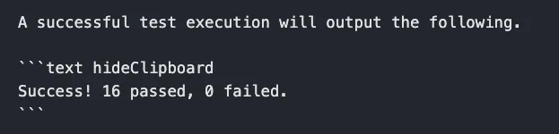
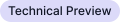

<!-- vale off -->

# Overview


Welcome to the Spectro Cloud documentation repository. To get started with contributions, please review the entire
README.

For internal Spectro Cloud users, please review the
[contributions](https://spectrocloud.atlassian.net/wiki/spaces/DE/pages/1765572627/Contribution) section of the
Documentation & Education's teams home page.

There are two local development paths available; Docker based, and non-Docker based. To reduce complexities, we
recommended the Docker based development approach.

## Prerequisites

To contribute, we recommend having the following software installed locally on your workstation.

- VScode or a text editor

- [Docker](https://docs.docker.com/desktop/)

- git configured and access to github repository

- Node.js v20 and npm.

- [Vale](https://vale.sh/docs/vale-cli/installation/), version 3.6.0 or higher.

## Local Development (Docker)

To get started with the Docker-based local development approach, ensure you are in the root context of this repository.

Initialize the repository by issuing the following command:

```shell
make init
```

By default, the [Packs component](#packs-component) is disabled. If you would like to enable it, then add your Palette
API key and set `DISABLE_PACKS_INTEGRATIONS` to `false` in the `.env` file. Replace `<your-palette-api-key>` with your
Palette API key.

```shell
PALETTE_API_KEY="<your-palette-api-key>"
DISABLE_PACKS_INTEGRATIONS=false
```

> [!IMPORTANT] You need a Palette API key to start the local development server. Refer to the
> [Create API Key](https://docs.spectrocloud.com/user-management/authentication/api-key/create-api-key/) guide to learn
> how to create a Palette API key.

Issue the following command to build the Docker image and start the Dockererized local development server. The command
may take several minutes to complete.

```shell
make docker-start
```

The local development server is ready when the following output is displayed in your terminal.

```shell
> spectro-cloud-docs@4.0.0 start
> docusaurus start --host 0.0.0.0 --port 9000

[INFO] Starting the development server...
[SUCCESS] Docusaurus website is running at: http://localhost:9000/

✔ Client
  Compiled successfully in 8.39s

client (webpack 5.88.2) compiled successfully
```

Open up a browser and navigate to [http://localhost:9000](http://localhost:9000) to view the documentation website.

To exit from the local development Docker container. Press `Ctrl + Z`.

## Local Development Setup (Non-Docker)

Clone the repository and run the initialization script.

```sh
cd Work
git clone https://github.com/spectrocloud/librarium.git
cd librarium
make init
```

Next, add your Palette API key to the `.env` file. Replace `<your-palette-api-key>` with your Palette API key.

```shell
PALETTE_API_KEY="<your-palette-api-key>"
```

> [!IMPORTANT] You need a Palette API key to start the local development server. Refer to the
> [Create API Key](https://docs.spectrocloud.com/user-management/authentication/api-key/create-api-key/) guide to learn
> how to create a Palette API key.

By default, last update times are hidden on local development. You can enable them by setting the
`SHOW_LAST_UPDATE_TIME` variable in you `.env` file.

```shell
SHOW_LAST_UPDATE_TIME=true
```

## Documentation Content

Create a branch to keep track of all your changes.

```sh
git checkout -b <branch_name>
```

Make changes to any markdown files in the [`docs/docs-content`](./docs/docs-content/) folder.

Start the local development server and preview your changes by navigating to the documentation page you modified. You
can start the local development server by issuing the following command:

```sh
make start
```

When you are done with your changes, stage your changes and create a commit

```sh
git add -A && git commit -m "docs: your commit message here"
```

## API Docs Generation

API documentation is generated by the
[OpenAPI plugin for Docusaurus](https://github.com/PaloAltoNetworks/docusaurus-openapi-docs).

We have two different OpenAPI spec files (also known as Swagger files) for two sets of APIs.

- [Palette API](./docs/api-content/api-docs/v1/api.json)
- [Edge Management API](./docs/api-content/api-docs/edge-v1/emc-api.json)

The Palette API is exposed on each instance of Palette, while the Edge management is available on each Edge host.

The make command `make api` runs the `generate-api-docs` npm script:

```bash
npm run run-api-parser && docusaurus gen-api-docs palette && docusaurus gen-api-docs emc
```

This script invokes an [API parser script](./utils/api-parser/index.js) to process both OpenAPI spec files, and then
runs the plugin on both of the processed spec files to generate the API pages. The plugin is contained in the
`docusaurus.config.js` file.

The `make clean-api` command will delete the generated API pages from both spec files. All generated API pages are
excluded from Git since they can be generated by their respective spec files.

The placement of the spec files are important. You must place the new spec files in the same location to replace the old
spec files in an update. If you want to move the files, you'll need to update their configured locations in the
`docusaurus.config.js` file, as well as the API parser script.

## Creating Pages

The documentation website is structured in a sidebar with main pages and sub-pages. Main pages will contain an overview
of the its sub pages.

### Anatomy of a documentation page

The **navigation** sidebar will be something across all pages.

The **header** will have a search bar and some links to different other sections of the documentation (api)

The page **content** will be displayed under the header and next to the sidebar. On it's right there will be a **table
of contents** menu that will extract all of the headers inside the content and display them in a list. This will follow
the user as he scroll the page. On top of the table of contents there will be a **github link** to the content of the
file. This can be used by users to submit changes to different sections of our documentation.

### Main Pages

Create a page with the filename `<url-using-dashes>.md` in the `docs-content` folder of the `content` directory. For
positioning the document in the sidebar, you can use `sidebar_position: 1` in the front matter. To manage folders,
create a `_category_.json` file with `{position: 1}` inside the desired directory.

**Example of attributes**

```markdown
---
title: "Introduction"
sidebar_label: "Introduction"
description: "Palette API Introduction"
hide_table_of_contents: false
sidebar_custom_props:
  icon: "graph"
---
```

#### Front Matter Attributes

| attribute                                   | type    | description                                                                                             |
| ------------------------------------------- | ------- | ------------------------------------------------------------------------------------------------------- |
| `sidebar_label`                             | string  | used as the label for navigation                                                                        |
| `title`                                     | string  | will appear on the browser window / tab as the title                                                    |
| `description`                               | string  | the text to display when a page is shared in social media platforms                                     |
| `sidebar_custom_props:`<br>` icon: "graph"` | string  | one of icons from https://fontawesome.com/icons?d=gallery                                               |
| `hide_table_of_contents`                    | boolean | setting this to `false` will hide the page from the navigation                                          |
| `sidebar_position`                          | number  | the position of the page in the navigation sidebar. The pages are sorted ascending by this value        |
| `toc_min_heading_level`                     | number  | the minimum heading level to show in the table of contents. The default value for all documents is `2`. |
| `toc_max_heading_level`                     | number  | the maximum heading level to show in the table of contents. The default value for all documents is `3`. |
| `tags`                                      | array   | A list of string that can be used for additonal categorization of content.                              |
| `keywords`                                  | array   | A list of strings that areused for SEO purposes.                                                        |

### Sub pages

Create a folder using the **same name** of the main page. Inside of it use the same name convention
(`<url-using-dashes>.md`) to create subpages.

The index document for a folder follows the naming convention below. Here are some examples:

- Named as index (case-insensitive): `docs/Guides/index.md`
- Named as README (case-insensitive): `docs/Guides/README.mdx`
- Same name as the parent folder: `docs/Guides/Guides.md`

### Markdown Links and URLs

Markdown links use file path references to link to other documentation pages. The markdown link is composed of the file
path to the page in context from the current file. All references to a another documentation page must end with the
`.md` extension. Docusaurus will automatically remove the `.md` extension from the URL during the compile. The file path
is needed for Docuasurus to generate the correct URL for the page when versioning is enabled.

The following example shows how to reference a page in various scenarios. Assume you have the following folder structure
when reviewing the examples below:

```shell
.
└── docs
    └── docs-content
        ├── architecture
        │   ├── grpc.md
        │   └── ip-addresses.md
        ├── aws
        │   └── iam-permissions.md
        ├── clusters
        └── security.md
```

#### Same Folder

To link to a file in the same folder, you can use the following syntax:

```md

```

Because the file is in the same folder, you do not need to specify the path to the file. Docusaurus will automatically
search the current folder for the file when compiling the markdown content.

So, if you are in the file `grpc.md` and want to reference the file `ip-addresses.md`, you would use the following
syntax:

```md

```

#### Different Folder

If you want to link to a file in a different folder, you have to specify the path to the file from where the current
markdown file is located.

If you are in the file `security.md` and want to reference the file `iam-permissions.md`, you have to use the following
syntax:

```md

```

If you are in the file `grpc.md` and want to reference the file `iam-permissions.md`, you have to use the following
syntax:

```md

```

#### A Heading in the Same File

To link to a heading in the same file, you can use the following syntax:

```md
[Link to a heading in the same file](#heading-name)
```

The `#` symbol is used to reference a heading in the same file. The heading name must be in lowercase and spaces must be
replaced with a `-` symbol. Docusaurs by default uses dashes to separate words in the URL.

#### A Heading in a Different File

To link to a heading in a different file, you can use the following syntax:

```md
[Link to a heading in a different file](name_of_file.md#heading-name)
```

For example, if you are in the file `grpc.md` and want to reference the heading `Palette gRPC API` in the file
`security.md`, you would use the following syntax:

```md
[Link to a heading in a different file](../security.md#palette-grpc-api)
```

The important thing to remember is that the `#` comes after the file name and before the heading name.

#### Exceptions

As of Docusarus `2.4.1`, the ability to link to documentation pages that belong to another plugin is unavailable. To
work around this limitation, reference a documentation page by the URL path versus the file path.

```md
[Link to a page in another plugin](/api-content/authentication#api-key)
```

> [!WARNING] Be aware that this approach will break versioning. The user experience will be impacted as the user will be
> redirected to the latest version of the page.

In future releases, Docusaurus will support linking pages from other Docusarus plugins. Once this feature is available,
this documentation will be updated.

### Redirects

To add a redirect to an existing documentation page you must add an entry to the
[redirects.js](/src/shared/utils/redirects.js) file. Below is an example of what a redirect entry should look like.

```js
  {
    from: `/clusters/nested-clusters/`,
    to: `/clusters/sandbox-clusters`,
  },
```

### Multi Object Selector

The Packs integration page and the Service Listings page use a component to display the various offerings. Packs
intergations use the `<Packs />` component, whereas the Service Tiers from App Mode use the `<AppTiers />` component.

To add a Pack to the list complete the following actions:

- Add a new markdown page for the Pack.
- In the frontmatter set the type to the following value: `type: "integration"`.
- Populate the page with content.

To add a Service to the Service List complete the following actions:

- Add a new markdown page for the App Mode Service.
- In the frontmatter set the type to the following value: `type: "appTier"`.
- Populate the page with content.

### Images or other assets

All images must reside in the [`static/assets/docs/images`](./static/assets/docs/images/) folder. All images must be in
webp format. You can save png, jpg, or jpeg to the directory. The commit hook will convert the images to webp format. Or
issue the command `make format-images` to convert the images to webp format.

```md

```

You can add a directory to to the images folder.

```md

```

**Image Loading** Image size loading can be customised. You can provide eager-load to images in the first fold of the
image with high priority as LCP (Largest contentful Paint) for the page will not be affected

```md

```

### Tabs component

To use the tabs component you have to import it from the _shared_ folder

After that, you can use it like this

```js
<Tabs queryString="platform">
  <TabItem label="AWS" value="aws">
    # AWS cluster Lorem ipsum dolor sit amet, consectetur adipiscing elit.
  </TabItem>
  <TabItem label="VMware" value="vmware">
    # VMware cluster Lorem ipsum dolor sit amet, consectetur adipiscing elit.
  </TabItem>
</Tabs>
```

**Note**: If you want to navigate from one page to another(which has tabs) and default tab to specific key then you must

- provide an identifier to the `Tabs` component `<Tabs queryString="clusterType">...</Tabs>`
- when creating the link to this page, include (in the query) the identifier provided and the **value** you want (eg:
  /clusters?clusterType=aws#section1)
- the values can be one of the tab panel keys
- additionally you may refer to different sections from the inner tab using the anchor points(using the #section-1)

### YouTube Video

To use a Youtube video us the YouTube component.

In your markdown file, use the component and ensure you specify a URL.

```js
<YouTube
  url="https://www.youtube.com/embed/wM3hcrHbAC0"
  title="Three Common Kubernetes Growing Pains  - and how to solve them"
/>
```

### Points of Interest

```js
<PointsOfInterest
  points={[
    {
      x: 20,
      y: 20,
      label: 1,
      description: "Lorem ipsum dolor sit amet, consectetur adipiscing elit.",
      tooltipPlacement: "rightTop",
    },
    {
      x: 80,
      y: 100,
      label: 2,
      description: "Lorem ipsum dolor sit amet, consectetur adipiscing elit.",
    },
    {
      x: 220,
      y: 230,
      description: "Lorem ipsum dolor sit amet, consectetur adipiscing elit.",
      tooltipPlacement: "rightTop",
    },
  ]}
>
  *Markdown content*
</PointsOfInterest>
```

**x** and **y** properties refer to the coordinates of the point starting from the **top-left corner** of the markdown
container.

> [!NOTE]
>
> The **_x_**, **_y_**, and **_description_** properties are **mandatory**. The **_label_** and **_tooltipPlacement_**
> properties are optional.

If no label is specified, the default one is "+".

Possible placements are: _topLeft_, _top_, _topRight_, _rightTop_, _right_ (default), _rightBottom_, _bottomRight_,
_bottom_, _bottomLeft_, _leftBottom_, _left_, _leftTop_.

### Tooltip

```js
<Tooltip>tooltip content</Tooltip>
```

**Notes**

- The tooltip icon can be customized by sending a [font awesome](https://fontawesome.com/icons?d=gallery) icon

```js
<Tooltip icon="atom">tooltip content</Tooltip>
```

- If needed, the icon can be replace with text or other html tags using the trigger property:

```js
<Tooltip trigger={<button>This is a button</button>}>
  <h1>This is a h1 inside the tooltip</h1>
</Tooltip>
```

- If used inside a paragraph or other md elements the entire "block" needs to be on the same line

```js
Hello <Tooltip trigger="world">tooltip content</Tooltip>! It's me Mario
```

### Code Lines Highlighter

You can highlight specific lines in a block of code by adding **coloredLines** prop.

_Example_: ` ```js {2-4,5-7}`. This will color the lines from 2 to 4 and from 5 to 7.

_Components_:

- `2-4` - lines interval to be colored
- `,` - separator for different colored lines intervals

Example

https://docusaurus.io/docs/markdown-features/code-blocks#highlighting-with-comments

#### Hide ClipBoard Button

The copy button is shown by default in all code blocks. You can disable the copy button by passing in the parameter
value `hideClipboard` in the markdown declaration of the code blocks.

Example 

Result


### Admonitions - Warning / Info / Tip / Danger / Tech Preview / Further Guidance

```mdx
:::warning

Some **content** with _Markdown_ `syntax`.

:::
```

```mdx
:::info

Some **content** with _Markdown_ `syntax`.

:::
```

```mdx
:::tip

Some **content** with _Markdown_ `syntax`.

:::
```

```mdx
:::danger

Some **content** with _Markdown_ `syntax`.

:::
```

```mdx
:::preview

Some **content** with _Markdown_ `syntax`.

:::
```

```mdx
:::further

Some **content** with _Markdown_ `syntax`.

:::
```

https://docusaurus.io/docs/markdown-features/admonitions

The content must have a new line at the beginning and at the end of the tag.

For guidance on using admonitions, refer to
[Spectro Cloud Internal Style Guide: Admonitions/Callouts](https://spectrocloud.atlassian.net/wiki/spaces/DE/pages/1765933057/Spectro+Cloud+Internal+Style+Guide#Admonitions%2FCallouts).

### Video

To add a video, use the following syntax. Ensure you capitalize the letter "V":

```mdx
<Video src="/aws-full-profile.mp4"></Video>
```

```mdx
<Video title="vsphere-pcg-creation" src="/cluster-creation-videos/vmware.mp4"></Video>
```

### Badges

The following badges are available for use:

> [!NOTE]
>
> All badges are globally available. No need to import them.

- Technical Preview Badge 
  

#### Technical Preview Badge

The technical preview badge is used to indicate that a feature is in technical preview. The badge is intended for
release notes in the context of a list. The following is an example of how to use the technical preview badge. The
component will automatically display the badge in the correct color based on the light theme (dark/light).

```markdown
- <TpBadge /> Cluster Profile variables, a new feature that allows you to define variables in a cluster profile. This
  feature is in Tech Preview and is available only for Edge clusters. Profile variables allow you to define variable
  types, apply validation, and more. Refer to the Cluster Profile Variables documentation to learn more about profile
  variables.
```

### Simple Card Grid

This is a custom component that creates a grid of simple text cards with two columns, styled according to our color
scheme. The rows of cards are dynamically created according to the list of specified cards. This component uses the
`VersionedLink` under the covers. URLs should be specified as discussed in the [Internal Links](#internal-links)
section.

```js
<SimpleCardGrid
  cards={[
    {
      title: "Lorem Ipsum",
      description: "Lorem ipsum dolor sit amet, consectetur adipiscing elit.",
      buttonText: "Learn more",
      url: "/path/to/link",
    },
    {
      title: "Lorem Ipsum",
      description: "Lorem ipsum dolor sit amet, consectetur adipiscing elit.",
      buttonText: "Learn more",
      url: "/path/to/link",
    },
    {
      title: "Lorem Ipsum",
      description: "Lorem ipsum dolor sit amet, consectetur adipiscing elit.",
      buttonText: "Learn more",
      url: "/path/to/link",
    },
  ]}
/>
```

## Tutorials Sidebar

This section describes how to publish new tutorials and add new categories to the Tutorials sidebar.

### Add a New Category

To add a new sidebar category to Tutorials, create a new directory under `docs/docs-content/tutorials`. For example,
let's add a directory called `new-tutorials`.

> [!NOTE]  
> Each category directory must have at least one **.md** file to render in the sidebar. If you add an empty directory to
> `sidebars.js`, the build will break.

```shell
.
├── _category_.json
├── cluster-deployment
│   ├── _category_.json
│   ├── pcg
│   │   ├── _category_.json
│   └── └── deploy-app-pcg.md
└── new-tutorials
    ├── _category_.json
    └── new-tutorial
```

Then, add the following code to the `tutorialSidebar` array in the `sidebars.js` file.

```js
tutorialSidebar: [
  {
    type: "category",
    label: string,
    className: "category",
    collapsed: false,
    collapsible: false,
    items: [{ type: "autogenerated", dirName: "tutorials/new-tutorials" }],
    customProps: {
      icon: string,
    },
  },
  ...
];
```

Consider the following example for reference.

```js
tutorialSidebar: [
    {
      type: "category",
      label: "Edge",
      className: "category",
      collapsible: false,
      collapsed: false,
      items: [{ type: "autogenerated", dirName: "tutorials/edge" }],
      customProps: {
        icon: "microchip",
      },
    },
  ...
];
```

### Publish New Tutorials

To add tutorials to an existing category, create a new **.md** file in the respective directory under
`docs-content/tutorials` and follow the guidance outlined in [Creating Pages](#creating-pages).

## Partials Component

This is a custom component that allows you to create and use Docusaurus'
[Import Markdown](https://docusaurus.io/docs/markdown-features/react#importing-markdown) functionality.

> [!IMPORTANT]
>
> Docusaurus does not provide the ability to dynamically configure table of contents. See
> [this issue](https://github.com/facebook/docusaurus/issues/6201) for more information. This means that you should
> avoid adding headings to partials that you intend to use with the Partials Component.
>
> If you require headings, then you should import your partials using the guidance on the Docusaurus
> [Import Markdown](https://docusaurus.io/docs/markdown-features/react#importing-markdown) page.

Partials must be created under the `_partials` folder. They must be named using an `_` prefix and the `*.mdx` filetype.
Partials may be organised in any further subfolders as required. For example, you could create
`_partials/public-cloud/_palette_setup.mdx`.

In order to aid with organisation and categorization, partials must have a `partial_category` and `partial_name` defined
in their frontmatter:

```mdx
---
partial_category: public-cloud
partial_name: palette-setup
---

This is how you set up Palette in {props.cloud}.
```

Partials are customized using properties which can be read using the `{props.field}` syntax.

Once your partial has been created, run the `make generate-partials` command to make your partial available for use.
This command will also be invoked during the `make start` and `make build` commands.

Finally, you can reference your partial in any `*.md` file by using the `PartialsComponent`, together with the specified
category and name of the partial:

```md
<PartialsComponent
  category="example-cat"
  name="example-name"
  message="Hello!"
/>
```

The snippet above will work with the example partial we have in our repository, so you can use it for testing.

Note that the `message` field corresponds to the `{props.message}` reference in the `_partials/_partial_example.mdx`
file.

### Internal Links

Due to the complexities of Docusaurus plugin rendering, links do not support versioning in `*.mdx` files. If you want to
add an internal link you will have to use the `VersionedLink` component inside the `*.mdx` file.

```mdx
---
partial_category: public-cloud
partial_name: palette-setup
---

This is how you set up Palette in {props.cloud}.

This is an <VersionedLink text="Internal Link" url="/getting-started/additional-capabilities"/>.
```

The path of the link should be the path of the destination file from the root directory, without any back operators
`..`. External links can be referenced as usual.

## Palette/VerteX URLs

A special component has been created to handle the generation of URLs for Palette and VerteX. The component is called
[PaletteVertexUrlMapper](./src/components/PaletteVertexUrlMapper/PaletteVertexUrlMapper.tsx). This component is intended
for usage withing partials. You can use the component to change the base path of the URL to either Palette or VerteX.
The component will automatically prefix the path to the URL. The component has the following props:

- `edition` - The edition of the URL. This can be either `Palette` or `Vertex`. Internally, the component will use this
  value to determine the base URL.
- `text` - The text to display for the link.
- `url` - The path to append to the base URL.

Below is an example of how to use the component:

```mdx
- System administrator permissions, either a Root Administrator or Operations Administrator. Refer to the
  <PaletteVertexUrlMapper
    edition={props.edition}
    text="System Administrators"
    url="/system-management/account-management"
  />
  page to learn more about system administrator roles.
```

In cases where Palette and Vertex pages have different URLs beyond the base path, the component will accept the
following props:

- `edition` - The edition of the URL. This can be either `Palette` or `Vertex`. Internally, the component will use this
  value to determine the base URL.
- `text` - The text to display for the link.
- `palettePath` - The Palette path to append to the base URL.
- `vertexPath` - The VerteX path to append to the base URL.

Below is an example of how to use the component when the URLs are different:

```mdx
- System administrator permissions, either a Root Administrator or Operations Administrator. Refer to the
  <PaletteVertexUrlMapper
    edition={props.edition}
    text="System Administrators"
    palettePath="/system-management/account-management"
    vertexPath="/system-management-vertex/account-management"
  />
  page to learn more about system administrator roles.
```

## Security Bulletins

The security bulletins are auto-generated upon server start or the build process. The bulletins are generated by
querying an internal Spectro Cloud API. The bulletins are displayed in the security bulletins page
`https://docs.spectrocloud.com/security-bulletins/reports/`.

The logic for generated the security bulletins is located in the [cves folder](./utils/cves/index.js). The script is
invoked before a build or a local development server start. The script will fetch the security bulletins and store the
data in the `.docusaurus/security-bulletins/default/` folder. The data is stored in the `data.json` file.

The script will also generate each markdown file for each security bulletin. The markdown files are stored in the
`/security-bulletins/reports/` folder.

### Disable Security Bulletins

To disable the security bulletins, you can set the environment variable `DISABLE_SECURITY_INTEGRATIONS` to `true`. This
will stop the pre-build script from fetching the security bulletins.

```shell
export DISABLE_SECURITY_INTEGRATIONS=true
```

### Cached Security Bulletins

All CVE related data is saved to a
[GitHub Workflow Artifact](https://docs.github.com/en/actions/writing-workflows/choosing-what-your-workflow-does/storing-and-sharing-data-from-a-workflow#about-workflow-artifacts)
after every successful release to production. Check out the [post_release.yaml](.github/workflows/post_release.yaml) for
further details. The cached data enables us to build and start librarium without performing any CVE-related API queries.
All of our GitHub workflows will use this cached data as a fallback in the case of an API related build failure. Check
out the [build-cached-cves action.yaml](.github/actions/build-cached-cves/action.yaml) to learn how the cached data is
fetched and used.

CVE data is saved locally in the `.docusaurus/security-bulletins/default/data.json` file. You can remove the data using
`make clean-security`. You can use the cached CVE artifact locally when you want to avoid the CVE download time. This
flow also helps you when you don't have any local CVE data and we are experiencing an API outage.

librarium provides the following commands which fetch cached CVE data to your local environment.

| **Command**              | **Description**                                                                                                                                |
| ------------------------ | ---------------------------------------------------------------------------------------------------------------------------------------------- |
| `make get-cached-cves`   | Fetch the CVE data artifact and place files in the correct places. You can then execute `make start` or `make build` as usual.                 |
| `make start-cached-cves` | Attempt to start the local development server. If a CVE related outage is detected, fetch the CVE data artifact and retry the `start` command. |
| `make build-cached-cves` | Attempt to build the application. If a CVE related outage is detected, fetch the CVE data artifact and retry the `build` command.              |

These scripts will prompt you to install and authenticate the [GitHub CLI](https://cli.github.com/) before you can
proceed.

## Packs Component

The packs component is a custom component that displays all packs available in Palette SaaS by querying the Palette API
at `api.spectrocloud.com`. The component is powered by a [custom plugin](./plugins/packs-integrations.js) that fetches
the data before a build or a local development server start.

> [!NOTE]
>
> The data is stored in the file `.docusaurus/packs-integration/api_pack_response.json` once all the packs are fetched.
> The logos are stored in `static/img/packs/`. If you remove the `.docusarus` folder, the plugin will fetch the packs
> again. If the pack's data is present, the plugin will skip re-downloading the data. If you want to remove the packs
> data and trigger a new fetch, you can issue the following command `make clean-packs`.

Pack descriptions are stored in a JSON file maintained by the documentation team. The JSON file is located at
[`/static/packs-data/packs_information.json`](./static/packs-data/packs_information.json). To add an entry for a new
pack, add the following JSON object to the file.

```json
{
  "name": "insert the name of the pack. DO NOT USE THE DISPLAY NAME",
  "description": "insert description here"
}
```

Some things to keep in mind related to descriptions. If the local development server is active and you make changes to
the `/static/packs-data/packs_information.json`file, the changes will not be reflected in the pack component. You must
stop and restart the local development server to observe the changes. The same applies to the build process. Another
thing to remember is to reference a pack by the name used in the Palette API, not the display name. You can find the
pack's name in the description component or by looking at the URL of the pack's page.

#### Exluding Packs

You can specify a list of packs to exclude from the packs component. To exclude a pack, add the pack name to the
[exclude_packs.json](./static/packs-data/exclude_packs.json) file.

<!-- prettier-ignore -->
```json
[
  "palette-upgrader", 
  "csi-aws-new", 
  "inser-pack-name-here"
]
```

Excluded packs are not displayed in the packs component.

#### Disable Plugin

To disable the packs plugin, you can set the `DISABLE_PACKS_INTEGRATIONS` environment variable to `true`. This will
prevent the plugin from running and fetching the packs data. The packs component will not display any data if the plugin
is disabled.

```shell
export DISABLE_PACKS_INTEGRATIONS=true
```

Settting the `DISABLE_PACKS_INTEGRATIONS` environment variable to `true` will also have the following effects:

- The PDE/App Mode Packs are still displayed.
- All production pack pages are added to the redirects file. This is to prevent broken URLs.
- Fallback logic is activated in the `PacksReadme`, `PacksInformation`, and `Packs` components. Redirect to the
  `integrations/` page is the new behavior.
- The Packs list page will display a warning message indicating that the packs data is not available.

#### Cached Packs Data

All pack related data is saved to a
[GitHub Workflow Artifact](https://docs.github.com/en/actions/writing-workflows/choosing-what-your-workflow-does/storing-and-sharing-data-from-a-workflow#about-workflow-artifacts)
after every successful release to production. Check out the [post_release.yaml](.github/workflows/post_release.yaml) for
further details. The cached data enables us to build and start librarium without performing any pack related API
queries. All of our GitHub workflows will use this cached data as a fallback in the case of an API related build
failure. Check out the [build-cached-packs action.yaml](.github/actions/build-cached-packs/action.yaml) to learn how the
cached data is fetched and used.

Packs data is saved locally in the `.docusaurus/packs-integrations` and `static/img/packs` folders. You can remove the
data using `make clean-packs`. You can use the cached packs artifact locally when you don't have any downloaded packs
data and you want to avoid the pack download time. This flow also helps you when you don't have any local packs data and
we are experiencing an API outage.

librarium provides the following commands which fetch cached packs to your local environment.

| **Command**               | **Description**                                                                                                                                    |
| ------------------------- | -------------------------------------------------------------------------------------------------------------------------------------------------- |
| `make get-cached-packs`   | Fetch the packs data artifact and pace files in the correct places. You can then execute `make start` or `make build` as usual.                    |
| `make start-cached-packs` | Attempt to start the local development server. If a packs related outage is detected, fetch the packs data artifact and retry the `start` command. |
| `make build-cached-packs` | Attempt to build the application. If a packs related outage is detected, fetch the packs data artifact and retry the `build` command.              |

These scripts will prompt you to install and authenticate the [GitHub CLI](https://cli.github.com/) before you can
proceed.

#### README Content

The pack component will display a Pack's README file if it exists. The README content comes from the Palette API.
Depending on the available content, the packs component will display the README content, the additional details content,
or a message indicating that no content is available. Refer to the table below for the different scenarios.

| README Available | Additional Details File Available | Content Displayed                                        |
| ---------------- | --------------------------------- | -------------------------------------------------------- |
| ✅               | ✅                                | Both README and Additional Details content is displayed. |
| ✅               | ❌                                | Only the README content is displayed.                    |
| ❌               | ✅                                | Only the Additional Details content is displayed.        |
| ❌               | ❌                                | A message indicating that no content is available.       |

#### Additional Details Content

To display the Additional Details content, create a markdown file with the same name as the pack in the the
[`docs/docs-content/integrations/`](./docs/docs-content/integrations/) content folder. For example, if the pack name is
`ubuntu-aws`, you would create a markdown file called `ubuntu-aws.md`. The additional details content requires you to
follow the [Packs layout guide](https://spectrocloud.atlassian.net/wiki/spaces/DE/pages/1802797059/Packs).

If you want to add content specific to a version, include the following heading and tabs component in the markdown file.

<!-- prettier-ignore -->
```md
## Versions Supported

<Tabs queryString="parent"> -> Tabs for different versions
<TabItem label="1.1.x" value="1.1.2">
 Insert content here as needed. Create more `TabItem` components as needed.
</TabItem>
</Tabs>
```

> [!WARNING]
>
> Ensure the`Tabs` component has the `queryString` prop set to `parent`. This is required for the component to work. The
> `Tabs` component must also have a `## Versions Supported` heading. If you do not follow this format, the content will
> not be displayed correctly, and as a result, actual tabs will be displayed, and the pack will lose the ability to
> automatically display the content for the select version the user has specified in the version drop-down.

The packs component will always display the top-level tab content, so if you add content for a new version, ensure the
new `TabItem` component is the first in the list. If a new pack version does not have a respective tag, the latest
version content will be displayed automatically.

#### Links

When authoring additional details content, you must use the `<VersionedLink />` component to link to other documentation
pages. The component is required to ensure that the links are versioned correctly. Refer to the
[Internal Links](#internal-links) section for more information.

If you want to link to a heading inside the pack component, you must also use the `<VersionedLink />` and include the
path to the component followed by the heading id. The following is an example of how to link to a heading inside the
pack component. Take note of the `#` symbol followed by the heading id.

```mdx
<VersionedLink
  text="Change Cluster DNS Service Domain"
  url="/integrations/packs/?pack=kubernetes-eks#change-cluster-dns-service-domain"
/>
```

Omit the `version=xxxx&parent=xxxx` value that is part of the query string. If you include the `version` and `parent`
values, the link will not work as expected.

### Link to a Pack

You must use the `<VersionedLink />` component to link to a pack. The following is an example of how to link to a pack.
For more information, refer to the [Internal Links](#internal-links) section.

```mdx
<VersionedLink text="Change Cluster DNS Service Domain" url="/integrations/packs/?pack=kubernetes-eks" />
```

If you do not use the `<VersionedLink />` component, the link will not be versioned correctly, and the build will fail.

### Redirect to a pack

If you have a page that needs to redirect to a pack page you can use the `RedirectPackPage` component. The syntax for
its usage is as follows.

```

<RedirectPackPage packName="myPack" />

```

Your page will now redirect to `/integrations/packs/?pack=myPack`.

## Our Kapa Widget Setup

Kapa is our embedded AI assistant that helps users navigate documentation and find answers through natural-language
search. It provides a plug-and-play JavaScript script that loads the Kapa widget with a solid list of built-in
customization options that come out-of-the-box. It also has a JavaScript API that we can use to build customized
functions if we need it, but a custom-built solution has high upfront as well as maintenance costs.

### Configuration Block

Since we use Docusaurus, which Kapa has built dedicated customization for, all we did to enable Kapa was to add a
configuration block in our `docusaurus.config.js` file. You can find the relevant block in the `allScripts` variable.

### Customizations

All of our customizations, except for the keyboard shortcut, were made using Kapa’s supported configuration fields.
While additional changes using CSS or JavaScript are technically possible, Kapa strongly discourages unsupported
customizations due to maintenance and compatibility risks with future updates. You can review all available parameters
in the [Kapa documentation - Configuration](https://docs.kapa.ai/integrations/website-widget/configuration) page.

#### Branding

We use fields such as `data-project-color` and `data-project-logo` to customize the color and logo of the website
widget.

```json
...
    "data-project-color": "#3A9D99",
    "data-project-logo": "/img/spectrocloud-mark-light-bkgd-RGB.svg"
```

#### Pop-up Style

Instead of having a central pop-up that blocks the rest of the site, we chose a dialogue window that appears on the
side. It allows users to navigate to different pages while continuing the conversation. We did this by following the
instructions on
[Style the widget like a customer help chat](https://docs.kapa.ai/integrations/website-widget/tutorials/style-widget-like-help-chat).
The entire implementation also only required changes to the configuration block.

#### Privacy Notice

These fields are part of Kapa's built-in consent flow and can be set directly in the config block. We used the following
blocks to implement the privacy notice in accordance with compliance requirements. Our compliance team provided the
text.

```json
...
    "data-consent-required": "true",
    "data-consent-screen-title": "Privacy Notice",
    "data-consent-screen-disclaimer":
      "Thank you for using our chat service!  Information you submit through this chat is subject to our [Privacy Policy and Terms of Use](https://www.spectrocloud.com/privacy-policy) and will be processed by our service provider. Please do not enter sensitive information. Chat transcripts may be kept for future reference.",
    "data-consent-screen-accept-button-text": "Accept",
    "data-consent-screen-reject-button-text": "Decline",
...
```

#### Keyboard Shortcut

We use the `/static/scripts/kapa-shortcut.js` file to enable the **CTRL + I** keyboard shortcut for opening the Kapa
widget. We wanted to use **CTRL + K**, but that space was taken up by Algolia.

## Netlify Previews

By default Netlify previews are enabled for pull requests. However, some branches do not require Netlify previews. In
the [netlify.toml](./netlify.toml) file, a custom script is used to determine if a Netlify preview should be created.
The script is located in the [scripts/netlify.sh](./scripts/netlify.sh) file. If you need to disable Netlify previews
for a branch, add the branch name to the `allowed_branches` variable in the [scripts/netlify.sh](./scripts/netlify.sh)
file.

## Approvers/Reviewers

The content in this repository requires approval from the documentation team. The approval rules can be found in the
[CODEOWNERS](./CODEOWNERS) file. Only members of the documentation team may modify this file.

## Check Writing

We leverage [Vale](https://vale.sh/) to help us enforce our writing style programmatically and to avoid common writing
mistakes. The writing checks are executed upon a pull request. You may also conduct a writing check locally by using the
Vale CLI. Follow the steps below to install the Vale CLI and execute the writing checks.

Start by installing Vale by following the [installation steps](https://vale.sh/docs/vale-cli/installation/) in the Vale
documentation.

Next, download the required Vale plugins.

```shell
make sync-vale
```

To execute the writing check, issue the command below. The command below will identify files that are modified by
comparing the current git branch against the `master` branch. Ensure your local `master` branch is up to date for
accurate results.

```shell
make check-writing
```

You may also use the Vale CLI to directly scan a file and receive feedback.

Example:

```shell
vale content/docs/08-user-management.md
```

## Vale

The [.vale.ini](.vale.ini) file contains the configuration for Vale. We use the
[Spectro Cloud Vale](https://github.com/spectrocloud/spectro-vale-pkg) package to enforce our writing style.

### Spellcheck Entire Librarium

The [spellcheck-report.yaml](.github/workflows/spellcheck-report.yaml) is a recurrent job that uses Vale to run weekly
spelling checks on the entire repository. The Documentation & Education team monitors the results of these spelling
scans and ensures that errors are rectified.

If you find an error, you can remediate it through the following possible actions:

1. Raise a PR to add a new word to the [`spectro-vale-pkg`](https://github.com/spectrocloud/spectro-vale-pkg) accept
   list.
2. Skip Vale checks on the portion of the file that is triggering the error using the `<!-- vale off -->` element. This
   element must be set on a separate line, so it cannot be used to ignore a single line of a table or Markdown file
   front matter.
3. Add the error to the `vale-spellcheck-ignore.txt` file to flag it as an exception to the Vale spelling check job.

## Check Formatting

We use [Prettier](https://prettier.io/) to maintain uniform and consistent formatting across the docbase. When you
commit changes, Prettier formats the staged files automatically. Then, once you create a pull request, it verifies that
the formatting in all files complies with our Prettier configuration.

> [!NOTE]
>
> The CI will automatically format the files and commit the changes, if necessary.

To manually check the formatting before pushing your work upstream, execute the following command in your terminal:

```shell
make format-check
```

Console output if all files are formatted:

```shell
Checking formatting...
All matched files use Prettier code style!
```

Console output if some of the files require re-formatting:

```shell
Checking formatting...
[warn] README.md
[warn] Code style issues found in the above file. Run Prettier to fix.
```

To manually format all files, issue the following command:

```shell
make format
```

### Known Caveats

- When using callouts/admonitions,
  [pay attention to their syntax](https://docusaurus.io/docs/markdown-features/admonitions#usage-with-prettier).

  ```
  <!-- Prettier doesn't change this -->
  :::note

  Hello world

  :::

  <!-- Prettier changes this -->

  :::note
  Hello world
  :::

  <!-- to this, interfering with the admonition rendering and breaking JSX components -->

  ::: note Hello world:::

  ```

- When you add JSX or HTML syntax, Prettier can introduce empty artifacts around them `{" "}` to ensure that whitespace
  is preserved in the rendered output – a helpful feature in React development. However, Docusaurus can sometimes parse
  them as valid HTML, making these artifacts visible to readers. For this reason, check your docs before pushing changes
  upstream and remove any `{" "}` you find.

## Release

To create a new release, use the following steps:

1. Create a release branch. Use the following naming pattern `docs-rel-X-X`
2. Create a commit using the following commit message `feat: updating documentation for `docs-rel-X-X`. Replace x-x with
   the upcoming release number.
3. Push up the commit and create a new pull request (PR).
4. Merge PRs related to the upcoming release into the `docs-rel-X-X` branch.
5. Merge the release branch.
6. Create a new branch from the `master` branch. Use the following naming pattern `version-X-X`. This brach is used for
   versioning the documentation.
7. Push the new version branch to the remote repository.
8. Trigger a new build so that the new version is published.

The semantic-release logic and the GitHub Actions in the [release.yaml](.github/workflows/release.yaml) will ensure the
new release tag is created.

> [!WARNING]
>
> Do not use `feat`,`perf`, `fix`, or other semantic-release key words that trigger a version change. Use the commit
> message prefix `docs: yourMessageHere` for regular documentation commits.

## Versioning

> [!NOTE]
>
> Detailed documentation for versioning can be found in the internal
> [Versioning](https://spectrocloud.atlassian.net/wiki/spaces/DE/pages/1962639377/Versioning) guide.

All versioned content belongs to a specific version branch. The version branch name follows the naming convention
`version-X-X`. The version branch is used to generate versioned content.

There are three files that are used for generating versioned content:

- [`versions.sh`](./scripts/versions.sh) - A bash script that loops through all the version branches and generates the
  versionioned content.

- [`update_docusaurs_config.js`](./docsearch.config.json) - A node script that updates the `docusaurus.config.js` file
  with all the required vesioning parameters.

- [`versionsOverride.json`](./versionsOverride.json) - A JSON file that contains the versioning overrides. These values
  are used to update the `docusaurus.config.js` file with non-default values.

### Build Versioned Content Locally

To build versioned content locally, use the following steps:

1. Issue the following command to generate the versioned content.

```shell
make versions
```

2. Start a local development server to view the versioned content.

```shell
make start
```

3. Compile the versioned content to ensure a successful build.

```shell
make build
```

4. Remove the `versions.json` file and discard the changes to the `docusaurus.config.js` file. Use the following command
   to remove all version artifacts.

```shell
make clean-versions
```

> [!WARNING]
>
> The `docusaurus.config.js` file is updated by the [`update_docusaurus_config.js`](./docusaurus.config.js) script. DO
> NOT commit this file with the updated changes.

## Exit Codes

Librarium provides the following exit codes. These exit codes are returned by both the `npm run start` and
`npm run build` commands.

> [!NOTE]
>
> Any exit codes added to the table must also be added to the Makefile's `build-ci` command.

| **Exit Code**                 | **Description**                                                                                                                                                                                                                                                                                                                                                                                                                                                                      |
| ----------------------------- | ------------------------------------------------------------------------------------------------------------------------------------------------------------------------------------------------------------------------------------------------------------------------------------------------------------------------------------------------------------------------------------------------------------------------------------------------------------------------------------ |
| `0`                           | The command was executed successfully.                                                                                                                                                                                                                                                                                                                                                                                                                                               |
| `5`                           | The command failed due to errors received from the API service related to packs. These requests are issued by the [Packs Component](#packs-component) and librarium cannot start without loading packs, either from the API service or the [cached packs data](#cached-packs-data)                                                                                                                                                                                                   |
| `7`                           | The command failed due to errors received from the API service related to security bulletins. These requests are issued by the [CVE script](./utils/cves/index.js) and librarium cannot start without loading the security bulletins. The [Build with Cached CVE](./.github/actions/build-cached-cves/action.yaml) action is built to handle this exit situation and build with cached CVEs. You can issue the command `make get-cached-cves` to fetch cached CVEs to build locally. |
| Any other non-zero exit code. | The command failed due to another error. Check the command output.                                                                                                                                                                                                                                                                                                                                                                                                                   |

## Unreleased Version Banner

The `UNRELEASED_VERSION_BANNER` environment variable is used to determine if the unreleased version banner should be
displayed. The default value is `false`. If you want to display the unreleased version banner, set the
`UNRELEASED_VERSION_BANNER` environment variable to `true`.

```shell
export UNRELEASED_VERSION_BANNER=true
```

## Palette Release Documentation

We have a series of scripts that automatically make updates to the documentation with a new Palette release. These
scripts rely on environment variables for their information.

The scripts update the following files.

- [Advanced CLI Configuration](docs/docs-content/registries-and-packs/advanced-configuration.md)
- [Compatibility Matrix](docs/docs-content/component.md)
- [Downloads](docs/docs-content/spectro-downloads.md)
- [Install Palette CLI](docs/docs-content/automation/palette-cli/install-palette-cli.md)
- [`_kubernetes_palette_versions.mdx`](_partials/self-hosted/_kubernetes_palette_versions.mdx)
- [Private Cloud Gateway](docs/docs-content/clusters/pcg/pcg.md)
- [Release Notes](docs/docs-content/release-notes/release-notes.md)
- [Spectro Cloud CLI Tool](docs/docs-content/registries-and-packs/spectro-cli-reference.md)

### Environment Variables

The following table provides an overview of all the environment variables and which pages they are used on. For ease of
recognition, all environment variables used by these scripts are named using the `RELEASE_` prefix.

| **Environment Variable**             | **Description**                                                                                                                                                                                    | **Example Value**                                                     |
| ------------------------------------ | -------------------------------------------------------------------------------------------------------------------------------------------------------------------------------------------------- | --------------------------------------------------------------------- |
| `RELEASE_NAME`                       | The internal release name.                                                                                                                                                                         | `4-5-c`                                                               |
| `RELEASE_VERSION`                    | The external release version.                                                                                                                                                                      | `4.6.6`                                                               |
| `RELEASE_DATE`                       | The date that the release takes place.                                                                                                                                                             | `"March 18, 2025"`                                                    |
| `RELEASE_PALETTE_CLI_VERSION`        | The Palette CLI version.                                                                                                                                                                           | `4.6.0`                                                               |
| `RELEASE_PALETTE_CLI_SHA`            | The SHA of the Palette CLI corresponding to the provided version.                                                                                                                                  | `07d63693a8c90483f6f000d4580cfd86f81178e4b96cfbd32e0f50955d57eec7`    |
| `RELEASE_EDGE_CLI_VERSION`           | The Palette Edge CLI version.                                                                                                                                                                      | `4.6.3`                                                               |
| `RELEASE_EDGE_CLI_SHA`               | The SHA of the Palette Edge CLI corresponding to the provided version.                                                                                                                             | `07d63693a8c90483f6f000d4580cfd86f81178e4b96cfbd32e0f50955d57e89456`  |
| `RELEASE_REGISTRY_VERSION`           | The Spectro registry version.                                                                                                                                                                      | `4.6.1`                                                               |
| `RELEASE_SPECTRO_CLI_VERSION`        | The Spectro CLI version.                                                                                                                                                                           | `4.6.0`                                                               |
| `RELEASE_VMWARE_KUBERNETES_VERSION`  | The Kubernetes version of the Palette [VMware installation](https://docs.spectrocloud.com/enterprise-version/install-palette/#kubernetes-requirements).                                            | `1.30.9`                                                              |
| `RELEASE_VMWARE_OVA_URL`             | The OS and Kubernetes OVA Download URL corresponding to the Palette release for [VMware installations](https://docs.spectrocloud.com/enterprise-version/install-palette/#kubernetes-requirements). | `https://vmwaregoldenimage.s3.amazonaws.com/u-2204-0-k-1309-0.ova`    |
| `RELEASE_VMWARE_FIPS_OVA_URL`        | The OS and Kubernetes FIPS OVA Download URL corresponding to the Palette for [VMware installations](https://docs.spectrocloud.com/enterprise-version/install-palette/#kubernetes-requirements).    | `https://vmwaregoldenimage.s3.amazonaws.com/u-2004-0-k-1309-fips.ova` |
| `RELEASE_HIGHEST_KUBERNETES_VERSION` | The highest supported Kubernetes version for Palette [Kubernetes installation](https://docs.spectrocloud.com/enterprise-version/install-palette/#kubernetes-requirements).                         | `1.30.9`                                                              |
| `RELEASE_PCG_KUBERNETES_VERSION`     | The Kubernetes cluster version required for PCG [installations](https://docs.spectrocloud.com/clusters/pcg/#kubernetes-requirements).                                                              | `1.30.9`                                                              |

### Commands

- `make init-release` creates placeholders for all the release related environment variables in your `.env` file. Use
  the placeholders to fill in the values relevant to the Palette release.
- `make generate-release-notes` creates only the release notes changes for the Palette release.
- `make generate-release` creates all Palette release related updates, excluding release notes.
