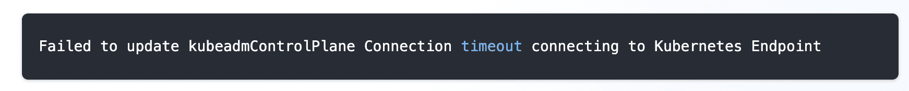

<!-- vale off -->

# Overview


Welcome to the Spectro Cloud documentation repository. To get started with contributions, please review the entire
README.

For internal Spectro Cloud users, please review the
[contributions](https://spectrocloud.atlassian.net/wiki/spaces/DE/pages/1765572627/Contribution) section of the
Documentation & Education's teams home page.

There are two local development paths available; Docker based, and non-Docker based. To reduce complexities, we
recommended the Docker based development approach.

## Prerequisites

To contribute, we recommend having the following software installed locally on your workstation.

- VScode or a text editor

- [Docker](https://docs.docker.com/desktop/)

- git configured and access to github repository

- Node.js and npm (optional)

- [Vale](https://vale.sh/docs/vale-cli/installation/)

## Local Development (Docker)

To get started with the Docker based local development approach ensure you are in the root context of this repository.

Initailize the repository by issuing the following command:

```shell
make init
```

Next, issue the following command to build the Docker image.

**Note**: The first time issuing the command may take several minutes.

```shell
make docker-image
```

To start the Dockererized local development server, issue the command:

```shell
make docker-start
```

The local development server is ready when the following output is displayed in your terminal.

```shell
> spectro-cloud-docs@4.0.0 start
> docusaurus start --host 0.0.0.0 --port 9000

[INFO] Starting the development server...
[SUCCESS] Docusaurus website is running at: http://localhost:9000/

✔ Client
  Compiled successfully in 8.39s

client (webpack 5.88.2) compiled successfully
```

Open up a browser and navigate to [http://localhost:9000](http://localhost:9000) to view the documentation website.

To exit from the local development Docker container. Press `Ctrl + Z`.

## Local Development Setup (Non-Docker)

Clone the repository and run the initialization script

```sh
cd Work
git clone https://github.com/spectrocloud/librarium.git
cd librarium
make init
```

Next, populate the `.env` file with the following content. The local development server will not start without the
required environment variables. The values are not important for local development.

```shell
ALGOLIA_APP_ID=1234567890
ALGOLIA_SEARCH_KEY=1234567890
```

## Documentation Content

Create a branch to keep track of all your changes.

```sh
git checkout -b <branch_name>
```

Make changes to any markdown files in the [`docs/docs-content`](./docs/docs-content/) folder.

Start the local development server and preview your changes by navigating to the documentation page you modified. You
can start the local development server by issuing the following command:

```sh
make start
```

When you are done with your changes, stage your changes and create a commit

```sh
git add -A && git commit -m "docs: your commit message here"
```

## Creating Pages

The documentation website is structured in a sidebar with main pages and sub-pages. Main pages will contain an overview
of the its sub pages.

### Anatomy of a documentation page

The **navigation** sidebar will be something across all pages.

The **header** will have a search bar and some links to different other sections of the documentation (api)

The page **content** will be displayed under the header and next to the sidebar. On it's right there will be a **table
of contents** menu that will extract all of the headers inside the content and display them in a list. This will follow
the user as he scroll the page. On top of the table of contents there will be a **github link** to the content of the
file. This can be used by users to submit changes to different sections of our documentation

### Main Pages

Create a page with the filename `<url-using-dashes>.md` in the `docs-content` folder of the `content` directory. For
positioning the document in the sidebar, you can use `sidebar_position: 1` in the front matter. To manage folders,
create a `_category_.json` file with `{position: 1}` inside the desired directory.

**Example of attributes**

```markdown
---
title: "Introduction"
sidebar_label: "Introduction"
description: "Palette API Introduction"
hide_table_of_contents: false
sidebar_custom_props:
  icon: "graph"
---
```

#### Front Matter Attributes

| attribute                                   | type    | description                                                                                             |
| ------------------------------------------- | ------- | ------------------------------------------------------------------------------------------------------- |
| `sidebar_label`                             | string  | used as the label for navigation                                                                        |
| `title`                                     | string  | will appear on the browser window / tab as the title                                                    |
| `description`                               | string  | the text to display when a page is shared in social media platforms                                     |
| `sidebar_custom_props:`<br>` icon: "graph"` | string  | one of icons from https://fontawesome.com/icons?d=gallery                                               |
| `hide_table_of_contents`                    | boolean | setting this to `false` will hide the page from the navigation                                          |
| `sidebar_position`                          | number  | the position of the page in the navigation sidebar. The pages are sorted ascending by this value        |
| `toc_min_heading_level`                     | number  | the minimum heading level to show in the table of contents. The default value for all documents is `2`. |
| `toc_max_heading_level`                     | number  | the maximum heading level to show in the table of contents. The default value for all documents is `3`. |
| `tags`                                      | array   | A list of string that can be used for additonal categorization of content.                              |
| `keywords`                                  | array   | A list of strings that areused for SEO purposes.                                                        |

### Sub pages

Create a folder using the **same name** of the main page. Inside of it use the same name convention
(`<url-using-dashes>.md`) to create subpages.

The index document for a folder follows the naming convention below. Here are some examples:

- Named as index (case-insensitive): `docs/Guides/index.md`
- Named as README (case-insensitive): `docs/Guides/README.mdx`
- Same name as the parent folder: `docs/Guides/Guides.md`

### Markdown Links and URLs

Markdown links use file path references to link to other documentation pages. The markdown link is composed of the file
path to the page in context from the current file. All references to a another documentation page must end with the
`.md` extension. Docusaurus will automatically remove the `.md` extension from the URL during the compile. The file path
is needed for Docuasurus to generate the correct URL for the page when versioning is enabled.

The following example shows how to reference a page in various scenarios. Assume you have the following folder structure
when reviewing the examples below:

```shell
.
└── docs
    └── docs-content
        ├── architecture
        │   ├── grpc.md
        │   └── ip-addresses.md
        ├── aws
        │   └── iam-permissions.md
        ├── clusters
        └── security.md
```

#### Same Folder

To link to a file in the same folder, you can use the following syntax:

```md

```

Because the file is in the same folder, you do not need to specify the path to the file. Docusaurus will automatically
search the current folder for the file when compiling the markdown content.

So, if you are in the file `grpc.md` and want to reference the file `ip-addresses.md`, you would use the following
syntax:

```md

```

#### Different Folder

If you want to link to a file in a different folder, you have to specify the path to the file from where the current
markdown file is located.

If you are in the file `security.md` and want to reference the file `iam-permissions.md`, you have to use the following
syntax:

```md

```

If you are in the file `grpc.md` and want to reference the file `iam-permissions.md`, you have to use the following
syntax:

```md

```

#### A Heading in the Same File

To link to a heading in the same file, you can use the following syntax:

```md
[Link to a heading in the same file](#heading-name)
```

The `#` symbol is used to reference a heading in the same file. The heading name must be in lowercase and spaces must be
replaced with a `-` symbol. Docusaurs by default uses dashes to separate words in the URL.

#### A Heading in a Different File

To link to a heading in a different file, you can use the following syntax:

```md
[Link to a heading in a different file](name_of_file.md#heading-name)
```

For example, if you are in the file `grpc.md` and want to reference the heading `Palette gRPC API` in the file
`security.md`, you would use the following syntax:

```md
[Link to a heading in a different file](../security.md#palette-grpc-api)
```

The important thing to remember is that the `#` comes after the file name and before the heading name.

#### Exceptions

As of Docusarus `2.4.1`, the ability to link to documentation pages that belong to another plugin is unavailable. To
work around this limitation, reference a documentation page by the URL path versus the file path.

```md
[Link to a page in another plugin](/api-content/authentication#api-key)
```

> [!WARNING] Be aware that this approach will break versioning. The user experience will be impacted as the user will be
> redirected to the latest version of the page.

In future releases, Docusaurus will support linking pages from other Docusarus plugins. Once this feature is available,
this documentation will be updated.

### Redirects

To add a redirect to an existing documentation page you must add an entry to the
[redirects.js](/src/shared/utils/redirects.js) file. Below is an example of what a redirect entry should look like.

```js
  {
    from: `/clusters/nested-clusters/`,
    to: `/clusters/sandbox-clusters`,
  },
```

### Multi Object Selector

The Packs integration page and the Service Listings page use a component to display the various offerings. Packs
intergations use the `<Packs />` component, whereas the Service Tiers from App Mode use the `<AppTiers />` component.

To add a Pack to the list complete the following actions:

- Add a new markdown page for the Pack.
- In the frontmatter set the type to the following value: `type: "integration"`.
- Populate the page with content.

To add a Service to the Service List complete the following actions:

- Add a new markdown page for the App Mode Service.
- In the frontmatter set the type to the following value: `type: "appTier"`.
- Populate the page with content.

### Images or other assets

All images must reside in the [`assets/docs/images`](./assets/docs/images/) folder.

```md

```

You can add a directory to to the images folder.

```md

```

**Image Loading** Image size loading can be customised. You can provide eager-load to images in the first fold of the
image with high priority as LCP (Largest contentful Paint) for the page will not be affected

```md

```

### Tabs component

To use the tabs component you have to import it from the _shared_ folder

After that, you can use it like this

```js
<Tabs queryString="platform">
  <TabItem label="AWS" value="aws">
    # AWS cluster Lorem ipsum dolor sit amet, consectetur adipiscing elit.
  </TabItem>
  <TabItem label="VMware" value="vmware">
    # VMware cluster Lorem ipsum dolor sit amet, consectetur adipiscing elit.
  </TabItem>
</Tabs>
```

**Note**: If you want to navigate from one page to another(which has tabs) and default tab to specific key then you must

- provide an identifier to the `Tabs` component `<Tabs queryString="clusterType">...</Tabs>`
- when creating the link to this page, include (in the query) the identifier provided and the **value** you want (eg:
  /clusters?clusterType=aws#section1)
- the values can be one of the tab panel keys
- additionally you may refer to different sections from the inner tab using the anchor points(using the #section-1)

### YouTube Video

To use a Youtube video us the YouTube component.

In your markdown file, use the component and ensure you specify a URL.

```js
<YouTube
  url="https://www.youtube.com/embed/wM3hcrHbAC0"
  title="Three Common Kubernetes Growing Pains  - and how to solve them"
/>
```

### Points of Interest

```js
<PointsOfInterest
  points={[
    {
      x: 20,
      y: 20,
      label: 1,
      description: "Lorem ipsum dolor sit amet, consectetur adipiscing elit.",
      tooltipPlacement: "rightTop",
    },
    {
      x: 80,
      y: 100,
      label: 2,
      description: "Lorem ipsum dolor sit amet, consectetur adipiscing elit.",
    },
    {
      x: 220,
      y: 230,
      description: "Lorem ipsum dolor sit amet, consectetur adipiscing elit.",
      tooltipPlacement: "rightTop",
    },
  ]}
>
  *Markdown content*
</PointsOfInterest>
```

**x** and **y** properties refer to the coordinates of the point starting from the **top-left corner** of the markdown
container.

**Note**: **_x_**, **_y_**, **_description_** properties are **mandatory**. **_label_** and **_tooltipPlacement_**
properties are optional.

If no label is specified, the default one is "+".

Possible placements are: _topLeft_, _top_, _topRight_, _rightTop_, _right_ (default), _rightBottom_, _bottomRight_,
_bottom_, _bottomLeft_, _leftBottom_, _left_, _leftTop_.

### Tooltip

```js
<Tooltip>tooltip content</Tooltip>
```

**Notes**

- The tooltip icon can be customized by sending a [font awesome](https://fontawesome.com/icons?d=gallery) icon

```js
<Tooltip icon="atom">tooltip content</Tooltip>
```

- If needed, the icon can be replace with text or other html tags using the trigger property:

```js
<Tooltip trigger={<button>This is a button</button>}>
  <h1>This is a h1 inside the tooltip</h1>
</Tooltip>
```

- If used inside a paragraph or other md elements the entire "block" needs to be on the same line

```js
Hello <Tooltip trigger="world">tooltip content</Tooltip>! It's me Mario
```

### Code Lines Highlighter

You can highlight specific lines in a block of code by adding **coloredLines** prop.

_Example_: ` ```js {2-4,5-7}`. This will color the lines from 2 to 4 and from 5 to 7.

_Components_:

- `2-4` - lines interval to be colored
- `|` - separator between lines interval and color
- `#fff` - hex color (colors can also be added as **rgb** format)
- `,` - separator for different colored lines intervals

Example

https://docusaurus.io/docs/markdown-features/code-blocks#highlighting-with-comments

#### Hide ClipBoard Button

The copy button is shown by default in all code blocks. You can disable the copy button by passing in the parameter
value `hideClipboard` in the markdown declaration of the code blocks.

Example 

Result



### Admonitions - Warning / Info / Tip / Danger

:::warning

Some **content** with _Markdown_ `syntax`.

:::

:::tip

Some **content** with _Markdown_ `syntax`.

:::

:::danger

Some **content** with _Markdown_ `syntax`.

:::

https://docusaurus.io/docs/markdown-features/admonitions

The content must have a new line at the beginning and at the end of the tag.

### Video

To add a video, use the following syntax. Ensure you capitalize the letter "V":

```
<Video src="/aws-full-profile.mp4"></Video>
```

```
<Video title="vsphere-pcg-creation" src="/cluster-creation-videos/vmware.mp4"></Video>
```

## Netlify Previews

By default Netlify previews are enabled for pull requests. However, some branches do not require Netlify previews. In
the [netlify.toml](./netlify.toml) file, a custom script is used to determine if a Netlify preview should be created.
The script is located in the [scripts/netlify.sh](./scripts/netlify.sh) file. If you need to disable Netlify previews
for a branch, add the branch name to the `allowed_branches` variable in the [scripts/netlify.sh](./scripts/netlify.sh)
file.

## Approvers/Reviewers

The content in the `docs/` folder require approval from the documentation team. The list of approvers and reviewers can
be found in the [OWNERS_ALIAS](./content/OWNER_ALIASES) file. Only members of the documentation team may modify this
file.

## Check Writing

We leverage [Vale](https://vale.sh/) to help us enforce our writing style programmatically and to avoid common writing
mistakes. The writing checks are executed upon a pull request. You may also conduct a writing check locally by using the
Vale CLI. Follow the steps below to install the Vale CLI and execute the writing checks.

Start by installing Vale by following the [installation steps](https://vale.sh/docs/vale-cli/installation/) in the Vale
documentation.

Next, download the required Vale plugins.

```
make sync-vale
```

To execute the writing check, issue the command below. The command below will identify files that are modified by
comparing the current git branch against the `master` branch. Ensure your local `master` branch is up to date for
accurate results.

```
make check-writing
```

You may also use the Vale CLI to directly scan a file and receive feedback.

Example:

```shell
vale content/docs/08-user-management.md
```

## Modify Writing Rules

The [vale.ini](vale.ini) file contains the configuration for Vale. Changes to [vale.ini](vale.ini),
[accept.txt](/vale/styles/Vocab/Internal/accept.txt), and [reject.txt](/vale/styles/Vocab/Internal/reject.txt) require
approval by the [docs-education](https://github.com/orgs/spectrocloud/teams/docs-education) team.

### Disable Rule

To disable a specific rule, add the rule name and the word "NO" to the vale.ini](vale.ini) file.

Example:

```
Google.Headings = NO
```

### Approved Words

Approved words can be found in the [accept.txt](/vale/styles/Vocab/Internal/accept.txt) file. You can add or remove
words from the list by modifying the file.

### Rejected Words

Rejected words automatically get flagged by Vale. To modify the list of rejected words, modify the
[reject.txt](/vale/styles/Vocab/Internal/reject.txt) file.

## Check Formatting

We use [Prettier](https://prettier.io/) to maintain uniform and consistent formatting across the docbase. When you
commit changes, Prettier formats the staged files automatically. Then, once you create a pull request, it verifies that
the formatting in all files complies with our Prettier configuration.

> [!NOTE]  
> The build fails if the Code Formatting check doesn't pass.

To manually check the formatting before pushing your work upstream, execute the following command in your terminal:

```
make format-check
```

Console output if all files are formatted:

```
Checking formatting...
All matched files use Prettier code style!
```

Console output if some of the files require re-formatting:

```
Checking formatting...
[warn] README.md
[warn] Code style issues found in the above file. Run Prettier to fix.
```

To manually format all files, issue the following command:

```
make format
```

### Known Caveats

- When using callouts/admonitions,
  [pay attention to their syntax](https://docusaurus.io/docs/markdown-features/admonitions#usage-with-prettier).

  ```
  <!-- Prettier doesn't change this -->
  :::note

  Hello world

  :::

  <!-- Prettier changes this -->

  :::note
  Hello world
  :::

  <!-- to this, interfering with the admonition rendering and breaking JSX components -->

  ::: note Hello world:::

  ```

- When you add JSX or HTML syntax, Prettier can introduce empty artifacts around them `{" "}` to ensure that whitespace
  is preserved in the rendered output – a helpful feature in React development. However, Docusaurus can sometimes parse
  them as valid HTML, making these artifacts visible to readers. For this reason, check your docs before pushing changes
  upstream and remove any `{" "}` you find.

## Release

To create a new release, use the following steps:

1. Create a release branch. Use the following naming pattern `release-X-X`
2. Create a commit using the following commit message `feat: updating documentation for release-X-X`. Replace x-x with
   the upcoming release number.
3. Push up the commit and create a new pull request (PR).
4. Merge PRs related to the upcoming release into the `release-X-X` branch.
5. Merge the release branch.
6. Create a new branch from the `master` branch. Use the following naming pattern `version-X-X`. This brach is used for
   versioning the documentation.
7. Push the new version branch to the remote repository.
8. Trigger a new build so that the new version is published.

The semantic-release logic and the GitHub Actions in the [release.yaml](.github/workflows/release.yaml) will ensure the
new release tag is created.

> **Warning** Do not use `feat`,`perf` or `fix` or other semantic-release key words that trigger a version change. Use
> the commit message prefix `docs: yourMessageHere` for regular documentation commits.

## Versioning

> [!NOTE] Detailed documentation for versioning can be found in the internal
> [Versioning](https://spectrocloud.atlassian.net/wiki/spaces/DE/pages/1962639377/Versioning) guide.

All versioned content belongs to a specific version branch. The version branch name follows the naming convention
`version-X-X`. The version branch is used to generate versioned content.

There are three files that are used for generating versioned content:

- [`versions.sh`](./scripts/versions.sh) - A bash script that loops through all the version branches and generates the
  versionioned content.

- [`update_docusaurs_config.js`](./docsearch.config.json) - A node script that updates the `docusaurus.config.js` file
  with all the required vesioning parameters.

- [`versionsOverride.json`](./versionsOverride.json) - A JSON file that contains the versioning overrides. These values
  are used to update the `docusaurus.config.js` file with non-default values.

### Build Versioned Content Locally

To build versioned content locally, use the following steps:

1. Issue the following command to generate the versioned content.

```shell
make versions
```

2. Start a local development server to view the versioned content.

```shell
make start
```

3. Compile the versioned content to ensure a successful build.

```shell
make build
```

4. Remove the `versions.json` file and discard the changes to the `docusaurus.config.js` file.

```shell
rm versions.json
```

> [!WARNING] The `docuasurus.config.js` file is updated by the [`update_docusaurs_config.js`](./docusaurus.config.js)
> script. DO NOT commit this file with the updated changes.
