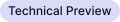

<!-- vale off -->

# Spectro Cloud Documentation


Welcome to the Spectro Cloud documentation repository. This repository contains the source for
[docs.spectrocloud.com](https://docs.spectrocloud.com).

Use this README as a quick start for contributing. For deeper guidance, see the contributor guides linked below.

For internal Spectro Cloud users, review the
[contributions](https://spectrocloud.atlassian.net/wiki/spaces/DE/pages/1765572627/Contribution) section of the
Documentation & Education team's home page.

## Quick Start

The recommended local development path uses Docker.

1. Install the required software listed in the
   [Local Development](./docs/contributing/local-development.md#prerequisites) guide.
2. Initialize the repository.

   ```shell
   make init
   ```

3. Add your Palette API key to the `.env` file.

   ```shell
   PALETTE_API_KEY="<your-palette-api-key>"
   ```

4. Start the Docker-based local development server.

   ```shell
   make docker-start
   ```

5. Open [http://localhost:9000](http://localhost:9000) to view the documentation website.

For the non-Docker setup, refer to [Local Development](./docs/contributing/local-development.md).

## Make Documentation Changes

Create a branch for your changes.

```shell
git checkout -b <branch_name>
```

Make changes to any markdown files in the [`docs/docs-content`](./docs/docs-content/) folder.

Start the local development server and preview your changes by navigating to the documentation page you modified. You
can start the local development server by issuing the following command:

```sh
make start
```

When you are done with your changes, stage your changes and create a commit

```sh
git add -A && git commit -m "docs: your commit message here"
```

## API Docs Generation

API documentation is generated by the
[OpenAPI plugin for Docusaurus](https://github.com/PaloAltoNetworks/docusaurus-openapi-docs).

We have two different OpenAPI spec files (also known as Swagger files) for two sets of APIs.

- [Palette API](./static/apis/v1/api.json)
- [Edge Management API](./static/apis/edge-v1/emc-api.json)

The Palette API is exposed on each instance of Palette, while the Edge management is available on each Edge host.

The make command `make api` runs the `generate-api-docs` npm script:

```bash
npm run run-api-parser && docusaurus gen-api-docs palette && docusaurus gen-api-docs emc
```

This script invokes an [API parser script](./utils/api-parser/index.js) to process both OpenAPI spec files, and then
runs the plugin on both of the processed spec files to generate the API pages. The plugin is configured in the
`docusaurus.config.js` file, specifically in the `plugin` property of the `config` object. For example, the `emc`
command came from the configuration parameters from the original name of Local UI that was never used.

The `make clean-api` command will delete the generated API pages from both spec files. All generated API pages are
excluded from Git since they can be generated by their respective spec files.

The placement of the spec files are important. You must place the new spec files in the same location to replace the old
spec files in an update. If you want to move the files, you'll need to update their configured locations in the
`docusaurus.config.js` file, as well as the API parser script.

## Creating Pages

The documentation website is structured in a sidebar with main pages and sub-pages. Main pages will contain an overview
of the its sub pages.

### Anatomy of a documentation page

The **navigation** sidebar will be something across all pages.

The **header** will have a search bar and some links to different other sections of the documentation (api)

The page **content** will be displayed under the header and next to the sidebar. On it's right there will be a **table
of contents** menu that will extract all of the headers inside the content and display them in a list. This will follow
the user as he scroll the page. On top of the table of contents there will be a **github link** to the content of the
file. This can be used by users to submit changes to different sections of our documentation.

### Main Pages

Create a page with the filename `<url-using-dashes>.md` in the `docs-content` folder of the `content` directory. For
positioning the document in the sidebar, you can use `sidebar_position: 1` in the front matter. To manage folders,
create a `_category_.json` file with `{position: 1}` inside the desired directory.

**Example of attributes**

```markdown
---
title: "Introduction"
sidebar_label: "Introduction"
description: "Palette API Introduction"
hide_table_of_contents: false
sidebar_custom_props:
  icon: "graph"
---
```

#### Front Matter Attributes

| attribute                                   | type    | description                                                                                             |
| ------------------------------------------- | ------- | ------------------------------------------------------------------------------------------------------- |
| `sidebar_label`                             | string  | used as the label for navigation                                                                        |
| `title`                                     | string  | will appear on the browser window / tab as the title                                                    |
| `description`                               | string  | the text to display when a page is shared in social media platforms                                     |
| `sidebar_custom_props:`<br>` icon: "graph"` | string  | one of icons from https://fontawesome.com/icons?d=gallery                                               |
| `hide_table_of_contents`                    | boolean | setting this to `false` will hide the page from the navigation                                          |
| `sidebar_position`                          | number  | the position of the page in the navigation sidebar. The pages are sorted ascending by this value        |
| `toc_min_heading_level`                     | number  | the minimum heading level to show in the table of contents. The default value for all documents is `2`. |
| `toc_max_heading_level`                     | number  | the maximum heading level to show in the table of contents. The default value for all documents is `3`. |
| `tags`                                      | array   | A list of string that can be used for additonal categorization of content.                              |
| `keywords`                                  | array   | A list of strings that areused for SEO purposes.                                                        |

### Sub pages

Create a folder using the **same name** of the main page. Inside of it use the same name convention
(`<url-using-dashes>.md`) to create subpages.

The index document for a folder follows the naming convention below. Here are some examples:

- Named as index (case-insensitive): `docs/Guides/index.md`
- Named as README (case-insensitive): `docs/Guides/README.mdx`
- Same name as the parent folder: `docs/Guides/Guides.md`

### Markdown Links and URLs

Markdown links use file path references to link to other documentation pages. The markdown link is composed of the file
path to the page in context from the current file. All references to a another documentation page must end with the
`.md` extension. Docusaurus will automatically remove the `.md` extension from the URL during the compile. The file path
is needed for Docuasurus to generate the correct URL for the page when versioning is enabled.

The following example shows how to reference a page in various scenarios. Assume you have the following folder structure
when reviewing the examples below:

```shell
.
└── docs
    └── docs-content
        ├── architecture
        │   ├── grpc.md
        │   └── ip-addresses.md
        ├── aws
        │   └── iam-permissions.md
        ├── clusters
        └── security.md
```

#### Same Folder

To link to a file in the same folder, you can use the following syntax:

```md

```

Because the file is in the same folder, you do not need to specify the path to the file. Docusaurus will automatically
search the current folder for the file when compiling the markdown content.

So, if you are in the file `grpc.md` and want to reference the file `ip-addresses.md`, you would use the following
syntax:

```md

```

#### Different Folder

If you want to link to a file in a different folder, you have to specify the path to the file from where the current
markdown file is located.

If you are in the file `security.md` and want to reference the file `iam-permissions.md`, you have to use the following
syntax:

```md

```

If you are in the file `grpc.md` and want to reference the file `iam-permissions.md`, you have to use the following
syntax:

```md

```

#### A Heading in the Same File

To link to a heading in the same file, you can use the following syntax:

```md
[Link to a heading in the same file](#heading-name)
```

The `#` symbol is used to reference a heading in the same file. The heading name must be in lowercase and spaces must be
replaced with a `-` symbol. Docusaurs by default uses dashes to separate words in the URL.

#### A Heading in a Different File

To link to a heading in a different file, you can use the following syntax:

```md
[Link to a heading in a different file](name_of_file.md#heading-name)
```

For example, if you are in the file `grpc.md` and want to reference the heading `Palette gRPC API` in the file
`security.md`, you would use the following syntax:

```md
[Link to a heading in a different file](../security.md#palette-grpc-api)
```

The important thing to remember is that the `#` comes after the file name and before the heading name.

#### Exceptions

As of Docusarus `2.4.1`, the ability to link to documentation pages that belong to another plugin is unavailable. To
work around this limitation, reference a documentation page by the URL path versus the file path.

```md
[Link to a page in another plugin](/api-content/authentication#api-key)
```

> [!WARNING] Be aware that this approach will break versioning. The user experience will be impacted as the user will be
> redirected to the latest version of the page.

In future releases, Docusaurus will support linking pages from other Docusarus plugins. Once this feature is available,
this documentation will be updated.

### Redirects

To add a redirect to an existing documentation page you must add an entry to the
[redirects.js](/src/shared/utils/redirects.js) file. Below is an example of what a redirect entry should look like.

```js
  {
    from: `/clusters/nested-clusters/`,
    to: `/clusters/sandbox-clusters`,
  },
```

### Multi Object Selector

The Packs integration page and the Service Listings page use a component to display the various offerings. Packs
intergations use the `<Packs />` component, whereas the Service Tiers from App Mode use the `<AppTiers />` component.

To add a Pack to the list complete the following actions:

- Add a new markdown page for the Pack.
- In the frontmatter set the type to the following value: `type: "integration"`.
- Populate the page with content.

To add a Service to the Service List complete the following actions:

- Add a new markdown page for the App Mode Service.
- In the frontmatter set the type to the following value: `type: "appTier"`.
- Populate the page with content.

### Images or other assets

All images must reside in the [`static/assets/docs/images`](./static/assets/docs/images/) folder. All images must be in
webp format. You can save png, jpg, or jpeg to the directory. The commit hook will convert the images to webp format. Or
issue the command `make format-images` to convert the images to webp format.

```md

```

You can add a directory to to the images folder.

```md

```

**Image Loading** Image size loading can be customised. You can provide eager-load to images in the first fold of the
image with high priority as LCP (Largest contentful Paint) for the page will not be affected

```md

```

### Tabs component

To use the tabs component you have to import it from the _shared_ folder

After that, you can use it like this

```js
<Tabs queryString="platform">
  <TabItem label="AWS" value="aws">
    # AWS cluster Lorem ipsum dolor sit amet, consectetur adipiscing elit.
  </TabItem>
  <TabItem label="VMware" value="vmware">
    # VMware cluster Lorem ipsum dolor sit amet, consectetur adipiscing elit.
  </TabItem>
</Tabs>
```

**Note**: If you want to navigate from one page to another(which has tabs) and default tab to specific key then you must

- provide an identifier to the `Tabs` component `<Tabs queryString="clusterType">...</Tabs>`
- when creating the link to this page, include (in the query) the identifier provided and the **value** you want (eg:
  /clusters?clusterType=aws#section1)
- the values can be one of the tab panel keys
- additionally you may refer to different sections from the inner tab using the anchor points(using the #section-1)

### YouTube Video

To use a Youtube video us the YouTube component.

In your markdown file, use the component and ensure you specify a URL.

```js
<YouTube
  url="https://www.youtube.com/embed/wM3hcrHbAC0"
  title="Three Common Kubernetes Growing Pains  - and how to solve them"
/>
```

### Points of Interest

```js
<PointsOfInterest
  points={[
    {
      x: 20,
      y: 20,
      label: 1,
      description: "Lorem ipsum dolor sit amet, consectetur adipiscing elit.",
      tooltipPlacement: "rightTop",
    },
    {
      x: 80,
      y: 100,
      label: 2,
      description: "Lorem ipsum dolor sit amet, consectetur adipiscing elit.",
    },
    {
      x: 220,
      y: 230,
      description: "Lorem ipsum dolor sit amet, consectetur adipiscing elit.",
      tooltipPlacement: "rightTop",
    },
  ]}
>
  *Markdown content*
</PointsOfInterest>
```

**x** and **y** properties refer to the coordinates of the point starting from the **top-left corner** of the markdown
container.

> [!NOTE]
>
> The **_x_**, **_y_**, and **_description_** properties are **mandatory**. The **_label_** and **_tooltipPlacement_**
> properties are optional.

If no label is specified, the default one is "+".

Possible placements are: _topLeft_, _top_, _topRight_, _rightTop_, _right_ (default), _rightBottom_, _bottomRight_,
_bottom_, _bottomLeft_, _leftBottom_, _left_, _leftTop_.

### Tooltip

```js
<Tooltip>tooltip content</Tooltip>
```

**Notes**

- The tooltip icon can be customized by sending a [font awesome](https://fontawesome.com/icons?d=gallery) icon

```js
<Tooltip icon="atom">tooltip content</Tooltip>
```

- If needed, the icon can be replace with text or other html tags using the trigger property:

```js
<Tooltip trigger={<button>This is a button</button>}>
  <h1>This is a h1 inside the tooltip</h1>
</Tooltip>
```

- If used inside a paragraph or other md elements the entire "block" needs to be on the same line

```js
Hello <Tooltip trigger="world">tooltip content</Tooltip>! It's me Mario
```

### Code Lines Highlighter

You can highlight specific lines in a block of code by adding **coloredLines** prop.

_Example_: ` ```js {2-4,5-7}`. This will color the lines from 2 to 4 and from 5 to 7.

_Components_:

- `2-4` - lines interval to be colored
- `,` - separator for different colored lines intervals

Example

https://docusaurus.io/docs/markdown-features/code-blocks#highlighting-with-comments

#### Hide ClipBoard Button

The copy button is shown by default in all code blocks. You can disable the copy button by passing in the parameter
value `hideClipboard` in the markdown declaration of the code blocks.

Example 

Result


### Admonitions - Warning / Info / Tip / Danger / Tech Preview / Further Guidance / Deprecated

For guidance on using admonitions in our docs, refer to
[Spectro Cloud Internal Style Guide: Admonitions/Callouts](https://spectrocloud.atlassian.net/wiki/spaces/DE/pages/1765933057/Spectro+Cloud+Internal+Style+Guide#Admonitions%2FCallouts).

To learn more about admonitions in Docusaurus, refer to the
[Admonitions](https://docusaurus.io/docs/markdown-features/admonitions) guide.

The content must have a new line at the beginning and at the end of the tag.

#### Warning

```mdx
:::warning

Some **content** with _Markdown_ `syntax`.

:::
```

#### Info

```mdx
:::info

Some **content** with _Markdown_ `syntax`.

:::
```

#### Tip

```mdx
:::tip

Some **content** with _Markdown_ `syntax`.

:::
```

#### Danger

```mdx
:::danger

Some **content** with _Markdown_ `syntax`.

:::
```

#### Tech Preview

The `:::preview` admonition is a custom admonition configured in `docusaurus.config.js` under `admonitions.keywords`.

Unlike other admonition types, you do not need to enter content in the admonition block. By default, the Tech Preview
admonition generates the message, "This is a Tech Preview feature and is subject to change. Do not use this feature in
production workloads." This message is hardcoded using `src/theme/Admonition/Type/TechPreview.js`. However, if you need
to deviate from the template text, you can provide a custom message.

```mdx
:::preview

Some **content** with _Markdown_ `syntax`.

:::
```

Files in `docs/docs-content` and `docs/api-content` are processed during the build phase. However, partials in the
`_partials` directory are dynamically imported at runtime. Because of this, custom admonitions defined in
`docusaurus.config.js` that are used in partials are not rendered, and the custom admonition is ignored.

As a workaround, when using custom admonitions in partials, import and reference the admonition with JSX syntax.

```mdx
import AdmonitionTypeTechPreview from '@theme/Admonition/Type/TechPreview'; # Import below front matter

<AdmonitionTypeTechPreview /> # Use instead of :::
```

Note that when used in partials, the default message cannot be overridden.

#### Further Guidance

```mdx
:::further

Some **content** with _Markdown_ `syntax`.

:::
```

Like Tech Preview, the Further Guidance admonition is a custom admonition. To use this admonition in partials, you must
import and reference it with JSX syntax.

```mdx
import AdmonitionTypeFurtherGuidance from '@theme/Admonition/Type/FurtherGuidance'; # Import below front matter

<AdmonitionTypeFurtherGuidance /> # Use instead of :::
```

#### Deprecated

The `:::deprecated` admonition is a custom admonition configured in `docusaurus.config.js` under `admonitions.keywords`.

Unlike other admonition types, you do not need to enter content in the admonition block. By default, the Deprecated
admonition generates the message, "This feature is deprecated and will no longer receive new updates. Refer to the
Announcements page for additional information, as well as alternatives." This message is hardcoded using
`src/theme/Admonition/Type/Deprecated.js`. However, if you need to deviate from the template text, you can provide a
custom message.

```mdx
:::deprecated

Some **content** with _Markdown_ `syntax`.

:::
```

Like Tech Preview and Further Guidance, the Deprecated admonition is a custom admonition. To use this admonition in
partials, import and reference it with JSX syntax.

```mdx
import AdmonitionTypeDeprecated from '@theme/Admonition/Type/Deprecated'; # Import below front matter

<AdmonitionTypeDeprecated /> # Use instead of :::
```

Note that when used in partials, the default message cannot be overridden.

### Video

To add a video, use the following syntax. Ensure you capitalize the letter "V":

```mdx
<Video src="/aws-full-profile.mp4"></Video>
```

```mdx
<Video title="vsphere-pcg-creation" src="/cluster-creation-videos/vmware.mp4"></Video>
```

### Badges

The following badges are available for use:

> [!NOTE]
>
> All badges are globally available. No need to import them.

- Technical Preview Badge 
  
- Deprecated Badge 
  

#### Technical Preview Badge

The technical preview badge is used to indicate that a feature is in technical preview. The badge is intended for
release notes in the context of a list. The following is an example of how to use the technical preview badge. The
component will automatically display the badge in the correct color based on the light theme (dark/light).

```markdown
- <TpBadge /> Cluster Profile variables, a new feature that allows you to define variables in a cluster profile. This
  feature is in Tech Preview and is available only for Edge clusters. Profile variables allow you to define variable
  types, apply validation, and more. Refer to the Cluster Profile Variables documentation to learn more about profile
  variables.
```

#### Deprecated Badge

The deprecated badge is used to indicate that a feature is deprecated. The badge is intended for usage in the context of
a list or table. The following is an example of how to use the deprecated badge. The component will automatically
display the badge in the correct color based on the light theme (dark/light).

```markdown
- <DeprecatedBadge /> Edge site deployment via MAAS is deprecated and will no longer receive new updates. Refer to the
  Announcements page for additional information, as well as alternatives.
```

### Simple Card Grid

This is a custom component that creates a grid of simple text cards with two columns, styled according to our color
scheme. The rows of cards are dynamically created according to the list of specified cards. This component uses the
`VersionedLink` under the covers.

```js
<SimpleCardGrid
  cards={[
    {
      title: "Lorem Ipsum",
      description: "Lorem ipsum dolor sit amet, consectetur adipiscing elit.",
      buttonText: "Learn more",
      url: "/path/to/link",
    },
    {
      title: "Lorem Ipsum",
      description: "Lorem ipsum dolor sit amet, consectetur adipiscing elit.",
      buttonText: "Learn more",
      url: "/path/to/link",
    },
    {
      title: "Lorem Ipsum",
      description: "Lorem ipsum dolor sit amet, consectetur adipiscing elit.",
      buttonText: "Learn more",
      url: "/path/to/link",
    },
  ]}
/>
```

## Tutorials Sidebar

This section describes how to publish new tutorials and add new categories to the Tutorials sidebar.

### Add a New Category

To add a new sidebar category to Tutorials, create a new directory under `docs/docs-content/tutorials`. For example,
let's add a directory called `new-tutorials`.

> [!NOTE]  
> Each category directory must have at least one **.md** file to render in the sidebar. If you add an empty directory to
> `sidebars.js`, the build will break.

```shell
.
├── _category_.json
├── cluster-deployment
│   ├── _category_.json
│   ├── pcg
│   │   ├── _category_.json
│   └── └── deploy-app-pcg.md
└── new-tutorials
    ├── _category_.json
    └── new-tutorial
```

Then, add the following code to the `tutorialSidebar` array in the `sidebars.js` file.

```js
tutorialSidebar: [
  {
    type: "category",
    label: string,
    className: "category",
    collapsed: false,
    collapsible: false,
    items: [{ type: "autogenerated", dirName: "tutorials/new-tutorials" }],
    customProps: {
      icon: string,
    },
  },
  ...
];
```

Consider the following example for reference.

```js
tutorialSidebar: [
    {
      type: "category",
      label: "Edge",
      className: "category",
      collapsible: false,
      collapsed: false,
      items: [{ type: "autogenerated", dirName: "tutorials/edge" }],
      customProps: {
        icon: "microchip",
      },
    },
  ...
];
```

### Publish New Tutorials

To add tutorials to an existing category, create a new **.md** file in the respective directory under
`docs-content/tutorials` and follow the guidance outlined in [Creating Pages](#creating-pages).

## Partials Component

This is a custom component that allows you to create and use Docusaurus'
[Import Markdown](https://docusaurus.io/docs/markdown-features/react#importing-markdown) functionality.

> [!IMPORTANT]
>
> Docusaurus does not provide the ability to dynamically configure table of contents. See
> [this issue](https://github.com/facebook/docusaurus/issues/6201) for more information. This means that you should
> avoid adding headings to partials that you intend to use with the Partials Component.
>
> If you require headings, then you should import your partials using the guidance on the Docusaurus
> [Import Markdown](https://docusaurus.io/docs/markdown-features/react#importing-markdown) page.

Partials must be created under the `_partials` folder. They must be named using an `_` prefix and the `*.mdx` filetype.
Partials may be organised in any further subfolders as required. For example, you could create
`_partials/public-cloud/_palette_setup.mdx`.

In order to aid with organisation and categorization, partials must have a `partial_category` and `partial_name` defined
in their frontmatter:

```mdx
---
partial_category: public-cloud
partial_name: palette-setup
---

This is how you set up Palette in {props.cloud}.
```

Partials are customized using properties which can be read using the `{props.field}` syntax.

Once your partial has been created, run the `make generate-partials` command to make your partial available for use.
This command will also be invoked during the `make start` and `make build` commands.

Finally, you can reference your partial in any `*.md` file by using the `PartialsComponent`, together with the specified
category and name of the partial:

```md
<PartialsComponent
  category="example-cat"
  name="example-name"
  message="Hello!"
/>
```

The snippet above will work with the example partial we have in our repository, so you can use it for testing.

Note that the `message` field corresponds to the `{props.message}` reference in the `_partials/_partial_example.mdx`
file.

### Numbered Lists

Multi-step partials that do not begin a new procedure (start with 1) cannot be reused if the partial is written in
typical MDX syntax. The example below shows a small snippet of a procedure.

```mdx
---
partial_category: clusters-aws-account-setup
partial_name: example
---

1. **Validate** your AWS credentials. A green check mark indicates valid credentials.

2. Toggle **Add IAM Policies** on and use the **Policies** drop-down menu to select any desired IAM policies.

3. Select **Confirm** to add your AWS account to Palette.
```

This partial could be reused in several places, as there are several types of AWS accounts and authentication methods.
However, the steps prior to this partial vary based on the procedure. For example, the partial may need to start at step
6 for AWS Commercial cloud but step 10 for AWS Secret cloud, which makes reuse tricky. Since MDX files are generated at
runtime instead of buildtime, implementing it in either of the following ways will _not_ work.

<!-- prettier-ignore-start -->

```md
6. In Palette, paste the role ARN into the **ARN** field.

7. <PartialComponent category="clusters-aws-account-setup" name="example" />
   <!-- creates a nested list on step 7 that begins with step 1 -->

<PartialComponent category="clusters-aws-account-setup" name="example" /> <!-- creates a new list starting at 1 -->
```

<!-- prettier-ignore-end -->

There are several other ways you can manipulate the partial in an attempt to fix this issue, but only _one_ works. To
reuse a mid-procedure partial that contains a numbered list, create each step item _except the first step_ as an HTML
list item (`<li>`).

```mdx
---
partial_category: clusters-aws-account-setup
partial_name: example
---

**Validate** your AWS credentials. A green check mark indicates valid credentials.

<li> Toggle **Add IAM Policies** on and use the **Policies** drop-down menu to select any desired IAM policies.</li>

<li>Select **Confirm** to add your AWS account to Palette.</li>
```

When you reference the partial in a markdown file, put the partial _after_ the numbered step. Doing so establishes the
step number for the first item, and the steps indicated with `<li>` are rendered with the correct subsequent numbers.

<!-- prettier-ignore-start -->

```md
6. In Palette, paste the role ARN into the **ARN** field.

7. <PartialComponent category="clusters-aws-account-setup" name="example" />

8. Additional step.
```

<!-- prettier-ignore-end -->

Any steps that come _after_ partial are updated with the correct values during runtime. For example, the above partial
would be rended as follows.

<!-- prettier-ignore-start -->

```md
6. In Palette, paste the role ARN into the **ARN** field.

7. **Validate** your AWS credentials. A green check mark indicates valid credentials.

8. Toggle **Add IAM Policies** on and use the **Policies** drop-down menu to select any desired IAM policies.

9. Select **Confirm** to add your AWS account to Palette.

10.  Additional step.
```
<!-- prettier-ignore-end -->

## Palette/VerteX URLs

A special component has been created to handle the generation of URLs for Palette and VerteX. The component is called
[PaletteVertexUrlMapper](./src/components/PaletteVertexUrlMapper/PaletteVertexUrlMapper.tsx). This component is intended
for usage withing partials. You can use the component to change the base path of the URL to either Palette or VerteX.
The component will automatically prefix the path to the URL. The component has the following props:

- `edition` - The edition of the URL. This can be either `Palette` or `Vertex`. Internally, the component will use this
  value to determine the base URL.
- `text` - The text to display for the link. To include a property value, wrap the text in `{``}` and insert the
  property using `${props.field}`.
- `url` - The path to append to the base URL.

Below is an example of how to use the component:

```mdx
- System administrator permissions, either a Root Administrator or Operations Administrator. Refer to the
  <PaletteVertexUrlMapper
    edition={props.edition}
    text="System Administrators"
    url="/system-management/account-management"
  />
  page to learn more about system administrator roles.
```

Below is an example of how to use the component when you want the link text to include a property value:

```mdx
<PaletteVertexUrlMapper
  edition={props.edition}
  text={`Install Airgap ${props.version}`}
  url="/supported-environments/vmware/install/airgap"
/>
```

In cases where Palette and Vertex pages have different URLs beyond the base path, the component will accept the
following props:

- `edition` - The edition of the URL. This can be either `Palette` or `Vertex`. Internally, the component will use this
  value to determine the base URL.
- `text` - The text to display for the link.
- `palettePath` - The Palette path to append to the base URL.
- `vertexPath` - The VerteX path to append to the base URL.

Below is an example of how to use the component when the URLs are different:

```mdx
- System administrator permissions, either a Root Administrator or Operations Administrator. Refer to the
  <PaletteVertexUrlMapper
    edition={props.edition}
    text="System Administrators"
    palettePath="/system-management/account-management"
    vertexPath="/system-management-vertex/account-management"
  />
  page to learn more about system administrator roles.
```

## Security Bulletins

The security bulletins are auto-generated upon server start or the build process. The bulletins are generated by
querying an internal Spectro Cloud API. The bulletins are displayed in the security bulletins page
`https://docs.spectrocloud.com/security-bulletins/reports/`.

The logic for generated the security bulletins is located in the [cves folder](./utils/cves/index.js). The script is
invoked before a build or a local development server start. The script will fetch the security bulletins and store the
data in the `.docusaurus/security-bulletins/default/` folder. The data is stored in the `data.json` file.

The script will also generate each markdown file for each security bulletin. The markdown files are stored in the
`/security-bulletins/reports/` folder.

### Disable Security Bulletins

To disable the security bulletins, you can set the environment variable `DISABLE_SECURITY_INTEGRATIONS` to `true`. This
will stop the pre-build script from fetching the security bulletins.

```shell
make start
```

When your changes are ready, stage and commit them.

```shell
git add -A && git commit -m "docs: your commit message here"
```

Use the `docs:` commit prefix for regular documentation changes. Avoid `feat:`, `fix:`, `perf:`, and other
semantic-release prefixes unless you intentionally need to trigger a version change.

## Validate Your Changes

Run the checks that match your change before opening a pull request.

| Check               | Command              | More information                                                       |
| ------------------- | -------------------- | ---------------------------------------------------------------------- |
| Writing style       | `make check-writing` | [Checks and CI](./docs/contributing/checks-and-ci.md#check-writing)    |
| Formatting          | `make format-check`  | [Checks and CI](./docs/contributing/checks-and-ci.md#check-formatting) |
| Full local CI setup | `make ci-local`      | [Release Process](./docs/contributing/release-process.md#commands)     |

The content in this repository requires approval from the documentation team. Approval rules are defined in
[CODEOWNERS](./CODEOWNERS).

## Contributor Guides

| Guide                                                                          | Use it for                                                                              |
| ------------------------------------------------------------------------------ | --------------------------------------------------------------------------------------- |
| [Local Development](./docs/contributing/local-development.md)                  | Prerequisites, Docker setup, non-Docker setup, and local environment variables.         |
| [Authoring Content](./docs/contributing/authoring-content.md)                  | Creating pages, organizing sidebars, tutorials, and reviewer guidance.                  |
| [Markdown and MDX](./docs/contributing/markdown-and-mdx.md)                    | Links, images, redirects, code blocks, and admonitions.                                 |
| [Components](./docs/contributing/components.md)                                | Tabs, videos, tooltips, partials, badges, cards, and Palette/VerteX URL helpers.        |
| [Generated Content and Integrations](./docs/contributing/generated-content.md) | API docs, security bulletins, packs, cached generated data, and the Kapa widget.        |
| [Checks and CI](./docs/contributing/checks-and-ci.md)                          | Netlify previews, Vale, Prettier, spellcheck, and build exit codes.                     |
| [Release Process](./docs/contributing/release-process.md)                      | Release branches, unreleased banners, Palette release automation, and release commands. |

## Repository References

| File or directory                                         | Description                                                 |
| --------------------------------------------------------- | ----------------------------------------------------------- |
| [docs/docs-content](./docs/docs-content/)                 | Main documentation content.                                 |
| [docs/api-content](./docs/api-content/)                   | API documentation content generated from OpenAPI specs.     |
| [\_partials](./_partials/)                                | Reusable MDX partials.                                      |
| [static/assets/docs/images](./static/assets/docs/images/) | Documentation image assets.                                 |
| [CODEOWNERS](./CODEOWNERS)                                | Pull request ownership and approval rules.                  |
| [Makefile](./Makefile)                                    | Local development, validation, and release helper commands. |
