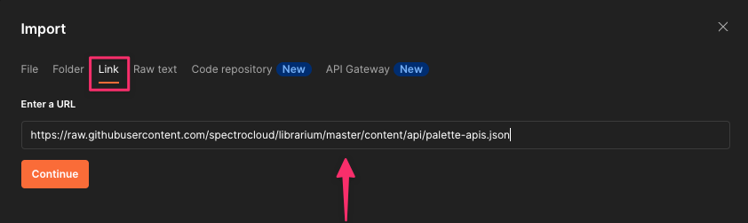

import {Intro, IntroButtons} from "shared/components"
import InfoBox from "shared/components/InfoBox"

<Intro>

# Postman Collection

</Intro>

Spectro Cloud provides a Postman collection for your convenience to help you interact with the Spectro Cloud API.

## Prerequisites

To interact with the API, you will need the following:

* [Postman application](https://www.postman.com/downloads/) v10.2.2+
* A base URL (https://api.spectrocloud.com).
* An authentication credential. 

<InfoBox>
If you're running Palette on a self-hosted server instead of the SaaS version, use your server URL as the base URL in the API request.
</InfoBox>

## Authentication

Two forms of authentication are available to interact with the Spectro Cloud API:

* An Authentication header with a token value.  
or
* An API Key with an ApiKey value.

Learn more about [authentication methods](https://docs.spectrocloud.com/user-management/user-authentication) in Palette documentation.

## Import the Postman Collection

Use the following URL to import your configuration into Postman:

https://raw.githubusercontent.com/spectrocloud/librarium/master/content/api/palette-apis.json
 

1. Open the **Import** dialog. 
2. Select the **Link** tab and copy/paste the URL in the field as shown in the screenshot. 
3. Click the **Continue** button.
4.  Click on **Show advanced settings** and uncheck the **Optimize conversion** feature. For additional context on why this feature is disabled, review the Postman GitHub issue related to [nesting bug](https://github.com/postmanlabs/postman-app-support/issues/10928).
5. Click on the **Import** button. 

  
Postman imports your collection and lists it under Import Complete.
 

   

Find details about importing in Postman's [import/export](https://learning.postman.com/docs/getting-started/importing-and-exporting-data/) tutorial.
