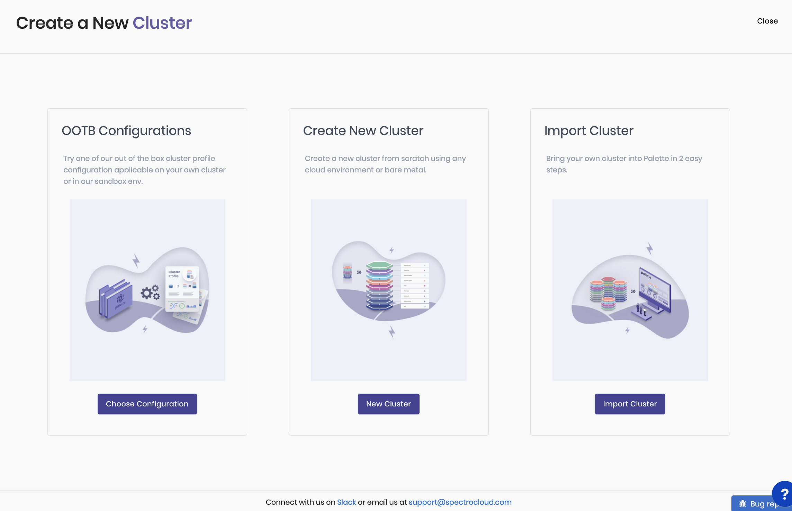

import Tabs from 'shared/components/ui/Tabs';
import WarningBox from 'shared/components/WarningBox';
import InfoBox from 'shared/components/InfoBox';
import PointsOfInterest from 'shared/components/common/PointOfInterest';
import Tooltip from "shared/components/ui/Tooltip";

# Palette Onboarding Workflow

Palette has a well-organized product onboarding process to streamline user-product adoption. The two significant steps of our onboarding workflow are:

* Product Tour

* Palette Experience

## Product Tour
Upon a successful sign in to our platform, we start the onboarding process with a product tour—an introduction to the platform, to familiarize the users with our Palette features.

## Start your Palette Experience 

The product tour is followed by a Palette experience session.  Here we make sure that our users are guided through a successful deployment pipeline in their first use, instead of them just figuring things out along the way towards cluster creation.  The major components of this session are as follows:

* [Create New Cluster](/clusters)

  * Create a new cluster from scratch using any cloud environment or bare metal.

  * A system-level cluster profile is included for the users to explore the Palette functionalities easier and faster. 

* [Import Cluster](/clusters/brownfield-clusters#overview)
  * Bring your own cluster into Palette in two easy steps.

* Out-of-the-box (OOTB) Configurations:
  * Try one of our out-of-the-box cluster profile configurations applicable on your own cluster or in our Palette Virtual Cluster environment.

<InfoBox>
Once the user experience session is finished, the user will be familiar with Palette's workflow and deployment pipeline. This section of the document is a quick start to the deployment process with simple instructions to jump start the Palette journey. The different Palette features and Day-2 operations are detailed in the remainder of this documentation site.
</InfoBox>

### Connect with us
* [Slack](https://spectrocloudcommunity.slack.com/join/shared_invite/zt-g8gfzrhf-cKavsGD_myOh30K24pImLA#/shared-invite/email)

* support@spectrocloud.com

# Palette Workflow

Palette mandates the creation of a cluster profile, before a workload cluster can be created. This is because the <Tooltip trigger={<u>cluster profiles</u>}><a href="/cluster-profiles">Cluster profiles</a> are instantiated
templates that are created with preconfigured layers/components needed for cluster deployments.</Tooltip> contain
the configurations required for your cluster. The cluster profile helps you prepare a ready-made configuration of the
OS, the Kubernetes layer, the network layer, and the storage layers. These four are the mandatory layers, without
which a cluster profile cannot be created. There are a host of other layers and components available to add in the
cluster profile (load balancers, authentication, monitoring, and logging) which are detailed in the cluster
profile section. Palette provides several cluster profiles out-of-the-box.

| |
|--|
|[Create your Cluster Profile](/cluster-profiles/task-define-profile/#creatingclusterprofiles)|
|[Create your Cluster](/clusters)|
|[Import Brownfield Clusters](/clusters/brownfield-clusters/#overview)|
|[Cluster Management](/clusters/cluster-management/#managecl)|
