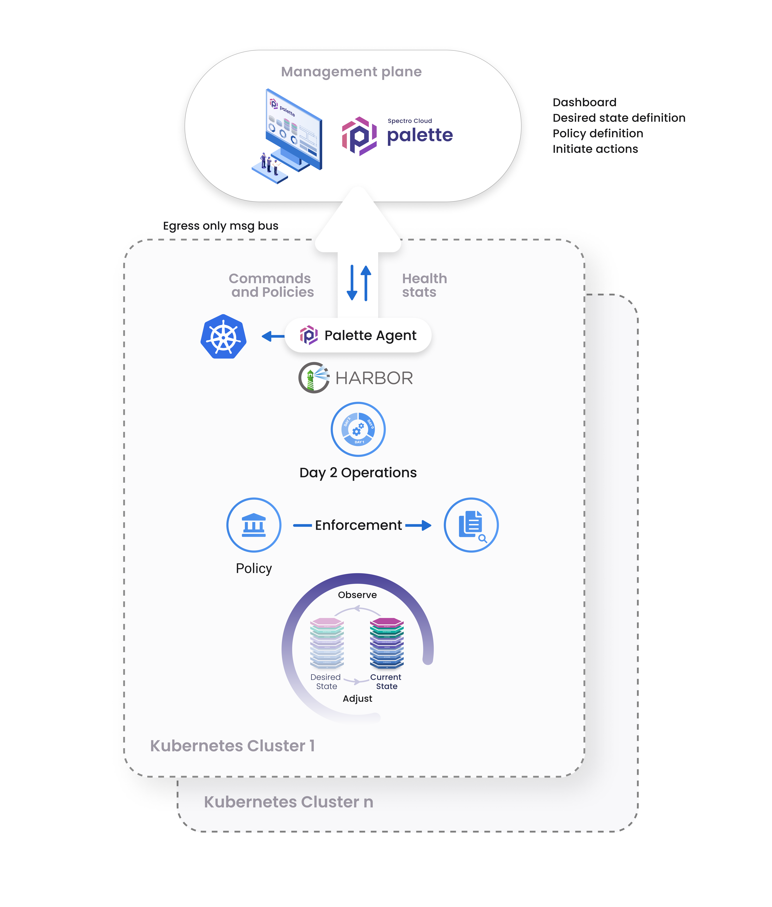

import Tabs from 'shared/components/ui/Tabs';
import WarningBox from 'shared/components/WarningBox';
import InfoBox from 'shared/components/InfoBox';
import PointsOfInterest from 'shared/components/common/PointOfInterest';
import Tooltip from "shared/components/ui/Tooltip";

# Palette Agent

The Spectro Cloud Palette platform offers full-stack management of Kubernetes clusters and applications in any environment, including the cloud, data centers, and edge locations. With the ability to manage tens of thousands of clusters, it features centralized policy and decentralized orchestration at the cluster level. This design ensures efficient management of the Kubernetes clusters and applications. Each Kubernetes cluster is deployed with the Palette agent to support this model. 

# Agent Responsibilities

The Palette agent is responsible for the following actions.

 

- Establish a network communication channel with the Palette management plane. 

- Receive agent upgrade instructions and apply the upgrade.

- Download and update related to local Pack registries.

- Deploy and manage a cluster's entire lifecycle and all its components, such as the host operation system (OS), Kubernetes platform, and applications that may be VM-based or container-based.

- Apply and enforce cluster policies such as patching and backup schedules.

- Cluster management actions associated with day two activities, such as SSL certificate rotations, cluster backup, restoring a cluster from a backup, compliance scans, and more.

- Gather cluster health stats and heartbeats and report the cluster status to the Palette management plane.

- Enable local APIs to support other Palette components, such as the CLI and the local WebUI.

The communication between the agent and the Palette management plane keeps the two components in sync. You can upgrade the agent to match the Palette version for complete control and consistency with the current management plane.

# Agent Communication Channels

The agent and the management plane have three communication channels.

- REST API: This is a one-way communication channel from the agent to the management plane for all Palette API requests. The endpoint for this channel has the following URL endpoint `api.<instance_endpoint_url>`

- Message Bus: This bi-directional channel exchanges messages between the agent and management plane. Network address translation (NATS) is applied to the channel to exchange messages with the management plane. The messages use the following URL endpoint `message.<instance_endpoint_url>`.

- Packs: This channel is a standard HTTP endpoint that contains the Pack repository. The Pack repository contains the metadata and the content for packs. Access control to packs is also enforced through this endpoint.

 