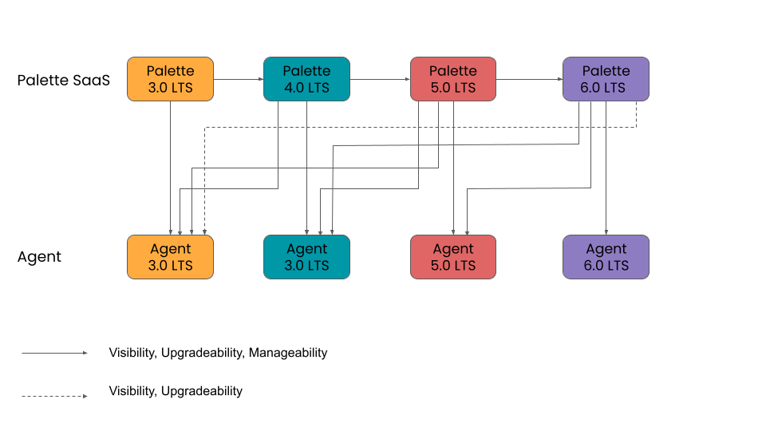

import Tabs from 'shared/components/ui/Tabs';
import WarningBox from 'shared/components/WarningBox';
import InfoBox from 'shared/components/InfoBox';
import PointsOfInterest from 'shared/components/common/PointOfInterest';
import Tooltip from "shared/components/ui/Tooltip";

# Overview

Palette's product versioning schema follows the traditional software version format of X.Y.Z. This number system is used to track the different releases of the product, and the individual numbers indicate significant changes in the software's development. 

The first number represents the product's major version and is incremented when a major change with breaking compatibility is introduced. The second number is incremented when new features with backward compatibility are introduced, and the third number represents bug fixes and minor improvements with forward compatibility.

# Long Term Support (LTS)

An LTS version of Palette will be released every year. Each major version of Palette will receive long-term support for three years starting from the release date. Long-term support includes security patches and bug fixes. LTS support will not include feature enhancements in patch releases. LTS versions are backward compatible with the two previous major releases [N-2]. The backward compatibility pertains to the Palette agent and the Palette SaaS API. Check out the [Palette Agent](/architecture/agent-architecture) documentation page to better understand the Palette Agent and communication channel.

# Supported Agent Versions

The Palette agent communicates with the Palette platform and its APIs. The Palette management plane will support [N-2] LTS major version of the agent for manageability and regular agent responsibilities. The Palette management plane LTS  version will also support any lower LTS agent versions for visibility and upgradeability. Visibility and upgradeability mean that clusters with an agent version greater than [N-2] will still be visible in Palette with the ability to receive upgrade commands.

 

<InfoBox>

Palette SaaS will always default to the latest version of Palette.

</InfoBox>

The following diagram illustrates the agent compatibility flow with the Palette control plane.

 

# Agent Upgrade

Palette agent versions greater than [N-2] will remain visible in Palette and are eligible for upgrade requests.

- How will this work?

- How will users upgrade the agent?

 