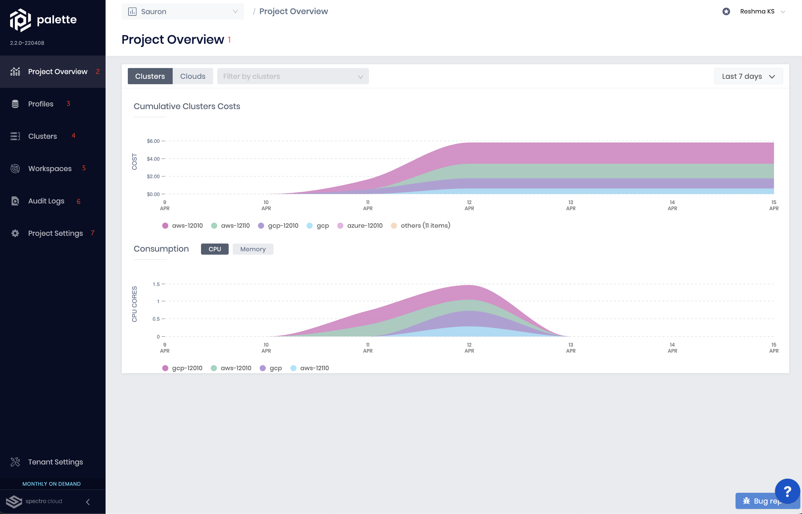
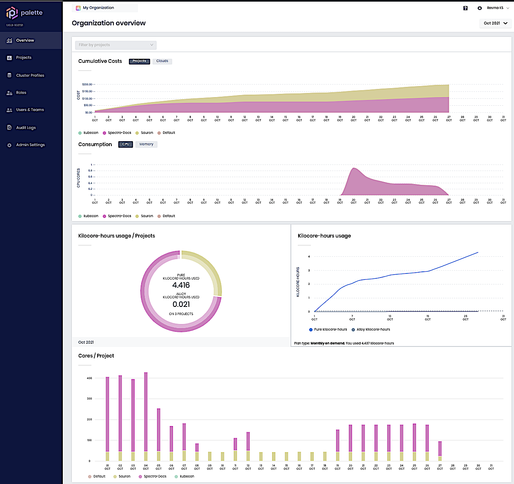

import Tabs from 'shared/components/ui/Tabs'; 
import WarningBox from 'shared/components/WarningBox'; 
import InfoBox from 'shared/components/InfoBox'; 
import PointsOfInterest from 'shared/components/common/PointOfInterest'; 
import Tooltip from "shared/components/ui/Tooltip";

# Overview 

This section is a tour of the two main dashboards of the tenant console, the Project Dashboard and the Admin
Dashboard. The Project Dashboard is used to perform operations related to setting up your Kubernetes clusters such as setting
up cluster profiles, creating cloud accounts, deploying clusters etc. The Admin dashboard is used for performing
administrative tasks such as setting up Single Sign On (SSO), creating user, teams and setting up Role-Based Access Control (RBAC), setting up additional
package registries etc. The admin dashboard is only available to the users who have the tenant admin role. Admin
users can toggle between the project dashboard and admin dashboard. Users without admin role can
only see the project dashboard.

# Project Dashboard

Upon login, the dashboard shows the views available for a non-admin user. On top we have <Tooltip trigger={<u>Projects</u>}> A <a href="/projects">project</a> helps to organize the cluster resources in a logical grouping.</Tooltip> (1) help to organize the cluster resources in a logical grouping. From the drop down we can shift between the projects. The left panel contains <Tooltip trigger={<u>project overview</u>}><a href="/projects">Project Overview</a> gives an overview of the resource and cost consumption of the selected project.</Tooltip> (2) , gives an overview of the resource and cost consumption of the selected project. <Tooltip trigger={<u>cluster profiles</u>}><a href="/cluster-profiles">Cluster profiles</a> are instantiated templates that are created with pre-configured layers/components needed for cluster deployments.</Tooltip> (3) of the default project are shown. The left pane in this dashboard also contains options for <Tooltip trigger={<u>clusters</u>}>Kubernetes <a href="/clusters">clusters</a> in Spectro Cloud that are instantiated from cluster profiles.</Tooltip> (4). <Tooltip trigger={<u>Workspaces</u>}><a href="/workspace">Workspace</a> Workspace enables the coupling of relevant namespaces across multiple clusters to manage access, obtain cost, and workload visibility by applications or teams.</Tooltip> (5) enables the coupling of relevant namespaces across multiple clusters to manage access, obtain cost, and workload visibility by applications or teams. <Tooltip trigger={<u>Audit logs</u>}><a href="/audit-logs/">Audit Logs </a> gives the log of activities with timeline.</Tooltip> (6) gives the log of activities with timeline.

The "Settings" section (7) of the default dashboard relates to the cloud account settings, Backup location settings, Alerts etc,. This is an important distinction from the settings under the Admin dashboard. It also allows the user to upload SSH keys for safekeeping. These key/s can be recalled when deploying a cluster.

<PointsOfInterest
  points={[
    {
      x: 80,
      y: 80,
      label: 3,
      description: "Cluster Profiles are listed here.",
      tooltipPlacement: "rightTop",
    },
    {
      x: 164,
      y: 15,
      label: 1,
      description: "This is where Projects are selected.",
    },
    {
      x: 5,
      y: 54,
      label: 2,
      description: "This is where the cumulative cost and resource utilization of the Project is presented.",
    },
    {
      x: 5,
      y: 110,
      label: 4,
      description: "Lists all the clusters accessible to the user under the current project.",
      tooltipPlacement: "rightTop",
    },
    {
      x: 75,
      y: 135,
      label: 5,
      description: "Relevant namespaces across multiple clusters to manage access, obtain cost, and workload visibility by applications or teams.",
      tooltipPlacement: "rightTop",
    },
    {
      x: 5,
      y: 155,
      label: 6,
      description: "Functionality related to cloud account settings, Backup location settings, Alerts, Keys etc",
      tooltipPlacement: "rightTop",
    },
    {
      x: 78,
      y: 185,
      label: 7,
      description: "Functionality related to cloud account settings, Backup location settings, Alerts, Keys etc",
      tooltipPlacement: "rightTop",
    },
  ]}
>

  

</PointsOfInterest>
<PointsOfInterest
  points={[
    {
      x: 85,
      y: 800,
      label: 8,
      description: "To create new roles and to list existing roles of the users",
      tooltipPlacement: "rightTop",
    },
    {
      x: 1,
      y: 830,
      label: 9,
      description: "To create new users and to list existing users and teams",
      tooltipPlacement: "rightTop",
    },
{
      x: 90,
      y: 860,
      label: 10,
      description: "Tracks the user interaction with the application resources along with the timeline.",
      tooltipPlacement: "rightTop",
    },
  ]}
>

</PointsOfInterest>

# Admin Dashboard

The menu within the Admin dashboard contains the Projects button. This is different from the Projects menu in the 
default dashboard. Within the Admin dashboard, the Projects button provides access to modifying a project itself (edit/configure/delete and the overall status), whereas the button in the default dashboard provides access to the cluster profiles inside the project.

The Cluster Profiles button in the Admin dashboard provides the ability to create and manage global cluster profiles 
that can be used for cluster creation across all projects within a tenant.

The <Tooltip trigger={<u>Roles</u>}>A <a href="/user-management/rbac#roles">Role</a> is a collection of permissions.</Tooltip> (and <Tooltip trigger={<u>Permissions</u>}><a href="/user-management/rbac/#permissions">Permissions</a> are associated with specific actions within the platform.</Tooltip>); (8) as well as <Tooltip trigger={<u>Users</u>}><a href="/user-management">Users</a> are members of a tenant who are assigned roles that control their access within the platform.</Tooltip> and <Tooltip trigger={<u>Teams</u>}>A <a href="/glossary-all/#team">Team</a> is a group of users.</Tooltip> allow the admin to set or restrict these attributes for one or more team members. See the <Tooltip trigger={<u>RBAC</u>}>Spectro Cloud's <a href="/user-management#rbac">RBAC</a> design allows granting granular access to resources and its operations.</Tooltip> section for more details.

The <Tooltip trigger={<u>audit logs(9)</u>}>The Spectro Cloud management platform application captures <a href="/audit-logs">audit logs</a> to track the user interaction with the application resources along with the timeline.</Tooltip> in the admin dashboard allow the admin to track the user interaction with the application resources along with the timeline for all projects and users. For admin users, the "audit log" button is visible for each project as well. Here, the admin can view the logs of the resources specific to the project.

Finally the Admin settings (10) under the Admin dashboard provide access to the <Tooltip trigger={<u>pack registries</u>}>A <a href="/registries-and-packs">pack</a> is a collection of files such as manifests, helm charts, ansible roles, configuration files, etc.</Tooltip>; <Tooltip trigger={<u>private cloud gateways</u>}>A <a href="/glossary-all/#privatecloudgateway">Private Cloud Gateway</a> is a Spectro Cloud component that enables the communication between Spectro Cloud's management console and a VMware based private data center.</Tooltip> and [SAML SSO](/user-management/saml-sso) configurations.

