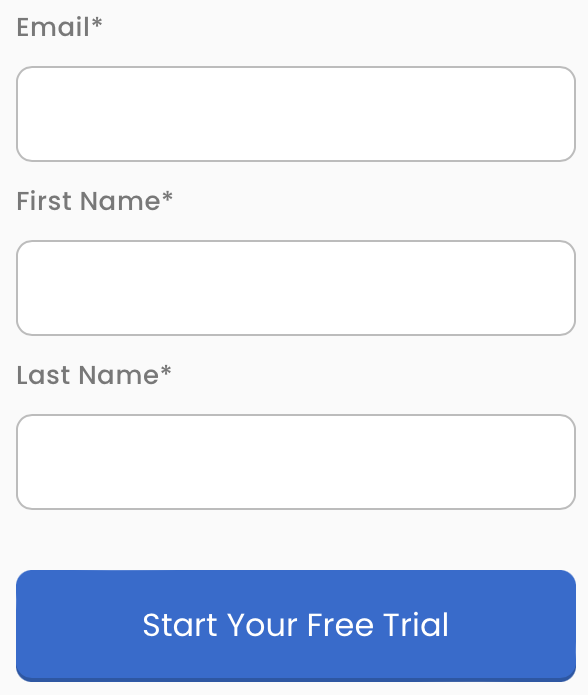
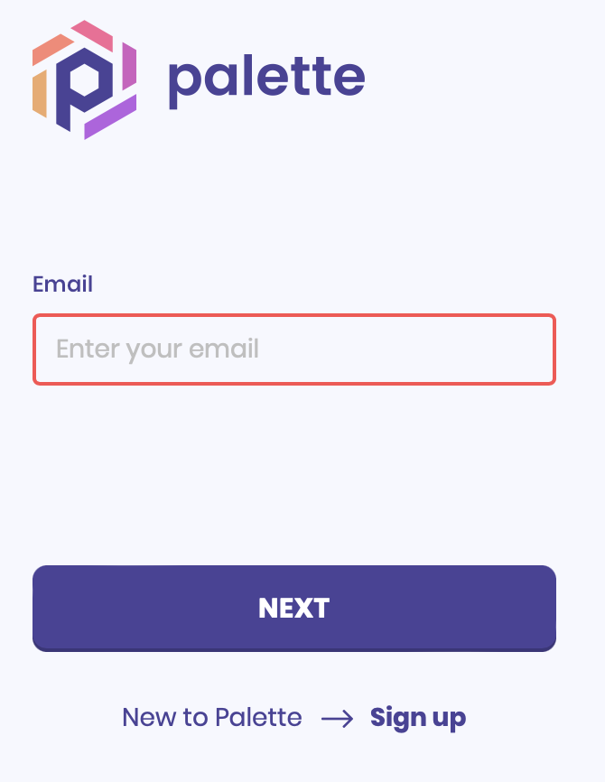
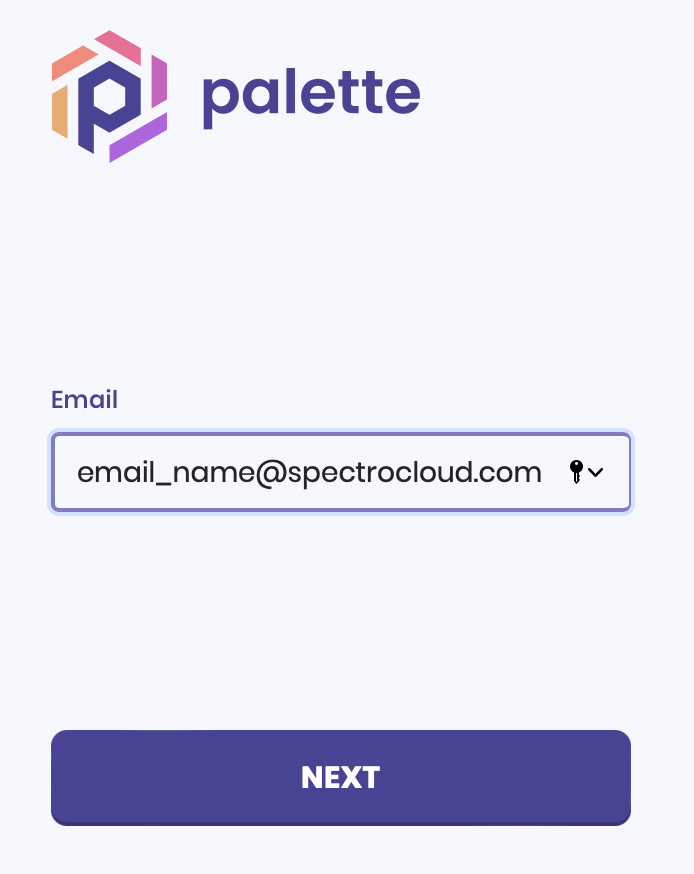
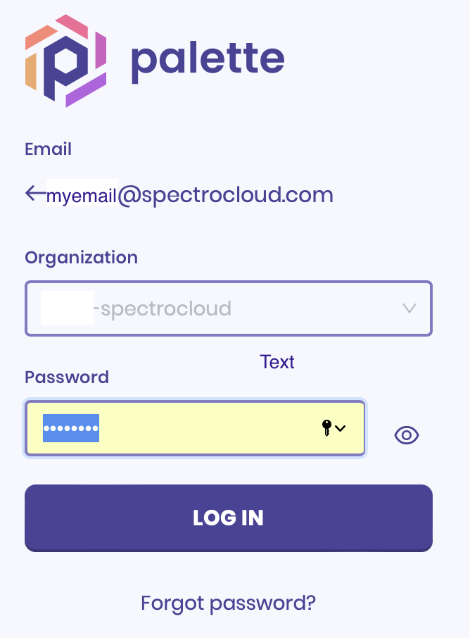
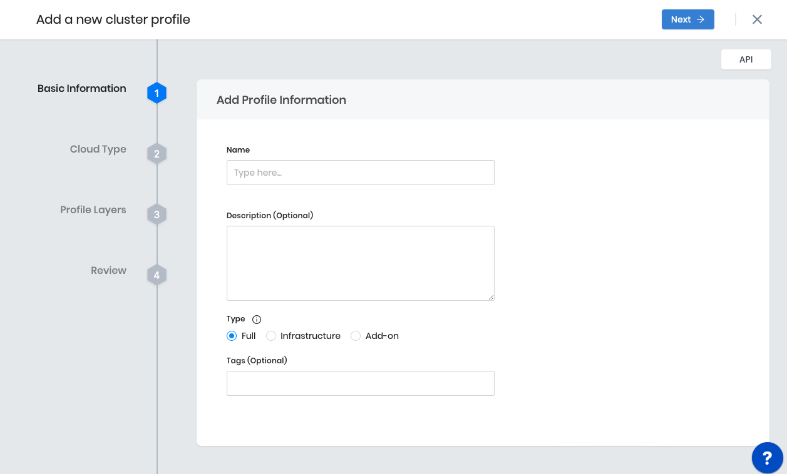

import Tabs from 'shared/components/ui/Tabs';
import WarningBox from 'shared/components/WarningBox';
import InfoBox from 'shared/components/InfoBox';
import PointsOfInterest from 'shared/components/common/PointOfInterest';
import Tooltip from "shared/components/ui/Tooltip";

# Getting Started

## Overview

This quick start guide will take you through setting up an out-of-the-box Tenant in the Spectro Cloud Palette console.

## Prerequisites

To use Spectro Cloud Palette, you must have the following prerequisites:

1. Spectro Cloud Palette account
 
  <!--  -->

2. A public or private Cloud Account
<!-- - Kubernetes installed -->

|     |    |   TESTING              |
|---------|---------|---------|
|I want to try Palette for Free? |  Sign up to create a [Palette](https://console.spectrocloud.com/auth/signup) account OR a [Free Trial](https://www.spectrocloud.com/free-trial/) account. |        |
|I already have a Palette account  | If you already have an authentication key,
 then use the email address that you used to request the 
 authentication key and the password given.
 Make sure you change the password as soon as you log in.
 |     |
|I want to sign on to Palette and change your password.| Navigate to `https://console.spectrocloud.com`
 and activate the account with the authentication code,
 provided to you via email. **Note**: This link has an expiration date.| |
|I want to sign on to Palette|Navigate to `https://console.spectrocloud.com`
 and enter the email and newly created password. 
  | |

## Set up Palette for your organization
Spectro Cloud requires the creation of a *Cluster Profile*, before a Workload cluster can be created. This is because the <Tooltip trigger={<u>Cluster Profiles</u>}><a href="/cluster-profiles">Cluster Profiles</a></Tooltip> are instantiated templates that are created with pre-configured layers or components needed for cluster deployments.

<!-- With Palette, you will be able to:

1. Construct flexible stacks from OS, Kubernetes, CNI, CSI to additional add-on application services
2. Repeatably deploy and reuse clusters across any environment
3. Import existing environments -->

  
<Tabs>

  <Tabs.TabPane tab="1. Cluster Profile Creation" key="foo">
  

  

  
|<a href="/cluster-profiles/1-task-define-profile.md/#creatingclusterprofiles" target="Create a Cluster Profile">Create a Cluster Profile</a> |  |  |
|---------|---------|---------|
|<li> Add your first Cluster Profile and enter the basic information.</li>|
  <li> 1. <bold>Name</bold></li>
<li> 2. <bold>Description</bold></li>
<li> 3. <bold>Profile Type</bold> will dictate the layers that can be configured in the Cluster Profile.</li>
    <li> - Full</li>
    <li> - Infra</li>
    <li> - Add-on</li>

 

<li>  4. <bold>Tags</bold> on a Cluster Profile are propagated to the VMs deployed on the cloud/data center environments when clusters are created from the cluster profile.</li>            

  </Tabs.TabPane>

  <Tabs.TabPane tab="2. Create your Cluster" key="foo2">
 
  <a href="/clusters/new-clusters/#creatingclusters" target="Cluster Profile">Create your Cluster</a>
  </Tabs.TabPane>

  <Tabs.TabPane tab="3. Import Existing Clusters" key="foo3">
   [Cluster Import](/clusters/brownfield-clusters/#overview) of Brownfield clusters

  </Tabs.TabPane>

  <Tabs.TabPane tab="4. Manage your Clusters" key="foo4">
   [Cluster Management](/clusters/cluster-management/#manageclusters)

  </Tabs.TabPane>

</Tabs>