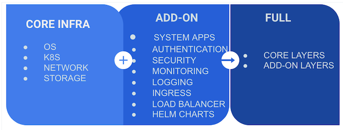
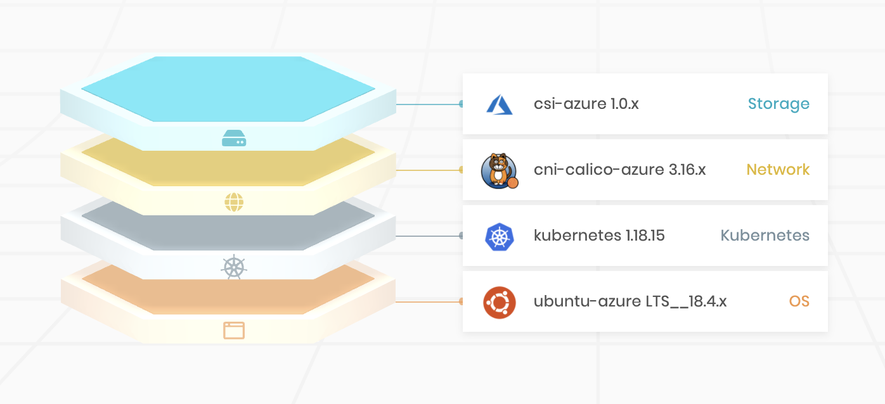
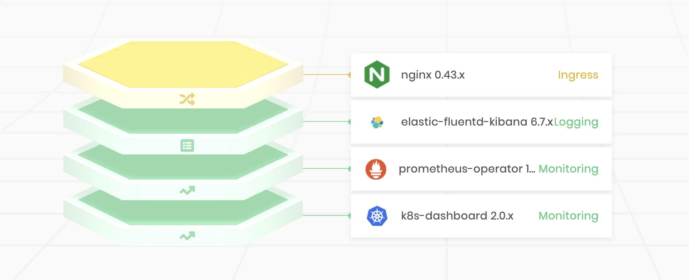
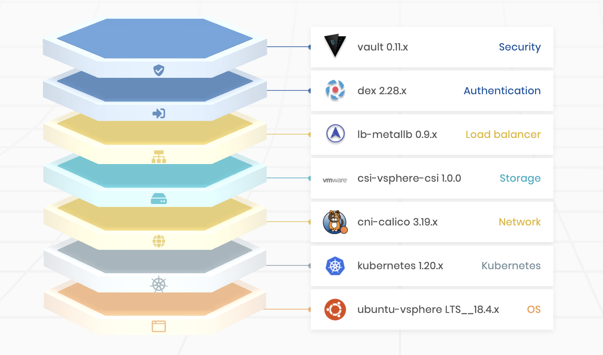

import WarningBox from 'shared/components/WarningBox';

# Overview
**Cluster Profiles** are like templates that are created with preconfigured layers/components that are required for 
workload cluster deployments. Cluster Profiles provide a way for driving consistency across workload cluster 
deployments. You can create as many profiles as required. 

A Cluster Profile can contain an environment-specific configuration and can be created to meet specific types of Workload Cluster deployment needs. As an example, you may create a Development Cluster Profile with a very basic configuration or a Production Cluster Profile with additional security, monitoring, and logging layers. 

You may also build Special Purpose Profiles to deploy Workload Clusters for use cases such as AI/ML or High Performance Computing (HPC). Cluster Profiles can be created to be of the type Core Infra, Add-on, or Full.

Cluster creation requires an Infrastructure or Full Cluster Profile to be selected, and optionally, one or more Add-on profile(s).  The same Add-on Layer category may exist in more than one of the Add-on profiles. The Profile would then read, for example: OS, Kubernetes, Networking, Storage, Monitoring, Ingress.

# Layers

Cluster Profile Layers are built using content packages which contain integration-specific templates, charts, and manifest. These content packages can either be of two types:

 * **Palette Packs** - These content packages are built using Spectro Cloud's proprietary content format. Spectro Cloud maintains a public registry of Palette Packs that are available to all Tenants.

 * **Helm Charts** - These charts are a collection of Kubernetes resource files capable of deploying services ranging in varying complexities. Palette provides a few stable public Helm registries out of the box. Tenants can also add any public or private Helm registries to leverage charts from those registries. Palette promotes Container Storage Interface (CSI) and Container Network Interface (CNI) layers to be added as Helm Charts from customized Helm registries and linked to Spectro Registry packs. 

# Core Infrastructure Cluster Profile
A **Core Infrastructure Cluster Profile** is constructed using the four Core Infrastructure layers: the OS, Kubernetes, the networking, and the storage layers. These profiles are environment specific and are constructed using cloud-specific layers.

# Add-On Cluster Profile
An **Add-on Cluster Profile** consists of various integrations and can be constructed using layers such as:

- System apps
- Authentication
- Security
- Monitoring
- Logging
- Ingress
- Load balancer
- Helm Charts

# Full Cluster Profile
A **Full Cluster Profile** consists of the Core Infrastructure layers and as many additional Add-on layers as required. The Core Infrastructure layers are cloud specific.

The next sections provide the details of creating and managing Cluster Profiles.

 
