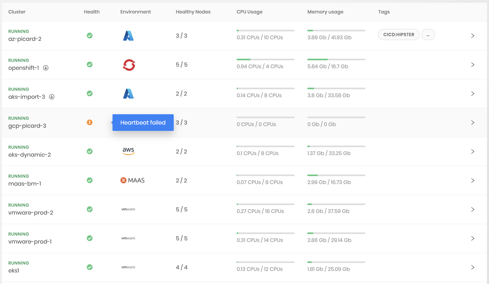
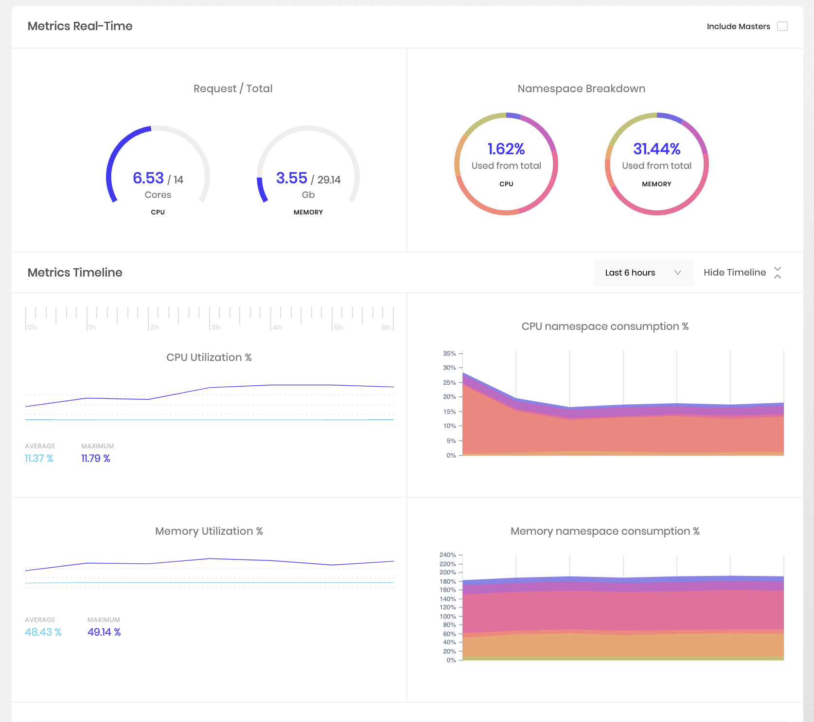
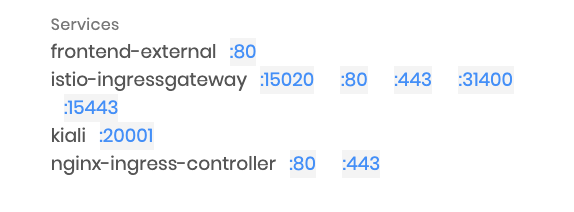
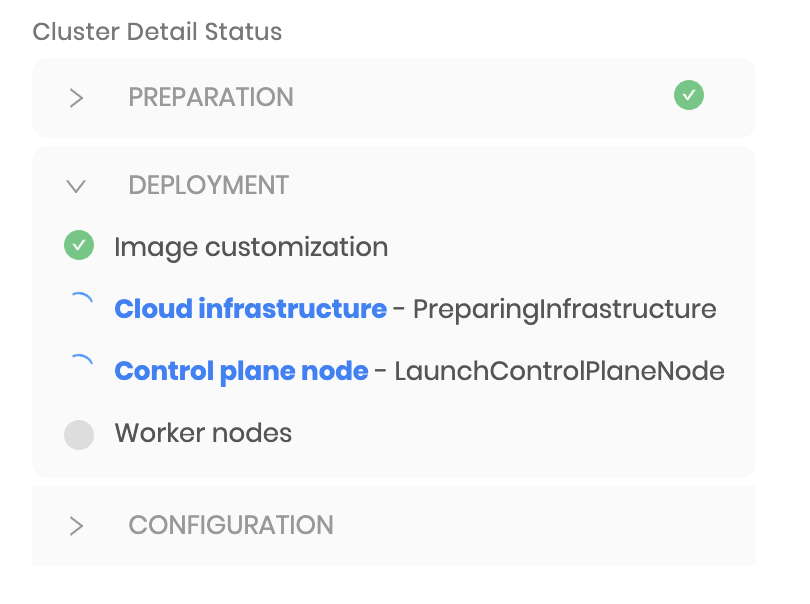
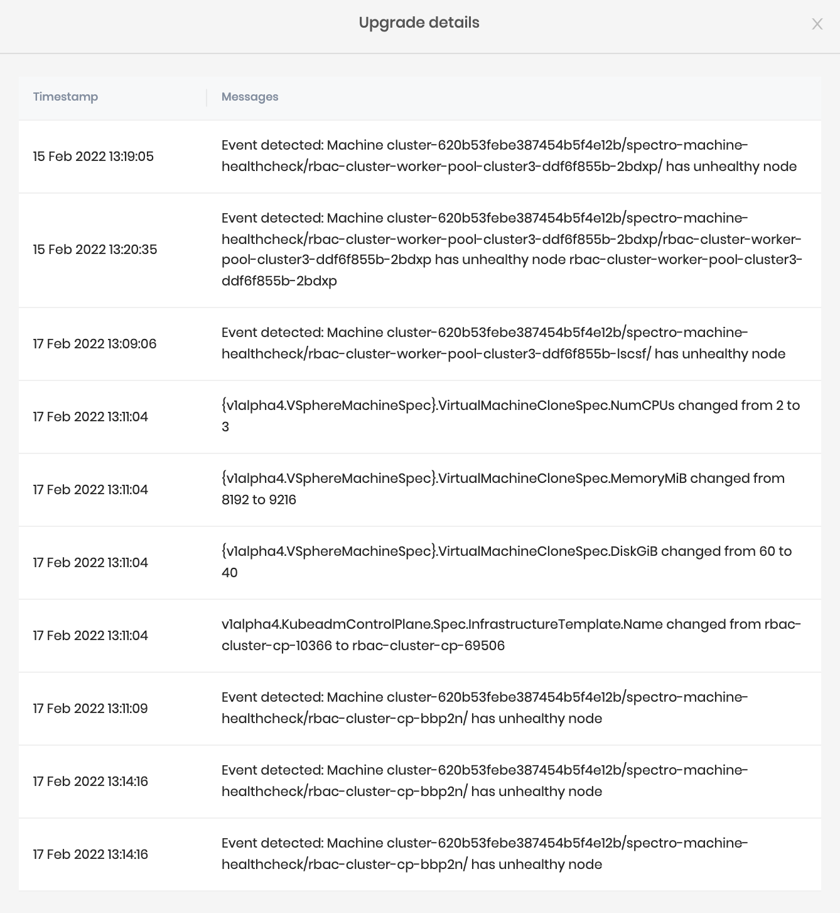
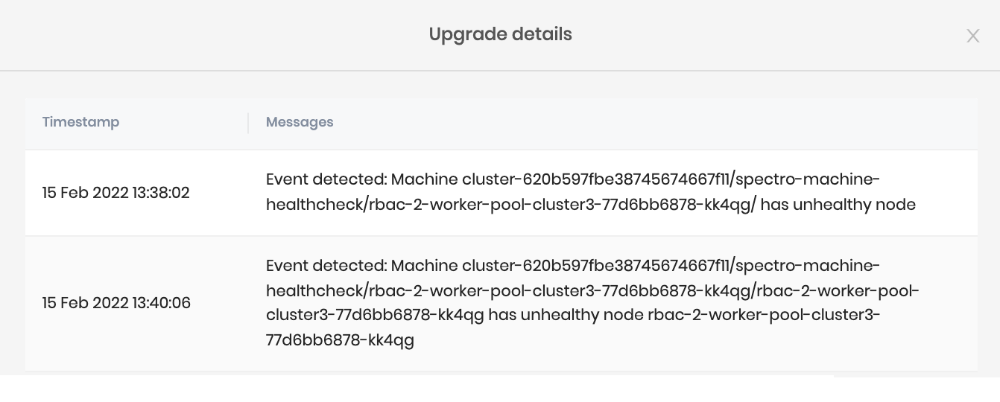

import Tabs from 'shared/components/ui/Tabs';
import InfoBox from 'shared/components/InfoBox';
import WarningBox from 'shared/components/WarningBox';
import PointsOfInterest from 'shared/components/common/PointOfInterest';
import Tooltip from "shared/components/ui/Tooltip";

# Cluster Overview

Kubernetes clusters in Palette are instantiated from cluster profiles. A cluster definition in Palette consists of a reference to a cluster profile, cloud configuration, as well as the cluster size and placement configuration. The following high-level tasks are performed as part of the cluster creation:

* Orchestration of computing, network, and storage resources on the cloud environments along with the required placement infrastructure.

* Installation and configuration of various Kubernetes components like Kubelet, API servers, etcd, or scheduler.

* Installation and configuration of the cloud-specific network (CNI) and storage (CSI) plugins.

* Securing the cluster infrastructure and configuration according to the relevant OS, Kubernetes, and cloud security best practices.

* Deployment of additional Add-ons such as Prometheus, Permissions Manager, or Vault, as specified in the Cluster Profile.

# Images

Palette provides Virtual Machine (VM) images for cluster-computing infrastructure out of the box for the most recent versions of Operating Systems such as Ubuntu or CentOS. These images are security-hardened based on the respective CIS Benchmarks. In addition, Kubernetes components such as kubelet, kubeadm, etc. are preinstalled in these images. The specific image for a cluster is derived from the Operating System and Kubernetes packs configured in the cluster profile.

The out-of-the-box images are hosted in the public cloud (AWS - AMI, Azure - VHD) or Palette's storage repository (vSphere - OVA). During provisioning, the image is copied (if missing) to the desired cloud region or downloaded onto a private data center.

## Customization

Palette provides various forms of customization options for VM images. All these customization options require a private pack registry to be set up with customized OS packs.

### Customize Out-of-the Box Images

The Palette out-of-the-box images are security-hardened and have Kubernetes components preinstalled. Additional components can be installed on the images at runtime by defining one or more Ansible roles in the customized OS pack. Palette's orchestration engine creates a new image by instantiating a VM instance from the out-of-the-box image and executing the specified Ansible roles on the instance. This custom image is used for cluster provisioning. The customized image is tagged with a unique signature generated from the pack definition so that it can be reused for future cluster provisioning requests.

# Security

Palette secures the Kubernetes clusters provisioned by following security best practices at the Operating System, Kubernetes, and Cloud Infrastructure levels.

## Operating System

The Palette out-of-the-box VM images are hardened in accordance with the relevant OS CIS benchmark. Additionally, the images are scanned for vulnerabilities regularly, and fixes are applied to these images when available from the provider. The upgraded images are released in the form of updated OS packs in the Palette Pack Registry and are available to the users to apply to their existing clusters at a time convenient to them.

## Kubernetes

Kubernetes components and configuration are hardened in accordance with the Kubernetes CIS Benchmark. Palette executes Kubebench, a CIS Benchmark scanner by Aqua Security, for every Kubernetes pack to ensure the master and worker nodes are configured securely.

## Cloud Infrastructure

Palette follows security best practices recommended by the various cloud providers when provisioning and configuring the computing, network, and storage infrastructure for the Kubernetes clusters. These include practices such as isolating master and worker nodes in dedicated network domains and limiting access through the use constructs like security groups.

<InfoBox>
  The security measures mentioned above are implemented for Palette's out-of-the-box OS and Kubernetes packs. For customized OS Kubernetes packs, users are responsible for taking the relevant measures to secure their clusters.
</InfoBox>

# Day-2 Management

Palette provides several options to manage Kubernetes clusters on an ongoing basis. These include opportunities to scale up/down the cluster by adding/reducing the number of nodes in a node pool, add extra worker pools, resizing nodes in a node pool by modifying the instance type, and adding additional fault domains such as availability zones to a node pool.

<InfoBox>
  Cluster management operations result updating cluster definitions in Palette's database. The updated definition is retrieved by the management agent running in the cluster. A rolling upgrade is then performed to bring associated clusters to their desired state.
</InfoBox>

# Cluster Health

Palette monitors the cluster infrastructure regularly and reports health on the management console.

Overall health is computed based on the following factors:

* **Heartbeat** - The Palette management agent, which runs inside the cluster, periodically sends a heartbeat to the management console. Missing heartbeats typically indicate of a problem such as a cluster infrastructure going down or lack of network connectivity. Failure to detect heartbeat over a while results in an unhealthy status for the cluster.

* **Node Conditions** - Kubernetes maintains the status for each cluster node in the form of conditions such as DiskPressure, MemoryPressure, or NetworkUnavailable. Palette monitors these conditions and reports back to the management console. Any node condition indicating a problem with the node, results in an unhealthy status for the cluster.

* **Metrics** - Palette collects usage metrics such as CPU, Disk, or Memory. The cluster is marked as unhealthy if the usage metrics cross specific thresholds over some time.

# Usage Monitoring

Palette continuously monitors cluster resources and reports the usage for the cluster as well as individual nodes. The following metrics are reported on the Cluster Overview page of the management console. By default, the metrics are only displayed for the worker nodes in the cluster:

* **Cores Used** - A cluster-wide breakdown of the number of cores used.

* **CPU Usage** - Current CPUs used across all cluster nodes. Additionally, usage over some time is presented as a chart.

* **Memory Usage** - Current memory used across all cluster nodes. Additionally, usage over a while is presented as a chart.

* **CPU Requests** - Total CPUs requested across all pods.

* **Memory Requests** - Total memory requested across all pods.

Additionally, usage metrics for individual nodes and node conditions are accessible from the Node Details page.

# Application Services

Palette enables quick access to the application services installed on the Kubernetes clusters by providing a link to those on the management console. These include the applications and services deployed through Palette and the ones deployed through any other means. Services are monitored on an ongoing basis, and all services of the type LoadBalancer or NodePort are displayed on the management console.

# Troubleshooting

Typically, when a cluster lifecycle action such as provisioning, upgrade, or deletion runs into a failure, it does not result in an outright error on the cluster. Instead, the Palette orchestration engine follows the reconciliation pattern, wherein the system repeatedly tries to perform various orchestration tasks to bring the cluster to its desired state until it succeeds. Initial cluster provisioning or subsequent updates can run into various issues related to cloud infrastructure availability, lack of resources, or networking issues.

## Cluster Conditions

Palette maintains specific milestones in a lifecycle and presents them as **Conditions**. 

Examples include: 

  - Creating Infrastructure
 

  - Adding Control Plane Node

  - Customizing Image 

The active condition indicates what task Palette orchestration system is trying to perform. If a task fails, the condition is marked as *failed*, with relevant error messages. Reconciliation, however, continues behind the scenes, and continuous attempts are made to perform the task. Failed conditions are a great source of troubleshooting provisioning issues.

For example, failure to create a Virtual Machine in AWS due to the exceeded vCPU limit will cause this error to be shown to the end-users. Then, they can choose to bring down some workloads in the AWS cloud to free up space. The next time a VM creation task is attempted, it will succeed, and the condition will be marked as a success.

## Rolling upgrade

Palette will perform a rolling upgrade on the nodes for any fundamental changes to the Cluster Configuration file. Below are some of the actions that will result in a rolling upgrade:

* OS layer changes

* Kubernetes layer changes

* Kubernetes version upgrade

* Kubernetes control plane upsize

* Machine pool updates for disk size

* Changes in availability zones

* Changes in instance types

* Certificate renewal and many more.

Palette keeps track of the reason that triggered the rolling upgrade on the nodes in the cluster and is made accessible under **Cluster Overview** > **Upgrade details**.

Besides actions taken by the user, Palette also performs a rolling upgrade if the cluster nodes' health degrades. Palette keeps track of the nodes machine's health and will relaunch the node when the machine health check fails.

The following are some sample scenarios where the node health is considered as degraded:

  * Kubelet not up for 10 mins.

  * Network unavailability for 10 mins.

  * New node doesn't get ready in 30 mins.

## Event Stream

Palette maintains an event stream with low-level details of the various orchestration tasks being performed. This event stream is a good source for identifying issues in the event an operation does not complete for a long time.

 

<InfoBox>

* Cluster events are retained for the last 1000 events.

* Due to the Palette reconciliation logic, intermittent errors appear in the event stream.    As an example, errors might show up in the event stream regarding being unable to reach the node after launching a node. However, the errors clear up once the node comes up.
 
 
  Error messages that persist over a long time or errors indicating issues with underlying infrastructure are an indication of a real problem.

</InfoBox>

## Download Cluster Logs

At times, you may be required to work with the Palette Support Team to troubleshoot an issue. Palette provides the ability to gather logs from the clusters it manages. Problems that occur during the orchestration lifecycle, may require access to the various containers, nodes, and Kube system logs. Palette automates this log-collection process and provides an easy download option from the Palette UI console. Hence, it reduces the burden on the operator to log in to various cluster nodes individually and fetch these logs.
 

### Collect the Logs

1. Select the running cluster.

2. Go to **Settings* and select **Download Logs**.

3. Choose the desired log from the below options:
      * Kube-System Logs
          * Logs of all the Kubernetes components.
      * Logs
        * Spectro namespace logs for the last one hour.
      * Node Logs 
        * Contains the Spectro log, system log, and the cloud-init log information collected for the last ten thousand lines of code.
    
4. Click **Download Logs**. 

    This message will display on the UI: "The request was sent successfully. The download will be available soon." There is an average wait time of five (5) minutes. 

    At the end of this short log fetching interval, the message will be displayed on the UI: "The logs archive for {Cluster-name} was created successfully."

5. Click **Download <*cluster-name*> logs** to download the **Logs** folder to your local machine.

6. Unzip and rename the Logs folder as per the customer's choice.

<InfoBox>

* In addition to the log contents briefed above, the folder will also contain a Manifest.yaml file describing the CRDs, Deployments, Pods, ConfigMap, Events, and Nodes details of the Cluster.

* Palette recommends its users attach these logs, along with the support request, for accelerated troubleshooting.

* Expect an average log fetching time of five (5) minutes for the ready-to-download message to appear on the UI, once the download log is clicked.

* The downloaded Zip file will be by default named as **spectro_logs.zip**. The users can unzip and choose a name of convenience.

</InfoBox>

# Proxy Whitelists

This table lists the proxy requirements for enabling the Palette management console.

| Top-level Domain          | Port | Description                                 |
| ------------------------- | ---- | ------------------------------------------- |
| spectrocloud.com          | 443  | For the Palette SaaS.                       |
| s3.amazonaws.com          | 443  | To access the Palette VMware OVA files.     |
| gcr.io                    | 443  | To access the Palette image files.          |
| docker.io                 | 443  | To access the Palette Pack Registries.      |
| googleapis.com            | 443  | For pulling Palette images.                 |
| docker.com                | 443  | To access the Palette docker images.        |
| raw.githubusercontent.com | 443  |                                             |
| projectcalico.org         | 443  | For egress management.                      |
| quay.io                   | 443  | Container image registry access.            |
| grafana.com               | 443  | To provide access to the dashboard metrics. |
| github.com                | 443  |                                             |

# Scope

Clusters are launched from within Projects in Palette, and they belong to a single project. In the **Project** view, all clusters that are launched from that project are listed for users with the Project Administrator role or Cluster Administrator role. A Tenant Administrator can get an aggregated view of clusters running across all projects from the **Organization** view, as follows:
 

1.    Log in to the **Palette Management Console** as a Tenant Administrator.

2.    Go to the **Clusters** option from the sidebar to list all the clusters belonging to all the users under that Tenant Administrator.

 

# Additional Resources 

The next section provides details for setting workload clusters in various environments.
 
