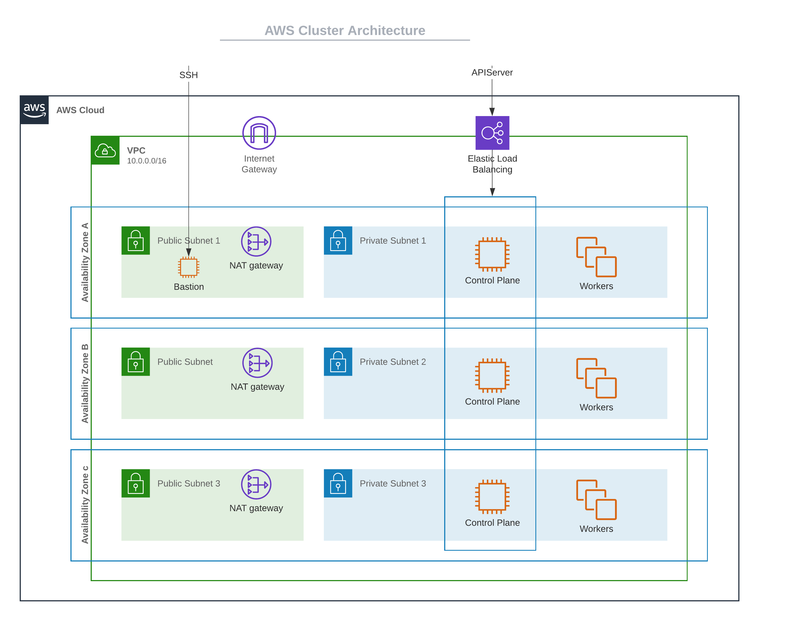

import Tabs from 'shared/components/ui/Tabs';
import WarningBox from 'shared/components/WarningBox';
import InfoBox from 'shared/components/InfoBox';
import PointsOfInterest from 'shared/components/common/PointOfInterest';

# AWS IaaS Architecture


The following are some architectural highlights of the Amazon Web Services (AWS) clusters, provisioned by Palette:


- Kubernetes nodes can be distributed across multiple availability zones (AZs) to achieve high availability (HA). For each of the AZs that you select, a public subnet and a private subnet is created.


- All the control plane nodes and worker nodes are created within the private subnets, so there is no direct public access available.


- A Network Address Translation (NAT) Gateway is created in the public subnet of each AZ, to allow nodes in the private subnet to be able to go out to the internet or call other AWS services.


- An Internet Gateway (IG) is created for each Virtual Private Cloud (VPC), to allow Secure Shell Protocol (SSH) access to the bastion node for debugging purposes. SSH into Kubernetes nodes is only available through the bastion node. A bastion node helps to provide access to the Amazon Elastic Compute Cloud (EC2) instances. This is because the EC2 instances are created in a private subnet and the bastion node operates as a secure, single point of entry into the infrastructure. The bastion node can be accessed via SSH or Remote Desktop (RDP).


- The Kubernetes API Server endpoint is accessible through an Elastic Load Balancing (ELB), which load balances across all the control plane nodes.




# AWS EKS Architecutre

Palette also supports deploying and managing AWS Elastic Kubernetes Service (EKS) clusters. Review the architectural highlights pertaining to EKS when managed by Palette.

- Cluster resources such as Virtual Machines (VMs) can be provisioned into an existing infrastructure (Gateways, VPCs, Subnets etc.) as part of static provisioning as well as new dedicated infrastructure as part of dynamic provisioning.


- Palette supports the usage of [EKS Fargate Profiles](https://docs.aws.amazon.com/eks/latest/userguide/fargate-profile.html).


- Spot instance support

 


## Disable OIDC Associate Provider
You can disable the OIDC associate provider if the service provider restricts the cluster deployment with the OIDC associate provider in the enabled state. Customize the EKS Kubernetes pack YAML values with the following option:

<br />


```yaml
  disableAssociateOIDCProvider: true
```  

# AWS Instance Type and Pod Capacity
Choose the instance type and the number of instances to be launched by calculating the number of expected pods. You should also calculate the number of pods scheduled per node for an instance type. Improperly sized nodes can cause cluster creation to fail due to resource unavailability.

The following section describes calculating the pod capacity for AWS instance types. This calculation will help you select the proper instance type and the number of desired workers in a worker pool. We recommend for most workloads choosing an instance that can support at least 30 pods.

## Formula for Pod Calculation
Number of pods = N * (M-1) + 2 

Where:
* **N** is the number of Elastic Network Interfaces (ENI) of the instance type (Maximum network interfaces).
* **M** is the number of IP addresses of a single ENI (Private IPv4 addresses per interface/IPv6 addresses per interface).
* Values for **N** and **M** for each instance type can be referred from [this document](https://docs.aws.amazon.com/AWSEC2/latest/UserGuide/using-eni.html#AvailableIpPerENI).

## Example Calculation:
* For instance type = t3.medium 
* For values of N = 3, and M = 6 (values derived from AWS [document](https://docs.aws.amazon.com/AWSEC2/latest/UserGuide/using-eni.html#AvailableIpPerENI) )
* N * (M-1) + 2 = 3(6-1)+2 =17 pods/instances
* In this example, we will need at least two (2) t3.medium instances to reach the minimum of 30 pods threshold.

When setting the desired size of the worker pool, make the choice as per pod requirement. In the example provided, two instances of t3.medium are needed to satisfy the resource requirement of an EKS cluster.


## Spot Instances

By default, worker pools are configured to use on-demand instances. However, to take advantage of discounted spot instance pricing you can specify Spot instances when creating a cluser. The **On-Spot** option can be selected in the node config page during cluster creation. This option allows you to specify a maximum bid price for the nodes as a percentage of the on-demand price. Palette tracks the current price for spot instances and launches nodes, when the spot price falls in the specified range.