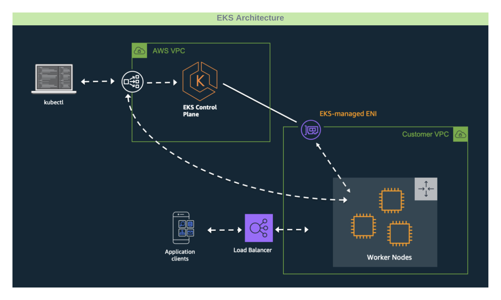

import Tabs from 'shared/components/ui/Tabs';
import WarningBox from 'shared/components/WarningBox';
import InfoBox from 'shared/components/InfoBox';
import PointsOfInterest from 'shared/components/common/PointOfInterest';

# Overview

The following are some architectural highlights of Amazon Web Services (AWS) managed Kubernetes clusters (also known as Elastic Kubernetes Service or (EKS)), provisioned by Palette:

1. Cluster resources such as Virtual Machines (VMs) can be provisioned into an existing infrastructure (Gateways, VPCs, Subnets, etc.) as part of static provisioning as well as new dedicated infrastructure as part of dynamic provisioning.


2. Full support for EKS Fargate profiles.


3. Spot instance support.

 

# Prerequisites

The following prerequisites must be met before deploying an EKS workload cluster:

1. You need an active AWS cloud account with all the permissions listed below in the **AWS Cloud Account Permissions** section.


2. You must register your AWS cloud account in Palette as described in the **Creating an AWS Cloud account** section below.


3. Have an Infrastructure cluster profile already created in Palette for EKS.


4. Sufficient capacity in the desired AWS region should exist for the creation of the following resources:
    - vCPU
    - VPC
    - Elastic IP
    - Internet Gateway
    - Elastic Load Balancers
    - NAT Gateway

# AWS Cloud Account Permissions

The following **four** policies include all the required permissions for provisioning clusters through Palette:

<Tabs>

<Tabs.TabPane tab="Controller Policy" key="Controller Policy">

### Controller Policy

**Last Update**: May 25, 2022

``` json
{
  "Version": "2012-10-17",
  "Statement": [
    {
      "Effect": "Allow",
      "Action": [
        "ec2:AllocateAddress",
        "ec2:AssociateRouteTable",
        "ec2:AttachInternetGateway",
        "ec2:AuthorizeSecurityGroupIngress",
        "ec2:CreateInternetGateway",
        "ec2:CreateNatGateway",
        "ec2:CreateRoute",
        "ec2:CreateRouteTable",
        "ec2:ReplaceRoute",       
        "ec2:CreateSecurityGroup",
        "ec2:CreateSubnet",
        "ec2:CreateTags",
        "ec2:CreateVpc",
        "ec2:ModifyVpcAttribute",
        "ec2:DeleteInternetGateway",
        "ec2:DeleteNatGateway",
        "ec2:DeleteNetworkInterface",
        "ec2:DeleteRouteTable",
        "ec2:DeleteSecurityGroup",
        "ec2:DeleteSubnet",
        "ec2:DeleteTags",
        "ec2:DeleteVpc",
        "ec2:DescribeAccountAttributes",
        "ec2:DescribeAddresses",
        "ec2:DescribeAvailabilityZones",
        "ec2:DescribeInstances",
        "ec2:DescribeInternetGateways",
        "ec2:DescribeImages",
        "ec2:DescribeKeyPairs",
        "ec2:DescribeNatGateways",
        "ec2:DescribeNetworkInterfaces",
        "ec2:DescribeNetworkInterfaceAttribute",
        "ec2:DescribeRouteTables",
        "ec2:DescribeSecurityGroups",
        "ec2:DescribeSubnets",
        "ec2:DescribeVpcs",
        "ec2:DescribeVpcAttribute",
        "ec2:DescribeVolumes",
        "ec2:DetachInternetGateway",
        "ec2:DisassociateRouteTable",
        "ec2:DisassociateAddress",
        "ec2:ModifyInstanceAttribute",
        "ec2:ModifyNetworkInterfaceAttribute",
        "ec2:ModifySubnetAttribute",
        "ec2:ReleaseAddress",
        "ec2:RevokeSecurityGroupIngress",
        "ec2:RunInstances",
        "ec2:TerminateInstances",
        "tag:GetResources",
        "elasticloadbalancing:AddTags",
        "elasticloadbalancing:CreateLoadBalancer",
        "elasticloadbalancing:ConfigureHealthCheck",
        "elasticloadbalancing:DeleteLoadBalancer",
        "elasticloadbalancing:DescribeLoadBalancers",
        "elasticloadbalancing:DescribeLoadBalancerAttributes",
        "elasticloadbalancing:ApplySecurityGroupsToLoadBalancer",
        "elasticloadbalancing:DescribeTags",
        "elasticloadbalancing:ModifyLoadBalancerAttributes",
        "elasticloadbalancing:RegisterInstancesWithLoadBalancer",
        "elasticloadbalancing:DeregisterInstancesFromLoadBalancer",
        "elasticloadbalancing:RemoveTags",
        "autoscaling:DescribeAutoScalingGroups",
        "autoscaling:DescribeInstanceRefreshes",
        "ec2:CreateLaunchTemplate",
        "ec2:CreateLaunchTemplateVersion",
        "ec2:DescribeLaunchTemplates",
        "ec2:DescribeLaunchTemplateVersions",
        "ec2:DeleteLaunchTemplate",
        "ec2:DeleteLaunchTemplateVersions"
      ],
      "Resource": [
        "*"
      ]
    },
    {
      "Effect": "Allow",
      "Action": [
        "autoscaling:CreateAutoScalingGroup",
        "autoscaling:UpdateAutoScalingGroup",
        "autoscaling:CreateOrUpdateTags",
        "autoscaling:StartInstanceRefresh",
        "autoscaling:DeleteAutoScalingGroup",
        "autoscaling:DeleteTags"
      ],
      "Resource": [
        "arn:*:autoscaling:*:*:autoScalingGroup:*:autoScalingGroupName/*"
      ]
    },
    {
      "Effect": "Allow",
      "Action": [
        "iam:CreateServiceLinkedRole"
      ],
      "Resource": [
        "arn:*:iam::*:role/aws-service-role/autoscaling.amazonaws.com/AWSServiceRoleForAutoScaling"
      ],
      "Condition": {
        "StringLike": {
          "iam:AWSServiceName": "autoscaling.amazonaws.com"
        }
      }
    },
    {
      "Effect": "Allow",
      "Action": [
        "iam:CreateServiceLinkedRole"
      ],
      "Resource": [
        "arn:*:iam::*:role/aws-service-role/elasticloadbalancing.amazonaws.com/AWSServiceRoleForElasticLoadBalancing"
      ],
      "Condition": {
        "StringLike": {
          "iam:AWSServiceName": "elasticloadbalancing.amazonaws.com"
        }
      }
    },
    {
      "Effect": "Allow",
      "Action": [
        "iam:CreateServiceLinkedRole"
      ],
      "Resource": [
        "arn:*:iam::*:role/aws-service-role/spot.amazonaws.com/AWSServiceRoleForEC2Spot"
      ],
      "Condition": {
        "StringLike": {
          "iam:AWSServiceName": "spot.amazonaws.com"
        }
      }
    },
    {
      "Effect": "Allow",
      "Action": [
        "iam:PassRole"
      ],
      "Resource": [
        "arn:*:iam::*:role/*.cluster-api-provider-aws.sigs.k8s.io"
      ]
    },
    {
      "Effect": "Allow",
      "Action": [
        "secretsmanager:CreateSecret",
        "secretsmanager:DeleteSecret",
        "secretsmanager:TagResource"
      ],
      "Resource": [
        "arn:*:secretsmanager:*:*:secret:aws.cluster.x-k8s.io/*"
      ]
    },
    {
      "Effect": "Allow",
      "Action": [
        "ssm:GetParameter"
      ],
      "Resource": [
        "arn:*:ssm:*:*:parameter/aws/service/eks/optimized-ami/*"
      ]
    },
    {
      "Effect": "Allow",
      "Action": [
        "iam:CreateServiceLinkedRole"
      ],
      "Resource": [
        "arn:*:iam::*:role/aws-service-role/eks.amazonaws.com/AWSServiceRoleForAmazonEKS"
      ],
      "Condition": {
        "StringLike": {
          "iam:AWSServiceName": "eks.amazonaws.com"
        }
      }
    },
    {
      "Effect": "Allow",
      "Action": [
        "iam:CreateServiceLinkedRole"
      ],
      "Resource": [
        "arn:*:iam::*:role/aws-service-role/eks-nodegroup.amazonaws.com/AWSServiceRoleForAmazonEKSNodegroup"
      ],
      "Condition": {
        "StringLike": {
          "iam:AWSServiceName": "eks-nodegroup.amazonaws.com"
        }
      }
    },
    {
      "Effect": "Allow",
      "Action": [
        "iam:CreateServiceLinkedRole"
      ],
      "Resource": [
        "arn:aws:iam::*:role/aws-service-role/eks-fargate-pods.amazonaws.com/AWSServiceRoleForAmazonEKSForFargate"
      ],
      "Condition": {
        "StringLike": {
          "iam:AWSServiceName": "eks-fargate.amazonaws.com"
        }
      }
    },
    {
      "Effect": "Allow",
      "Action": [
        "iam:ListOpenIDConnectProviders",
        "iam:CreateOpenIDConnectProvider",
        "iam:AddClientIDToOpenIDConnectProvider",
        "iam:UpdateOpenIDConnectProviderThumbprint",
        "iam:DeleteOpenIDConnectProvider"
      ],
      "Resource": [
        "*"
      ]
    },
    {
      "Effect": "Allow",
      "Action": [
        "iam:GetRole",
        "iam:ListAttachedRolePolicies",
        "iam:DetachRolePolicy",
        "iam:DeleteRole",
        "iam:CreateRole",
        "iam:TagRole",
        "iam:AttachRolePolicy"
      ],
      "Resource": [
        "arn:*:iam::*:role/*"
      ]
    },
    {
      "Effect": "Allow",
      "Action": [
        "iam:GetPolicy"
      ],
      "Resource": [
        "arn:aws:iam::aws:policy/AmazonEKSClusterPolicy"
      ]
    },
    {
      "Effect": "Allow",
      "Action": [
        "eks:DescribeCluster",
        "eks:ListClusters",
        "eks:CreateCluster",
        "eks:TagResource",
        "eks:UpdateClusterVersion",
        "eks:DeleteCluster",
        "eks:UpdateClusterConfig",
        "eks:UntagResource",
        "eks:UpdateNodegroupVersion",
        "eks:DescribeNodegroup",
        "eks:DeleteNodegroup",
        "eks:UpdateNodegroupConfig",
        "eks:CreateNodegroup"
      ],
      "Resource": [
        "arn:*:eks:*:*:cluster/*",
        "arn:*:eks:*:*:nodegroup/*/*/*"
      ]
    },
    {
      "Effect": "Allow",
      "Action": [
        "eks:AssociateIdentityProviderConfig",
        "eks:ListIdentityProviderConfigs"
      ],
      "Resource": [
        "arn:aws:eks:*:*:cluster/*"
      ]
    },
    {
      "Effect": "Allow",
      "Action": [
        "eks:DisassociateIdentityProviderConfig",
        "eks:DescribeIdentityProviderConfig"
      ],
      "Resource": [
        "*"
      ]
    },
    {
      "Effect": "Allow",
      "Action": [
        "eks:ListAddons",
        "eks:CreateAddon",
        "eks:DescribeAddonVersions",
        "eks:DescribeAddon",
        "eks:DeleteAddon",
        "eks:UpdateAddon",
        "eks:TagResource",
        "eks:DescribeFargateProfile",
        "eks:CreateFargateProfile",
        "eks:DeleteFargateProfile"
      ],
      "Resource": [
        "*"
      ]
    },
    {
      "Effect": "Allow",
      "Action": [
        "iam:PassRole"
      ],
      "Resource": [
        "*"
      ],
      "Condition": {
        "StringEquals": {
          "iam:PassedToService": "eks.amazonaws.com"
        }
      }
    }
  ]
}

```

<InfoBox>
<b>Note</b>:
All the above policies are required as part of the Cluster API requirement, derived using <a href="https://cluster-api-aws.sigs.k8s.io/clusterawsadm/clusterawsadm_bootstrap_iam_print-policy.html/">clusterawsadm bootstrap iam print-policy.</a>
</InfoBox>

</Tabs.TabPane>
<Tabs.TabPane tab="Control Plane Policy" key="Control Plane Policy">

### Control Plane Policy

**Last Update**: June 6, 2021

``` json
{
  "Version": "2012-10-17",
  "Statement": [
    {
      "Effect": "Allow",
      "Action": [
        "autoscaling:DescribeAutoScalingGroups",
        "autoscaling:DescribeLaunchConfigurations",
        "autoscaling:DescribeTags",
        "ec2:DescribeInstances",
        "ec2:DescribeImages",
        "ec2:DescribeRegions",
        "ec2:DescribeRouteTables",
        "ec2:DescribeSecurityGroups",
        "ec2:DescribeSubnets",
        "ec2:DescribeVolumes",
        "ec2:CreateSecurityGroup",
        "ec2:CreateTags",
        "ec2:CreateVolume",
        "ec2:ModifyInstanceAttribute",
        "ec2:ModifyVolume",
        "ec2:AttachVolume",
        "ec2:AuthorizeSecurityGroupIngress",
        "ec2:CreateRoute",
        "ec2:DeleteRoute",
        "ec2:DeleteSecurityGroup",
        "ec2:DeleteVolume",
        "ec2:DetachVolume",
        "ec2:RevokeSecurityGroupIngress",
        "ec2:DescribeVpcs",
        "elasticloadbalancing:AddTags",
        "elasticloadbalancing:AttachLoadBalancerToSubnets",
        "elasticloadbalancing:ApplySecurityGroupsToLoadBalancer",
        "elasticloadbalancing:CreateLoadBalancer",
        "elasticloadbalancing:CreateLoadBalancerPolicy",
        "elasticloadbalancing:CreateLoadBalancerListeners",
        "elasticloadbalancing:ConfigureHealthCheck",
        "elasticloadbalancing:DeleteLoadBalancer",
        "elasticloadbalancing:DeleteLoadBalancerListeners",
        "elasticloadbalancing:DescribeLoadBalancers",
        "elasticloadbalancing:DescribeLoadBalancerAttributes",
        "elasticloadbalancing:DetachLoadBalancerFromSubnets",
        "elasticloadbalancing:DeregisterInstancesFromLoadBalancer",
        "elasticloadbalancing:ModifyLoadBalancerAttributes",
        "elasticloadbalancing:RegisterInstancesWithLoadBalancer",
        "elasticloadbalancing:SetLoadBalancerPoliciesForBackendServer",
        "elasticloadbalancing:AddTags",
        "elasticloadbalancing:CreateListener",
        "elasticloadbalancing:CreateTargetGroup",
        "elasticloadbalancing:DeleteListener",
        "elasticloadbalancing:DeleteTargetGroup",
        "elasticloadbalancing:DescribeListeners",
        "elasticloadbalancing:DescribeLoadBalancerPolicies",
        "elasticloadbalancing:DescribeTargetGroups",
        "elasticloadbalancing:DescribeTargetHealth",
        "elasticloadbalancing:ModifyListener",
        "elasticloadbalancing:ModifyTargetGroup",
        "elasticloadbalancing:RegisterTargets",
        "elasticloadbalancing:SetLoadBalancerPoliciesOfListener",
        "iam:CreateServiceLinkedRole",
        "kms:DescribeKey"
      ],
      "Resource": [
        "*"
      ]
    }
  ]
}

```

<InfoBox>
<b>Note</b>:
All the above policies are required as part of the Cluster API requirement, derived using <a href="https://cluster-api-aws.sigs.k8s.io/clusterawsadm/clusterawsadm_bootstrap_iam_print-policy.html/">clusterawsadm bootstrap iam print-policy.</a>
</InfoBox>

</Tabs.TabPane>

<Tabs.TabPane tab="Nodes Policy" key="Nodes Policy">

### Nodes Policy

**Last Update**: June 1, 2021

``` json
{
  "Version": "2012-10-17",
  "Statement": [
    {
      "Effect": "Allow",
      "Action": [
        "ec2:DescribeInstances",
        "ec2:DescribeRegions",
        "ecr:GetAuthorizationToken",
        "ecr:BatchCheckLayerAvailability",
        "ecr:GetDownloadUrlForLayer",
        "ecr:GetRepositoryPolicy",
        "ecr:DescribeRepositories",
        "ecr:ListImages",
        "ecr:BatchGetImage"
      ],
      "Resource": [
        "*"
      ]
    },
    {
      "Effect": "Allow",
      "Action": [
        "secretsmanager:DeleteSecret",
        "secretsmanager:GetSecretValue"
      ],
      "Resource": [
        "arn:*:secretsmanager:*:*:secret:aws.cluster.x-k8s.io/*"
      ]
    },
    {
      "Effect": "Allow",
      "Action": [
        "ssm:UpdateInstanceInformation",
        "ssmmessages:CreateControlChannel",
        "ssmmessages:CreateDataChannel",
        "ssmmessages:OpenControlChannel",
        "ssmmessages:OpenDataChannel",
        "s3:GetEncryptionConfiguration"
      ],
      "Resource": [
        "*"
      ]
    }
  ]
}

```
<InfoBox>
<b>Note</b>:
All the above policies are required as part of the Cluster API requirement, derived using the <a href="https://cluster-api-aws.sigs.k8s.io/clusterawsadm/clusterawsadm_bootstrap_iam_print-policy.html/">clusterawsadm bootstrap iam print-policy.</a>
</InfoBox>

</Tabs.TabPane>

<Tabs.TabPane tab="Deployment Policy" key="Deployment Policy">

### Deployment Policy

 **Last Update**: June 1, 2021

``` json
{
    "Version": "2012-10-17",
    "Statement": [
        {
            "Effect": "Allow",
            "Action": [
                "cloudformation:CreateStack",
                "cloudformation:DescribeStacks",
                "cloudformation:UpdateStack",
                "ec2:CreateSnapshot",
                "ec2:DeleteSnapshot",
                "ec2:DescribeKeyPairs",
                "ec2:DetachNetworkInterface",
                "ec2:DeleteNetworkInterface",
                "ec2:DescribeSnapshots",
                "ec2:DescribeTags",
                "ec2:DescribeVolumesModifications",
                "iam:AddRoleToInstanceProfile",
                "iam:AddUserToGroup",
                "iam:AttachGroupPolicy",
                "iam:CreateGroup",
                "iam:CreateInstanceProfile",
                "iam:CreatePolicy",
                "iam:CreatePolicyVersion",
                "iam:CreateUser",
                "iam:DeleteGroup",
                "iam:DeleteInstanceProfile",
                "iam:DeletePolicy",
                "iam:DetachGroupPolicy",
                "iam:DeletePolicyVersion",
                "iam:GetGroup",
                "iam:GetInstanceProfile",
                "iam:GetUser",
                "iam:GetPolicy",
                "iam:ListPolicyVersions",
                "iam:RemoveRoleFromInstanceProfile",
                "iam:RemoveUserFromGroup",
                "pricing:GetProducts",
                "sts:AssumeRole"
            ],
            "Resource": [
                "*"
            ]
        }
    ]
}

```

</Tabs.TabPane>

</Tabs>


## Restricting Palette Static Minimum Permissions for Existing VPC

You can choose to have Palette work in a static or dynamic environment. You can also set it to restrict or allow Palette to perform an AWS EKS cluster creation into an existing VPC. The following policy allows Palette work but restricts it to the Principle of Least Privilege.


<br />
<br />

<Tabs>
<Tabs.TabPane tab="Minimum Dynamic Permissions" key="Minimum Dynamic Permissions">


This is a policy for those who want to restrict Palette to a single VPC and not give Palette access to create or delete VPCs.

<br />
<br />

### Minimum Dynamic Permissions


```json
{
 "Version": "2012-10-17",
  "Statement": [
    {
      "Sid": "VisualEditor0",
      "Effect": "Allow",
      "Action": [
        "ec2:AuthorizeSecurityGroupIngress",
        "ec2:DescribeInstances",
        "iam:RemoveRoleFromInstanceProfile",
        "ec2:AttachInternetGateway",
        "iam:AddRoleToInstanceProfile",
        "ec2:DeleteRouteTable",
        "ec2:AssociateRouteTable",
        "ec2:DescribeInternetGateways",
        "ec2:CreateRoute",
        "ec2:CreateInternetGateway",
        "ec2:DescribeVolumes",
        "ec2:DescribeKeyPairs",
        "ec2:DescribeNetworkAcls",
        "ec2:DescribeRouteTables",
        "ec2:CreateTags",
        "ec2:CreateRouteTable",
        "ec2:RunInstances",
        "ec2:ModifyInstanceAttribute",
        "ec2:TerminateInstances",
        "ec2:DetachInternetGateway",
        "ec2:DisassociateRouteTable",
        "ec2:RevokeSecurityGroupIngress",
        "ec2:DescribeIpv6Pools",
        "ec2:DeleteVpc",
        "ec2:CreateSubnet",
        "ec2:DescribeSubnets",
        "iam:CreateInstanceProfile",
        "ec2:DisassociateAddress",
        "ec2:DescribeAddresses",
        "ec2:CreateNatGateway",
        "ec2:DescribeRegions",
        "ec2:CreateVpc",
        "ec2:DescribeDhcpOptions",
        "ec2:DescribeVpcAttribute",
        "ec2:DescribeNetworkInterfaces",
        "ec2:DescribeAvailabilityZones",
        "ec2:DescribeNetworkInterfaceAttribute",
        "ec2:CreateSecurityGroup",
        "ec2:ModifyVpcAttribute",
        "iam:DeleteInstanceProfile",
        "ec2:ReleaseAddress",
        "iam:GetInstanceProfile",
        "ec2:DescribeTags",
        "ec2:DeleteRoute",
        "ec2:DescribeNatGateways",
        "ec2:DescribeIpamPools",
        "ec2:AllocateAddress",
        "ec2:DescribeSecurityGroups",
        "ec2:DescribeImages",
        "ec2:DescribeVpcs",
        "elasticloadbalancing:DeleteLoadBalancer",
        "elasticloadbalancing:DescribeLoadBalancers",
        "elasticloadbalancing:DescribeLoadBalancerAttributes",
        "elasticloadbalancing:CreateLoadBalancer",
        "elasticloadbalancing:ModifyLoadBalancerAttributes",
        "elasticloadbalancing:DescribeTags",
        "secretsmanager:CreateSecret",
        "secretsmanager:DeleteSecret",
        "secretsmanager:TagResource",
        "secretsmanager:GetSecretValue",
        "autoscaling:StartInstanceRefresh",
        "elasticloadbalancing:DeregisterInstancesFromLoadBalancer",
        "elasticloadbalancing:RegisterInstancesWithLoadBalancer",
        "eks:DescribeCluster",
        "eks:ListClusters",
        "cloudformation:CreateStack",
        "cloudformation:DescribeStacks",
        "cloudformation:UpdateStack",
        "ecr:GetAuthorizationToken",
        "iam:PassRole",
        "elasticloadbalancing:ConfigureHealthCheck",
        "elasticloadbalancing:DescribeTargetHealth",
        "ecr:BatchCheckLayerAvailability",
        "ecr:GetDownloadUrlForLayer",
        "ecr:GetRepositoryPolicy",
        "ecr:DescribeRepositories",
        "ecr:ListImages",
        "ecr:BatchGetImage",
        "ec2:DeleteInternetGateway",
        "ec2:DeleteNatGateway",
        "ec2:DeleteNetworkInterface",
        "ec2:DeleteSecurityGroup",
        "ec2:DeleteSubnet",
        "ec2:DeleteTags",
        "ssm:UpdateInstanceInformation",
        "ssmmessages:CreateControlChannel",
        "ssmmessages:CreateDataChannel",
        "ssmmessages:OpenControlChannel",
        "ssmmessages:OpenDataChannel",
        "pricing:GetProducts",
        "sts:AssumeRole",
        "ec2:ReplaceRoute",
        "ec2:ModifyNetworkInterfaceAttribute",
        "ec2:AssociateAddress",
        "tag:GetResources",
        "ec2:ModifySubnetAttribute"
      ],
      "Resource": "*"
    },
    {
      "Effect": "Allow",
      "Action": [
         "iam:PassRole"
      ],
      "Resource": [
          "arn:*:iam::*:role/*.cluster-api-provider-aws.sigs.k8s.io"
      ]
    }
  ]
}

```

</Tabs.TabPane>

<Tabs.TabPane tab="Minimum Static Permissions" key="Minimum Static Permissions">


This is a policy for those who want to restrict Palette to a single VPC and not give Palette access to create or delete VPCs.

<br />
<br />

### Minimum Static Permissions

```json

{
  "Version": "2012-10-17",
  "Statement": [
      {
          "Sid": "VisualEditor0",
          "Effect": "Allow",
          "Action": [
              "ec2:AuthorizeSecurityGroupIngress",
              "ec2:DescribeInstances",
            "iam:RemoveRoleFromInstanceProfile",
            "pricing:GetProducts",
            "sts:AssumeRole",
            "ec2:DescribeRegions",
            "ec2:DescribeKeyPairs",
            "ec2:DescribeVpcs",
            "ec2:DescribeVpcAttribute",
            "ec2:DescribeSubnets",
            "cloudformation:DescribeStacks",
            "cloudformation:CreateStack",
            "cloudformation:UpdateStack",
            "ec2:DescribeRouteTables",
            "ec2:DescribeNatGateways",
            "ec2:DescribeSecurityGroups",
            "elasticloadbalancing:DescribeLoadBalancers",
            "elasticloadbalancing:DescribeLoadBalancerAttributes",
            "elasticloadbalancing:DescribeTags",
            "secretsmanager:CreateSecret",
            "secretsmanager:TagResource",
            "secretsmanager:GetSecretValue",
            "secretsmanager:DeleteSecret",
            "iam:GetInstanceProfile",
            "iam:AddRoleToInstanceProfile",
            "iam:CreateInstanceProfile",
            "iam:DeleteInstanceProfile",
            "ec2:RunInstances",
            "ec2:ModifyInstanceAttribute",
            "ec2:TerminateInstances",
            "autoscaling:StartInstanceRefresh",
            "elasticloadbalancing:DeregisterInstancesFromLoadBalancer",
            "elasticloadbalancing:RegisterInstancesWithLoadBalancer",
            "ssm:UpdateInstanceInformation",
            "ec2:DescribeAvailabilityZones",
            "eks:DescribeCluster",
            "eks:ListClusters",
            "ec2:CreateSecurityGroup",
            "ec2:DeleteSecurityGroup",
            "ec2:RevokeSecurityGroupIngress",
            "ssmmessages:CreateControlChannel",
            "ssmmessages:CreateDataChannel",
            "ssmmessages:OpenControlChannel",
            "ssmmessages:OpenDataChannel",
            "elasticloadbalancing:ConfigureHealthCheck",
            "elasticloadbalancing:DescribeTargetHealth",
            "ec2:CreateTags",
            "ec2:DescribeNetworkInterfaces",
            "elasticloadbalancing:DeleteLoadBalancer",
            "elasticloadbalancing:CreateLoadBalancer",
            "elasticloadbalancing:ModifyLoadBalancerAttributes",
            "ec2:DisassociateAddress",
            "ec2:DescribeAddresses",
            "ec2:DescribeVolumes",
            "ec2:DescribeImages",
            "ec2:ModifyVpcAttribute",
            "s3:GetEncryptionConfiguration",
            "ec2:ModifyVolume",
            "ec2:AttachVolume",
            "ec2:DescribeVolumesModifications",
            "ec2:DetachVolume",
            "elasticloadbalancing:DetachLoadBalancerFromSubnets",
            "ec2:DetachInternetGateway",
            "ec2:DeleteNetworkInterface",
            "tag:GetResources",
            "ec2:ReleaseAddress",
            "ec2:ModifyNetworkInterfaceAttribute",
            "ec2:DescribeNetworkInterfaceAttribute",
            "ec2:AllocateAddress",
            "ec2:AssociateAddress"
        ],
        "Resource": "*"
    },
    {
        "Effect": "Allow",
        "Action": [
            "iam:PassRole"
        ],
        "Resource": [
            "arn:*:iam::*:role/*.cluster-api-provider-aws.sigs.k8s.io"
        ]
    }
  ]
}

```

</Tabs.TabPane>

</Tabs>

<InfoBox>
Ensure that the role created contains all the policies defined above.
</InfoBox>

<InfoBox>
These policies cannot be used as an inline policy, as they exceed AWS' 2048 non-whitespace character limit.
</InfoBox>

<InfoBox>
The following warning is expected and can be ignored:<p></p>
<i>These policies define some actions, resources, or conditions that do not provide permissions. To grant access, policies must have an action that has an applicable resource or condition.</i>
</InfoBox>

# Creating an AWS Cloud Account

<Tabs>

<Tabs.TabPane tab="Using the Access Credentials Method" key="Using the Access Credentials Method">

## AWS Account Creation Using the Access Credentials Method


To create an AWS cloud account using access credentials follow the steps below:

1. In the AWS console, create the [four policies listed](/clusters/public-cloud/eks#awscloudaccountpermissions). Assign this role to the root user or the IAM user to be used from Palette.


2. Login to Palette console as Tenant Admin.


3. Go to `Tenant Settings` > `Cloud Accounts` and click `+Add AWS Account`.


4. In the cloud account creation wizard give the following information:
   * Account Name
   * Description
   * Credentials:
       * AWS Access key
       * AWS Secret access key


5. Validate the credentials, once the credentials are validated, a toggle button appears as `Add IAM Policies`, once the option is toggled, a `dropdown appears` listing all the policies attached in the AWS console. User can make the choice of policies from the dropdown and attach it to the cloud account being created.

</Tabs.TabPane>

<Tabs.TabPane tab="Using the Security Token Service (STS) Method" key="Using the Security Token Service (STS) Method"> 

## AWS Account Creation Using the Security Token Service (STS) Method


## Security Token Service (STS) Method

To create an AWS cloud account using STS credentials follow the steps below:

1. In the AWS console, create the [four policies listed](/clusters/public-cloud/eks#awscloudaccountpermissions). Assign this role to the root user or the IAM user to be used from Palette.


2. Login to Palette console as Tenant Admin.


3. Go to `Tenant Settings` > `Cloud Accounts` and click `+Add AWS Account`.


4. In the cloud account creation wizard give the following information:
   * Account Name
   * Description
   * Select STS authentication for validation:

3. Go to `Tenant Settings` > `Cloud Accounts` and click `+Add AWS Account`.

5. Security Token Service (STS)

    In the AWS console, create a new IAM role called using the following options:

    |**Parameter**|**Description**|
    |---------|---------------|
    |**Trusted Entity Type**| Another AWS account|
    |**Account ID**|Copy the Account ID displayed on the UI|
    |**Require External ID**| Enable|
    |**External ID**|Copy the External ID displayed on the UI|
    |**Permissions Policy**|Search and select the four policies added in step #2|
    |**Role Name**|SpectroCloudRole|
    

6. In the AWS console, browse to the **Role Details** page and copy the Amazon Resource Name (ARN) Role.Arn.


7. In Palette, enter the Role ARN in the field provided. Validate the credentials, once the credentials are validated, a toggle button appears as `Add IAM Policies`, once the option is toggled, a `dropdown appears` listing all the policies attached in the AWS console. User can make the choice of policies from the dropdown and attach it to the cloud account being created.


</Tabs.TabPane>
</Tabs>

# Global Role Additional Policies:

There will be situations where additional Node Level policies needs to be added to your deployment. For instance, the EBS storage pack requires Roles to be present at the node level. For such scenarios in the cloud account page, after validation of the credentials, `Add IAM policies` are enabled where you can specify additional Role ARNs which need to be attached. This policy will be attached to all the clusters that are launched with this specific Cloud Account.

<br />
<br />

<InfoBox>

## Disable OIDC Associate Provider for AWS Service Account
Palette customers can optionally disable the OIDC Associate Provider if the service provider restricts the cluster deployment with the OIDC associate provider in enable state. Customize the EKS Kubernetes pack values as follows:

<br />

```
  # Disable creation of an identity provider for the controller
  # for use with IAM roles for service accounts
  # Changes to this field after the cluster is provisioned
  # will have no effect on the associated OIDC Identity provider.
  # Defaults to false
  #disableAssociateOIDCProvider: true

  ## Controlplane Logging
  logging:

    # Setting to toggle Kubernetes API Server logging (kube-apiserver)
    apiServer: false
```  
</InfoBox>

<br />
<br />

# Deploying an EKS Cluster

 

The following steps need to be performed to provision a new EKS cluster:

1. Provide the basic cluster information: Name, Description, and Tags. Tags on a cluster are propagated to the VMs deployed on the cloud/data center environments.


2. Select the Cluster Profile created for the EKS cloud. The profile definition will be used as the cluster construction template.


3. Review and override pack parameters, as desired. By default, parameters for all packs are set with values defined in the cluster profile.


4. Provide the AWS Cloud account and configure the cluster.

    |**Parameter**| **Description**|
    |-------------|---------------|
    |**Cloud Account** | Select the desired cloud account. AWS cloud accounts with AWS credentials need to be preconfigured in project settings.|
    |**Static Placement** | By default, Palette uses dynamic placement, wherein a new VPC with a public and private subnet is created to place cluster resources for every cluster. <br /> These resources are fully managed by Palette and deleted when the corresponding cluster is deleted. Turn on the **Static Placement** option if it's desired to place resources into preexisting VPCs and subnets.|
    |**Region** | Choose the preferred AWS region where you would like the clusters to be provisioned.|
    |**SSH Key Pair Name** | Choose the desired SSH Key pair. SSH key pairs need to be preconfigured on AWS for the desired regions. The selected key is inserted into the VMs provisioned.|
    |**Cluster Endpoint Access**:| Select Private or Public or Private & Public, based on how the customer wants to establish the communication with the endpoint for the managed Kubernetes API server and your cluster. 
    |**Public Access CIDR**: |For Public or Private & Public endpoint access, give the CIDR values.| 
    |**Enable Encryption**|The user can enable secret encryption by toggling the [Enable Encryption](/clusters/public-cloud/eks#eksclustersecretsencryption) option. Provide the provider KMS key ARN to complete the wizard.|
    |**Worker Pool Update**|Optionally, enable the option to update the worker pool in parallel.|
   
<InfoBox>
Add the following Tags to the public subnet to enable automatic subnet discovery for integration with AWS load balancer service.<p> </p>
kubernetes.io/role/elb = 1 <br />
sigs.k8s.io/cluster-api-provider-aws/role = public <br />
kubernetes.io/cluster/[ClusterName] = shared <br />
sigs.k8s.io/cluster-api-provider-aws/cluster/[ClusterName] = owned

</InfoBox>


5. Configure the Node Pools.

   * Configure one or more worker node pools. A single worker node will be configured by default.

    |**Parameter**| **Description**|
    |-------------|----------------|
    |**Name** | A descriptive name for the node pool.|
    |**Size** | Make your choice of minimum, maximum and desired sizes for the worker pool. The size of the worker pool will scale between the minimum and maximum size under varying workload conditions.|
    |[Taints](/clusters/cluster-management/taints#overviewontaints): |Optionally enable node affinity optionally to attracts pods to a set of nodes| 
    |[Labels](/clusters/cluster-management/taints#overviewonlabels): |Optionally enable Labels to constrain a Pod to only run on a particular set of Node(s)|
    |**Instance Type** | Select the AWS [instance type](/clusters/public-cloud/eks/#awsinstancetypewithpodcapacity) to be used for all nodes in the node pool.|
  * Cloud Configuration settings:

     |**Parameter**| **Description**|
     |-------------|----------------|
     |**Instance Option**:| Make the selection of instance allocation.|
     | |* On Demand|
     | |* Spot|
     |**Instance Type**:|Make the selection of the instance type.|
     |**Availability Zones**:|Select at least one availability zone within the VPC.|
     |**Disk Size**|Choose the disk size as per requirement.|
 *  Optionally, create one or more Fargate Profile(s) to aid the provisioning of on-demand, optimized compute capacity for the workload clusters.
    
    |**Parameter**| **Description**|
    |-------------|---------------|
    |**Name** |Provide a name for the Fargate profile.|
    |**Subnets** |Pods running on Fargate Profiles are not assigned public IP addresses, so only private subnets (with no direct route to an Internet Gateway) are accepted for this parameter. For dynamic provisioning, this input is not required, and subnets are automatically selected.|
    |**Selectors** |Define pod selector by providing a target namespace and optionally labels. Pods with matching namespace and app labels are scheduled to run on dynamically provisioned compute nodes.<br /> You can have up to five selectors in a Fargate profile, and a pod only needs to match one selector to run using the Fargate profile.|

6. Configure the [Cluster Management](/clusters/cluster-management#manageclusters) options as per user requirements.


7. Review the settings and deploy the cluster. Provisioning status with details of ongoing provisioning tasks is available to track progress.

<InfoBox>
New worker pools may be added if it is desired to customize certain worker nodes to run specialized workloads. For example, the default worker pool may be configured with the <i>m3.large</i> instance types for general-purpose workloads, and another worker pool with instance type <i>g2.2xlarge</i> can be configured to run GPU workloads.
</InfoBox>

# EKS Cluster Secrets Encryption

Palette encourages using a Key Management Service (KMS) to provide envelope encryption of Kubernetes secrets stored in Amazon Elastic Kubernetes Service (EKS) clusters. This encryption is a defense-in-depth security strategy to protect the sensitive data such as passwords, docker registry credentials, and TLS keys stored as [Kubernetes Secrets](https://kubernetes.io/docs/concepts/configuration/secret/). 

## Prerequisites:
* KMS key created in the AWS console.
* Key Type: Symmetric
* Key Usage: Encrypt and Decrypt

## AWS Cloud Account Permissions:

The AWS permissions listed below need to be configured in the AWS account to enable key creation:

```json
kms:CreateGrant
```
Enable secret encryption at step 4 of EKS cluster creation by toggling the botton and by updating ARN of the encryption key to the wizard.

# AWS Instance Type and Pod Capacity
Choose the instance type and the number of instances to be launched according to the number of pods required for the workload. The number of pods that can be scheduled on the nodes for an instance type needs to be calculated for the same; otherwise, the cluster creation cannot go to completion, as the pods cannot come up on the target cluster, due to resource unavailability. 


The following section describes the method of calculating the pod capacity for individual AWS instance types. This will help in making exact choices of **desired size** of worker pool during **cluster creation**. We recommend selecting an instance that can support at least 30 pods.

## Formula for Pod Calculation
Number of pods = N * (M-1) + 2 

Where:
* **N** is the number of Elastic Network Interfaces (ENI) of the instance type (Maximum network interfaces).
* **M** is the number of IP addresses of a single ENI (Private IPv4 addresses per interface/IPv6 addresses per interface).
* Values for **N** and **M** for each instance type can be referred from [this document](https://docs.aws.amazon.com/AWSEC2/latest/UserGuide/using-eni.html#AvailableIpPerENI).

## Example Calculation:
* For instance type = t3.medium 
* For values of N = 3, and M = 6 (values derived from AWS [document](https://docs.aws.amazon.com/AWSEC2/latest/UserGuide/using-eni.html#AvailableIpPerENI) )
* N * (M-1) + 2 = 3(6-1)+2 =17 pods/instances
* In this example, we will need at least two (2) t3.medium instances to reach the minimum of 30 pods threshold.

<InfoBox>
Select the type and number of instances to support a minimum of 30 pods.
</InfoBox>

While setting the desired size of the worker pool, choose as per pod requirement. In the example given above, we need to launch a minimum of two (2) instances of t3.medium to satisfy the resource requirement of an EKS cluster.

# Troubleshooting

If your EKS cluster worker pool ends up in `Failed` or `Create Failed` or `Error nodes failed to join` state, please refer to this [Amazon provided Runbook](https://docs.aws.amazon.com/systems-manager-automation-runbooks/latest/userguide/automation-awssupport-troubleshooteksworkernode.html).


# Deleting an EKS Cluster
The deletion of an EKS cluster results in removing all Virtual Machines and associated Storage Disks, created for the cluster. The following tasks need to be performed to delete an EKS cluster:

1. Select the cluster to be deleted from the **Cluster** **View** page and navigate to the **Cluster Overview** page.


2. Invoke a delete action available on the page: **Cluster** > **Settings** > **Cluster** **Settings** > **Delete** **Cluster**.


3. Click **Confirm** to delete.

The Cluster status is updated to **Deleting** while cluster resources are being deleted. Provisioning status is updated with the ongoing progress of the delete operation. Once all resources are successfully deleted, the cluster status changes to **Deleted** and is removed from the list of clusters.

# Force Delete a Cluster

A cluster stuck in the **Deletion** state can be force deleted by the user through the User Interface. The user can go for a force deletion of the cluster only if it is stuck in a deletion state for a minimum of **15 minutes**. Palette enables cluster force delete from the tenant admin and project admin scope. 

## To force delete a cluster:
1. Log in to the Palette Management Console.


2. Navigate to the **Cluster Details** page of the cluster stuck in deletion mode.

      - If the deletion status is stuck for more than 15 minutes, click the **Force Delete Cluster** button from the **Settings** dropdown. 
    
      - If the **Force Delete Cluster** button is not enabled, wait for 15 minutes. The **Settings** dropdown will give the estimated time for auto-enabling the force delete button.

<WarningBox>
If any cloud resources still on the cloud, the user should clean up those resources before going for the force deletion.
</WarningBox>


