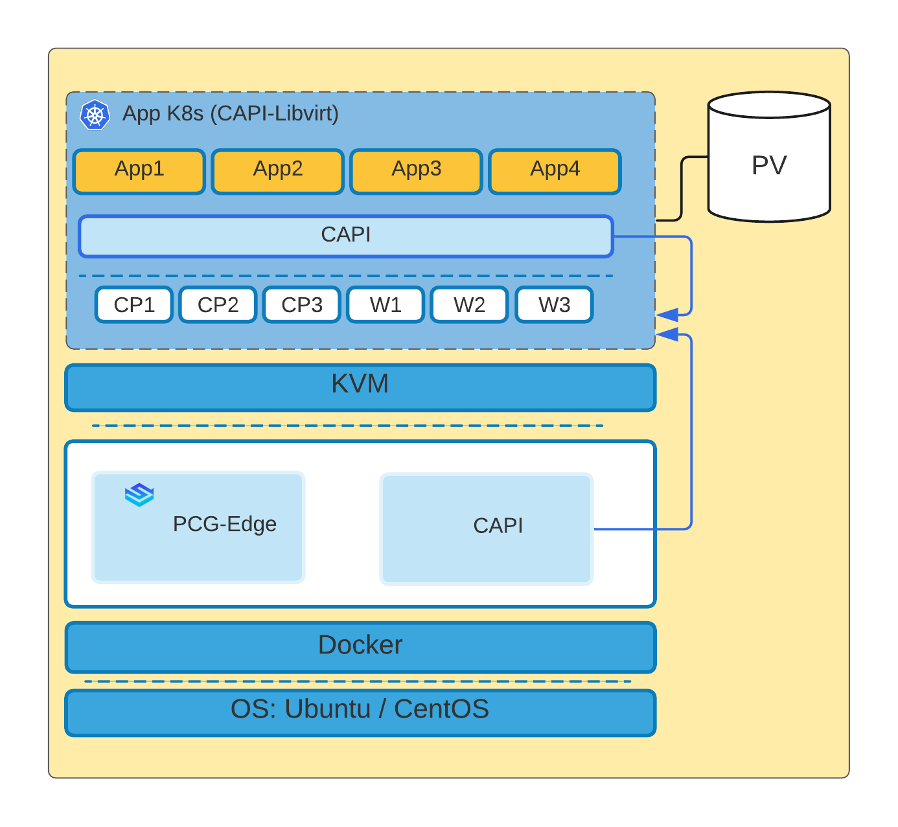

import Tabs from 'shared/components/ui/Tabs';
import WarningBox from 'shared/components/WarningBox';
import InfoBox from 'shared/components/InfoBox';
import PointsOfInterest from 'shared/components/common/PointOfInterest';

# Overview

Kubernetes nodes for master and worker pools are launched as KVM-based virtual machines in the virtualized mode. Each VM represents a Kubernetes node. Users can specify placement settings for these virtual machines to ensure they are launched in the desired network and storage pool. Users can also configure VM hardware settings such as CPU, Memory, Disk size, etc.

<WarningBox>

Palette recommends Virtualized Edge deployment only when the user has a **single edge appliance and needs HA virtualized Kubernetes Cluster.**

[Contact Spectro support via the Service Desk](http://support.spectrocloud.io/) for more details on the deployment of Virtualized Edge Architecture.

</WarningBox>

