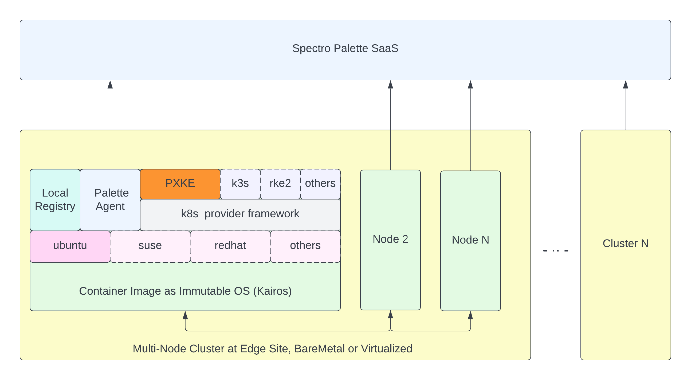

import Tabs from 'shared/components/ui/Tabs';
import WarningBox from 'shared/components/WarningBox';
import InfoBox from 'shared/components/InfoBox';
import PointsOfInterest from 'shared/components/common/PointOfInterest';


# Overview

Palette’s native edge solution provides a way for Spectro Cloud’s Palette Edge Distribution, a security-hardened, immutable operating system with embedded Kubernetes components, to be installed at edge sites on typically small form factor devices. Thousands of such sites can be provisioned and centrally managed from Palette’s management console, making it easy to upgrade and configure sites in bulk. Cluster profiles with specifications of the desired infrastructure settings (OS type and version; K8s type and version; CNI), as well as desired applications such as Point of Sales, etc., are used as a blueprint for provisioning edge sites. 

At the site, Palette provides a plug-n-play experience to the operator. First, appliances are bootstrapped with an initial installer image connecting to the management console to retrieve desired settings from the associated cluster profile. Then, the appropriate Palette Edge Distribution is downloaded, installed, and configured to provision the edge appliance and operationalize the site. 


# Palette Native Edge Architecture



Following are some of the architectural highlights of the Palette-provisioned Edge Native clusters:

* Kubernetes natively installed onto the host.


* Support of Bare metal and virtualized edge devices.


* Customizable site properties such as network proxies, certificates, etc. 


* Configure Kubernetes API servers with VIP or Dynamic DNS


* Supports adding multiple devices to the site to form a multi-node Kubernetes cluster.


* OS images are derived from immutable container-based OS images provided by [Kairos](http://kairos.io).


* Installation is bootstrapped using a relatively small installer ISO image. The appropriate version/flavor of OS-K8s is derived based on cluster profile settings associated with the edge site and dynamically downloaded and installed. 


* Customization of Palette Edge Distribution for cases such as adding OS packages. 

# Prerequisites

* One or more bare metal or virtual devices on X86 architecture to serve as Edge hosts for the site.


* Minimum hardware requirements for the edge devices:
   * RAM: 4GB (minimum)
   * CPU: 2
   * Disk: 50Gb


* Outgoing internet connectivity either direct or via proxy.


* Whitelist the sites and repositories mentioned in this document.


* For bare metal edge hosts, a bootable USB drive or Pixie setup to boot devices from Palette Edge Distribution Installer image. 

# Palette Edge Distribution

At the edge locations, Palette provides the following distributions for installation:

|Name|OS |K8s Distro|CNIs|CSIs|
|----|---|----------|----|----|
|Palette Optimized K3S |openSUSE,Ubuntu  |K3S |Calico, Flannel|Rook Ceph|
|Palette Optimized RKE2|openSUSE,Ubuntu  |RKE2|Calico|Rook Ceph|
|Palette eXtended Kubernetes Edge (PXK-E)|openSUSE,Ubuntu|CNCF|Calico|Rook Ceph|

# Edge Deployment Lifecycle

The typical end-to-end lifecycle of deploying clusters at edge locations involves several distinct phases, and within each phase, different teams/organizations need to perform specific tasks. 
 <br />

* [Modeling](/clusters/edge/native#modeling) - App architects build and test the applications in lab environments and model application profiles in Palette for cluster installation.


* [Staging](/clusters/edge/native#staging) - Central IT/Ops teams prepare an edge host installer variant from the base installer provided by Palette. Available customizations common to all edge locations are applied to the base installer in this phase. This includes specifying/overriding properties such as Palette endpoint, Registration App URL (for QR code-based registration), default OS users, default network settings, etc. This edge host installer variant is then shipped to all site locations. The Edge Installer Variant can be an ISO (bare-metal), OVA (VMware),  AMI (AWS), or QCOW2 (OpenStack or MaaS). The staging section below describes the procedures to create each of these variants. 


* [Installation](/clusters/edge/native#installation) - Site Operators provision one or more edge hosts using the image prepared by the Staging phase at the edge location. Site-specific properties are supplied during this phase by the site operator. This typically involves specifying site-specific properties such as static IP address, network proxy, certificate, etc. 

* [Registration](/clusters/edge/native#registration) - Edge hosts need to be registered with the Palette management console, and cluster configuration needs to be created with these edge hosts. Clusters are configured with infrastructure and add-on profiles modeled by app architects during the modeling phase. This step can be performed in one of the following two ways:

   * Server-less app deployment for automated registration and cluster configuration. 
This involves cloning a sample application provided by Palette and customizing it to your 
needs. Detailed instructions for this are provided below. 
   * Central IT / Ops manually register the edge hosts and configure clusters using Palette Management UI, API or Terraform. Detailed instructions for each of these methods are provided below. 

The Palette Edge Management agent inside the edge host waits for the configuration to be available in Palette Management Console. Once registration and configuration are complete, it proceeds to install the Kubernetes cluster. The Kubernetes distribution, version, and other configuration properties are read from the associated infrastructure profile in the cluster configuration. Additional add-ons, if any, are deployed after the Kubernetes installation is complete. You can install a single or multi-node cluster using this process. You can also scale up your cluster at a later point after deployment.

<br />

<InfoBox>

The Kubernetes Packs for Edge Native deployments disable a few items by default to allow users to install those items independently or to avoid duplication.

**Example Scenario:**
	
For the Palette Optimized K3s pack, the default network component flannel is disabled to allow the user to independently use any CNI pack (Flannel or others), as part of the Network Layer (Infrastructure Layer).
	
The component metric server is disabled to avoid duplication of the metrics server, since the Palette agent already installs the metrics-server by default.

```
cluster:
 config: 
   # disable the built in cni
   flannel-backend: none
   no-flannel: true
   disable-network-policy: true
   Disable:
     - metrics-server
```

</InfoBox>

Suppose the edge location configuration is known and predictable. In that case, Staging, Installation, and Registration can be potentially combined into one step by the central IT/Ops team and then ship the fully configured edge hosts to the edge location. The Site Operator at the edge location needs to hook up power and network cable without any further configuration. The edge cluster will be ready to be centrally managed for future upgrades.

## Modeling

The high-level tasks to be completed on the Palette Management Console during the modeling phase are as below:

1. Create a cluster profile of the type `infrastructure` or `full` with `Edge Native` as the cloud type by providing the following layers. 
 
| Layer| Pack|Configuration|
|------|-----|-------------|
|Operating System (OS)|Choose desired OS  from the following options:OpenSUSE, Ubuntu|  |
|Kubernetes (K8s)|Choose desired distribution  from the following options:Palette eXtended Edge(PXE), Palette Optimized K3S, Palette Optimized RKE2| |
|Container Network Interface (CNI)|Applicable choices will depend on the choice of K8s distro. Choose the desired CNI implementation:Calico, Flannel|	|

<br />

2. Optionally, create additional profiles with out-of-the-box packs for monitoring, security, authentication, or other capabilities as desired. If remote access to the cluster is desired, consider adding the Spectro Proxy pack to one of the add-on profiles.


3. Optionally, add additional helm or OCI registries and include applications hosted in those registries into add-on profiles.


4. Test your application profiles by deploying them to clusters. 

## Staging

In this phase, a variant of Palette Edge Installer is created for shipping to edge locations. The procedure to build these variants depends on the target environment. During this phase site general settings that apply to all the sites are customized. 

<br />

### General Install Settings

The following table describes general settings that can be customized during the staging phase. 

<br />

|Site Setting Name | Description| Mandatory|
|------------------|------------|----------|
|paletteEndPoint   |Palette Management Server endpoint|Yes|
|name|Unique Identifier for the device. This should be globally unique across in  the Palette Management System. If not provided, the ID is generated using the serial number of the applianc|No|
|registrationURL| End point to the restoration app that can be used for QR code based automated registration |No|
|Stages:initramfs|Create OS users, add them to groups, or add additional files/folders using this setting. Example below| |

<br />

These settings are typically customized in a Site template YAML file called user-data.yaml, like the one shown below:

<br />

```
stylus:
  site:
    paletteEndpoint: api.spectrocloud.com
    registrationUrl: https://edge-registration.vercel.app

stages:
  initramfs:
    - users:
        kairos:
          groups:
            - sudo
          passwd: kairos
```


<br />

**The sub-sections below describe specific steps of staging for various environments:**

<br />

<Tabs>

<Tabs.TabPane tab="Bare Metal" key="Bare Metal">

### Staging: Bare Metal (ISO)

For bare metal appliances, creating  the palette edge installer variant involves generating an installer image which is derived by customizing the default Palette Edge Installer image. Site-specific settings described above are baked into this image. The customization is performed by using the Palette Edge Installer Container. 

Following are the steps to customize **site settings** and **build an installer image**: 


1. Checkout the following [Git Repo](https://github.com/spectrocloud/pxke-samples) on your local machine or server where you intend to run the customization procedure.

   ```
     git clone https://github.com/spectrocloud/pxke-samples
   ```

2. A file called .installer.env.template serves as a template file for  settings that can be customized. Make a copy of this file to .installer.env.

   ```
     cp .installer.env.template .installer.env
   ```

3. Update contents of this file to customize:
   * Installer Name
   * Base palette installer version(typically latest)
   * Location of the docker registry where the installation container image should be uploaded (optional)
   * Location of the user data.yaml file where customized installer settings described above are stored
   

   A. `Name of the ISO image to be generated`- (Optional - defaults to pxe-installer if not specified)

   ```
     ISO_IMAGE="pxe-installer-custom"
   ```

<br />

   B. `Version of the palette edge installer agent`- (Optional) Defaults to whatever is current latest release  - [latest  build](https://github.com/spectrocloud/stylus/releases).For using latest builds, use "latest")

```
INSTALLER_VERSION="latest"
```

<br />

   C. `Target Docker image for the installer to generate`

```
IMAGE_NAME="gcr.io/customer-registry/p6os"
```

   D. `Path to user data file`- (Optional - Defaults to "user-data" in the current directory.Change the value below and uncomment the line if the file is different).

```
USER_DATA_FILE="my-user-data.yaml”
```


4. The default user-data file is named `user-data` in the home directory. So create that file or file named as specified in USER_DATA_FILE in the `.installer.env`

	**Example:**  “my-user-data.yaml” above. The user data settings are as described in the [site settings](/clusters/edge/native#staging) section above. 


5. Build the custom ISO: A custom ISO should be built with the name specified in the settings and the user data file baked inside the ISO.

```
./build-installer.sh
```


6. Mount this Palette Edge Installer ISO using a [bootable USB drive](http://tbd), [pixie server](http://tbd), or any other means to the bare metal appliances' primary drive (USB or CDROM). The installer will be flashed to the edge host hard disk, and the host will be shut down. The bare-metal edge host appliance is ready to be shipped to the edge location.

</Tabs.TabPane>

<Tabs.TabPane tab="VMware Environment" key="VMware Environment">

### Staging: VMware Environment (OVA)

We will create an OVA file from the base Palette Edge Installer ISO for VMware environments by injecting customized settings (user data) via a secondary drive. Following are the detailed steps to generate the Palette Edge Installer variant in  OVA format. 

1. Prepare cloud-init ISO with common site properties. The steps to do this can vary from platform to platform. The instructions below describe the procedure to build the cloud-init ISO on macOS. 
 

2. Create a YAML file called ‘user-data’  with the contents from the template in the [Site Settings section](http://localhost:9000/clusters/edge/native#staging). Customize various properties as necessary.


3. Create an empty meta-data file:
   
```
 touch meta-data
```

4. Create a cloud init iso using the following command:

```
mkisofs -output ci.iso -volid cidata -joliet -
rock user-data meta-data
```
 
 **Note** - You may need to install prerequisites using:
 
```
brew install cdrtools
```
This will generate an ISO file called ci.iso in the current directory. 

<br />

1. Upload the ci.iso file generated in the previous step to a datastore in vSphere using the vCenter console. 


2. Download the default Palette Edge Installer image (ISO) from the appliances page on the Palette Management Console.

 
3. Upload this ISO  to a datastore in vSphere using the vCenter console. 


4. Create a new VM using the vCenter console. Add 2 CD drives to this VM and select the Palette Edge installer for one of them and the ci.iso 4. file for the other. 


5. Select other settings, such as Network, Datastore, Folder, etc., as appropriate for your environment. 


6. Power on the VM.


7. Monitor the VM console for log messages. The installer and user data will be copied to the hard disk, and the VM will show a message “...”. 


8. Power off the VM


9. Edit VM settings and delete the two CD drives previously attached.


10. Export VM as an OVF template.


The OVA file is ready to ship to various edge locations for installation. 

</Tabs.TabPane>

<Tabs.TabPane tab="Amazon Web Service" key="Amazon Web Service">

### Staging: Amazon Web Services (AMI)

</Tabs.TabPane>

<Tabs.TabPane tab="KVM" key="KVM">

### Staging: KVM  (QCOW2)


 To be added


</Tabs.TabPane>

</Tabs>

-------

## Installation

Site operators install edge hosts using the Palette Edge Installer variant. Installation procedures vary depending on the environment. During installation, site-specific properties may need to be supplied to the edge hosts. The properties available for site customization are described in the table below. 


|Site Setting Name|Description|Mandatory|
|-----------------|-----------|---------|
|network: type|network type may either be `dhcp` or `static`|Yes|
|network: httpProxy|proxy is specified it will be used for http and https traffic|No|
|network: nameserver|configures the default nameserver for the system|No|
|network: gateway|required if static network type is configured, this is the default gateway for all outbound traffic|Conditional - required  if network type is static|
|network: ipAddress|required if static network type is configured, this is the ip address the default interface will be configured|Conditional - required  if network type is static|
|network: mask|required if a static network type is configured, defines the prefix length for addressable network.|Conditional - required  if network type is static|


### Installation Steps for different Environments:

<Tabs>
<Tabs.TabPane tab="Bare-metal" key="Bare-metal">

Bare-metal

</Tabs.TabPane>

<Tabs.TabPane tab="VMware" key="VMWare">

VMware

</Tabs.TabPane>

<Tabs.TabPane tab="AWS" key="AWS">

AWS

</Tabs.TabPane>

<Tabs.TabPane tab="KVM" key="KVM">

KVM

</Tabs.TabPane>

</Tabs>

---------

**Note:**

If automated QR code-based registration is set up in the installer, a QR code will be displayed on the console when the edge hosts boot up. The site operators can scan this QR code on their phones to bring up the registration web application. First, the unique edge host Id is pre-populated in the web application. Then, site operators can select a site nominated for the edge location and save it to automatically register the appliance in Palette Management Console and create a cluster definition. If multiple edge hosts need to be added to the same site, repeat the procedure for all of them, selecting the same site. Once the Palette Edge Host agent running inside edge hosts detect their configuration in Palette, it proceeds with cluster installation. 


<br />

## Registration

Registration involves adding your edge hosts to Palette Management Console and defining a cluster with those edge hosts. Once the registration is complete in Palette, the edge host agent comes out of the wait cycle and proceeds to install the cluster.

<br />

### Methods to Register:

Registration can be performed using one of the following methods:


<br />

<Tabs>

<Tabs.TabPane tab="Using QR Code" key="Using QR Code">

### Automate Using QR Code

You can provide a QR case-based automated registration to simplify the process. A QR code is displayed on the edge host UI upon boot up if enabled during the installation phase. Site operators can scan this QR code using a cell phone to create a simple web page. This web page pre-populates the edge host’s unique ID in the web app and provides a list of edge sites that they can associate with this edge host. Site operators can select a site and submit it. The web application automatically creates the edge host entry in Palette and defines a cluster with that edge host. This results in the Palette edge host agent coming out of the wait cycle and proceeding to install the cluster end to end. Using this flow, edge hosts can also be added to existing clusters to scale the cluster into a multi-node cluster. 

The following steps are required to facilitate this flow:

* Palette provides a reference serverless application (Palette Edge Registration App) built and deployed using the [Vercel](https://vercel.com/) platform. This application needs to be cloned and customized. Contact our sales team to access the GitHub repository that hosts the code for this application and set up automated deployments into the Vercel platform. 


* Clone the repository and change the company name, logo, and theme.


* Update the sample sites provided with your site names and locations. 


* Map infrastructure and add-on cluster profiles to be used with each site.


* Provide site-specific Virtual IP Addresses of DNS mapping to be used for the Kubernetes API server for each side
Compile and test the code locally.


* Raise a GitHub PR to automatically merge into your branch to deploy the app. 


* The link to this app deployment needs to be entered as `registrationURL` during the staging phase. 

**Note:**
Specific details about the files to be changed and instructions on how to build and test the application locally are provided in the ReadMe file present in the GitHub repository.

</Tabs.TabPane>

<Tabs.TabPane tab="Palette UI" key="Palette UI">

### Register through Palette Management Console UI

Site operators need to note down the unique edge host ID displayed on the console when the edge host is booted up. If not customized during staging or installation, this ID is generated using the serial number of the edge host. Send this information to Central IT/Ops teams. Edge host registration and cluster definition can be done by the IT Ops teams from the Palette Management Console UI  as follows:

* Log in as a tenant administrator and navigate to the clusters page. 


* Click on the Edge Hosts tab and press the ‘Add Edge Hosts’ button.


* Enter the Edge Host ID. Optionally provide one or more tags in the form of ‘tagName:value.’ Please note that the tag called ‘name’ allows you to set a readable name for the edge host. If provided, this readable name is displayed in other UIs across the Palette Management Console. 


* Click on the clusters tab and invoke the new cluster creation wizard. 


* Select ‘Edge Native’ as the environment and select the infrastructure profile created during the modeling phase. Add additional add-ons to deploy applications inside the cluster. If remote access or troubleshooting is desired, we recommend adding an add-on layer with the Spectro Proxy pack. This establishes a route through the Palette Management Console to access the cluster remotely.


* Configure cluster properties such as Virtual IP address (VIP) for the edge site, inject SSH keys, etc. 


* Configure node pools by adding your edge hosts to the master or worker pools. 


* Review and Save cluster configuration. 


Once the cluster is created, the Palette Edge Host agent, which constantly polls the management console for information, will begin the installation. You can monitor installation progress on the Palette Management Console. High-level progress is displayed on the cluster overview page, and lower-level orchestration logs are available in the events tab.

</Tabs.TabPane>

</Tabs>

## Deleting an Edge Native Cluster 

Clusters can be deleted by clicking ‘Delete’ for a running cluster or ‘Abort’ for a cluster in a provisioning state. The delete operation returns the edge hosts to the ‘Ready’ state. All the artifacts related to the K8s distribution are removed. Post deletion, the edge hosts are available for deployment to a new cluster.


 


