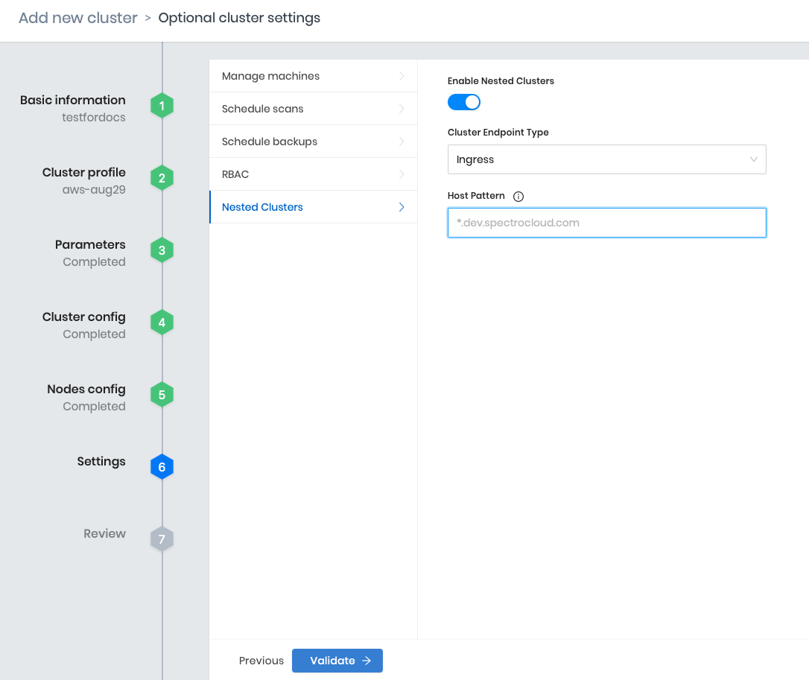

import Tabs from 'shared/components/ui/Tabs';
import InfoBox from 'shared/components/InfoBox';
import WarningBox from 'shared/components/WarningBox';
import PointsOfInterest from 'shared/components/common/PointOfInterest';
import Tooltip from "shared/components/ui/Tooltip";

# Getting Started with Palette Virtual Clusters

With Palette Virtual Clusters, you can deploy additional Kubernetes clusters that run as nested clusters within an existing *Host Cluster*.

There are certain advantages to using a virtual cluster environment. For example, you are free to operate with admin level privileges, while simultaneously ensuring strong isolation, reducing operational overhead, and improving resource utilization.

Try the steps below to [enable](#enablingpalettevirtualclustersonanexistinghostcluster) and [deploy](#deployingapalettevirtualcluster) a managed Palette Virtual Cluster from within Palette.  
<br />

## Prerequisites

- You will need to have access to a Palette Account. Refer to the [Getting Started with Palette](/getting-started) page, and sign up for free [here](https://www.spectrocloud.com/get-started/).<br />

- Ensure you have a functioning [cluster](/clusters) already configured. If not, you can deploy a new cluster and enable the Palette Virtual Clusters feature at the Settings step of your new cluster's deployment configuration. Clusters with the Palette Virtual Cluster feature enabled are referred to as **Host Clusters**.  

<InfoBox>

Palette does not support *Usage* and *Cost* metrics for Virtual Clusters running on Google Kubernetes Engine (GKE).

</InfoBox>

  ### Host Clusters

  There are two ways to engage with a Palette Virtual Cluster on Palette.<br />

   1. When you [create](/clusters) and [deploy](#deployingapalettevirtualcluster) a new Host Cluster, there is an option to **Enable Virtual Clusters**.   
   <br />
   
   Refer to the [Cluster Endpoint](#enablingpalettevirtualclustersonanexistinghostcluster) step below for more information on how to configure this option. The settings listed below are available when you are enabling the Palette Virtual Clusters feature on a pre-existing cluster and when using the Host Cluster deployment wizard.

    <p></p><br />

    2. Similarly, you can [enable](/clusters/palette-virtual-clusters/cluster-quickstart#enablingpalettevirtualclusterssonanexistinghostcluster) an existing cluster; thus allowing it to host Palette Virtual Clusters.<p></p><br />


## Global Role Additional Policies:

There may be situations where additional node-level policies must be added to your deployment. To add additional node-level policies, switch to the **Tenant Admin**  project, and click on the **Tenant Settings** on the **Main Menu**. Click on **Cloud Accounts**. Add an account if one does not exists. After validation of the credentials, ensure `Add IAM policies` are enabled. You can specify additional policies to be attached. The attached policies will be included to all the clusters launched with this specific cloud Account.

# Enabling Palette Virtual Clusters on an Existing Host Cluster

You can enable Palette Virtual Clusters on an existing host cluster by performing the following steps:<p></p><br />

1. From the slide menu, select **Clusters** and view the list of **Clusters**.


2. Click any Host Cluster from the list and select **Settings** > **Cluster Settings** > **Virtual Clusters**.


3. Toggle the **Enable Virtual Clusters** option (yes/no).
<br />
<InfoBox>

    This feature can be enabled when first creating a new cluster, so you may find that it is already enabled.
</InfoBox>

4. Select the **Cluster Endpoint Type**: *Load Balancer* or *Ingress*.


## Load Balancer

If **Load Balancer** is selected, the following must be true:  

-  The Host Cluster must support dynamic provisioning of load balancers.  

-  If the Host Cluster is in the public cloud, the AKS/EKS/GCP Cloud Controller Manager will provide this support by default.   

-  If the Host Cluster is in a private data center, a bare metal load balancer provider such as MetalLB must be installed and correctly configured.
<br />

## Ingress
  If **Ingress** is selected, a **Host DNS Pattern** must be specified for this Host Cluster. To create a valid Host DNS Pattern, the NGINX Ingress Controller must be deployed on the Host Cluster with SSL passthrough enabled. This allows TLS termination to occur at the Palette Virtual Cluster's Kubernetes API server.

  Additionally, a wildcard DNS record must be configured that maps the Host DNS Pattern to the load balancer associated with the NGINX Ingress Controller. See the Example Record in the recap below:

   **Host DNS Pattern**: `*.sandbox.host.1.spectrocloud.com`
<br />

<br />

<InfoBox>
<b>Recap</b>

1. Deploy the NGINX Ingress Controller on the Host Cluster and ensure that SSL passthrough is enabled in the NGINX Ingress Controller pack's values.yaml. Specifically, `charts.ingress-nginx.controller.extraArgs` must be set as follows:
<br />

  ```yml
    charts:
      ingress-nginx:
        ...
        controller:
          ...
          extraArgs:
            enable-ssl-passthrough: true
  ```
2. Identify the public DNS name of the load balancer associated with the LoadBalancer Service that is associated with your NGINX Ingress Controller deployment.<p></p><br />

3. Create a wildcard DNS record (e.g., in AWS Route53) mapping the Host Pattern to the NGINX Ingress Controller load balancer.

  |Example Record with Host DNS Pattern||
  |-|-|
  | |Here is an example of an <br /> AWS Route53 record for the <br />`*.starship.te.spectrocloud.com` <br /> Host DNS Pattern.|
 
</InfoBox>

<br />

# Deploying a Palette Virtual Cluster

1. Select a project from the drop-down menu, and click **Clusters** in the **Main** menu. 
<br />
2. Click the **Virtual Clusters** tab to list the available Palette Virtual Clusters, and then select **Add New Virtual Cluster**.
<br />
3. Complete the **Deploy New Virtual Cluster** information:<br />

    - Select a Host Cluster.  

    - Add a Cluster name.
    <br />
    <InfoBox>
    Use lowercase letters and do not add spaces.
    </InfoBox>
    
    - Optionally, you can provide a Description and Tags. 

    - Click the **Attach Profile** button to assign a profile.
    <br />
      <InfoBox>
      Optionally, attach one or more Add-on layer(s) to this cluster. If you do not have a Cluster Profile, see the [Creating Cluster Profile](/cluster-profiles/task-define-profile) page for more information.
      </InfoBox>
      <br />
    
4. If the Host Cluster's **Cluster Endpoint Type** is a _Load Balancer_, you may optionally provide the following advanced configurations here:
<br />

   - [External Traffic Policy](https://kubernetes.io/docs/tasks/access-application-cluster/create-external-load-balancer/#preserving-the-client-source-ip) - Cluster or Local.<br />

   - Load Balancer Source Ranges (Optional) - Limit which client IPs can access the load balancer. Inputs **must** be a comma-separated list of CIDR ranges in the `a.b.c.d/x` format. [Network Load Balancer support on AWS](https://kubernetes.io/docs/concepts/services-networking/service/#aws-nlb-support) provides additional details.

Your Virtual Cluster is now deployed. Next, try deploying an application by [creating an app profile](/devx/app-profile/create-app-profile).
<br />


<InfoBox>

Palette does not support *Usage* and *Cost* metrics for Virtual Clusters running on Google Kubernetes Engine (GKE).

</InfoBox>
<br />

# Resources

- [Resource Management for Pods and Containers](https://kubernetes.io/docs/concepts/configuration/manage-resources-containers/)

- [CPU resource units](https://kubernetes.io/docs/concepts/configuration/manage-resources-containers/#meaning-of-cpu)

- [Memory resource units](https://kubernetes.io/docs/concepts/configuration/manage-resources-containers/#meaning-of-memory)

- [Amazon EBS CSI driver - Amazon EKS](https://docs.aws.amazon.com/eks/latest/userguide/ebs-csi.html)

- [Creating the Amazon EBS CSI driver IAM role for service accounts - Amazon EKS](https://docs.aws.amazon.com/eks/latest/userguide/csi-iam-role.html)
