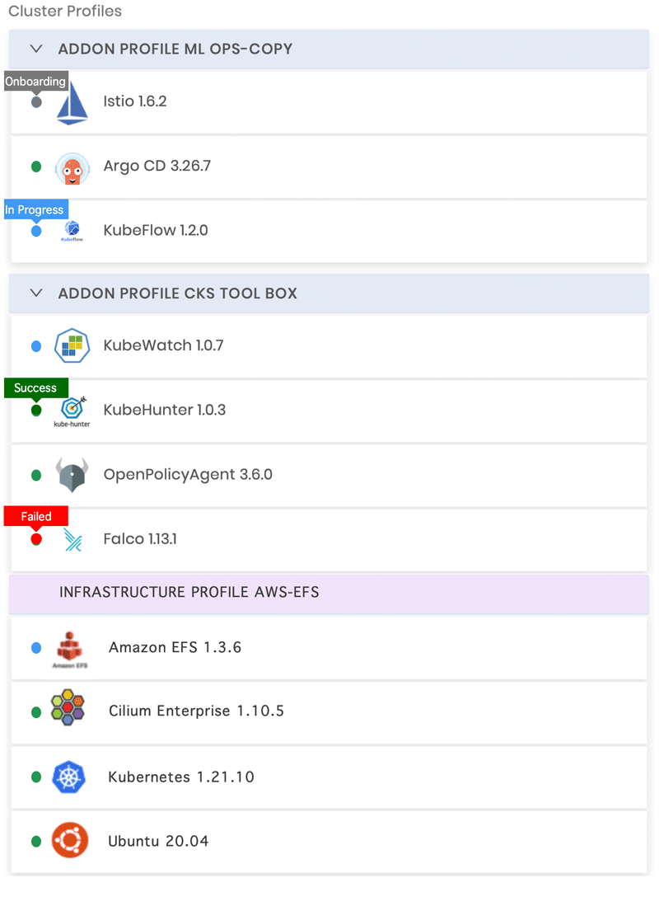

import Tabs from 'shared/components/ui/Tabs';
import WarningBox from 'shared/components/WarningBox';
import InfoBox from 'shared/components/InfoBox';
import PointsOfInterest from 'shared/components/common/PointOfInterest';
import Tooltip from "shared/components/ui/Tooltip";

# Pack Monitoring

Palette provides a well defined color scheme to monitor the deployment status of packs during Palette Workload Cluster deployment. Different colors represent the different stages of pack installation status. It clearly defines the progress of installation. As the number of packs added to a cluster via cluster profile increases, this monitoring technique is highly user friendly for status recognition.

The Cluster Profile page displays the list of packs associated with the cluster you are monitoring. In addition, the page also includes information on the status and the installation progress of the installed packs. The following are the possible pack statuses.

 
 

| **Indicator Status**                 | **Description**                                                     |
| ------------------------------------ | ------------------------------------------------------------------- |
| 
**Gray**
   | The pack is onboarding, and it's right before the deployment stage. |
| 
**Blue**
   | The pack is in processing mode.                                     |
| 
**Green**
 | The pack installation is successful.                                |
| 
**Red**
     | The pack installation has failed.                                   |

 
 

#### Cluster Profiles Pack Status

 
 

