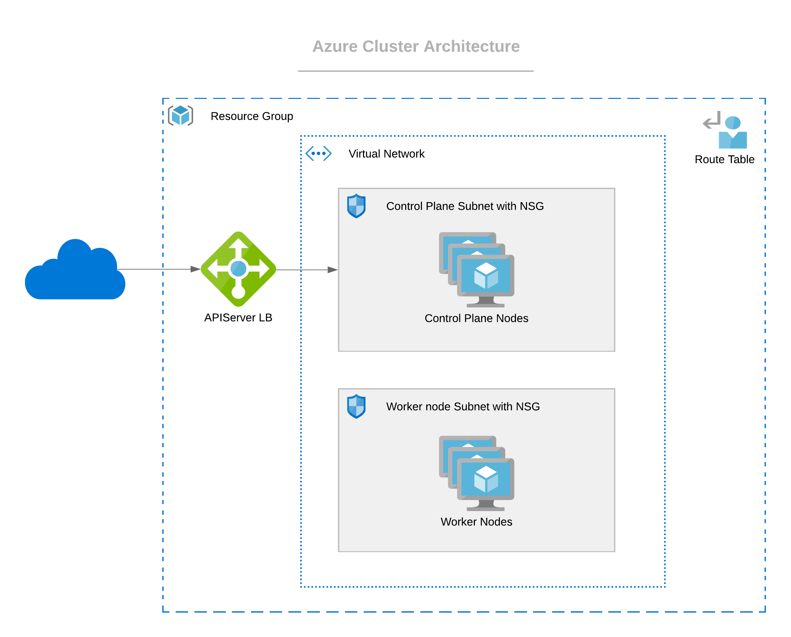

import Tabs from 'shared/components/ui/Tabs';
import WarningBox from 'shared/components/WarningBox';
import InfoBox from 'shared/components/InfoBox';
import PointsOfInterest from 'shared/components/common/PointOfInterest';

# Overview

The following are some architectural highlights of Azure clusters deployed by Palette:

1. Azure cluster resources are placed within an existing Resource Group.

2. Nodes are provisioned within a Virtual Network that is auto-created or preexisting, with one subnet for control plane nodes and one for worker nodes. These two subnets are secured with separate Network Security Groups. Both subnets can span across multiple availability zones (AZs).

3. Worker nodes are distributed across multiple AZs.

4. None of the control plane nodes and worker nodes have public IPs attached. The Kubernetes API Server endpoint is accessed through a public load balancer.

# Prerequisites

The following prerequisites must be met before deploying a workload cluster in Azure:

1. You must have an active Azure cloud account with sufficient resource limits and permissions to provision compute, network, and security resources in the desired regions.

2. You must register your Azure cloud account in Palette as described in the "Creating an Azure Cloud account" section below.

3. You should have an Infrastructure cluster profile created in Palette for Azure cloud.

# Creating an Azure cloud account

`video: title: "Azure-cloud-account": /cloud-accounts/azure.mp4`

To create an Azure cloud account, we need:

- Client ID
- Tenant ID
- Client Secret

For this, we first need to create an Azure Active Directory (AAD) Application which can be used with role-based access control. Follow the steps below to create a new AAD application, assign roles, and create the client secret:

1. Follow the steps described [here](https://docs.microsoft.com/en-us/azure/active-directory/develop/howto-create-service-principal-portal#create-an-azure-active-directory-application) to create a new Azure Active Directory application. Note down your ClientID and TenantID.

2. On creating the application, a minimum required [ContributorRole](https://docs.microsoft.com/en-us/azure/role-based-access-control/built-in-roles#contributor) needs to be assigned. To assign any kind of role, the user must have a minimum role of [UserAccessAdministrator](https://docs.microsoft.com/en-us/azure/role-based-access-control/built-in-roles#user-access-administrator). The role can be assigned by following the [Assign Role To Application](https://docs.microsoft.com/en-us/azure/active-directory/develop/howto-create-service-principal-portal#assign-a-role-to-the-application) link.

3. Follow the steps described in the [Create an Application Secret](https://docs.microsoft.com/en-us/azure/active-directory/develop/howto-create-service-principal-portal#create-a-new-application-secret) section to create the client application secret. Store the Client Secret safely as it will not be available as plain text later.

# Deploying an Azure Cluster

`video: title: "azure-cluster-creation": ./cluster-creation-videos/azure.mp4`

The following steps need to be performed to provision a new Azure cluster:

1. Provide the basic cluster information like Name, Description, and Tags.

2. Select the Cluster Profile created for the Azure environment. The profile definition will be used as the Cluster Construction Template.

3. Review and override Pack Parameters as desired. By default, parameters for all packs are set with values defined in the Cluster Profile.

4. Provide the Azure Cloud account and placement information.

   | **Parameter**        | **Description**                                                                                                                                                                                                                                                                                                                                                                                                                                                                                                     |
   | -------------------- | ------------------------------------------------------------------------------------------------------------------------------------------------------------------------------------------------------------------------------------------------------------------------------------------------------------------------------------------------------------------------------------------------------------------------------------------------------------------------------------------------------------------- |
   | **Cloud Account**    | Select the desired cloud account. Azure cloud accounts with credentials need to be preconfigured in project settings.                                                                                                                                                                                                                                                                                                                                                                                               |
   | **Subscription**     | Select the subscription which is to be used to access Azure Services.                                                                                                                                                                                                                                                                                                                                                                                                                                               |
   | **Region**           | Select a region in Azure in which the cluster should be deployed.                                                                                                                                                                                                                                                                                                                                                                                                                                                   |
   | **Resource Group**   | Select the resource group in which the cluster should be deployed.                                                                                                                                                                                                                                                                                                                                                                                                                                                  |
   | **SSH Key**          | Public key to configure remote SSH access to the nodes.                                                                                                                                                                                                                                                                                                                                                                                                                                                             |
   | **Static Placement** | By default, Palette uses dynamic placement, wherein a new VPC with a public and private subnet is created to place cluster resources for every cluster.  These resources are fully managed by Palette and deleted when the corresponding cluster is deleted. Turn on the **Static Placement** option if it's desired to place resources into preexisting VPCs and subnets. If the user is making the selection of **Static Placement** of resources, the following placement information needs to be provided: |
   |                      | **Virtual Network**: Select the virtual network from dropdown menu.                                                                                                                                                                                                                                                                                                                                                                                                                                                 |
   |                      | **Control plane Subnet**: Select the control plane network from the dropdown menu.                                                                                                                                                                                                                                                                                                                                                                                                                                  |
   |                      | **Worker Network**: Select the worker network from the dropdown.                                                                                                                                                                                                                                                                                                                                                                                                                                                    |

5. Make the choice of updating the worker pool in parallel.

6. Configure the master and worker node pools. A master and a worker node pool are configured by default.

   | **Parameter**                             | **Description**                                                                                                                                                                                                                                                           |
   | ----------------------------------------- | ------------------------------------------------------------------------------------------------------------------------------------------------------------------------------------------------------------------------------------------------------------------------- |
   | **Name**                                  | A descriptive name for the node pool                                                                                                                                                                                                                                      |
   | **Size**                                  | Number of nodes to be provisioned for the node pool. For the master pool, this number can be 1, 3, or 5                                                                                                                                                                   |
   | **Allow worker capability (master pool)** | To allow workloads to be provisioned on master nodes                                                                                                                                                                                                                      |
   | **Instance Type**                         | Select the Azure instance type to be used for all the nodes in the pool                                                                                                                                                                                                   |
   | **Managed Disk**                          | Select the managed disk type to be used.                                                                                                                                                                                                                                  |
   | **Disk Size**                             | Storage disk size in GB to be attached to the node.                                                                                                                                                                                                                       |
   | **Rolling Updates**                       | There are two choices of Rolling Update.                                                                                                                                                                                                                                  |
   |                                           | **Expand First**: Launches the new node and then shut down the old node.                                                                                                                                                                                                  |
   |                                           | **Contract First**: Shut down the old node first and then launches the new node.                                                                                                                                                                                          |
   | **Availability Zones**                    | Choose one or more availability zones. Palette provides fault tolerance to guard against failures like hardware failures or network failures, by provisioning nodes across availability zones, if multiple zones are selected. Zones are supported only for worker pools. |

7. Review the settings and deploy the cluster. Provisioning status with details of ongoing provisioning tasks is available to track progress.

<InfoBox>
New worker pools may be added if its desired to customize certain worker nodes to run specialized workloads. As an example, the default worker pool may be configured with the <i>Standard_D2_v2</i> instance types for general-purpose workloads and another worker pool with instance type <i>Standard_NC12s_v3</i> can be configured to run GPU workloads.
</InfoBox>

# Deleting an Azure Cluster

The deletion of an Azure cluster results in the removal of all Virtual Machines and associated storage disks created for the cluster. The following tasks need to be performed to delete an Azure cluster:

1. Select the cluster to be deleted from the **Cluster** **View** page and navigate to the **Cluster Overview** page.

2. Invoke a delete action available on the page: **Cluster** > **Settings** > **Cluster** **Settings** > **Delete** **Cluster**.

3. Click **Confirm** to delete.

The Cluster Status is updated to **Deleting** while cluster resources are being deleted. Provisioning status is updated with the ongoing progress of the delete operation. Once all resources are successfully deleted, the cluster status changes to **Deleted** and is removed from the list of clusters.

# Force Delete a Cluster

A cluster stuck in the **Deletion** state can be force deleted by the user through the User Interface. The user can go for a force deletion of the cluster, only if it is stuck in a deletion state for a minimum of **15 minutes**. Palette enables cluster force delete from the Tenant Admin and Project Admin scope.

## To force delete a cluster:

1. Log in to the Palette Management Console.

2. Navigate to the **Cluster Details** page of the cluster stuck in deletion.

   - If the deletion is stuck for more than 15 minutes, click the **Force Delete Cluster** button from the **Settings** dropdown.

   - If the **Force Delete Cluster** button is not enabled, wait for 15minutes. The **Settings** dropdown will give the estimated time for the auto-enabling of the force delete button.

<WarningBox>
If there are any cloud resources still on the cloud, the user should cleanup those resources before going for the force deletion. 
</WarningBox>
