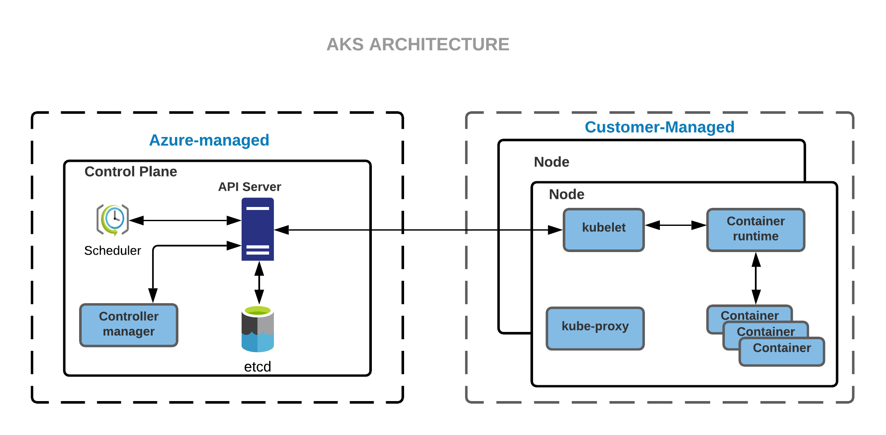

import Tabs from 'shared/components/ui/Tabs';
import WarningBox from 'shared/components/WarningBox';
import InfoBox from 'shared/components/InfoBox';
import PointsOfInterest from 'shared/components/common/PointOfInterest';

# Overview

The following is the detailing of the Microsoft Azure Kubernetes Service (AKS) cluster provisioning by Palette:

1. The Palette platform enables containerized applications' effortless deployment and management with fully-managed AKS. 

2. It provides the users with server-less Kubernetes, an integrated continuous integration and continuous delivery (CI/CD) experience, and enterprise-grade security and governance.

3. This unites the development and operations to a single platform achieving faster build, delivery, and scaling of applications with credence.

4. The infrastructure has event-driven autoscaling and triggers that enable Elastic provisioning for this self-managed infrastructure.

5. Leverage extensive authentication and authorization capabilities, using Azure Active Directory and dynamic rules enforcement, across multiple clusters with Azure Policy.

# Prerequisites

These prerequisites must be met before deploying an AKS workload cluster:

1. You need an active Azure cloud account with sufficient resource limits and permissions to provision compute, network, and security resources in the desired regions.

2. You will need to have permissions to deploy clusters using the AKS service on Azure.

3. Register your Azure cloud account in Palette as described in the [Creating an Azure Cloud Account](#creatinganazurecloudaccount) section below.

4. You should have a cluster profile created in Palette for AKS.
   

5. Associate an SSH key pair to the cluster worker node.

 

## Additional Prerequisites

There are additional prerequisites if you want to set up Azure Active Directory integration for the AKS cluster:

  1. A Tenant Name must be provided as part of the Azure cloud account creation in Palette.
   

  2. For the Azure client used in the Azure cloud account, these API permissions have to be provided:
  
    |                 |                                       |
    | --------------- | ------------------------------------- |
    | Microsoft Graph | Group.Read.All (Application Type)     |
    | Microsoft Graph | Directory.Read.All (Application Type) |

  3. You can configure these permissions from the Azure cloud console under **App registrations** > **API permissions** for the specified application.

# Creating an Azure Cloud Account

`video: title: "Azure-cloud-account": /cloud-accounts/azure.mp4`

To create an Azure cloud account, we need:

* Client ID
* Tenant ID
* Client secret

For this, we first need to create an Azure Active Directory (AAD) application that can be used with role-based access control. Follow the steps below to create a new AAD application, assign roles, and create the client secret:

 

1. Follow the steps described [here](https://docs.microsoft.com/en-us/azure/active-directory/develop/howto-create-service-principal-portal#create-an-azure-active-directory-application) to create a new Azure Active Directory application. Note down your ClientID and TenantID.

2. On creating the application, assign a minimum required [ContributorRole](https://docs.microsoft.com/en-us/azure/role-based-access-control/built-in-roles#contributor). To assign any type of role, the user must have a minimum role of [UserAccessAdministrator](https://docs.microsoft.com/en-us/azure/role-based-access-control/built-in-roles#user-access-administrator). Follow the [Assign Role To Application](https://docs.microsoft.com/en-us/azure/active-directory/develop/howto-create-service-principal-portal#assign-a-role-to-the-application) link learn more about roles. 

3. Follow the steps described in the [Create an Application Secret](https://docs.microsoft.com/en-us/azure/active-directory/develop/howto-create-service-principal-portal#create-a-new-application-secret) section to create the client application secret. Store the Client Secret safely as it will not be available as plain text later.

# Deploying an AKS Cluster

 

`video: title: "aks-cluster-creation": ./cluster-creation-videos/aks.mp4`

The following steps need to be performed to provision a new cluster:
 

1. If you already have a profile to use, go to the **Cluster** > **Add a New Cluster** > **Deploy New Cluster** and select an Azure cloud. If you do not have a profile to use, reference the [Creating a Cluster Profile](https://docs.spectrocloud.com/cluster-profiles/task-define-profile) page for steps on how to create one.

2. Fill the basic cluster profile information such as **Name**, **Description**, **Tags** and **Cloud Account**.

3. In the **Cloud Account** dropdown list, select the Azure Cloud account or create a new one. See the [Creating an Azure Cloud Account](#creatinganazurecloudaccount) section above.

4. Next, in the **Cluster profile** tab from the **Managed Kubernetes** list, pick **AKS**, and select the AKS cluster profile definition.

5. Review the **Parameters** for the selected cluster profile definitions. By default, parameters for all packs are set with values defined in the cluster profile.
   

6. Complete the **Cluster config** section with the information for each parameter listed below.
   
    | **Parameter**      | **Description**                                                                              |
    | ------------------ | -------------------------------------------------------------------------------------------- |
    | **Subscription**   | Select the subscription which is to be used to access Azure Services.                        |
    | **Region**         | Select a region in Azure in where the cluster should be deployed.                            |
    | **Resource Group** | Select the resource group in which the cluster should be deployed.                           |
    | **SSH Key**        | Public key to configure remote SSH access to the nodes.                                      |
    | **Placement**      | You may leave this unchecked, unless the choice of placement is Static, then select:    **Virtual Network**: Select the virtual network from the dropdown menu.     **CIDR Block**: Enter the groups of addresses.     **Control plane Subnet**: Select the control plane network from the dropdown menu.     **Worker Network**: Select the worker network from the dropdown menu.      **Update worker pools in parallel**: Check the box to concurrently update the worker pools.|
    

7. Click **Next** to configure the node pools.

 

# Node Pools

This section guides you to through configuring Node Pools. As you set up the cluster, the **Nodes config** section will allow you to customize node pools. AKS Clusters are comprised of System and User node pools, and all pool types can be configured to use the Autoscaler, which scales out pools horizontally based on per node workload counts. 

A complete AKS cluster contains the following: 

 

1. As a mandatory primary **System Node Pool**, this pool will run the pods necessary to run a Kubernetes cluster, like the control plane and etcd. All system pools must have at least a single node for a development cluster; one (1) node is enough for high availability production clusters, and three (3) or more is recommended.

2. **Worker Node** pools consist of one (1) or more per workload requirements. Worker node pools can be sized to zero (0) nodes when not in use.

 

## Creating and Removing Node Pools

During cluster creation, you will default to a single pool.

 

1. To add additional pools, click **Add Node Pool**.

2. Provide any additional Kubernetes labels to assign to each node in the pool. This section is optional, and you can use a `key:value` structure, press your space bar to add additional labels, and click the **X** with your mouse to remove unwanted labels.

3. To remove a pool, click **Remove** across from the title for each pool.

 

## Creating a System Node Pool

1. Each cluster requires at least one (1) system node pool. To define a pool as a system pool, check the box labeled **System Node Pool**.
 

<InfoBox>
Identifying a Node Pool as a System Pool will deactivate taints, and the operating system options within the <b>Cloud Configuration</b> section, as you can not to taint or change their OS from Linux. See the <a href="https://docs.microsoft.com/en-us/azure/aks/use-system-pools?tabs=azure-cli#system-and-user-node-pools">AKS Documentation</a> for more details on pool limitations.
</InfoBox>

 

2. Provide a name in the **Node pool name** text box. When creating a node, it is good practice to include an identifying name that matches the node in Azure.

3. Add the **Desired size**. You can start with three for multiple nodes.

4. Include **Additional Labels**. This is optional.

5. In the **Azure Cloud Configuration** section, add the **Instance type**. The cost details are present for review.

6. Enter the **Managed Disk** information and its size.

7. If you are including additional or multiple nodes to make a node pool, click the **Add Worker Pool** button to create the next node.

## Configuring Node Pools

In all types of node pools, configure the following.

 

1.  Provide a name in the **Node pool name** text box. When creating a node, it is good practice to include an identifying name. 

  **Note:** Windows clusters have a name limitation of six (6) characters.

2.  Provide how many nodes the pool will contain by adding the count to the box labeled **Number of nodes in the pool**. Configure each pool to use the autoscaler controller. There are more details on how to configure that below.

3.  Alternative to a static node pool count, you can enable the autoscaler controller, click **Enable Autoscaler** to change to the **Minimum size** and **Maximum size** fields which will allow AKS to increase or decrease the size of the node pool based on workloads. The smallest size of a dynamic pool is zero (0), and the maximum is one thousand (1000); setting both to the same value is identical to using a static pool size.

4.  Provide any additional Kubernetes labels to assign to each node in the pool. This section is optional; you can use a `key:value` structure. Press your space bar to add additional labels and click the **X** with your mouse to remove unwanted labels.

5. In the **Azure Cloud Configuration** section:

  - Provide instance details for all nodes in the pool with the **Instance type** dropdown. The cost details are present for review.

 

<InfoBox>
New worker pools may be added if you want to customize specific worker nodes to run specialized workloads. As an example, the default worker pool may be configured with the <i>Standard_D2_v2</i> instance types for general-purpose workloads, and another worker pool with the instance type <i>Standard_NC12s_v3</i> can be configured to run GPU workloads.
</InfoBox>

 

  -  Provide the disk type via the **Managed Disk** dropdown and the size in Gigabytes (GB) in the **Disk size** field.

<InfoBox>
A minimum allocation of <i>two (2)</i> CPU cores is required across all worker nodes.

A minimum allocation of <i>4Gi</i> of memory is required across all worker nodes.
</InfoBox>
 
 

   -  When are done setting up all node pools, click **Next** to go to the **Settings** page to **Validate** and finish the cluster deployment wizard.

  **Note**: Keep an eye on the **Cluster Status** once you click **Finish Configuration** as it will start as *Provisioning*. Deploying an AKS cluster does take a considerable amount of time to complete, and the **Cluster Status** in Palette will say *Ready* when it is complete and ready to use.

 

# Deleting an AKS Cluster

The deletion of an AKS cluster results in the removal of all Virtual Machines and associated Storage Disks, created for the cluster. The following tasks need to be performed to delete an AKS cluster:

 

1. Select the cluster to be deleted from the **Cluster** **View** page and navigate to the **Cluster Overview** page.

2. Invoke a delete action available on the page: **Cluster** > **Settings** > **Cluster** **Settings** > **Delete** **Cluster**.

3. Click **Confirm** to delete.

The Cluster Status is updated to **Deleting** while cluster resources are being deleted. Provisioning status is updated with the ongoing progress of the delete operation. Once all resources are successfully deleted, the cluster status changes to **Deleted** and is removed from the list of clusters.

# Force Delete a Cluster

A cluster stuck in the **Deletion** state can be force deleted by the user through the User Interface. The user can go for a force deletion of the cluster, only if it is stuck in a deletion state for a minimum of **15 minutes**. Palette enables cluster force delete from the Tenant Admin and Project Admin scope. 

## To force delete a cluster:

1. Log in to the Palette Management Console.

2. Navigate to the **Cluster Details** page of the cluster stuck in deletion mode.

      - If the deletion status is stuck for more than 15 minutes, click the **Force Delete Cluster** button from the **Settings** dropdown. 
    
      - If the **Force Delete Cluster** button is not enabled, wait for 15 minutes. The **Settings** dropdown will give the estimated time for the auto-enabling of the **Force Delete** button.

<WarningBox>
If there are any cloud resources still on the cloud, you should clean up those resources before going for the force deletion.
</WarningBox>

# Configuring an Azure Active Directory

The Azure Active Directory (AAD) could be enabled while creating and linking the Azure Cloud account for the Palette Platform, using a simple check box. Once the cloud account is created, you can create the Azure AKS cluster. The AAD-enabled AKS cluster will have its Admin *kubeconfig* file created and can be downloaded from our Palette UI as the 'Kubernetes config file'. You need to manually create  the user's *kubeconfig* file to enable AAD completely. The following are the steps to create the custom user *kubeconfig* file:

 

1. Go to the Azure console to create the Groups in Azure AD to access the Kubernetes RBAC and Azure AD control access to cluster resources.

2. After you create the groups, create users in the Azure AD.

3. Create custom Kubernetes roles and role bindings for the created users and apply the roles and role bindings, using the Admin *kubeconfig* file.

 

<InfoBox>
The above step can also be completed using Spectro RBAC pack available under the Authentication section of Add-on Packs.
</InfoBox>

 

4. Once the roles and role bindings are created, these roles can be linked to the Groups created in Azure AD.

5. The users can now access the Azure clusters with the complete benefits of AAD. To get the user-specific *kubeconfig* file, please run the following command:

  `az aks get-credentials --resource-group <resource-group> --name <cluster-name>`

 

# References:

[Use Kubernetes RBAC with Azure AD integration](https://docs.microsoft.com/en-us/azure/aks/azure-ad-rbac?toc=https%3A%2F%2Fdocs.microsoft.com%2Fen-us%2Fazure%2Faks%2Ftoc.json&bc=https%3A%2F%2Fdocs.microsoft.com%2Fen-us%2Fazure%2Fbread%2Ftoc.json)

[Azure Kubernetes Service (AKS)](https://docs.microsoft.com/en-us/azure/aks/)

 
