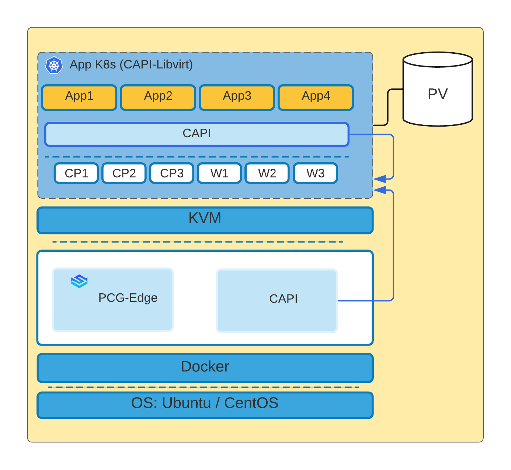
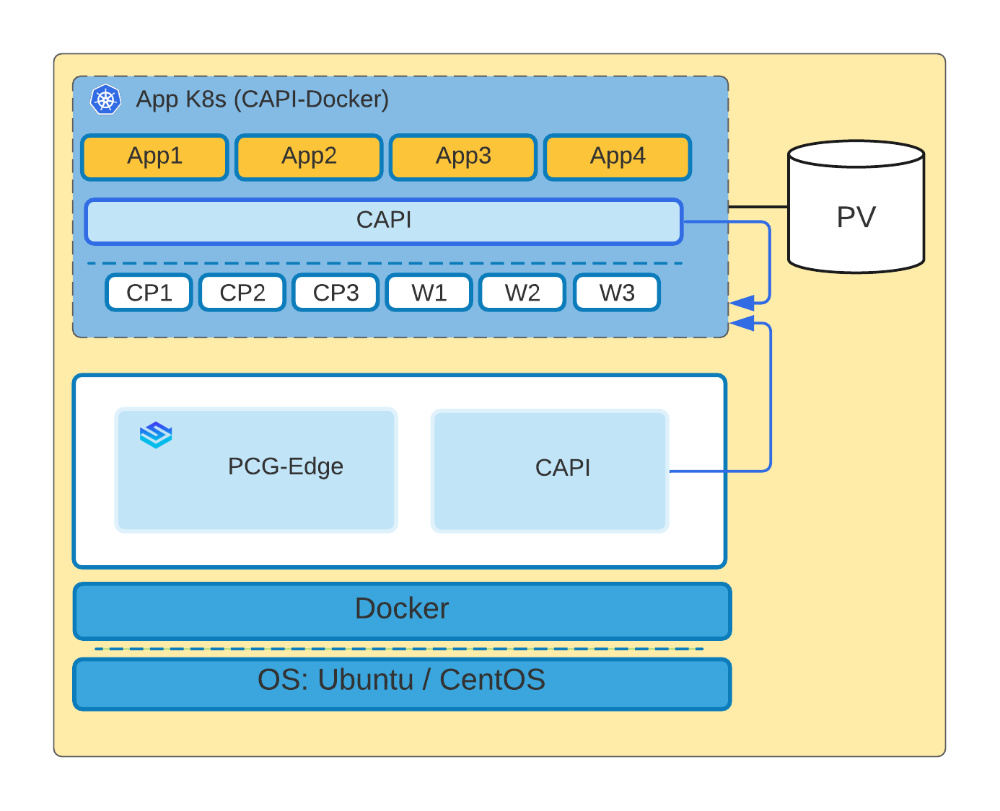

import Tabs from 'shared/components/ui/Tabs';
import WarningBox from 'shared/components/WarningBox';
import InfoBox from 'shared/components/InfoBox';
import PointsOfInterest from 'shared/components/common/PointOfInterest';

# Overview

Edge Clusters are Kubernetes clusters set up on appliances installed in isolated locations such as grocery stores and restaurants, unlike a data center or cloud environment. These appliances can be bare metal machines or virtual machines and are managed by operators at these remote sites. Palette provides the provisioning of workload clusters on such edge appliances from its SaaS-based management console. Besides provisioning of the cluster, Palette also provides end-to-end management of these clusters through operations such as scaling, upgrades, and reconfiguration.

<InfoBox>

Palette currently supports x86-based Edge devices. ARM-based support will be added subsequently.

</InfoBox>

# Private Cloud Gateway-Edge (PCG-E)

Deploying Edge Clusters requires a Private Cloud Gateway-Edge (PCG-E) to be installed on the appliances for Palette to discover the appliance and provision workload clusters on them. A PCG-E is Palette's on-premises component to support remote Edge devices. Palette PCG-E, once installed on-premises, registers itself with Palette's SaaS portal and enables secure communications between the SaaS portal and the Edge Clusters.

# Cluster Types

Palette supports the following two configurations for Edge clusters:

## Virtualized

Kubernetes nodes for master and worker pools are launched as Kernel-based Virtual Machines (KVM-based) in the virtualized mode. Each Virtual Machine (VM) represents a Kubernetes node. Users can specify placement settings for these virtual machines to ensure they are launched in the desired network and storage pools. Users can also configure VM hardware settings such as CPU, Memory, Disk size, etc.



## Containerized

Kubernete nodes for the master and worker pools are launched as Docker containers in the containerized mode. Each container represents a Kubernetes node.



# Edge Appliances

Palette supports several kinds of appliances at the Edge. These appliances can be registered with the Palette Management console and used for provisioning a Virtualized or Containerized cluster. The following is a list of all the supported Edge appliance types:

  | **Appliance Type**                        | **Cluster Type** |
  | :-------------                            | :----------      |
  | Virtual Machine                           | Containerized    |
  | Bare Metal Machine with Libvirt           | Virtualized      |
  | Bare Metal Machine without Libvirt        | Containerized    |

# High-level Orchestration Flow

* A communication and orchestration component called Private Cloud Gateway-Edge (PCG-E) is installed on the Edge appliance. Several environment-specific properties, such as proxy settings, Pod Classless Inter-Domain Routing (CIDRs), etc., are specified in PCG-E.


* PCG-E performs fundamental device discovery and registration with the Palette Management Console.


* User can register the appliance on the Palette Management Console at any time by specifying a unique appliance ID. This ID can be customized while starting up PCG-E. By default, the appliance's machine ID is used as a unique appliance ID.


* Upon initial registration of the appliance, its status will become _Unpaired_. Once PCG-Edge sends back the appliance information, the appliance is paired up, and the status changes to _Ready_.


* The rest of the provisioning workflow is similar to any other cloud in Palette. An environment-specific cluster profile needs to be created and used to provision the appliance cluster.

# Prerequisites

1. A Tenant account in Palette Management Console


2. Linux based operating systems like Ubuntu/CentOS


3. Docker installed on the system
  
   **Note**: The snap-installed Docker on Ubuntu does not work. Uninstall the same and install using the Official Docker steps. <https://docs.docker.com/engine/install/>)


4. Make sure to have root access to the machine

# Detailed Instructions

The following sections cover the prerequisites and detailed instructions for deploying clusters on containerized Edge appliances.

## Appliance Registration

1. Login to the Palette Console as a tenant.


2. Go to the **Clusters** page and click open the **Appliances** tab.


3. Click on the **+Add Appliances** button to open the wizard.


4. Navigate to the appliance section under the **Clusters** menu and register the appliance by providing its _unique ID_.
  This ID should match the ID sent over by the PCG-Edge running on the appliance. By default, PCG-E uses the machine ID, but it can be overridden to something different (e.g. 'store-1').


5. Optionally, specify one or more tags for the appliance. For example, Palette supports a unique **Name** tag. If specified, Palette would use the value of this tag in other User Interfaces (UIs) to make identification of the device easier.


6. Open the kebab (three-dot) menu and click the **Delete** button to delete the appliance.


<InfoBox>
The appliance will register with the PCG-E once PCG-E is installed successfully.
</InfoBox>

## PCG-Edge Install

1. Download the edge installer binary from the following location onto the appliance: <https://spectro-images.s3.amazonaws.com/edge-v2.3x.bin>


2. A Bootstrapper mechanism for installing the Palette component *PCG-E* is baked into the Palette PCG-E binary.


3. As the root user run the PCG-E installation command:

```bash
./edge-installer.bin -- -i  <IP address of the local machine/vm> 
                                   -d  <Custom Device id [Optional]> 
                                   -a  <Endpoint for Hubble API [Optional][default:api.spectrocloud.com]> 
                                   --http-proxy <Proxy for Http connections> 
                                   --https-proxy <Proxy for Https connections> 
                                   --no-proxy <comma separated list for No Proxy>
```

## Cluster Profile Creation

Cluster Profiles are created by configuring various layers of the Kubernetes infrastructure stack. The following steps need to be performed to create a new Cluster Profile:

1. Provide the basic profile information.
    - **Name** - Give your cluster a name.
    - **Description** - Add a familiar description of your profile.
    - **Profile Type** - Profile Type (Full, Infra, or Add-on) will dictate the layers configured in the cluster profile.  
    - **Tag** - Tags on a cluster profile are propagated to the edge device when clusters are created from the cluster profile.


2.  Select the _Edge_ as the **Environment** for _Infra_ or _Full_ cluster profile. (For containerized Edge cluster, toggle the **Virtualized** button).


3.  Configure the layers of the infrastructure stack. The following layers are considered Core Infrastructure layers. Configuring these layers is mandatory for cluster profiles of Infra or Full. These layers are not configurable for _Add-On_ cluster profiles:
    - OS
    - Kubernetes
    - Network
    - Storage

<InfoBox>
For the OS pack, if a custom CA certificate is required for outgoing traffic, make sure to specify it.

**Example:**

     Kubeadmconfig:
     preKubeadmCommands:
     - echo "Executing pre kube admin config commands"
     - update-ca-certificates
     - 'systemctl restart containerd; sleep 3'
     - 'while [ ! -S /var/run/containerd/containerd.sock ]; do echo "Waiting for containerd..."; sleep     1; done'
    postKubeadmCommands:
     - echo "Executing post kube admin config commands"
    files:
     - targetPath: /usr/local/share/ca-certificates/mycom.crt
    targetOwner: "root:root"
    targetPermissions: "0644"
    content: |
      -----BEGIN CERTIFICATE-----

           Certificate Content

      -----END CERTIFICATE-----

For Kubernetes packs, please ensure that the Pod CIDR and Service CIDR do not overlap with any IP ranges assigned in your network.

</InfoBox>

<InfoBox>

If Workloads deployed to the Edge clusters require persistence, we recommend using the Rook-Ceph pack for the storage layer. Rook-Ceph turns Distributed Storage System (DSS) into self-managing, self-scaling, self-healing storage services. It automates the storage administrator tasks such as: deployment, bootstrapping, configuration, provisioning, scaling, upgrading, migration, disaster recovery, monitoring, and resource management.

The Rook-Ceph pack in Palette, provides a couple of preset configurations. You can choose one of these configurations as a starting point and further tune configurations as desired:

* **Multi-Node Cluster With Replication (Default)** - This recommended configuration sets up a three-node Ceph cluster. This setting requires at least three nodes selected for the worker pool.
* **Single Node Cluster** - This configuration creates a single node Ceph cluster.

The following are the specific considerations that need to be taken into account for Virtualized and Containerized clusters, when using Rook-Ceph for storage:

1. Add three disks to the bare-metal machine or the VM instance.


2. Configure the Pack settings to use a device filter and set up only one OSD per device. As an example, if the disks added were SDD, SDE, SDF, the following device filters would need to be set:

**Example:**  

```json
 storage: 
   useAllNodes: true
   useAllDevices: false
   deviceFilter: ^sd[d-f]
   config:
     osdsPerDevice: "1" # this value can be overridden at the node or device level

```
  
</InfoBox>

4.  Additional layers such as Monitoring, Security, Load Balancers, etc., may be added and configured as desired. These layers may be configured for **Full** or **Add-On** profiles. The Add-on layers can be added in one of the following ways:
      * **Add New** - Add a Palette Pack from a pack registry or a Helm Chart from a chart registry. The public Palette Pack registry and a few popular Helm chart repositories are already available out of the box.


5.  Additional pack registries or public/private chart registries can be added to Palette.
       * **Pack Manifests** - Layers can be constructed using raw manifests to provide Kubernetes resources unavailable via Palettes or Charts. Pack Manifests provide a pass-through mechanism wherein additional Kubernetes resources can be orchestrated onto a cluster along with the rest of the stack.


6.  Configure each layer as follows:

    * Choosing the desired version includes pinning to a specific version (e.g., 1.1.1) or picking a major or minor train such as 1.x or 1.1.x. 

    * Picking a major/minor train results in a dynamic version association. The latest release from that train is linked to the pack at any given point. Future release updates on the train will result in the pack being relinked to the newest version. This allows clusters to always be at the latest released version without making subsequent updates to the profile.
      
    * The configuration option and version selected might provide configuration parameters to provide granular control or fine-tune certain aspects of the functionality. The configuration parameters are set to values based on standard best practices for the packs provided out of the box. Users may override these parameters as desired. Additionally, for specific layers, Palette provides a bunch of presets to enable or configure a feature within the add-on quickly. These presets are a group of properties presets with defaults to provide a quick and easy way to modify a set of relevant properties. If available, users can also enable one or more presets as appropriate.

      
    * Attach additional manifests to the layer if desired. Attach manifests provide a way for provisioning additional Kubernetes resources that support integration or an add-on. For example, specific integration offered through packs or charts may require creating resources like secrets, CRDs, etc., to complete the installation end to end. This can be achieved by adding one or more **Attach Manifests** to the layer.
       
    * Review your changes and save the cluster profile.

## Cluster Deployment

The following steps need to be performed to provision a new Edge cluster:

1. Provide the basic cluster information like name, description, and tags. Tags are currently not propagated to the VMs deployed on the edge device.


2. Select a Cluster Profile created for the _Containerized_ or _Virtualized_ Edge environment, depending on the type of cluster to be deployed. The profile definition will be used as the cluster construction template.


3. Review and override Pack parameters as desired. By default, parameters for all packs are set with values defined in the Cluster Profile.


4. Provide the Cluster Configuration details:
      * **SSH Keys (optional)** - Public key to configure remote SSH access to the nodes (User: spectro).


5. Configure the master and worker node pools. A master and a worker node pool are configured by default:

    |**Parameter**| **Description**|
    |-------------|----------------|
    | **Node Pool Name** | A descriptive name for the node pool.|
    | **Size** | Number of nodes to be provisioned for the node pool. For the master pool, this number can be a _1_, _3_, or _5_.|
    | **Allow worker capability (master pool)** | Workloads to be provisioned on master nodes.|
    | **Appliances** | Select the registered appliance from the dropdown. Can add multiple appliances for pool configuration.|
    | **Rolling Update** | For pool scale up and scale down, there are two choices of Rolling Update.
        || **Expand First** - Launches the new node and then shut down the old node.
        || **Contract First** - Shuts down the old node first and then launches the new node.|


6. Set the Cluster Policies as per requirement. For example, these policies could be set or scheduled later when the clusters start running.

    |**Parameter**| **Description**|
    |-------------|----------------|
      |**Manage Machines**   | Schedule the OS Patching to update the latest patches to the cluster.
      |**Scan Policies**     | Users can schedule the security scans from the following options:
       || * Kubernetes Configuration Security
       || * Kubernetes Penetration Testing
       || * Kubernetes Conformance Testing |
      |**Backup Policies**   | Palette provides a convenient backup option to back up the Kubernetes <br /> cluster state into object storage and restores it at a later point in time if required to the same or a different cluster.
7.  Review the settings and deploy the cluster. Provisioning status with details of ongoing provisioning tasks is available to track progress.

For more details on Day 2 Cluster management please refer to [Cluster Management](/clusters/#cluster-management).

## Deleting an Edge Cluster

The deletion of an Edge cluster results in the removal of all Virtual Machines and associated Storage Disks created for the cluster. The following tasks need to be performed to delete an Edge cluster:


1. Select the cluster to be deleted from the **Cluster** **View** page and navigate to the **Cluster Overview** page.


2. Invoke a delete action available on the page: **Cluster** > **Settings** > **Cluster** **Settings** > **Delete** **Cluster**.


3. Click **Confirm** to delete.


The Cluster Status is updated to **Deleting** while cluster resources are being deleted. Provisioning status is updated with the ongoing progress of the delete operation. Once all resources are successfully deleted, the cluster status changes to **Deleted** and is removed from the list of clusters.

<InfoBox>
Delete action is only available for clusters that are fully provisioned. For clusters that are still in the process of being provisioned, an Abort action is available to stop provisioning and delete all resources.
</InfoBox>

