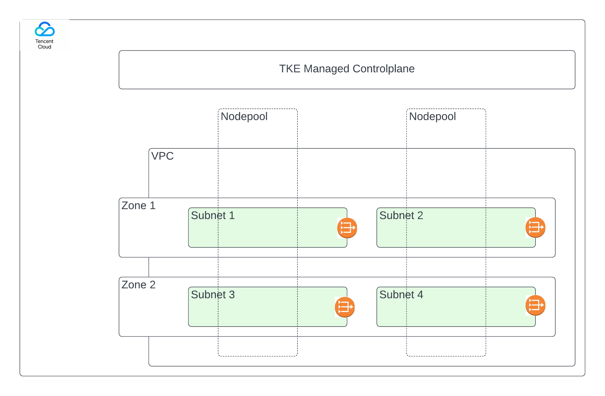

import Tabs from 'shared/components/ui/Tabs';
import WarningBox from 'shared/components/WarningBox';
import InfoBox from 'shared/components/InfoBox';
import PointsOfInterest from 'shared/components/common/PointOfInterest';


# Overview

Palette supports the deployment of tenant workloads with TKE (Tencent Kubernetes Engine). The following are the detailing of the Tencent TKE cluster provisioning through Palette:

* Palette enables the effortless deployment and management of containerized applications with fully-managed TKE (Tencent Kubernetes Engine).
* TKE is fully compatible with the native Kubernetes APIs and extends Kubernetes plug-ins such as CBS and CLB on the Tencent Cloud.
* The Palette-supported TKE architecture is represented diagrammatically as below:



# Prerequisites

* A Tencent Cloud account with appropriate permissions.
* Create a Cloud API **Secret ID** and **Secret Key**.
* Create the **Virtual Private Network** and **Subnet** to the region where the workload cluster needs to be deployed.
* The [**NAT Gateway**](https://intl.cloud.tencent.com/document/product/457/38369) is to be created to support IP address translation and to enable Internet access to resources in Tencent Cloud. 
* Route table set to accept external traffic, so that the nodes getting created in the associated subnets will have internet capability

# Creating a Tencent Cloud Account

Tencent Cloud account needs to be created for Palette Console from the Tenant Admin or Project Admin scope. To create the cloud account:
* Login to the Palette Management Console, and from the Project/Tenant Admin Settings, select the `Cloud Accounts` tab.
* Click `+ Tencent Account` to open the cloud account creation wizard and fill in the following details:
  * **Account Name**: A custom name to identify the Cloud account on the Palette Console.
  * **Optional description**: If any about the cloud account.
  * **Secret ID**: The secret id of the Tencent cloud account
  * **Secret Key**: The secret key of the Tencent cloud account.
*   Validate and confirm the given information to complete the wizard. 

**Note**: Cloud account can be created during the first step of cluster creation when you fill in the basic information by clicking `+` next to `Cloud Account.` 

# Deploying Tencent Cluster
The following steps need to be performed to provision a new TKS cluster:
* Provide basic cluster information like name, description, and tags. Tags on a cluster are propagated to the VMs deployed on the cloud/data center environments.
* Select a cluster profile created for Tencent Cloud. The profile definition will be used as the cluster deployment template.
* Review and override pack parameters as desired. By default, parameters for all packs are set with values defined in the cluster profile.

<WarningBox>

While adding add-on packs to Cluster Profile, please make sure that Persistent Volume Claim size is >=10 GB and also are in multiples of 10 (10,20,30 …).

Example:

```yaml

## Enable persistence using Persistent Volume Claims
     ## ref: http://kubernetes.io/docs/user-guide/persistent-volumes/
     ##
     master:
       persistence:
         enabled: true
         ## mariadb data Persistent Volume Storage Class
         ## If defined, storageClassName: <storageClass>
         ## If set to "-", storageClassName: "", which disables dynamic provisioning
         ## If undefined (the default) or set to null, no storageClassName spec is
         ##   set, choosing the default provisioner.  (gp2 on AWS, standard on
         ##   GKE, AWS & OpenStack)
         ##
         # storageClass: "-"
         accessModes:
           - ReadWriteOnce
         size: 20Gi
```

</WarningBox>

* Provide the Tencent Cloud account and placement information:
  * Cloud Account - Select the desired cloud account. Tencent cloud accounts with Tencent credentials need to be pre-configured in project/tenant admin settings.

**Note**: Cloud account can be created during this step of cluster creation by clicking `+` next to `Cloud Account.` 
  * Region - Choose the desired  Tencent region where you would like the clusters to be provisioned.
  * SSH Key Pair Name - Choose the desired SSH Keypair. SSH key pairs need to be pre-configured on TKS for the desired regions. The selected key is inserted into the VMs provisioned.
  * VPCID
  * Cluster endpoint access
    * Private:
    * Public: 
    * Private &Public:

<InfoBox>
Palette encourages its uses to go with Public Cluster endpoint access as of now. Other options will be supported in the near future.
</InfoBox>

  * Public Access CIDRs:  to enable access restrictions for the users.
  * Update worker pools in parallel: Patch updates to all worker pools simultaneously.
* Configure one or more worker node pools. A single worker node will be configured by default.
  * Name - A descriptive name for the node pool.
  * Size - Make your choice of minimum, maximum, and desired sizes for the worker pool. The size of the worker pool will scale between the minimum and maximum size under varying workload conditions.
  * Create [Label and Taints](./clusters/cluster-management/taints)  as per user requirements.
  * Instance type - Select the Tencent Instance Type for the nodes in the node pool with availability zones and disk size.
* Review settings and deploy the cluster. Provisioning status with details of ongoing provisioning tasks is available to track progress.

# Deleting a Tencent Cluster

The deletion of a Tencent cluster results in the removal of all Virtual machines and associated storage disks created for the cluster. The following tasks need to be performed to delete a Tencent cluster:
* Select the cluster to be deleted from the cluster view and navigate to the `Cluster overview page`.
* Invoke a delete action available on the page: `Cluster -> Settings  -> Delete Cluster`.
* Confirm the delete operation by typing in the cluster name. Cluster status is updated to ‘Deleting’ while cluster resources are deleted. Provisioning status is updated with the ongoing progress of the delete operation. Once all resources are successfully deleted, the cluster status changes to ‘Deleted’ and is removed from the list of clusters.

# Cluster Force Deletion

A cluster stuck in the **Deletion** state can be force deleted by the user through the User Interface. The user can only go for a force deletion of the cluster if it is stuck in a deletion state for a minimum of **14 minutes**. Palette users can force delete the clusters from the tenant and project admin scope. 

To force delete a cluster:

* Login to the Palette Management Console
* Navigate to the Cluster details page of the cluster stuck in deletion.
* If the deletion is stuck for more than 14 minutes, Click the `Force Delete Cluster` button from the `Settings` dropdown. 
* If the `Force Delete Cluster` button is not enabled, wait for 14 minutes, The`Settings` dropdown will give the estimated time for enabling the force deletion button.

<WarningBox>
If there are any cloud resources still on the cloud, the user should clean up those resources before doing the force deletion. 
</WarningBox>


