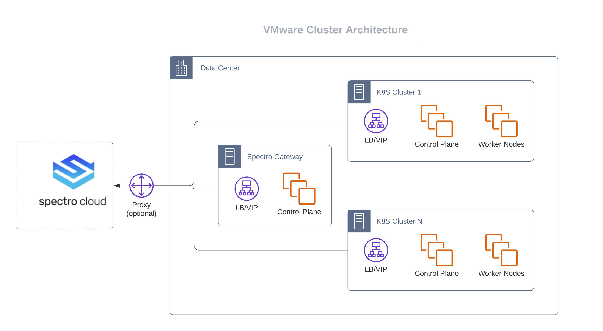

import Tabs from 'shared/components/ui/Tabs';
import WarningBox from 'shared/components/WarningBox';
import InfoBox from 'shared/components/InfoBox';
import PointsOfInterest from 'shared/components/common/PointOfInterest';


# Overview

The following are some architectural highlights of Kubernetes clusters provisioned by Palette on VMware:

1. Kubernetes nodes can be distributed across multiple-compute clusters which serve as distinct fault domains. 


2. Support for static IP as well as DHCP.
   *  If using DHCP, Dynamic DNS is required.


3. IP pool management for assigning blocks of IPs dedicated to clusters or projects.


4. To facilitate communications between the Palette management platform and vCenter installed in the private data center, set up a Private Cloud Gateway (PCG) within the environment.


5. Private Cloud Gateway is Palette's on-premises component to enable support for isolated, private cloud or data center environments. The Palette Gateway, once installed on-premises, registers itself with Palette's SaaS portal and enables secure communications between the SaaS portal and private cloud environment. The gateway enables installation and end-to-end lifecycle management of Kubernetes clusters in private cloud environments from Palette's SaaS portal.



# Prerequisites

The following prerequisites must be met before deploying a Kubernetes clusters in VMware:

1. vSphere [6.7U3](https://docs.vmware.com/en/VMware-vSphere/6.7/rn/vsphere-esxi-67u3-release-notes.html) or later (recommended).


2. Configuration Requirements - A Resource Pool needs to be configured across the hosts, onto which the workload clusters will be provisioned. Every host in the Resource Pool will need access to shared storage, such as vSAN, to be able to make use of high-availability control planes. Network Time Protocol (NTP) must be configured on each of the ESXi hosts.


3. You need an active vCenter account with all the permissions listed below in the **VMware Cloud Account Permissions** section.


4. You should have an Infrastructure cluster profile created in Palette for VMWare.


5. Install a Private Cloud Gateway for VMware as described in the **Installing Private Cloud Gateway - VMware** section below. Installing the Private Cloud Gateway will automatically register a cloud account for VMware in Palette. You can register your additional VMware cloud accounts in Palette as described in the **Creating a VMware Cloud account** section below.


6. Subnet with egress access to the internet (direct or via proxy):
    * For proxy: HTTP_PROXY, HTTPS_PROXY (both required).
    * Outgoing internet connection on port 443 to api.spectrocloud.com.


7. The Private cloud gateway IP requirements are:
    - One (1) node - one (1) IP or three (3) nodes - three (3) IPs.
    - One (1) Kubernetes control-plane VIP.
    - One (1) Kubernetes control-plane extra.


8. IPs for application workload services (e.g.: LoadBalancer services).


9. A DNS to resolve public internet names (e.g.: api.spectrocloud.com).


10. Shared Storage between vSphere hosts.


11. Zone Tagging: A dynamic storage allocation for persistent storage.


<InfoBox>
If access switching is VMware vSphere Distributed Switch (VDS) then permissions needs to be provided only for the virtual switch and not the VDS object.
</InfoBox>

## Zone Tagging 

Zone tagging is required for dynamic storage allocation across fault domains when provisioning workloads that require persistent storage. This is required for installation of Palette Platform itself and also useful for workloads deployed in the tenant clusters if they have persistent storage needs. Use vSphere tags on data centers (k8s-region) and compute clusters (k8s-zone) to create distinct zones in your environment.

  As an example, assume your vCenter environment includes three compute clusters, cluster-1, cluster-2, and cluster-3, that are part of data center dc-1. You can tag them as follows:

| **vSphere Object**       | **Tag Category**     | **Tag Value**     |
| :-------------       | :----------      | :-----------  |
|  dc-1                | k8s-region       | region1       |
| cluster-1            | k8s-zone         | az1           |
| cluster-2            | k8s-zone         | az2           |
| cluster-3            | k8s-zone         | az3           |

**Note:** 

The exact values for the k8s-region and k8s-zone tags can be different from the ones described in the above example, as long as they are unique.

<br />

# VMware Cloud Account Permissions 

**Last Update**: October 7, 2021

The vSphere user account used in the various Palette tasks must have the minimum vSphere privileges required to perform the task. The **Administrator** role provides super-user access to all vSphere objects. For users without the **Administrator** role, one or more custom roles can be created based on the tasks being performed by the user.

<br />

## Privileges Under Root-Level Role

<br />

<WarningBox>
The root-level role privileges are applied to root object and data center objects only.
</WarningBox>

|**vSphere Object**    |**Privileges**|
|---------------|----------|
|**Cns**|Searchable|
|**Datastore**|Browse datastore
|**Host**|Configuration
||* Storage partition configuration
|**vSphere** **Tagging**|Create vSphere Tag|
||Edit vSphere Tag|
|**Network**|Assign network|
|**Sessions**|Validate session|
|**Profile-driven storage**|Profile-driven storage view|
|**Storage views**|View|

<br />

## Privileges Under the Spectro Role 
<br />

<InfoBox>
The Spectro role privileges are applied to hosts, clusters, virtual machines, templates, datastore and network objects.
</InfoBox>

|**vSphere Object**    |**Privileges**|
|---------------|----------|
|**Cns**|Searchable
|**Datastore**|Allocate space|
||Browse datastore|
||Low level file operations|
||Remove file|
||Update virtual machine files|
||Update virtual machine metadata|
|**Folder**|Create folder|
||Delete folder|
||Move folder|
||Rename folder|
|**Host**|Local operations|
||Reconfigure virtual machine|
|**vSphere Tagging**|Assign or Unassign vSphere Tag|
||Create vSphere Tag|
||Delete vSphere Tag|
||Edit vSphere Tag|
|**Network**|Assign network|
|**Resource**|Apply recommendation|
||Assign virtual machine to resource pool|
||Migrate powered off virtual machine|
||Migrate powered on virtual machine|
||Query vMotion|
|**Sessions**|Validate session|
|**Profile-driven storage**|Profile-driven storage view|
|**Storage views**|Configure service|
||View|
|**Tasks**|Create task|
||Update task|
|**vApp**|Export|
||Import|
||View OVF environment|
||vApp application configuration|
||vApp instance configuration|
|**Virtual machines**|**Change Configuration**|
||* Acquire disk lease|
||* Add existing disk|
||* Add new disk|
||* Add or remove device|
||* Advanced configuration|
||* Change CPU count|
||* Change Memory|
||* Change Settings|
||* Change Swapfile placement|
||* Change resource|
||* Configure Host USB device|
||* Configure Raw device|
||* Configure managedBy|
||* Display connection settings|
||* Extend virtual disk|
||* Modify device settings|
||* Query Fault Tolerance compatibility|
||* Query unowned files|
||* Reload from path|
||* Remove disk|
||* Rename|
||* Reset guest information|
||* Set annotation|
||* Toggle disk change tracking|
||* Toggle fork parent|
||* Upgrade virtual machine compatibility|
||**Edit Inventory**|
||* Create from existing|
||* Create new|
||* Move|
||* Register|
||* Remove|
||* Unregister|
||**Guest operations**|
||* Guest operation alias modification|
||* Guest operation alias query|
||* Guest operation modifications|
||* Guest operation program execution|
||* Guest operation queries|
||**Interaction**|
||* Console interaction|
||* Power off|
||* Power on|
||**Provisioning**|
||* Allow disk access|
||* Allow file access|
||* Allow read-only disk access|
||* Allow virtual machine download|
||* Allow virtual machine files upload|
||* Clone template|
||* Clone virtual machine|
||* Create template from virtual machine|
||* Customize guest|
||* Deploy template|
||* Mark as template|
||* Mark as virtual machine|
||* Modify customization specification|
||* Promote disks|
||* Read customization specifications|
||**Service configuration**|
||* Allow notifications|
||* Allow polling of global event notifications|
||* Manage service configurations|
||* Modify service configuration|
||* Query service configurations|
||* Read service configuration|
||**Snapshot management**|
||* Create snapshot|
||* Remove snapshot|
||* Rename snapshot|
||* Revert to snapshot|
||**vSphere Replication**|
||* Configure replication|
||* Manage replication|
||* Monitor replication|
|**vSAN**|Cluster|
||ShallowRekey|

# Creating a VMware Cloud Gateway


<br />
<br />

<InfoBox>
For self hosted version, a system gateway is provided out of the box and typically installing a Private Cloud Gateway is not required. However, additional gateways can be created as required to support provisioning into remote data center that do not have direct incoming connection from the management console.
</InfoBox>

<br />

* Minimum capacity required for a Private Cloud Gateway:
  + One (1) node - two (2) vCPU, 4GB memory, 30GB storage.
  + Three (3)nodes - six (6) vCPU, 12GB memory, 70GB storage.


* Setting up a cloud gateway involves: 

  * Initiating the install from the tenant portal
  * Deploying gateway installer VM in vSphere
  * Launching the cloud gateway from the tenant portal

<br />

## Tenant Portal - Initiate Install

1. As a Tenant Administrator, navigate to the **Private Cloud Gateway** page under settings and click the dialogue to create a new Private Cloud Gateway.

2. Notate the link to the Palette Gateway Installer OVA and PIN displayed on the dialogue.


<br />

## vSphere - Deploy Gateway Installer

1. Initiate deployment of a new OVF template by providing a link to the installer OVA as the URL.


2. Proceed through the OVF deployment wizard by choosing the desired Name, Placement, Compute, Storage, and Network options.


3. At the **Customize Template** step, specify Palette properties as follows:

<br />

| **Parameter** | **Value** | **Remarks** |
|---|---|---|
|**Installer Name** | Desired Palette Gateway Name | The name will be used to identify the gateway instance. Typical environments may only require a single gateway to be deployed, however, multiple gateways might be required for managing clusters across multiple vCenters. Choose a name that can easily identify the environment that this gateway instance is being configured for.|
| **Console endpoint** | URL to Palette management platform portal | https://console.spectrocloud.com by default |
|**Pairing Code** | PIN displayed on the Palette management platform portal's 'Create a new gateway' dialogue. | |
| **SSH Public Key** | Optional key, useful for troubleshooting purposes (Recommended) | Enables SSH access to the VM as 'ubuntu' user |
| **Pod CIDR** | Optional - IP range exclusive to pods | This range should be different to prevent an overlap with your network CIDR. |
| **Service cluster IP range** | Optional - IP range in the CIDR format exclusive to the service clusters | This range also must not overlap with either the pod CIDR or your network CIDR. |

 * Additional properties that are required to be set only for a proxy environment. Each of the proxy properties may or may not have the same value but all the three properties are mandatory.

| **Parameter** | **Value** | **Remarks** |
|---|---|---|
|**HTTP PROXY** | The endpoint for the HTTP proxy server | This setting will be propagated to all the nodes launched in the proxy network. e.g., http://USERNAME: PASSWORD@PROXYIP: PROXYPORT |
| **HTTPS PROXY** | The endpoint for the HTTPS proxy server | This setting will be propagated to all the nodes launched in the proxy network. e.g., http://USERNAME: PASSWORD@PROXYIP: PROXYPORT |
| **NO Proxy** | A comma-separated list of vCenter server, local network CIDR, hostnames, domain names that should be excluded from proxying | This setting will be propagated to all the nodes to bypass the proxy server . e.g., vcenter.company.com, .company.org, 10.10.0.0/16 |

4. Finish the OVF deployment wizard and wait for the OVA to be imported and virtual machine to be deployed.


5. Power on the virtual machine.

## Tenant Portal - Launch Cloud Gateway

1. Close the **Create New Gateway** dialogue if it is still open or navigate to the Private Cloud Gateway page under settings in case you have navigated away or been logged out.


2. Wait for a gateway widget to be displayed on the page and for the **Configure** option to be available. The IP address of the installer VM will be displayed on the gateway widget. This may take a few minutes after the Virtual Machine is powered on. Failure of the installer to register with the Palette Management Platform portal within 10 mins of powering on the Virtual Machine on vSphere, might be indicative of an error. Please follow the troubleshooting steps to identify and resolve the issue.


3. Click on the **Configure** button to invoke the Palette Configuration dialogue. Provide vCenter credentials and proceed to the next configuration step.


4. Choose the desired values for the data center, Compute Cluster, Datastore, Network, Resource pool, and Folder. Optionally, provide one or more SSH Keys and/or NTP server addresses.


5. Choose the IP Allocation Scheme - Static IP or DHCP. If static IP is selected, an option to create an IP pool is enabled. Proceed to create an IP pool by providing an IP range (start and end IP addresses) or a subnet. The IP addresses from this IP Pool will be assigned to the gateway cluster. By default, the IP Pool is available for use by other tenant clusters. This can be prevented by enabling the **Restrict to a single cluster** button. A detailed description of all the fields involved in the creation of an IP pool can be found [here](/clusters?clusterType=vmware_cluster#ipaddressmanagement).


6. Click on **Confirm**, to initiate provisioning of the gateway cluster. The status of the cluster on the UI should change to **Provisioning** and eventually **Running**, when the gateway cluster is fully provisioned. This process might take several minutes (typically 8 to 10 mins). 
   You can observe a detailed provisioning sequence on the **Cluster Details** page, by clicking on the gateway widget on the UI. If provisioning of the gateway cluster runs into errors or gets stuck, relevant details can be found on the **Summary** tab or the events tab of the cluster details page. 
   
   In certain cases where provisioning of the gateway cluster is stuck or failed due to invalid configuration, the process can be reset from the Cloud Gateway Widget on the UI.

7. Once the Gateway transitions to the **Running** state, it is fully provisioned and ready to bootstrap tenant cluster requests.

<InfoBox>
A Gateway cluster installation automatically creates a cloud account behind the scenes, using the credentials entered at the time of deploying the gateway cluster. This account may be used for the provisioning of clusters across all Tenant Projects.
</InfoBox>

## vSphere - Clean up installer

Power off the installer OVA which was initially imported at the start of this installation process.

# Troubleshooting
<br />

### Gateway installer - Unable to register with the Tenant Portal

The installer VM, when powered on, goes through a bootstrap process and registers itself with the Tenant Portal. This process typically takes five to ten minutes. Failure of the installer to register with the Tenant Portal, within this duration, might be indicative of a bootstrapping error. 

SSH into the installer virtual machine using the key provided during OVA import and inspect the log file located at */var/log/cloud-init-output.log*. This log file will contain error messages in the event there are failures with connecting to the Palette Management platform portal, authenticating, or downloading installation artifacts. A common cause for these errors is that the Palette Management platform console endpoint or the pairing code is typed incorrectly. 

Ensure that the Tenant Portal console endpoint does not have a trailing slash. If these properties were incorrectly specified, power down and delete the installer VM and relaunch with the correct values.

Another potential issue is a lack of outgoing connectivity from the VM. The installer VM needs to have outbound connectivity directly or via a proxy. Adjust proxy settings (if applicable) to fix the connectivity or power down and delete the installer VM and relaunch in a network that enables outgoing connections.

If the above steps do not resolve your issues, copy the following script to the installer VM and execute to generate a logs archive. Open a support ticket and attach the logs archive to the ticket to allow the Palette Support team to troubleshoot and provide further guidance:

``` bash
#!/bin/bash

DESTDIR="/tmp/"

CONTAINER_LOGS_DIR="/var/log/containers/"
CLOUD_INIT_OUTPUT_LOG="/var/log/cloud-init-output.log"
CLOUD_INIT_LOG="/var/log/cloud-init.log"
KERN_LOG="/var/log/kern.log"
KUBELET_LOG="/tmp/kubelet.log"
SYSLOGS="/var/log/syslog*"

FILENAME=spectro-logs-$(date +%-Y%-m%-d)-$(date +%-HH%-MM%-SS).tgz

journalctl -u kubelet > $KUBELET_LOG

tar --create --gzip -h --file=$DESTDIR$FILENAME $CONTAINER_LOGS_DIR $CLOUD_INIT_LOG $CLOUD_INIT_OUTPUT_LOG $KERN_LOG $KUBELET_LOG $SYSLOGS

retVal=$?
if [ $retVal -eq 1 ]; then
    echo "Error creating spectro logs package"
else
    echo "Successfully extracted spectro cloud logs: $DESTDIR$FILENAME"
fi
```
<br />

### Gateway Cluster - Provisioning stalled/failure

An installation of the gateway cluster may run into errors or might get stuck in the provisioning state for a variety of reasons like lack of infrastructure resources, IP addresses not being available, unable to perform NTP sync, etc. 

While these are most common, some other issue might be related to the underlying VMware environment. The Cluster Details page, which can be accessed by clicking anywhere on the gateway widget, contains details of every orchestration step including an indication of the current task being executed. 

Any intermittent errors will be displayed on this page next to the relevant orchestration task. The Events tab on this page, also provides a useful resource to look at lower-level operations being performed for the various orchestration steps.

If you think that the orchestration is stuck or failed due to an invalid selection of infrastructure resources or an intermittent problem with the infrastructure, you may reset the gateway by clicking on the **Reset** button on the gateway widget. This will reset the gateway state to **Pending** allowing you to reconfigure the gateway and start provisioning of a new gateway cluster. 

If the problem persists, please contact Palette support, via the Service Desk.
<br />

### Upgrading a VMware Cloud Gateway

Palette maintains the OS image and all configurations for the cloud gateway. Periodically, the OS images, configurations, or other components need to be upgraded to resolve security or functionality issues. Palette releases such upgrades when required and communication about the same is presented in the form of an upgrade notification on the gateway.

Administrators should review the changes and apply them at a suitable time. Upgrading a cloud gateway does not result in any downtime for the Tenant Clusters. During the upgrade process, the provisioning of new clusters might be temporarily unavailable. New cluster requests are queued while the gateway is being upgraded and are processed as soon as the gateway upgrade is complete.


<br />

### Deleting a VMware Cloud Gateway

The following steps need to be performed to delete a cloud gateway:

1. As a Tenant Administrator, navigate to the **Private Cloud Gateway** page under **Settings**.


2. Invoke the **Delete** action on the cloud gateway instance that needs to be deleted.


3. The system performs a validation to ensure there are no running tenant clusters associated with the gateway instance being deleted. If such instances are found, the system presents an error. Delete relevant running tenant clusters and retry the deletion of the cloud gateway.


4. Delete the Gateway Virtual Machines from vSphere.

<br />

### Resizing a VMware Cloud Gateway

A cloud gateway can be set up as a 1-node or a 3-node cluster.  For production environments, it is recommended that three (3) nodes are set up. A cloud gateway can be initially set up with one (1) node and resized to three (3) nodes at a later time. The following steps need to be performed to resize a 1-node cloud gateway cluster to a 3-node gateway cluster:

1. As a Tenant Administrator, navigate to the **Private Cloud Gateway** page under **Settings**.


2. Invoke the resize action for the relevant cloud gateway instance.


3. Update the size from one (1) to three (3).


4. The gateway upgrade begins shortly after the update. Two new nodes are created on vSphere and the gateway is upgraded to a 3-node cluster.

<InfoBox>
Scaling a 3-node cluster down to a 1-node cluster is not permitted.<p></p> A load balancer instance is launched even for a 1-node gateway to support future expansion.
</InfoBox>

# IP Address Management

Palette supports DHCP as well as Static IP based allocation strategies for the VMs that are launched during cluster creation. IP Pools can be defined, using a range or a subnet. Administrators can define one or more IP pools linked to a private cloud gateway. 

Clusters created using a private cloud gateway can select from the IP pools linked to the corresponding private cloud gateway. By default, IP Pools are shared across multiple clusters, but can optionally be restricted to a cluster. 

The following is a description of various IP Pool properties:

| **Property** | **Description** |
|---|---|
| **Name** | Descriptive name for the IP Pool. This name will be displayed for IP Pool selection when static IP is chosen as the IP allocation strategy |
| **Network Type** | Select **Range** to provide a start and an end IP address. IPs within this range will become part of this pool. Alternately select 'Subnet' to provide the IP range in CIDR format.|
| **Start** | First IP address for a range based IP Pool E.g. 10.10.183.1|
| **End** | Last IP address for a range based IP Pool.  E.g. 10.10.183.100 |
| **Subnet** | CIDR to allocate a set of IP addresses for a subnet based IP Pool.  E.g. 10.10.183.64/26 |
| **Subnet Prefix** | Network subnet prefix. e.g. /18|
| **Gateway** | Network Gateway E.g. 10.128.1.1 |
| **Name server addresses** | A comma-separated list of name servers. e.g., 8.8.8.8 |
| **Restrict to a Single Cluster** | Select this option to reserve the pool for the first cluster that uses this pool. By default, IP pools can be shared across clusters.|

# Creating a VMware Cloud Account

<InfoBox>
Configuring the private cloud gateway is a prerequisite task. A default cloud account is created when the private cloud gateway is configured. This cloud account can be used to create a cluster.
</InfoBox>

<InfoBox>
Enterprise version users should choose the <i>Use System Gateway</i> option.
</InfoBox>

In addition to the default cloud account already associated with the private cloud gateway, new user cloud accounts can be created for the different vSphere users.

| **Property** | **Description** |
|---|---|
|**Account Name** | Custom name for the cloud account |
| **Private cloud gateway** | Reference to a running cloud gateway|
| **vCenter Server** | IP or FQDN of the vCenter server|
| **Username** | vCenter username|
| **Password** | vCenter password|

# Deploying a VMware Cluster


The following steps need to be performed to provision a new VMware cluster:

1. Provide the basic cluster information like Name, Description, and Tags. Tags are currently not propagated to the Virtual Machines (VMs) deployed on the cloud/data center environments.


2. Select a Cluster Profile created for the VMware environment. The profile definition will be used as the cluster construction template.


3. Review and override Pack Parameters as desired. By default, parameters for all Packs are set with values defined in the Cluster Profile.


4. Provide a vSphere Cloud account and placement information. 

    |**Parameter**                            | **Description**|
    |-----------------------------------------|----------------|
        | **Cloud Account** | Select the desired cloud account. <br />VMware cloud accounts with credentials need to be preconfigured <br /> in the Project Settings section. An account is auto-created as <br /> part of the cloud gateway setup and is available for <br /> provisioning of Tenant Clusters if permitted by the administrator.|
        | **Data center** |The vSphere data center where the cluster nodes will be launched.|
        | **Folder** | The vSphere VM Folder where the cluster nodes will be launched.|
        | **SSH Keys (Optional)** | Public key to configure remote SSH access to the nodes (User: spectro).|
        | **NTP Server (Optional)** | Setup time synchronization for all the running nodes.|
        | **IP Allocation strategy** | DHCP or Static IP|
    
5. Configure the master and worker node pools. A master and a worker node pool are configured by default.

    |**Parameter**                            | **Description**|
    |-----------------------------------------|----------------|
    | **Name** | A descriptive name for the node pool.|
    | **Size** | Number of nodes to be provisioned for the node pool. For the master pool, this number can be 1, 3, or 5.|
    | **Allow worker capability (master pool)** | To workloads to be provisioned on master nodes.|
    | **CPU** | Number of CPUs to be allocated to the nodes.|
    | **Memory** | Amount of memory in GB to be allocated to the nodes.|
    | **Disk** | Storage disk size in GB to be attached to the node.|
    | **Placement Domains** |One or more placement domains. VMs are distributed across multiple placement domains on a round-robin basis. Currently, only one placement domain is supported for a master pool.|
       || * **Compute Cluster** - A Compute cluster under the selected data center.|
       || * **Datastore** - The vSphere storage in the selected data center.|
       || * **Network** - The vSphere Network in the selected data center, to enable connectivity for the cluster nodes.|
       || * **Resource Pool**- The vSphere resource pool where the cluster nodes will be launched.|
       || * **IP Pool** - An IP pool to be used for allocation <br /> IP addresses to cluster VMs. Required only <br /> for Static IP allocation. IP pools need to be predefined for private cloud gateways.|

6. Review settings and deploy the cluster. Provisioning status with details of ongoing provisioning tasks is available to track progress.

<InfoBox>
New worker pools may be added if it is desired to customize certain worker nodes to run specialized workloads. As an example, the default worker pool may be configured with 4 CPUs, 8 GB of memory for general-purpose workloads, and another worker pool with 8 CPUs, 16 GB of memory for advanced workloads that demand larger resources.
</InfoBox>

# Deleting a VMware Cluster

The deletion of a VMware cluster results in the removal of all Virtual machines and associated storage disks created for the cluster. The following tasks need to be performed to delete a VMware cluster:


1. Select the cluster to be deleted from the **Cluster** **View** page and navigate to the **Cluster Overview** page.


2. Invoke the delete action available on the page: **Cluster** > **Settings** > **Cluster** **Settings** > **Delete** **Cluster**.


3. Click **Confirm** to delete.


The Cluster Status is updated to **Deleting** while the Cluster Resources are being deleted. Provisioning status is updated with the ongoing progress of the delete operation. Once all resources are successfully deleted, the Cluster Status changes to **Deleted** and is removed from the list of Clusters.

<InfoBox>
The Delete action is only available for Clusters that are fully provisioned. For Clusters that are still in the process of being provisioned, <b> Abort </b> action is available to stop provisioning and delete all resources.
</InfoBox>

# Force Delete a Cluster

A cluster stuck in the **Deletion** state can be force deleted by the user through the User Interface. The user can go for a force deletion of the cluster, only if it is stuck in a deletion state for a minimum of **15 minutes**. Palette enables cluster force delete from the Tenant Admin and Project Admin scope. 

## To force delete a cluster:

1. Log in to the Palette Management Console.


2. Navigate to the **Cluster Details** page of the cluster stuck in deletion mode.

      - If the deletion status is stuck for more than 15 minutes, click the **Force Delete Cluster** button from the **Settings** dropdown. 
    
      - If the **Force Delete Cluster** button is not enabled, wait for 15 minutes. The **Settings** dropdown will give the estimated time for the auto-enabling of the **Force Delete** button.


<WarningBox>
If there are any cloud resources still on the cloud, the user should cleanup those resources before going for the force deletion. 
</WarningBox>


