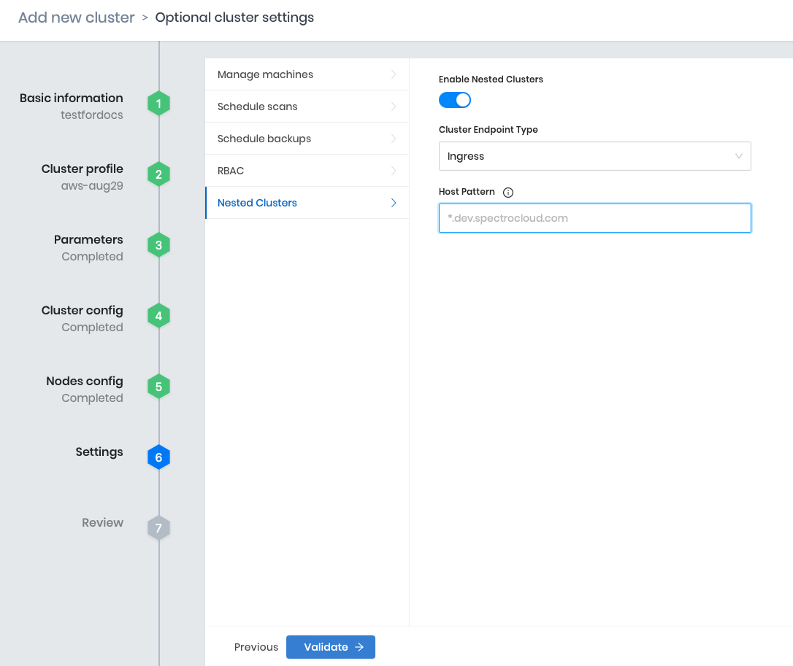

import Tabs from 'shared/components/ui/Tabs';
import InfoBox from 'shared/components/InfoBox';
import WarningBox from 'shared/components/WarningBox';
import PointsOfInterest from 'shared/components/common/PointOfInterest';
import Tooltip from "shared/components/ui/Tooltip";

# Getting Started with Nested Clusters

With the Palette Nested Cluster option, you can deploy additional Kubernetes clusters within an existing cluster to provide users and teams with nested cluster environments.

There are certain advantages to use a nested cluster environment. For example, you are free to operate with admin level privileges, while simultaneously ensuring strong isolation, reducing operational overhead, and improving resource utilization.

Try the steps below to [enable](/clusters/nested-clusters/cluster-quickstart#enablingnestedclustersonahostcluster) and [deploy](/clusters/nested-clusters/cluster-quickstart#deployinganestedcluster) a managed Nested Cluster from within Palette.

<br />

## Prerequisites

- You will need to have access to a Palette Account. Refer to the [Getting Started with Palette](/getting-started) page, and sign up for free [here](https://www.spectrocloud.com/get-started/).<p></p><br />

- Ensure you have a functioning [cluster](/clusters/new-clusters) already configured. If not, you can deploy a new cluster and enable the Nested Clusters feature at the Settings step of your new cluster's deployment configuration. Clusters with the Nested Cluster feature enabled are referred to as **Host Clusters**.<p></p><br />

  ### Host Clusters

  There are two ways to engage with a Nested Cluster on Palette.<p></p><br />

   1. When you [create](/clusters/new-clusters) and [deploy](/clusters/nested-clusters/cluster-quickstart#deployinganestedcluster) a new Host Cluster, there is an option to **Enable Nested Clusters**. <p></p><br />Refer to the [Cluster Endpoint](/clusters/nested-clusters/cluster-quickstart#loadbalancer) step below for more information on how to configure this option. The settings listed below are available when you are enabling the Nested Clusters feature on a pre-existing cluster and when using the Host Cluster deployment wizard.

    <p></p><br />

    2. Similarly, you can [enable](/clusters/nested-clusters/cluster-quickstart#enablingnestedclustersonanexistinghostcluster) an existing cluster; thus allowing it to host Nested Clusters.<p></p><br />

<InfoBox>

When you create a Host Cluster and the storage layer is AWS EKS CSI, ensure the following role policies are included.

<br />

```yml
roleName: "custom-ng-role"
  roleAdditionalPolicies:
  - "arn:aws:iam::aws:policy/service-role/AmazonEBSCSIDriverPolicy"
```
</InfoBox>


# Enabling Nested Clusters on an Existing Host Cluster

You can enable nested clusters on an existing host cluster by performing the following steps:<p></p><br />

1. From the slide menu, select **Clusters** and view the list of **Clusters**.


2. Click any Host Cluster from the list and select **Settings** > **Cluster Settings** > **Nested Clusters**.


3. Toggle the **Enable Nested Clusters** option (yes/no).

    **Note**: This feature can be enabled when first creating a new cluster, so you may find that it is already enabled.


4. Select the **Cluster Endpoint Type**: *Load Balancer* or *Ingress*.


## Load Balancer

If **Load Balancer** is selected, the following must be true:<p></p><br />

-  The Host Cluster must support dynamic provisioning of load balancers.<p></p><br />
-  If the Host Cluster is in the public cloud, the AKS/EKS/GCP Cloud Controller Manager will provide this support by default. <p></p><br />
-  If the Host Cluster is in a private data center, a bare metal load balancer provider such as MetalLB must be installed and correctly configured.<p></p><br />

## Ingress
  - If **Ingress** is selected, a **Host DNS Pattern** must be specified for this Host Cluster. To create a valid Host DNS Pattern, the NGINX Ingress Controller must be deployed on the Host Cluster with SSL passthrough enabled. This allows TLS termination to occur at the nested cluster's Kubernetes API server.

   Additionally, a wildcard DNS record must be configured that maps the Host DNS Pattern to the load balancer associated with the NGINX Ingress Controller.

   For example: `*.nested.host.1.spectrocloud.com`

<InfoBox>
<b>Recap</b>

- Deploy the NGINX Ingress Controller on the Host Cluster and ensure that SSL passthrough is enabled in the NGINX Ingress Controller pack's values.yaml. Specifically, `charts.ingress-nginx.controller.extraArgs` must be set as follows:

```yml
  charts:
    ingress-nginx:
      ...
      controller:
        ...
        extraArgs:
          enable-ssl-passthrough: true
  ```
- Identify the public DNS name of the load balancer associated with the LoadBalancer Service that is associated with your NGINX Ingress Controller deployment.<p></p><br />

- Create a wildcard DNS record (e.g., in AWS Route53) mapping the Host Pattern to the NGINX Ingress Controller load balancer.

</InfoBox>

**Example Record**<p></p>
  Here is an example AWS Route53 record for the `*.starship.te.spectrocloud.com` Host DNS Pattern.

<br />


<br />

# Deploying a Nested Cluster

1. From the slide menu, select the **Clusters** tab and click the **Nested Clusters** tab to list the available Nested Clusters, and then select **Add New Nested Cluster**.


2. Complete the **Deploy New Nested Cluster** information:<p></p><br />

    - Select a Host Cluster.<p></p><br />

    - Add a Cluster name.

      **Note**: Use lowercase letters and do not add spaces.<p></p><br />

    - Provide a Description and Tags. These are optional.<p></p><br />

    - Click the **Attach Profile** button to assign a profile.

      **Note**: Optionally, attach one or more Add-on layer(s) to this cluster. If you do not have a Cluster Profile, see the [Creating Cluster Profile](/cluster-profiles/task-define-profile) page for more information.<p></p><br />


3. If the Host Cluster's **Cluster Endpoint Type** is a _Load Balancer_, you may optionally provide the following advanced configurations here:<p></p><br />

   - [External Traffic Policy](https://kubernetes.io/docs/tasks/access-application-cluster/create-external-load-balancer/#preserving-the-client-source-ip) - Cluster or Local<p></p><br />

   - Load Balancer Source Ranges (Optional) - Limit which client IP's can access the load balancer. Inputs **must** be a comma-separated list of CIDR ranges in the `a.b.c.d/x` format. See [Network Load Balancer support on AWS](https://kubernetes.io/docs/concepts/services-networking/service/#aws-nlb-support) for additional details.
<p></p><br />

  

Congratulations! Your Nested Cluster is now deployed. If you like more information on managing your resources, refer to the links below.
<br />

# Resources

[Resource Management for Pods and Containers](https://kubernetes.io/docs/concepts/configuration/manage-resources-containers/)

[CPU resource units](https://kubernetes.io/docs/concepts/configuration/manage-resources-containers/#meaning-of-cpu)

[Memory resource units](https://kubernetes.io/docs/concepts/configuration/manage-resources-containers/#meaning-of-memory)

[Amazon EBS CSI driver - Amazon EKS](https://docs.aws.amazon.com/eks/latest/userguide/ebs-csi.html)

[Creating the Amazon EBS CSI driver IAM role for service accounts - Amazon EKS](https://docs.aws.amazon.com/eks/latest/userguide/csi-iam-role.html)
