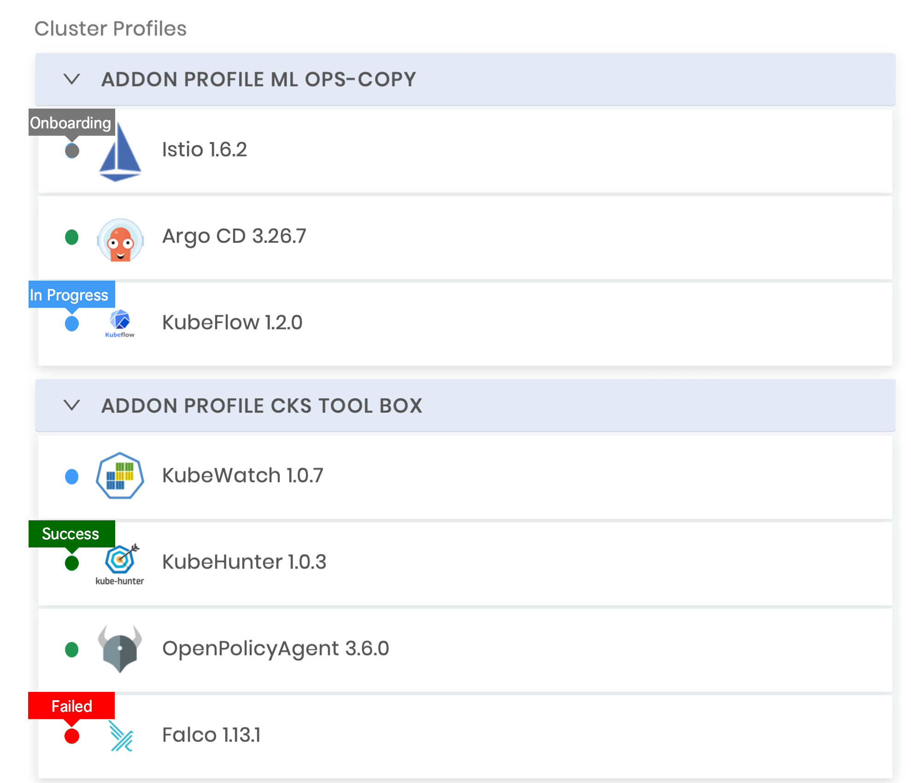

import Tabs from 'shared/components/ui/Tabs';
import WarningBox from 'shared/components/WarningBox';
import InfoBox from 'shared/components/InfoBox';
import PointsOfInterest from 'shared/components/common/PointOfInterest';
import Tooltip from "shared/components/ui/Tooltip";

# Pack Monitoring

You may need a way to monitor which are in progress of installing and which are failed.  When there are just a few packs added to the cluster profile, it is easy to observe its status, but when you have many packs, it gets a little tricky.  

The Cluster Profile page displays the list of packs associated with the cluster you are monitoring. In addition, the page also includes information on the status and the installation progress of the installed packs. The following are the possible pack statuses.

 
 

| **Indicator Status**                 | **Description**                                                     |
| ------------------------------------ | ------------------------------------------------------------------- |
| 
**Gray**
   | The pack is onboarding, and it's right before the deployment stage. |
| 
**Blue**
   | The pack is in processing mode.                                     |
| 
**Green**
 | The pack installation is successful.                                |
| 
**Red**
     | The pack installation has failed.                                   |

 
 

#### Cluster Profiles and Pack Status

 
 

