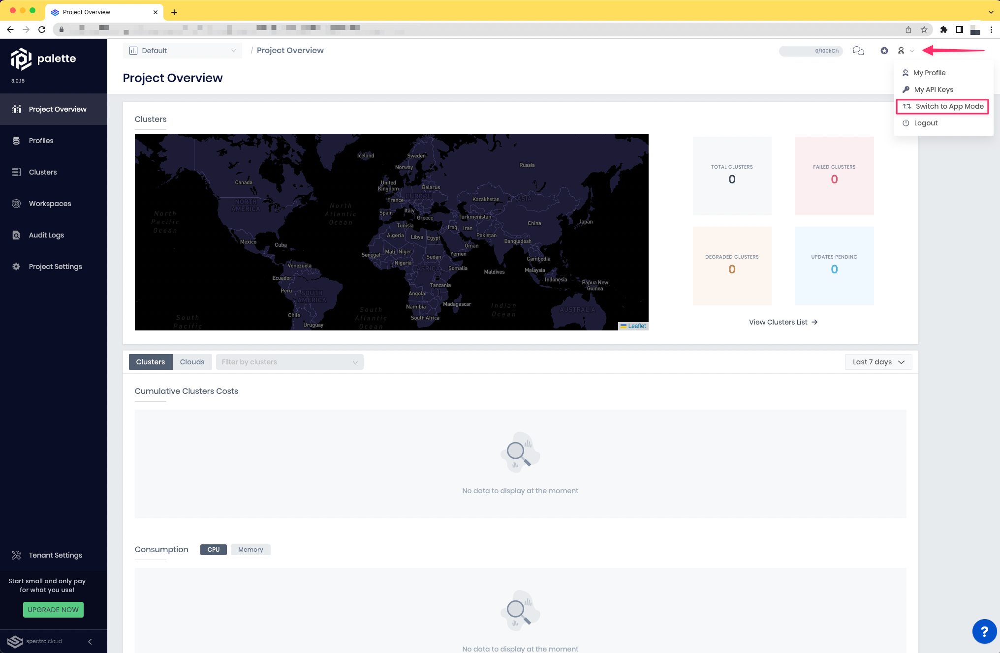

import Tabs from 'shared/components/ui/Tabs';
import WarningBox from 'shared/components/WarningBox';
import InfoBox from 'shared/components/InfoBox';

# Overview

Palette provides two different modes for deploying and managing applications. The first mode is *Cluster Mode* - this mode enables you to create, deploy, and manage Kubernetes clusters and applications. The second mode is *App Mode* - a mode optimized for a simpler and streamlined developer experience that allows you to only focus on the building, maintenance, testing, deployment, and monitoring of your Kubernetes applications. 

You can leverage Spectro Cloud's complimentary managed Kubernetes cluster when using App Mode. The complimentary resources have a limit of 12 vCPU, 16 GiB of memory, and 20 GiB of free storage. Alternatively, you may deploy applications on Kubernetes clusters that belong to your organization and are managed by Palette. 

 

* App Mode: Deploy and manage applications through Palette.
* Cluster Mode: Manage Kubernetes clusters and applications through Palette.

 

# Quick Start with Palette App Mode

Use the following steps to get started with Palette App Mode.

| **Steps**  |          **Description**                                                                                                                              |
|--------|--------------------------------------------------------------------------------------------------------------------------------------   |
| 1      |[Login to Palette](https://console.spectrocloud.com/). You may use your Palette credentials or utilize the Social Sign-in capabilities    |
| 2      |On the right hand-side of the window, click on the User menu. Once the user menu is expanded, click on Switch to App Mode                 |
| 3      |Select an App Profile (we do offer a set of out-of-the-box profiles) or [Create an App Profile](/devx/app-profile) based on your use case|
| 4      |Use the App Profile to [deploy your application](/devx/apps)| 

 

Refer the below links to explore the Palette Dev Engine in depth.

 

* **Sign up to Manage Apps**: As a free tier offering from Palette for Developers to [Quick Overview](/devx/dev-land-explore).

* **Sign up to Manage Clusters**: For [Enterprise Developers](/devx/enterprise-user) full Palette capabilities.
