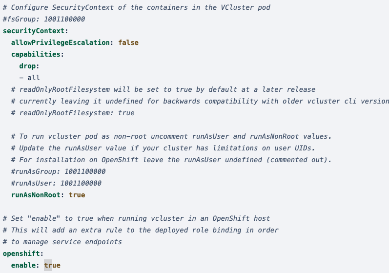

import Tabs from 'shared/components/ui/Tabs';
import InfoBox from 'shared/components/InfoBox';
import WarningBox from 'shared/components/WarningBox';
import PointsOfInterest from 'shared/components/common/PointOfInterest';
import Tooltip from "shared/components/ui/Tooltip";

# Tenant Scope - DevOps Persona

The enterprise developer can create and utilize the Palette compute under the scope of a *Tenant admin*. Once these compute resources are launched and ready to use they can shift to the Palette Dev Engine to explore our developer centric offerings. The creation of Cluster Groups is a deployment under the tenant scope. They can also utilize:

 

* The Cluster Groups available under the Palette [System Scope](/devx/cluster-groups#systemscope).

* The Cluster Groups launched in the [developer's enterprise datacenter/environment](/devx/cluster-groups#tenantscope).

# Cluster Groups

A Cluster Group is an aggregation of host clusters deployed through the Palette Tenant Admin console. Palette Virtual Clusters can be launched into host cluster groups. The cluster groups are created under two scopes:

## System Scope

  * Palette provides a default cluster group called `beehive` at the system scope in the us-east region. 

## Tenant Scope

### Create Your Cluster Group (Tenant Scope) 

To create a Palette Host Cluster Group, you need to [deploy a healthy running Palette host cluster](/clusters) under the *Tenant Admin Scope*.  The host clusters deployed under the Tenant Admin scope can be aggregated as a Palette Host Cluster Group. To create a Palette Host Cluster Group:

 

1. Log in to Palette Console as `Tenant Admin` and select `Cluster Groups` from the right side bar.

2. Click on `+New Cluster Groups` to create a new cluster group and provide the following information to the Cluster Group creation wizard:

   * **Basic Information: **

  |         Parameter           | Description  |
  |-------------------------------|-----------------|
  |Group Name                 | A custom name for the cluster group|
  |Description (optional)   | Description of the group, if any | 
  |Tag (optional)               | Tags on a cluster group are propagated to the cloud/data center environments.|

  * **Add clusters** to the group from the existing tenant scope healthy host clusters.

  * **Cluster Group Configurations:** Two types of configurations needs to be done as below:

    
  **Host Configuration:** The cluster group consists of the ‘n’ number of tenant scope clusters. 
    
|**Host Cluster Config**        |        **Description**                    |
|--------------------------------------|-------------------------------------------|
|Oversubscription (%):                 | Default is 120%, can be customized|
|Cluster endpoint type:                | LB or Ingress|
|Host DNS:                             | If the cluster endpoint selected is Ingress, then for each selected host cluster provide the Host DNS. |

**Note:**  Please ensure that a wildcard DNS record exists that maps the provided Host Pattern to the NGINX Ingress Controller load balancer for this cluster.

   **Palette Virtual Cluster Configuration:** The configuration for clusters launched into the host clusters. This configuration can be done when the Palette Virtual Clusters are getting launched.

 |**Palette Virtual Cluster Resource ** | **Default**   |**Minimum Limit**|
 |------------------------------|-------------------|-----------------|
 |CPU (per request)             | 6                 | 4               |
 | Memory (per request)         | 8 GiB             | 4 GiB           |
 | Storage (per request)        | 10 GiB            | 2 GiB           |

3. Review the settings and deploy the cluster group. The Palette host cluster group is all set to host the Palette Virtual Cluster.

### Manage your Cluster Group

Once the cluster group is created, the day two operations can be performed form the Palette Cluster Group **Settings** options by accessing different cluster management activities. 

### Delete your Cluster Group

To delete a cluster group, select `Delete Cluster form the **Settings** and enter the cluster name, and confirm the delete operation.

### Platforms Supported

* AWS
* EKS
* Azure
* AKS
* VMWare
* OpenShift

<Tabs>
<Tabs.TabPane tab="Configure OpenShift" key="Configure OpenShift">

#### Configure OpenShift 
 
To deploy a virtual cluster on OpenShift:

1. Create a new Cluster Group or edit an existing one and click **Settings**.
2. Select **Settings** in **Cluster Group Settings**.
3. In the **Advanced Config** file, locate the section ``Configure SecurityContext of the containers in the VCluster pod``.

4. Comment out these lines: 

    * ``fsGroup 1001100000``
    * ``runAsGroup 1001100000``
    * ``runAsUser 1001100000``
4. Set ``openshift: enable: true``.
5. Verify these default parameter values are set as follows: 
    * ``allowPrivilegeEscalation: false``
    * ``capabilities: drop: -all``
    * ``runAsNonRoot: true`` 

</Tabs.TabPane> 
</Tabs>
 

### Cluster Import Support

* EKS
* AKS
* GKE

 
