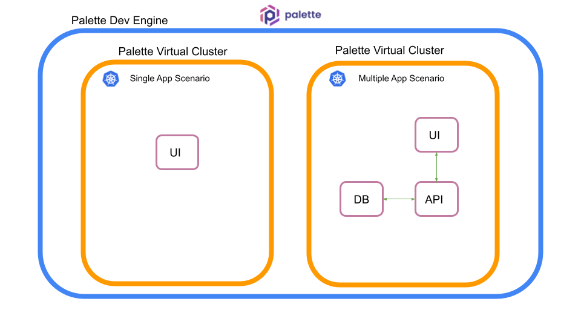
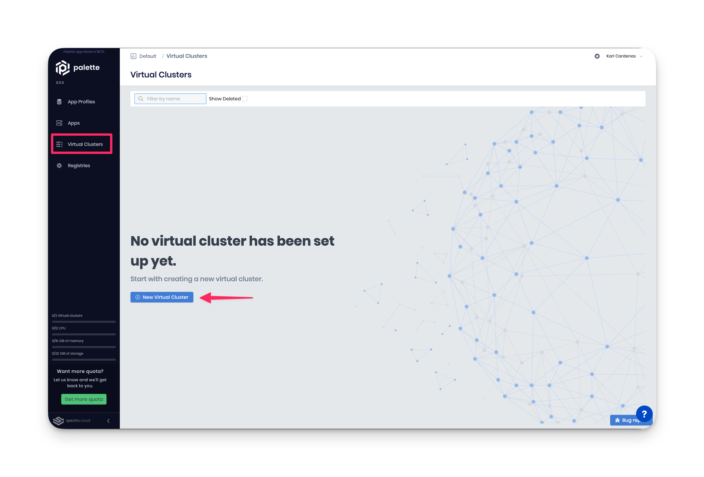
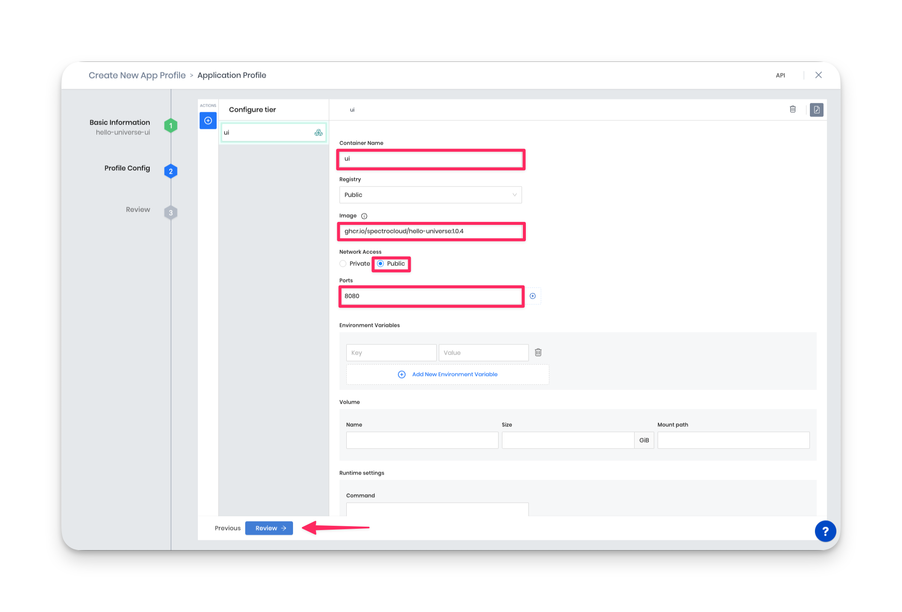
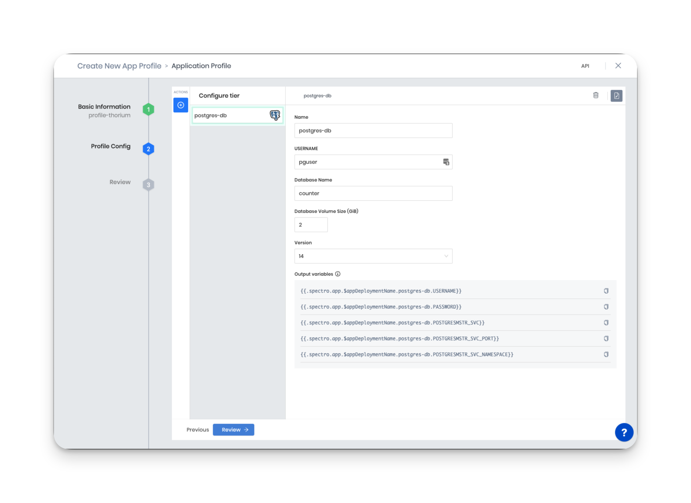
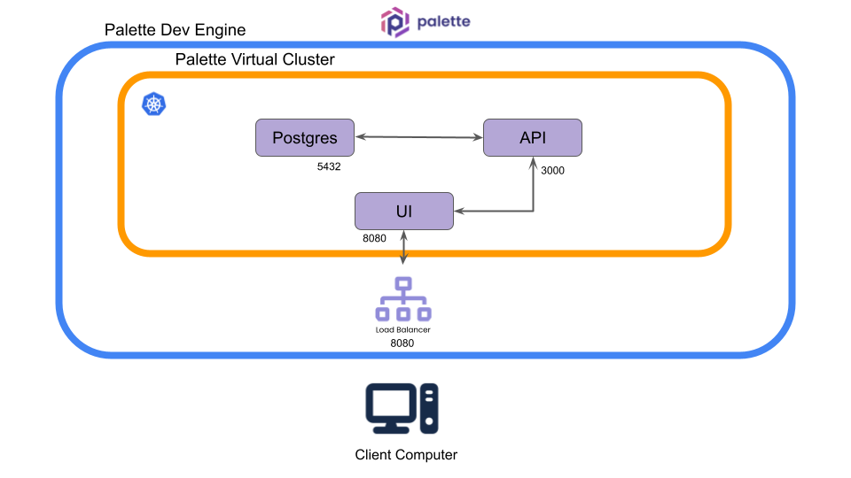
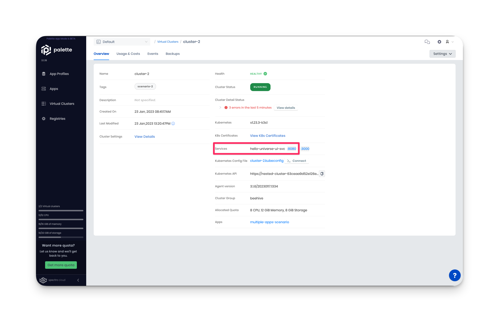
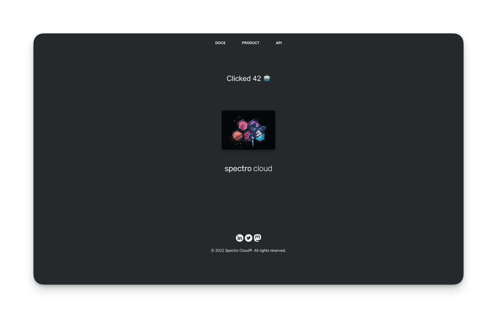
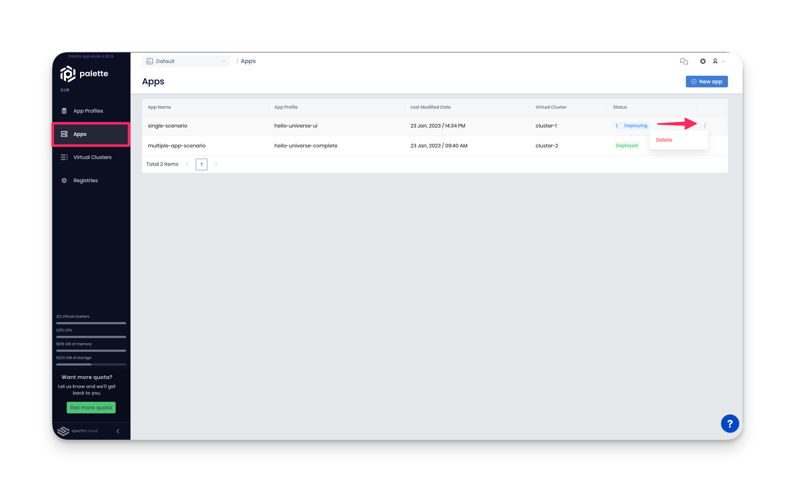

import Tabs from 'shared/components/ui/Tabs';
import InfoBox from 'shared/components/InfoBox';
import WarningBox from 'shared/components/WarningBox';
import PointsOfInterest from 'shared/components/common/PointOfInterest';
import Tooltip from "shared/components/ui/Tooltip";

# Deploy an Application using Palette Dev Engine

Kubernetes is a popular container orchestration system that helps organizations manage and scale their containerized applications. It offers a range of features and tools that allow you to deploy, scale, and manage containerized applications consistently and reliably. Despite its complex architecture and learning curve, Kubernetes offers significant benefits for organizations willing to invest in learning and using this technology.

Palette’s mission is to reduce the challenges you, as a user, face when interacting with Kubernetes. Whether you are a system administrator or an application developer, Kubernetes can introduce overhead that slows down the development process. One of Palette’s core components, *Dev Engine*, focuses on reducing the application development time by enabling builders to deploy applications to Kubernetes with minimal friction. 

In this tutorial, you will learn how to deploy a single application and multiple applications to Kubernetes through Palette’s Dev Engine experience. You will learn about *App Mode*, *App Profiles*, and *Palette Virtual Clusters* and understand how they enable you to deploy applications to Kubernetes quickly with minimal overhead. 

# Prerequisites

To complete this tutorial, you will need the following items.

A Spectro Cloud account
Basic knowledge about Kubernetes and containers.

 If you select the Terraform workflow, you will need the following software installed.
Terraform v1.3.6 or greater
Git v2.30.0 or greater

There are no expenses associated with this tutorial as everything falls under the Palette Free Tier.

# Architecture 

The tutorial includes two scenarios, and for each scenario, you will deploy a separate Kubernetes environment. The following diagram illustrates the different layers that will power the tutorial environment.

The top layer is Palette, which is the product platform. Palette can be used in two modes: app mode or cluster mode. Each mode is intended for different use cases and personas, but for this tutorial, you will use app mode. For an in-depth explanation of each mode’s differences, check out the documentation for [App Mode and Cluster Mode](/introduction/palette-modes). 

# Deploy The Environment

The following steps will guide you through deploying the two scenarios. You will start with the single application scenario to build up your knowledge before deploying the multiple applications scenario.

## Deploy a Single Application 

From Palette, you will deploy two Palette Virtual Clusters. Palette Virtual Clusters will be referred to as virtual clusters for the rest of the tutorial. Each virtual cluster will be hosted on a host cluster group managed by Spectro Cloud, called beehive. You can deploy up to two virtual clusters in the beehive group for free. Each scenario’s virtual cluster will sit on the beehive host cluster group.

 

<InfoBox>

Virtual clusters are standalone Kubernetes environments that sit on top of what you would consider a traditional Kubernetes cluster or host cluster. Palette Virtual Clusters are Kubernetes clusters that run as nested clusters within an existing host cluster and share the host cluster resources, such as CPU, memory, and storage. Palette Virtual Clusters use k3s, a highly available, certified Kubernetes distribution designed for production workloads. Palette Virtual Clusters are also powered by vCluster.

</InfoBox>

You can complete this tutorial by using the Palette console, simulating a manual workflow. Or you may leverage infrastructure as code and complete the tutorial using Terraform.

 

<Tabs>
<Tabs.TabPane tab="UI Workflow" key="UI">

### UI Workflow.

Start by log in to Palette. From the landing page, click on the user **drop-down Menu** and click on **App Mode**.

From the app mode landing page, navigate to the left **Main Menu** and click on **Virtual Clusters**.  Next, click on the button **New Virtual Cluster**

In the following screen, you will be prompted for the cluster group, virtual cluster name, and the cluster size in terms of CPU, memory, and storage. Select beehive for the cluster group, name the cluster cluster-1,  and allocate 4 CPU, 4 GiB memory, and 2 GiB of storage. Click on **Deploy Virtual Cluster** after you have filled out all the required information.

It will take a few minutes for the virtual cluster to deploy. In the meantime, go ahead and navigate to the left **Main Menu** and click on **App Profiles**.

App Profiles are templates that contain all the configurations and settings required to deploy applications to virtual clusters. App Profiles provide a way to drive consistency across virtual clusters as you can re-use app profiles and deploy them to different virtual clusters. You can think of app profiles as declarative templates that inform the Kubernetes cluster of the desired application or set of applications. 

Click on the **New App Profile** button to get started with creating your first app profile. Give the app profile the name `hello-universe-ui` and add the tag `scenario-1`. Click on **Next**. The following screen is the service type selection page. You have the option to deploy applications through containers, Helm, or Manifests. You can also consume services such as databases and more. Click on **Container Deployment**.

Name the container `ui`, select a public registry, and provide the following image URL `ghcr.io/spectrocloud/hello-universe:1.0.7`. Change the network access to **Public** and add the port `8080`

Click on **Review** once you have filled out the provided information. On the next page, click on the **Deploy New App** button. 

It’s time to deploy your app profile containing your application to a virtual cluster.  Go ahead and name the application “single-scenario.” For the **App profile** input field, click on the button to the right of the input field to get a list of all your available app profiles. Select the hello-universe-ui profile and click on **Confirm** to continue.

Next, click the radio button **Deploy in An Existing Palette Virtual Cluster**. Select the cluster-1 you created earlier and click on **Create App** to deploy the app profile onto the virtual cluster.

 

<WarningBox>

If no clusters are available, then **cluster-1** is not yet available. Wait a few more moments and return to the above steps. You can refresh the page, but you must fill out all the required input fields.

</WarningBox>

The app profile deployment takes a few moments to finish. You can review the application's progress by navigating to the left **Main Menu** and clicking on Virtual Clusters. Click on cluster-1 to view its details page.  You can review cluster information, log events, access a remote shell session in the cluster, and more from the cluster details page.

When the application is deployed and ready for use, the **Services** row on the details page will automatically be updated by Palette with the app's public-facing URL. Click on the **:8080** link to view the application.

 

<WarningBox>

It takes between one to three minutes for DNS to properly resolve the public load balancer URL. We recommend waiting a few moments before clicking on the service URL to prevent the browser from caching an unresolved DNS request.
</WarningBox>

Welcome to Hello Universe, a demo application to help you learn more about Palette and its features. Feel free to click on the logo to increase the global counter and for a fun image change. 

You now have deployed your first app profile to Palette. Your first application is a single container application with no dependencies. In a production environment, you often deploy applications that consume other services and require connectivity with other resources. The next scenario expands on the single application scenario by adding an API server and Postgres database to simulate better a common application architecture encountered in a production environment.

## Deploy Multiple Applications 

Go ahead and create another virtual cluster for the multi-application scenario. From the app mode landing page, navigate to the left **Main Menu** and click on **Virtual Clusters**.  Next, click on the button **New Virtual Cluster**

Go ahead and create a cluster with the following details. Select beehive for the cluster group, name **cluster-2**, add the tag **scenario-2**, and allocate 8 CPU, 12 GiB memory, and 8 GiB of storage. Click on **Deploy Virtual Cluster** after you have filled out all the required information. 

It will take a few minutes for the new virtual cluster to deploy. In the meantime, go ahead and navigate to the left **Main Menu** and click on **App Profiles**.

### Postgres

Click on the **New App Profile** button to create your second app profile. Give the app profile the name `hello-universe-complete` and add the tag `scenario-2`. Click on **Next**. This application profile will contain three different applications, and you will create a service configuration for each. The three layers or tiers will together make up the entire application deployment.  The order you create each layer plays an important role as it dictates the deployment order. For this scenario, you will deploy the database, the API, and the UI. Start by creating the first layer by selecting the database service Postgres. 

In the next screen, assign the following values to the Postgres database.

- Name: `postgres-db`
- Username: `pguser`
- Database Name: `counter`
- Database Volume Size: `2`
- Version: `14`

Take notice of the **Output Variables** section. The Postgres service exposes several environment variables to help other applications connect with the database. In the next section, you will use these environment variables and other system environment variables that Palette exposes for each service. You can learn more about environment variables by reviewing the app profile [environment variables](/devx/app-profile/app-profile-macros) documentation. 

Next, navigate to the top left side of the wizard screen and click on the **Actions** button  **+**. Go ahead and select the **Container Deployment**.

### API

The API is available as a container image. To deploy the API successfully, you need to provide the API server with information about the database, such as hostname, database user, database name, and password. The required information can be retrieved using Palette's system environment variables and the environment variables the database service exposes.

Go ahead and provide the container service with the following information:

- Container Name: `api`
- Registry: Public
- Image: `ghcr.io/spectrocloud/hello-universe-api:1.0.6`
- Network Access: Private
- Ports: `3000`

Assign the following environment variables to the API service:

| Parameter        | Value                                                                                                                                                                                                                                                                                                                                                            |
|------------------|----------------------------------------------------------------------------------------------------------------------------------------------------------------------------------------------------------------------------------------------------------------------------------------------------------------------------------------------------------|
| `DB_NAME`        | `counter`                                                                                                                                                                                                                                                                                                                                                    |
| `DB_HOST`        | `{{.spectro.app.$appDeploymentName.postgres-db.POSTGRESMSTR_SVC}}`                                                                                                                                                                                             |
| `DB_PASSWORD`    | `{{.spectro.app.$appDeploymentName.postgres-db.PASSWORD}}`                                                                                                                                                                                                                                                                                              |
| `DB_INIT`        | `true`                                                                                                                                                                                                                                                                                                                                                       |
| `DB_USER`        | `{{.spectro.app.$appDeploymentName.postgres-db.USERNAME}}`                                                                                                                                                                                                                                                                                               |
| `DB_ENCRYPTION`  | `require`                                                                                                                                                                                                                                                                                                                                                      |
| `AUTHORIZATION`  | `true`                                                                                                                                                                                                                                                                                                                                                       |

You can learn more about each environment variable's purpose by reviewing the API server's [documentation](https://github.com/spectrocloud/hello-universe-api#environment-variables). One variable that you should understand in greater detail is the `DB_HOST.` The value of this environment variable is constructed using two variables the Postgres service exposed, followed by the value `svc.cluster.local`. The combined value is the DNS value of the Postgres service container.

 A virtual cluster is a Kubernetes environment, and because it’s a Kubernetes environment, you can use the [Kubernetes DNS](https://kubernetes.io/docs/concepts/services-networking/dns-pod-service/) record created for services and pods. You will have another opportunity to practice this concept when you deploy the UI. 

Once you have filled out all the required information, navigate to the top left side of the wizard screen and click on the **Actions** button  **+**. Go ahead and select the **Container Deployment** to add the final service layer, the UI.

### UI

This time you will use a different container image for the UI that contains a reverse proxy. The reverse proxy is responsible for two important tasks. The first task is to route requests to the API inside the UI container instead of using your browser. The reason behind this behavior is to access the API server that is not publicly exposed. The reverse proxy will pick up the API request and forward it to the API container.  The second task is to insert an authentication token in all requests to the API. The API server configuration you provided earlier enabled authentication, so a Bearer token is required for all requests. The following diagram illustrates the network connectivity path and behavior discussed.

Go ahead and provide the UI container with the following information.
- Container Name: `ui`
- Registry: Public
- Image: `ghcr.io/spectrocloud/hello-universe:1.0.8-proxy`
- Network Access: Public
- Ports: `8080`, `3000`

Assign the following environment variables to the UI service:

| Parameter | Value                                                                                                                                                                                              |
|-----------|----------------------------------------------------------------------------------------------------------------------------------------------------------------------------------------------------|
| `SVC_URI` | `http://{{.spectro.app.$appDeploymentName.api.CONTAINER_SVC}}:{{.spectro.app.$appDeploymentName.api.CONTAINER_SVC_PORT}}` |
| `API_URI` | ???                                                                                                                                                                                                |
| `TOKEN`   | `931A3B02-8DCC-543F-A1B2-69423D1A0B94`                                                                                                                                                             |

If you want to explore the UI's environment variables in greater detail, you can review the UI's [documentation](https://github.com/spectrocloud/hello-universe).  The `SVC_URI` is the API service's Kubernetes DNS value. The hostname is composed of the following pattern `<svc name>.<service namespace>.svc.cluster.local:<service port>`. The `API_URI` is the address of the application load balancer that will be deployed, exposing the ports of the UI service. The `TOKEN` is the authorization token that the reverse proxy will inject inside the UI container for all API requests. Without this token, all API requests will get rejected.

Click on the **Review** button at the bottom of the screen to finalize the app profile. Click on **Deploy New App** in the following screen to deploy the new app profile to cluster-2.

Name the app “multiple-app-scenario,” select the app profile **hello-universe-complete**, pick version **1.0.0** and toggle the radio button **Deploy In An Existing Palette Virtual Cluster**.  Select **cluster-2** and click on **Create App**

 

<WarningBox>

If cluster-2 is unavailable. Wait a few more moments and return to the above steps. You can refresh the page but must fill out all the required input fields.
</WarningBox>

The app profile deployment takes a few moments to finish. You can review the application's progress by navigating to the left **Main Menu** and clicking on Virtual Clusters. Click on **cluster-2** to view its details page.  

The app profile deployment takes a few moments to finish. You can review the application's progress by navigating to the left **Main Menu** and clicking on Virtual Clusters. Click on cluster-2 to view its details page.  

Once the app profile is successfully deployed, the cluster details page will expose the public-facing URLs of the services. 

Click on the UI’s service URL for port 8080 to access the Hello Universe application in a three-tier configuration. 

The global counter is no longer available; instead, you have a counter that starts at zero counts. Each time you click on the center image, the counter is incremented and stored in the Postgres database. Also, keep in mind that the reverse proxy is injecting the Bearer token value in each request sent to the API. 

## Clean-up

To remove all resources created in this tutorial, begin by navigating to the left **Main Menu** and click on the **Apps** link. For each application, click on the **three dots** to expand the options and menu and click on the **Delete** button. Repeat this process for each application.

Next, in the left **Main Menu**, click on the **Cluster** link to access the clusters page. 
Click on **cluster-1** to access its details page. Click on **Settings** from the details page to expand the settings menu. Click on **Delete** to delete the cluster. You will be asked to type in the cluster name to confirm the delete action. Go ahead and type the cluster name to proceed with the delete step.  Repeat this process for cluster-2. 

<InfoBox>

 If a cluster remains in the delete phase for over 15 minutes, it becomes eligible for **Force Delete**. To trigger a force delete, navigate to the respective cluster’s details page and click on **Settings**.  Click on the **Force Delete Cluster** to delete the cluster. 

</InfoBox>

</Tabs.TabPane>
<Tabs.TabPane tab="Terraform" key="terraform">
    WIP
</Tabs.TabPane>

</Tabs>

# Wrap-up