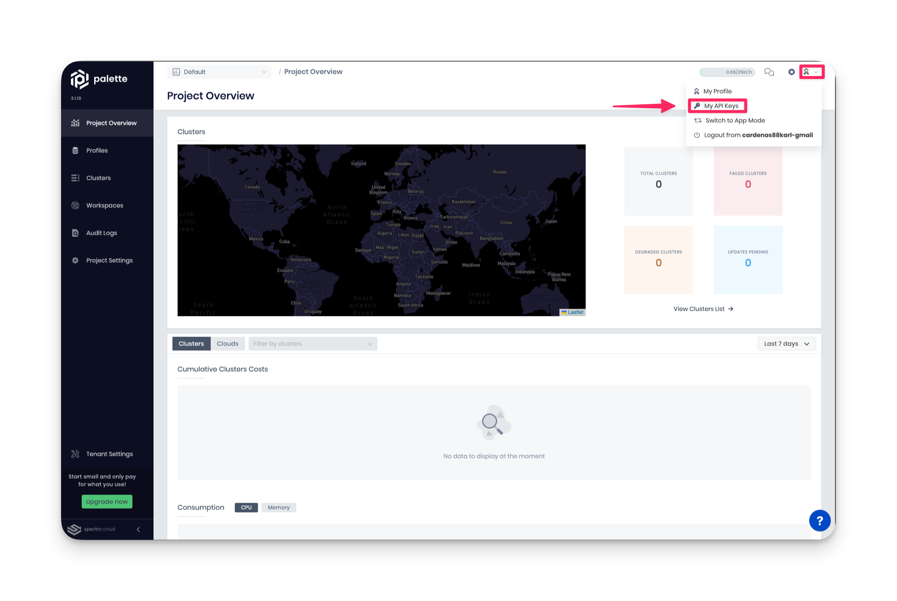

import Tabs from 'shared/components/ui/Tabs';
import InfoBox from 'shared/components/InfoBox';
import WarningBox from 'shared/components/WarningBox';
import PointsOfInterest from 'shared/components/common/PointOfInterest';
import Tooltip from "shared/components/ui/Tooltip";

# Deploy an Application using Palette Dev Engine

Palette’s mission is to reduce the challenges you, as a user, face when interacting with Kubernetes. Whether you are a system administrator or an application developer, Kubernetes can introduce overhead that slows down the development process. One of Palette’s core components, *Dev Engine*, focuses on reducing the application development time by enabling builders to deploy applications to Kubernetes with minimal friction. 

This tutorial will teach you how to deploy single and multiple applications to Kubernetes through Palette’s Dev Engine experience. You will learn about *App Mode*, *App Profiles*, and *Palette Virtual Clusters* and understand how they enable you to deploy applications to Kubernetes quickly with minimal overhead. 

# Prerequisites

To complete this tutorial, you will need the following items.

- A Spectro Cloud account
- Basic knowledge about containers.

<!-- If you select the Terraform workflow, you will need the following software installed.
- Terraform v1.3.6 or greater
- Git v2.30.0 or greater 
- A Spectro Cloud API key. To learn how to create an API key

-->

There are no expenses associated with this tutorial as everything falls under the Palette Free Tier.


# Architecture 

The tutorial includes two scenarios, and for each scenario, you will deploy a separate Kubernetes environment. The following diagram illustrates the different layers that will power the tutorial environment.


The top layer is Palette, which is the product platform. Palette can be used in two modes: app mode or cluster mode. Each mode is intended for different use cases and personas, but for this tutorial, you will use app mode. For an in-depth explanation of each mode’s differences, check out the [App Mode and Cluster Mode](/introduction/palette-modes) documentation.

# Deploy The Environment

The following steps will guide you through deploying the two scenarios. You will start with the single application scenario to build up your knowledge before deploying the multiple applications scenario.


## Deploy a Single Application 

From Palette, you will deploy two Palette Virtual Clusters. Palette Virtual Clusters will be referred to as virtual clusters for the rest of the tutorial. Each virtual cluster will be hosted on a host cluster group managed by us, Spectro Cloud, called *beehive*. You can deploy up to two virtual clusters in the beehive group for free. Each scenario’s virtual cluster will sit on the beehive host cluster group.

<br />

<InfoBox>


Virtual clusters are standalone Kubernetes environments that sit on top of what you would consider a traditional Kubernetes cluster or host cluster. Palette Virtual Clusters are Kubernetes clusters that run as nested clusters within an existing host cluster and share the host cluster resources, such as CPU, memory, and storage. Palette Virtual Clusters use k3s, a highly available, certified Kubernetes distribution designed for production workloads. Palette Virtual Clusters are also powered by vCluster.

</InfoBox>

You can complete this tutorial by using the Palette console, simulating a manual workflow. Or you may leverage infrastructure as code and complete the tutorial using Terraform.

<br />


<Tabs>


<Tabs.TabPane tab="Terraform" key="terraform">


##  Terraform

The [Spectro Cloud Terraform](https://registry.terraform.io/providers/spectrocloud/spectrocloud/latest/docs) provider enables you to create and manage Palette resources in a codified manner by leveraging Infrastructure as Code (IaC). There are many reasons why you would want to utilize IaC. A few reasons worth highlighting are; the ability to automate infrastructure, improve collaboration related to infrastructure changes, self-document infrastructure through codification, and track all infrastructure in a single source of truth. If you need to become more familiar with Terraform, check out the [Why Terraform](https://developer.hashicorp.com/terraform/intro) explanation from HashiCorp. 

<br />

<InfoBox>

As you go through the Terraform workflow, be aware that high-level concepts from Palette will not be discussed in-depth to optimize the reader experience and focus more on the Terraform concepts that apply to Palette. To better understand the mentioned  Palette concepts, review the UI workflow where the concepts are explained in greater detail.

</InfoBox>


Open up a terminal window to begin the tutorial and download the tutorial code from GitHub. 

```shell
git@github.com:spectrocloud/tutorials.git
```

Change directory to the tutorial folder.

```shell
cd tutorials/
```

Checkout the following git tag.

```shell
Git checkout v1.0.0
```

Change directory to the tutorial code.

```shell
cd hello-universe-tf/
```

Before you can get started with the Terraform code, you need a Spectro Cloud API key. 

### API Key

To create an API key, log in to Palette, and click on the user **User Menu** and select **My API Keys**. 



Next, click on **Add New API Key**. Fill out the required input field, **API Key Name**, and the **Expiration Date**. Click on **Confirm** to create the API key. Copy the key value to your clipboard, as you will use it shortly.


### Initialize Terraform

The tutorial folder contains several Terraform files that you should review and explore. Each file is named after the respective type of Palette resource it supports. Use the following list to gain a high-level overview of the files.

<br />

- **provider.tf** - the provider configuration and version of the provider. 
- **inputs.tf** - contains all the Terraform variables and the default values used in the tutorial.
- **outputs.tf** - contains the output variables that are used to expose information.
- **data.tf** - all the data resources that are used to dynamically retrieve data from Palette.
- **virtual-clusters.tf** - the code for the virtual clusters that will be deployed in Palette.
- **application-profiles.tf** - contains the configurations that makeup all the app profiles.
- **application.tf** - the configuration that creates a Spectro Cloud app and deploys the app into a virtual cluster.

The [Spectro Cloud Terraform](https://registry.terraform.io/providers/spectrocloud/spectrocloud/latest/docs) provider requires credentials to interact with the Palette API. Go ahead and export the API key as an environment variable so that the Spectro Cloud provider can authenticate with the Palette API. 

```shell
export SPECTROCLOUD_APIKEY=tKpsmBhv8lFBP0jvMZuBhmppaIQyOH06
```

Next, initialize the Terraform provider by issuing the following command.

```shell
terraform init
```

The `init` command downloads all the required plugins and providers specified in **provider.tf** file. In the provider configuration, the scope or context of Palette is set. The provider is configured for the `Default` project but, you can change this value to point to any other project space you may have in Palette.

<br />

```tf
terraform {
  required_providers {
    spectrocloud = {
      version = ">= 0.11.0"
      source  = "spectrocloud/spectrocloud"
    }
  }
}

provider "spectrocloud" {
  // API key set though the environment variable SPECTROCLOUD_API_KEY
  project_name = "Default"
}
```

To deploy the first scenario, a single application container, you must first create a configuration for the virtual cluster. Look at the virtual cluster resources in **virtual-clusters.tf**, and check out the "cluster-1" resource. The resource specifies the cluster name, the cluster group id, the resource limits, and the tags that will apply to the cluster.

<br />

```tf
resource "spectrocloud_virtual_cluster" "cluster-1" {
  name              = var.scenario-one-cluster-name
  cluster_group_uid = data.spectrocloud_cluster_group.beehive.id

  resources {
    max_cpu           = 4
    max_mem_in_mb     = 4096
    min_cpu           = 0
    min_mem_in_mb     = 0
    max_storage_in_gb = "2"
    min_storage_in_gb = "0"
  }

  tags = concat(var.tags, ["scenario-1"])

  timeouts {
    create = "15m"
    delete = "15m"
  }
}

```

The cluster group id is retrieve from the data resource `spectrocloud_cluster_group.beehive`. The data resource will query the Palette API and retrive information about the specified cluster group, which is the *beehive* cluster group made available for all users of Palette. The virtual cluster this resource will create will be hosted on beehive.

<br />

```tf
data "spectrocloud_cluster_group" "beehive" {
  name    = var.cluster-group-name
  context = "system"
}
```


</Tabs.TabPane>

</Tabs>


# Wrap-Up

In this tutorial, you learned about Palette’s Dev Engine and App Mode. You deployed two virtual clusters, each containing a different architecture and configuration of the Hello Universe application. Palette’s Dev Engine enables developers to quickly deploy applications into a Kubernetes environment without requiring Kubernetes knowledge. In a matter of minutes, you deployed a new Kubernetes cluster and all its applications without having to write Kubernetes configuration files. To learn more about Palette Dev Engine and its capabilities.

<br />

- [Palette Modes](/introduction/palette-modes)
- [App Profiles](/devx/app-profile)
- [App Services]()
- [Palette Virtual Clusters](/devx/palette-virtual-clusters) 
- [Hello Universe GitHub respository](https://github.com/spectrocloud/hello-universe)
