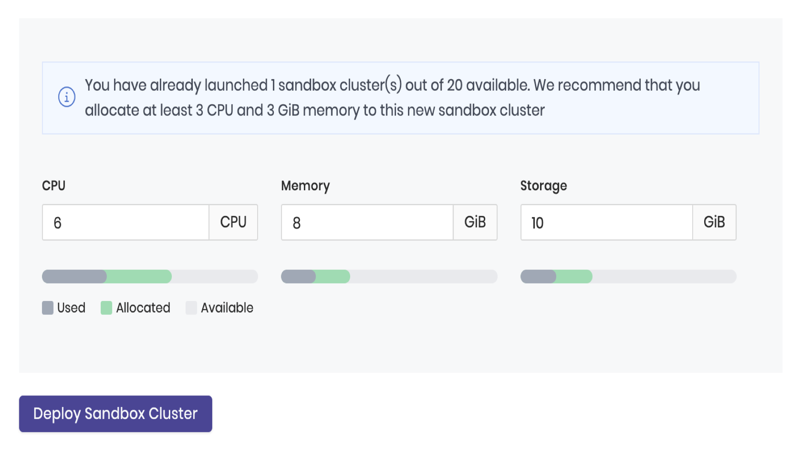

import Tabs from 'shared/components/ui/Tabs';
import InfoBox from 'shared/components/InfoBox';
import WarningBox from 'shared/components/WarningBox';
import PointsOfInterest from 'shared/components/common/PointOfInterest';
import Tooltip from "shared/components/ui/Tooltip";

## Sandbox Clusters

Sandbox Clusters are Kubernetes clusters that run as nested clusters within an existing cluster (also known as a Host Cluster) or Host Cluster groups and share the host cluster resources, such as CPU, memory, and storage. By default, Sandbox Clusters will use k3s as virtual Kubernetes cluster, which is a highly available, certified Kubernetes distribution designed for production workloads.

Palette provisions and orchestrates Sandbox Clusters and makes it easy to use the lightweight, Kubernetes technology stack and tools ecosystem. Deploy Sandbox Clusters on Host Cluster Group as simple as following the wizard and attaching Add-on profiles.

### Create your Sandbox Cluster:

To create your new sandbox cluster:

 

1. Log in to the Palette Dev Engine console

2. Select the `Sandbox Clusters` from the left ribbon menu, click `+ Sandbox Clusters,` and provide the following information to the app creation wizard.
   * Select the Cluster Group: From the available host cluster group, select the cluster group to host the new sandbox cluster.
   * Sandbox cluster name: Provide a custom sandbox cluster name or go with the default name.
   * Provide the resource limit in terms of CPU, memory, and storage. 

  

 |**Sandbox Cluster Resource ** | **Default    **   |**Minimum Limit**|
 |------------------------------|-------------------|-----------------|
 | CPU (per request)            | 6                 | 2.5               |
 | Memory (per request)         | 8 GiB             | 2.5 GiB           |
 | Storage (per request)        | 10 GiB            | 0 GiB           |

 

   * Review the information and deploy the Palette virtual cluster. The Palette virtual cluster will be provisioned within the next few minutes.

 

### Resource Tracking for Palette Virtual Clusters

Palette users can track the available resources within a Cluster Group while launching a virtual cluster. The UI color codes give a rough estimation of available CPU, memory, and storage within the selected Cluster Group. The interpretations are as follows:

 

* **Grey**: Resources already in use.

* **Green**: The resources allocated for the Virtual Cluster under deployment.

* **White**: Resources available within the Cluster Group which can be utilized after deploying the new Virtual Cluster.

### Example Scenario

The example screenshot below illustrates the following scenario. The Cluster Group selected in the example has a virtual cluster already running on it. The info box displays the recommended minimum CPU and memory allocated to the new virtual cluster. The color-coded bar summarizes the used, allocated, and available CPU, storage, and memory within the Cluster Group. Users can use this information to plan resource utilization per available resources. 

 

 
 

