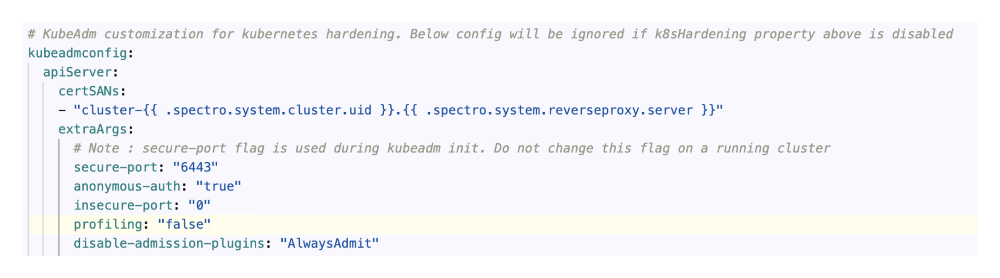

import Tabs from 'shared/components/ui/Tabs';
import WarningBox from 'shared/components/WarningBox';
import InfoBox from 'shared/components/InfoBox';
import PointsOfInterest from 'shared/components/common/PointOfInterest';
import Tooltip from "shared/components/ui/Tooltip";

# Spectro Proxy
Spectro Proxy is a fast and straightforward reverse proxy that lets you forward a port of your local server behind a network address translation (NAT) or firewall to a public server. The proxy server pack is available as an add on pack for authentication. Users can attach this layer to the cluster profile while profile creation. This installs the FRP client in the workload clusters and configures it with a FRP server. Spectro Cloud provides hosts FRP server and by default the pack is configrued to connect to this server. Spectro Cloud detects the presence of this pack in the cluster and automatically updates the Kubeconfig file to use the FRP server as the endpoint. 


## Versions Supported

<Tabs>

<Tabs.TabPane tab="1.2.x" key="1.2.x">

## Prerequisites

- A Spectro Cloud Host Cluster.
- Port 443 exposed outbound communication


## Parameters

The following parameters are supported for the Spectro Proxy.

| Parameter                | Description                                            | Default                                     |
|-------------------------|--------------------------------------------------------|---------------------------------------------|
| namespace               | The Kubernetes namespace to install the Spectro Proxy. | `cluster-{{ .spectro.system.cluster.uid }}` |
| server                  | The Kubernetes server.                                 | `{{ .spectro.system.reverseproxy.server }}` |
| clusterUid              | The Kubernetes cluster identifier.                     | `{{ .spectro.system.cluster.uid }}`         |
| subdomain               | The Kubernetes cluster subdomain identifier.           | `cluster-{{ .spectro.system.cluster.uid }}` |


The Kubernetes dashboard integration supports the followwing parameters.

| Parameter       | Description                                 | Default |
|-----------------|---------------------------------------------|---------|
| enabled         |  Enable the dashboard.                      | `false`   |
| useInsecurePort | Use unsecure port (HTTP) for communication. | `false`   |


## Usage

To enable the 

</Tabs.TabPane>

<Tabs.TabPane tab="1.1.x" key="1.1.x">

**1.1.0**

</Tabs.TabPane>
<Tabs.TabPane tab="1.0.x" key="1.0.x">

**1.0.x**

</Tabs.TabPane>
</Tabs>

**Important Note:**

If the user goes for clusters other than EKS, add the following extra cert SAN values to the Kubernetes pack under apiServer while creating the cluster. 

```json
 certSANs:
 - "cluster-{{ .spectro.system.cluster.uid }}.{{ .spectro.system.reverseproxy.server }}"
```
Example:




# Terraform

The Spectro Proxy pack can be referenced through Terraform with a data resource.

```tf
data "spectrocloud_pack" "spectro-proxy" {
  name    = "spectro-proxy"
  version = "1.2.0"
}
```

# References

- [`spectrocloud_pack`](https://registry.terraform.io/providers/spectrocloud/spectrocloud/latest/docs/data-sources/pack)

