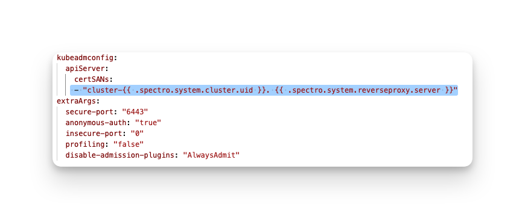
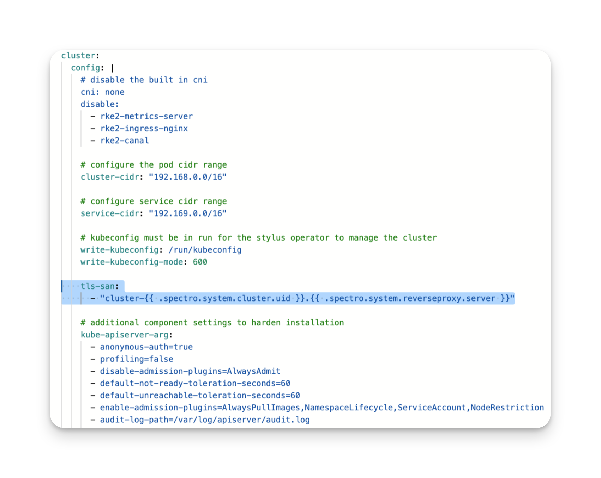

import Tabs from 'shared/components/ui/Tabs';
import WarningBox from 'shared/components/WarningBox';
import InfoBox from 'shared/components/InfoBox';
import PointsOfInterest from 'shared/components/common/PointOfInterest';
import Tooltip from "shared/components/ui/Tooltip";

# Spectro Proxy
Spectro Proxy is a pack that enables the use of a reverse proxy with a Kubernetes cluster. The reverse proxy allows you to connect to the API of a Palette-managed Kubernetes cluster in private networks or clusters configured with private API endpoints. The reverse proxy managed by Spectro Cloud is also known as the forward reverse proxy (FRP).

The reverse proxy has a server component and a client component. The reverse proxy server is publicly available and managed by Spectro Cloud. The client runs inside your Palette-managed Kubernetes cluster and connects to the reverse proxy server. When you add the Spectro Proxy pack to a cluster profile, a couple of things happen:

<br />

- The KubeConfig file is updated with the reverse proxy address instead of pointing directly to the cluster's API address. The following is an example of a kubeconfig file where the `server` attribute points to the reverse proxy.

    ```yaml
    apiVersion: v1
    clusters
    - cluster:
    certificate-authority-dataLSOtLa....
    server: https://cluster-11111111111111.proxy.stage.spectrocloud.com:443
    name: vsphere-proxy
    contexts:
    - context:
    cluster: vsphere-proxy

    ```

- Any requests to the Kubernetes API server, such as kubectl commands, will be routed to the reverse proxy. The reverse proxy forwards the request to the intended client, which is the cluster's API server. The cluster's API server authenticates the request and replies with the proper response.


You can attach this pack to a [cluster profile](/cluster-profiles). The pack installs the Spectro Proxy client in the workload clusters and configures the cluster's API server to point to a managed proxy server. 

<br />

<InfoBox>


This pack can be combined with the [Kubernetes dashboard](https://kubernetes.io/docs/tasks/access-application-cluster/web-ui-dashboard/) pack to expose the Kubernetes dashboard. To learn more about exposing the Kubernetes dashboard, check out the [Enable Kubernetes Dashboard](/clusters/cluster-management/kubernetes-dashboard) guide. 
</InfoBox>


<br />

# Versions Supported

<Tabs>

<Tabs.TabPane tab="1.2.x" key="1.2.x">

## Prerequisites

- Outbound internet connectivity for port 443 is allowed so that you and your applications can connect with the Spectro Cloud reverse proxy.


## Parameters

The Spectro Proxy supports the following parameters.

| Parameter                | Description                                            | Default                                     |
|-------------------------|--------------------------------------------------------|---------------------------------------------|
| namespace               | The Kubernetes namespace to install the Spectro Proxy. | `cluster-{{ .spectro.system.cluster.uid }}` |
| server                  | The Kubernetes server.                                 | `{{ .spectro.system.reverseproxy.server }}` |
| clusterUid              | The Kubernetes cluster identifier.                     | `{{ .spectro.system.cluster.uid }}`         |
| subdomain               | The Kubernetes cluster subdomain identifier.           | `cluster-{{ .spectro.system.cluster.uid }}` |


The Kubernetes dashboard integration supports the following parameters.

| Parameter       | Description                                 | Default |
|-----------------|---------------------------------------------|---------|
| enabled         |  Enable the dashboard.                      | `false`   |
| useInsecurePort | Use unsecure port (HTTP) for communication. | `false`   |


## Usage

To use this pack, you have to add it to your cluster profile.  You can also add the Spectro Proxy pack when you create the cluster profile. Check out the [Create Cluster Profile](/cluster-profiles/task-define-profile) guide to learn more about cluster profile creation.

Depending on the type of cluster, the usage guidance varies. Select the tab that corresponds to the kind of cluster you have. Use the following definitions to help you identify the type of cluster.

<br />


- **Palette Deployed**: A brand new IaaS cluster that is deployed or will be deployed through Palette. An IaaS cluster is a Kubernetes cluster with a control plane that is not managed by a third party or cloud vendor but is completely managed by Palette. Google GKE and Tencent TKE fall into this category. Clusters in this category get an additional entry in the Kubernetes configuration that adds the reverse proxy certificate (CA) to the API server configuration.  

<br />

- **Imported Cluster**: An imported cluster or a non-IaaS cluster with a control plane that a third party manages. Azure AKS and AWS EKS fall in this category, as both Palette and the cloud provider partially manage the clusters. Clusters that fall under this category get the default kubeconfig  CA replaced with the CA from the proxy server. Additionally, the kubeconfig authentication method is changed to a bearer token. To support the bearer token method, a new service account is created in the cluster with a role binding that allows Kubernetes API requests to pass through the reverse proxy and connect with the cluster API server.


<Tabs>

<Tabs.TabPane tab="Palette Deployed" key="palette-deployed">


<br />

<WarningBox>


Be aware that if this pack is added as a day-2 operation, meaning not during the cluster creation process, you will have to re-download the kubeconfig file to pick up the new configuration changes. This will also result in Kubernetes control plane nodes getting repaved.

</WarningBox>

Add the following extra certificate Subject Alternative Name (SAN) value to the Kubernetes pack under the `apiServer` parameter section. 

<br />

```yaml
certSANs:
  - "cluster-{{ .spectro.system.cluster.uid }}.{{ .spectro.system.reverseproxy.server }}"
```

The following is an example configuration of the Kubernetes Pack manifest getting updated with the certificate SAN value:




For RKE2 and K3s edge-native clusters, add the following configuration to the Kubernetes pack under the `cluster.config` parameter section.
<br />

```yaml
tls-san:
  - "cluster-{{ .spectro.system.cluster.uid }}.{{ .spectro.system.reverseproxy.server }}"
```



<br />


</Tabs.TabPane>
<Tabs.TabPane tab="Imported Cluster" key="imported-cluster">

<br />

<WarningBox>


Be aware that if this pack is added as a day-2 operation, meaning not during the cluster creation process, you will have to re-download the kubeconfig file to pick up the new configuration changes. 

</WarningBox>


Add the Spectro Proxy pack to a cluster profile without making any configuration changes. Use the pack as is.

</Tabs.TabPane>

</Tabs>

<InfoBox>

Set the parameter `k8sDashboardIntegration.enabled` to true if you intend to expose the Kubernetes dashboard. 
Review the [Enable Kubernetes Dashboard](/clusters/cluster-management/reverse-proxy-dashboard) guide for more information.

</InfoBox>


</Tabs.TabPane>
<Tabs.TabPane tab="1.1.x" key="1.1.x">


## Prerequisites

- Outbound internet connectivity for port `443` is allowed so that you and your applications can connect with the Spectro Cloud reverse proxy. 


## Parameters

The Spectro Proxy supports the following parameters.

| Parameter                | Description                                            | Default                                     |
|-------------------------|--------------------------------------------------------|---------------------------------------------|
| namespace               | The Kubernetes namespace to install the Spectro Proxy. | `cluster-{{ .spectro.system.cluster.uid }}` |
| server                  | The Kubernetes server.                                 | `{{ .spectro.system.reverseproxy.server }}` |
| clusterUid              | The Kubernetes cluster identifier.                     | `{{ .spectro.system.cluster.uid }}`         |
| subdomain               | The Kubernetes cluster subdomain identifier.           | `cluster-{{ .spectro.system.cluster.uid }}` |


The Kubernetes dashboard integration supports the following parameters.

| Parameter       | Description                                 | Default |
|-----------------|---------------------------------------------|---------|
| enabled         |  Enable the dashboard.                      | `false`   |
| useInsecurePort | Use unsecure port (HTTP) for communication. | `false`   |

## Usage

To use this pack, you have to add it to your cluster profile.  You can also add the Spectro Proxy pack when you create the cluster profile. Check out the [Create Cluster Profile](/cluster-profiles/task-define-profile) guide to learn more about cluster profile creation.

Depending on the type of cluster, the usage guidance varies. Select the tab that corresponds to the kind of cluster you have. Use the following definitions to help you identify the type of cluster.

<br />


- **Palette Deployed**: A brand new IaaS cluster that is deployed or will be deployed through Palette. An IaaS cluster is a Kubernetes cluster with a control plane that is not managed by a third party or cloud vendor but is completely managed by Palette. Google GKE and Tencent TKE fall into this category. Clusters in this category get an additional entry in the Kubernetes configuration that adds the reverse proxy certificate (CA) to the API server configuration.  

<br />

- **Imported Cluster**: An imported cluster or a non-IaaS cluster with a control plane that a third party manages. Azure AKS and AWS EKS fall in this category, as both Palette and the cloud provider partially manage the clusters. Clusters that fall under this category get the default kubeconfig  CA replaced with the CA from the proxy server. Additionally, the kubeconfig authentication method is changed to a bearer token. To support the bearer token method, a new service account is created in the cluster with a role binding that allows Kubernetes API requests to pass through the reverse proxy and connect with the cluster API server.


<Tabs>

<Tabs.TabPane tab="Palette Deployed" key="palette-deployed">


<br />

<WarningBox>


Be aware that if this pack is added as a day-2 operation, meaning not during the cluster creation process, you will have to re-download the kubeconfig file to pick up the new configuration changes. This will also result in Kubernetes control plane nodes getting repaved.

</WarningBox>

Add the following extra certificate Subject Alternative Name (SAN) value to the Kubernetes pack under the `apiServer` parameter section. 
<br />

```yaml
certSANs:
  - "cluster-{{ .spectro.system.cluster.uid }}.{{ .spectro.system.reverseproxy.server }}"
```

The following is an example configuration of the Kubernetes Pack manifest getting updated with the certificate SAN value:


For RKE2 and K3s edge-native clusters, add the following configuration to the Kubernetes pack under the `cluster.config` parameter section.
<br />

```yaml
tls-san:
  - "cluster-{{ .spectro.system.cluster.uid }}.{{ .spectro.system.reverseproxy.server }}"
```


<br />


</Tabs.TabPane>
<Tabs.TabPane tab="Imported Cluster" key="imported-cluster">

<br />

<WarningBox>


Be aware that if this pack is added as a day-2 operation, meaning not during the cluster creation process, you will have to re-download the kubeconfig file to pick up the new configuration changes. 

</WarningBox>


Add the Spectro Proxy pack to a cluster profile without making any configuration changes. Use the pack as is.

</Tabs.TabPane>

</Tabs>

<InfoBox>

Set the parameter `k8sDashboardIntegration.enabled` to true if you intend to expose the Kubernetes dashboard. 
Review the [Enable Kubernetes Dashboard](/clusters/cluster-management/reverse-proxy-dashboard) guide for more information.

</InfoBox>


</Tabs.TabPane>
<Tabs.TabPane tab="1.0.x" key="1.0.x">

## Prerequisites

- Outbound internet connectivity for port `443` is allowed so that you and your applications can connect with the Spectro Cloud reverse proxy.


## Parameters

The Spectro Proxy supports the following parameters.

| Parameter                | Description                                            | Default                                     |
|-------------------------|--------------------------------------------------------|---------------------------------------------|
| namespace               | The Kubernetes namespace to install the Spectro Proxy. | `cluster-{{ .spectro.system.cluster.uid }}` |
| server                  | The Kubernetes server.                                 | `{{ .spectro.system.reverseproxy.server }}` |
| clusterUid              | The Kubernetes cluster identifier.                     | `{{ .spectro.system.cluster.uid }}`         |
| subdomain               | The Kubernetes cluster subdomain identifier.           | `cluster-{{ .spectro.system.cluster.uid }}` |


## Usage

To use this pack, you have to add it to your cluster profile.  You can also add the Spectro Proxy pack when you create the cluster profile. Check out the [Create Cluster Profile](/cluster-profiles/task-define-profile) guide to learn more about cluster profile creation.

Depending on the type of cluster, the usage guidance varies. Select the tab that corresponds to the kind of cluster you have. Use the following definitions to help you identify the type of cluster.

<br />


- **Palette Deployed**: A brand new IaaS cluster that is deployed or will be deployed through Palette. An IaaS cluster is a Kubernetes cluster with a control plane that is not managed by a third party or cloud vendor but is completely managed by Palette. Google GKE and Tencent TKE fall into this category. Clusters in this category get an additional entry in the Kubernetes configuration that adds the reverse proxy certificate (CA) to the API server configuration.  

<br />

- **Imported Cluster**: An imported cluster or a non-IaaS cluster with a control plane that a third party manages. Azure AKS and AWS EKS fall in this category, as both Palette and the cloud provider partially manage the clusters. Clusters that fall under this category get the default kubeconfig  CA replaced with the CA from the proxy server. Additionally, the kubeconfig authentication method is changed to a bearer token. To support the bearer token method, a new service account is created in the cluster with a role binding that allows Kubernetes API requests to pass through the reverse proxy and connect with the cluster API server.


<Tabs>

<Tabs.TabPane tab="Palette Deployed" key="palette-deployed">


<br />

<WarningBox>


Be aware that if this pack is added as a day-2 operation, meaning not during the cluster creation process, you will have to re-download the kubeconfig file to pick up the new configuration changes. This will also result in Kubernetes control plane nodes getting repaved.

</WarningBox>

Add the following extra certificate Subject Alternative Name (SAN) value to the Kubernetes pack under the `apiServer` parameter section. 
<br />

```yaml
certSANs:
  - "cluster-{{ .spectro.system.cluster.uid }}.{{ .spectro.system.reverseproxy.server }}"
```

The following is an example configuration of the Kubernetes Pack manifest getting updated with the certificate SAN value:


For RKE2 and K3s edge-native clusters, add the following configuration to the Kubernetes pack under the `cluster.config` parameter section.
<br />

```yaml
tls-san:
  - "cluster-{{ .spectro.system.cluster.uid }}.{{ .spectro.system.reverseproxy.server }}"
```


<br />


</Tabs.TabPane>
<Tabs.TabPane tab="Imported Cluster" key="imported-cluster">

<br />

<WarningBox>


Be aware that if this pack is added as a day-2 operation, meaning not during the cluster creation process, you will have to re-download the kubeconfig file to pick up the new configuration changes. 

</WarningBox>


Add the Spectro Proxy pack to a cluster profile without making any configuration changes. Use the pack as is.

</Tabs.TabPane>

</Tabs>

<InfoBox>

Set the parameter `k8sDashboardIntegration.enabled` to true if you intend to expose the Kubernetes dashboard. 
Review the [Enable Kubernetes Dashboard](/clusters/cluster-management/reverse-proxy-dashboard) guide for more information.

</InfoBox>


</Tabs.TabPane>
</Tabs>


# Troubleshooting

Troubleshooting scenarios related to the Spectro Proxy.
<br />

### x509 Unknow Authority Error

If you encounter an x509 unknown authority error when deploying a cluster with the Spectro Proxy.

<br />

```shell
Unable to connect to connect the server: X509: certiticate signed by unknown authorit signed by
```

The workaround for this error is to wait a few moments for all the kubeconfig configurations to get propagted to Palette. The Palette cluster agent sends the original kubeconfig to Palette, followed by the modified kubeconfig containing the reverse proxy settings. If you attempt to open up a web shell session or interact with cluster API during the initialization process, you will receive an x509 error. Once Palette receives the kubeconfig file containing the cluster's reverse proxy configurations from the cluster agent, the x509 errors will disappear.


# Terraform

You can reference the Spectro Proxy pack in Terraform with a data resource.

```tf
data "spectrocloud_registry" "public_registry" {
  name = "Public Repo"
}

data "spectrocloud_pack_simple" "spectro-proxy" {
  name    = "spectro-proxy"
  version = "1.2.0"
  type = "operator-instance"
  registry_uid = data.spectrocloud_registry.public_registry.id
}
```

# References

- [Enable Kubernetes Dashboard](/clusters/cluster-management/reverse-proxy-dashboard)

- [Terraform Data Resource](https://registry.terraform.io/providers/spectrocloud/spectrocloud/latest/docs/data-sources/pack)

