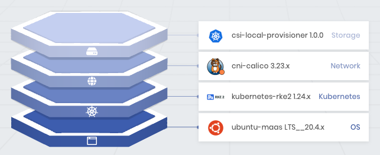

import Tabs from 'shared/components/ui/Tabs';
import WarningBox from 'shared/components/WarningBox';
import InfoBox from 'shared/components/InfoBox';
import PointsOfInterest from 'shared/components/common/PointOfInterest';
import Tooltip from "shared/components/ui/Tooltip";

# RKE2 Overview

RKE2 is the next iteration of Rancher Kubernetes distribution that focuses on security and compliance and within the U.S. Federal Government datacenters.

To meet the Kubernetes security and compliance goals required by the U.S. Federal Government, RKE2 establishes the following:

 

1. Provides defaults and configuration options that allow clusters to pass the CIS Kubernetes Benchmark v1.6 with minimal operator intervention.

 

2. Enables Federal Information Processing Standard 140-2 (FIPS 140-2) compliance.

 

3. Scans components regularly for Common Vulnerabilities and Exposures (CVEs) using Trivy in the build pipeline.

 

Combined with the best of K3s and RKE1 features, RKE2 launches control plane components as static pods, managed by the kubelet instead of relying on Docker. Moreover, the embedded container runtime is containerd.

Palette has made using RKE2 simple by incorporating it as a Pack. With a few clicks, RKE2 can be set while creating a Palette-specific cluster profile.

Once the cluster profile is created, users can deploy RKE2-based, Kubernetes clusters through the Palette console.

# Versions Supported

The following RKE2 versions are supported to work with Palette.

 

<Tabs>
<Tabs.TabPane tab="RKE2 1.24.x" key="k8s_rke2_v1.24.x">

* **k8s_rke2_1.24.3**

 

</Tabs.TabPane>
<Tabs.TabPane tab="RKE2 1.23.x" key="k8s_rke2_1.23.x">

* **k8s_rke2_1.23.9**

 

</Tabs.TabPane>
<Tabs.TabPane tab="RKE2_1.22.x" key="k8s_rke2_1.22.x">

* **k8s_rke2_1.22.12**

 

</Tabs.TabPane>
</Tabs>

# Prerequisites

- Ensure you have two different hostnames. If all your nodes have the same hostname, set the node-name parameter in the RKE2 config file for each node you add to the cluster to ensure you have a different node name.

 

- Use a solid-state storage device (SSD) when possible to ensure optimal performance.

 

- Linux

 
    - RAM - 4 GB Minimum (we recommend at least 8 GB)

 
    - CPU - 2 Minimum (we recommend at least 4CPU)

 
    - Ports - The RKE2 server needs port 6443 and 9345 to be accessible by other nodes in the cluster.

 
    - Nodes - All nodes need to be able to reach other nodes over UDP port 8472 when Flannel VXLAN is used.

 

- You will need access to a Palette Account. Refer to the [Getting Started with Palette](/getting-started). 

 

- Ensure you have a functioning cluster ready and configured. Refer to the [New Clusters](/clusters/new-clusters) page for more information.

 

# Deploying an RKE2 Cluster on Palette

1. To begin the setup, create a Cluster Profile. For steps on how to create a Cluster Profile, see the [Cluster Profile](/cluster-profiles/task-define-profile) page.

 

2. Select the layers for provisioning the first cluster profile. Complete the entries for each layer as follows:

   **Operating System Layer**
    1. From the Registry dropdown, select **Public Repro**.
    2. Select the **Ubuntu** image listed under the Public Registry.
    3. Pick the Pack Version and then, continue to the **Next Layer**.

 

   **Kubernetes Layer**
    1. From the Registry dropdown, select **Public Repro**.
    2. Select the **RKE2** pack listed under Pack Name.
    3. Pick the Pack Version and then, continue to the **Next Layer**.

 

   **Network Layer**
    1. From the Registry dropdown, select **Public Repro**.
    2. Select the **Calico** or **Cilium Enterprise** Pack Name.
    3. Pick the Pack Version and then, continue to the **Next Layer**.

 

   **Storage Layer**
    1. From the Registry dropdown, select **Public Repro**.
    2. Select your storage provisioner under Pack name. The most common are CNI or CSI.
    3. Pick the Pack Version and then, continue to the **Next Layer**.

 

 

1. Click **Finish Configuration** to complete the Cluster Profile creation wizard.

 

2. Create a new cluster as specified in the [New Cluster](/clusters/new-clusters) page. 
    **Note**: Palette is supporting the following two Infrastructure providers for RKE2--MAAS and VMware.

 

3. You will be able to confirm and view the Cluster Details Status from the Overview page and the cluster is provisioning.

 

## References

[RKE2](https://docs.rke2.io)

[RKE2 on GitHub](https://github.com/rancher/rke2)
