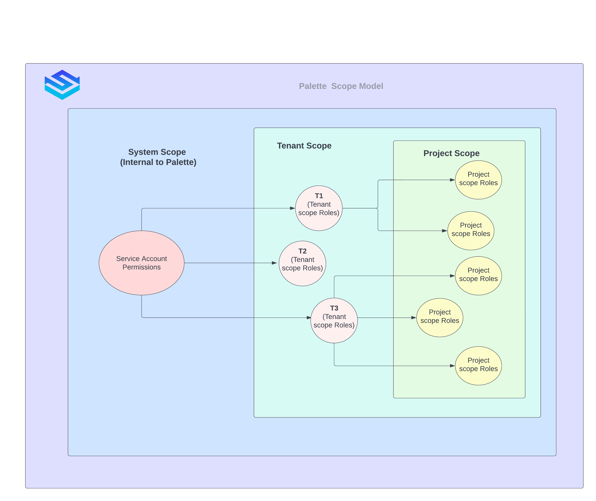

import Tabs from 'shared/components/ui/Tabs';
import WarningBox from 'shared/components/WarningBox';
import InfoBox from 'shared/components/InfoBox';
import PointsOfInterest from 'shared/components/common/PointOfInterest';

# Role-Based Access Control(RBAC)
## Overview

RBAC stands for Role-Based Access Control. RBAC allows a single user to have different types of access control based on the resource being accessed. RBAC is the scenario that allows the Tenant Admin to grant full and unrestricted access to some parts of the system and withhold it for some others. 

Palette enforces a very well-structured RBAC design on how to grant granular access to resources and their operations within our management console. Role-based access control primarily assigns permissions to roles instead of individual users. We maintain precise Roles and Resource Access Control List. Role-based access control primarily focuses on assigning permissions to roles instead of individual users and then assigning these roles to users. Multiple roles can be assigned to a user, which defines the permitted actions on the resource. This module lists and enumerates all the roles available within the Palette console and the scope and status. 

Palette enables:

* A role can have multiple permissions. We encourage custom role creation, coupling the wide range of Palette permissions.

* Multiple roles can be assigned to a single user, defining the permitted actions on the resource. 

## Palette RBAC Model
The Palette RBAC Model, is based on the following three components:
* Scopes
* Permissions
* Roles

### Scopes

A Scope defines the resources on which the role has coverage. The Scope will be either Tenant or Project. For example, a Role with the Scope Project can operate within the projects. A combination of the user and the roles given to a user indicates the totality of the accesses made available to that user. Scopes are structured in a parent-child relationship. Each level of hierarchy makes the scope more specific. The roles are assigned at any of these levels of scope. The level you select determines how widely the role is applied. Lower levels inherit role permissions from higher levels.

 
The following are the major properties of Palette driven Scopes:
* Scopes control the visibility of the resource
* Resource created in the higher scope will be visible in the lower scope as read-only. Cluster Profiles created by a tenant will be available to all the projects created by that Tenant.
* Resource Isolation: Resources within the same scope will be restricted to the respective scope entity.
    * Cluster Profile created in project-1 will not be available in project-2 of the same tenant
* Resource with the same name can co-exist across scopes and will be distinguished with scope prefix (icon)
  * A profile with the same name can be created in tenant and project scope. The resource will have the scope information, which helps to distinguish them.

Palette resources can be allocated to Roles under 3 Scopes:
* System (The service accounts internal to Palette)
* Tenant
* Project

### Permission
Permission determine the type of operations allowed on a resource. Permissions can be defined in the following format:

`component.operation’ 

Examples:

*  `Cluster.create`
*  `cluster.edit`
*  `cluster.activate`

Each Permission has a defined scope. The Role creation is limited based on scope, type and permissions.

### Roles
A Role is a collection of permissions. When a role is assigned to a user, it means all the permissions the role contains are assigned to that user. The Role will have a **Type** and a **Scope**. The Type signifies the creator's scope and the Scope signifies the role visibility. The permissions will be restricted to the permission's scope list based on the role's scope. The ProfileEditor will be visible under Tenant, but neither the Tenant nor the Project admins are allowed to modify the Project Scopes. 

 

## Access Modes
* Tenant
* Project

### Tenant
Tenant is an isolated workspace within the Palette. Users and Teams with specific Roles can be associated with the Tenant(s) you create. **[Link to tenant permissions page]**
Everyone is a user. User with SuperAdmin role will become SuperAdmin and similarly Tenant
 

### Project

The Global Project Scope holds a group of resources, in a logical grouping, to a specific project. The project acts as a namespace for resource management. Users and Teams with specific Roles can be associated with the Project, Cluster, or Cluster Profile you create. Users are members of a tenant who are assigned [project scope roles](/user-management/palette-rbac/project-scope-roles-permissions#globalprojectscope) that control their access within the platform.
 

## Palette Specific Default Roles:

### Tenant Scope Default Roles:

The Global Tenant Scope holds all the tenant resources of Palette. The list of Role types within the Tenant Scope are as follows:
 

1. [Tenant Administrator Role](/user-management/palette-rbac/tenant-scope-roles-permissions#tenantadmin)

2. [Tenant Viewer Role](/user-management/palette-rbac/tenant-scope-roles-permissions#tenantviewer)

3. [Tenant Project Admin Role](/user-management/palette-rbac/tenant-scope-roles-permissions#tenantprojectadmin)

4. [Tenant Cluster Profile Admin Role](/user-management/palette-rbac/tenant-scope-roles-permissions#tenantclusterprofileadmin)

3. [Tenant Role Admin Role](/user-management/palette-rbac/tenant-scope-roles-permissions#tenantroleadminrole)

4. [Tenant Team Admin Role](/user-management/palette-rbac/tenant-scope-roles-permissions#tenantteamadmin)

5. [Tenant User Admin Role](/user-management/palette-rbac/tenant-scope-roles-permissions#tenantuseradminrole)

### Project Scope Default Roles:

The Global Project Scope holds a group of resources in a logical grouping. Users and Teams with specific Roles can be associated with the Project(s) you create. Below is a list of Role types within the Project Scope built in to the Palette console. These Roles can neither be deleted nor edited. 
 
 

1. [Project Administrator Role](/user-management/palette-rbac/project-scope-roles-permissions#projectadmin)

2. [Project Editor Role](/user-management/palette-rbac/project-scope-roles-permissions#projecteditor)

3. [Project Viewer Role](/user-management/palette-rbac/project-scope-roles-permissions#projectviewer)

4. [Cluster Profile Admin Role](/user-management/palette-rbac/project-scope-roles-permissions#clusterprofileadmin)

5. [Cluster Profile Editor Role](/user-management/palette-rbac/project-scope-roles-permissions#clusterprofileeditor)

6. [Cluster Profile Viewer Role](/user-management/palette-rbac/project-scope-roles-permissions#clusterprofileviewer)

7. [Cluster Admin Role](user-management/palette-rbac/project-scope-roles-permissions#clusteradmin)

8. [Cluster Editor Role](/user-management/palette-rbac/project-scope-roles-permissions#clustereditor)

9. [Cluster Viewer Role](/user-management/palette-rbac/project-scope-roles-permissions#clusterviewer)

10. [Cloud Account Admin Role](/user-management/palette-rbac/project-scope-roles-permissions#clusteraccountadmin)

11. [Cloud Account Editor Role](/user-management/palette-rbac/project-scope-roles-permissions#clusteraccounteditor)

12. [Cloud Account Viewer Role](/user-management/palette-rbac/project-scope-roles-permissions#clusteraccountviewer)

13. [Workspace Admin Role](/user-management/palette-rbac/project-scope-roles-permissions#workspaceadmin)

14. [Workspace Operator Role](/user-management/palette-rbac/project-scope-roles-permissions#workspaceoperator)
 

## Assign Palette Specific Roles to Users

The Default (built-in) roles of Palette system can be directly assigned to a user. 

1. Login to Palette console as `Tenant Admin`.

2. Select **Users and Teams** from the left ribbon menu to list the [created users](/user-management#rolesandpermissions).

3. From the list of users **select the user** to be assigned with role to open the role addition wizard.

4. Make the choice of role category from the top tabs:
    * Project Role
    * Tenant Role
    * Workspace Role

5. Once the choice of category is made Click on **+ New Role**.

6. In the **Add Roles to User-name** wizard, select the project name from the drop down and select the roles from the list.

7. Confirm to complete the wizard.

8. The role user association can be edited and deleted from the `kebab menu`.

 

## Custom Roles in Palette
Palette enables the users to have custom Roles. These custom roles can be created either under the Tenant Scope or the Project Scope, but not both. These roles need to have unique names for identification. The names are case-insensitive which means, a role name KEY_MANAGER is the same as key_manager. To create custom role in Palette Platform, we need to understand the components and operations in the Palette Platform enumerated as a `Resource Scope Matrix` as below:

 
 

### Resource Scope Matrix

|Component|Resource Key|Operations|Scope|Usage|
|---------|------------|----------|-----|-----|
|API Key Permission|API Key|create  get, list, update, delete|Tenant|API Key related operations|
|Appliance Permissions|Edge Appliance|create,get,list,update,delete|Project|Edge appliance deployment and management|
|Audit Permissions|Audit Logs|get, list|Tenant Project|Audit Log access|
|Cloud Account Permissions|Cloud Account|create, get,list,update,delete|Tenant Project|Cloud account creation and management|
|Cloud Config Permissions|Cloud Configuration|create,update,delete,get,list|Project|Cloud Configuration |
|Cluster Permissions|Cluster|create,get,list,update,delete|Project|Creation and management of Palette workload clusters|
|Cluster Profile Permissions|Cluster Profile|update,publish,delete,create,get,list|Tenant Project|Creation and management of cluster profiles|
|DNS Mapping Permissions|DNS Mapping|create,get,list,update,delete|Project|Domain Name Server mapping services creation and management|
|Location Permissions|Location|create,get,list,update,delete|Tenant Project|  |
|Macro Permissions|Macro|create,get,list,update,delete|Tenant Project| |
|Machine Permissions|Machine|create,get,list,delete,update|Project|
|Private Gateway Permissions|Private Gateway|create,get,list,update,delete|Tenant|PCG creation and maintenance|ack Registry creation and management|
|Registry Permissions|Pack Registry|create, get, list, update, delete|Tenant|
|Role Permissions|Role|create,update,delete,get,list|Tenant|
|Project Permissions|Project|create,get,list,delete,update|Project|
|Workspace Permissions|Workspace|create,list,update,delete,backup,restore,get|Project|Workspace operations including backup and restore||
|Team Permissions|Team|create,list,update,delete,get|Tenant||
|User Permissions|User|create,update,delete,get,list|Tenant||

 

## Create Custom Role in Palette
To create a custom role, login to the Palette console as Tenant Admin:
1. Go to **Roles** from the left ribbon menu

2. Click **Create Role**, to open the `Add New Role` wizard

3. Give a Role Name

4. Clicking on a Role will show the permissions available under this Role. Default Roles (built-in into the Palette system) cannot be edited or deleted. Select the scope from the available options:
    * Tenant
    * Project

5. Make your choice of **Permissions** and **Operations** to create a custom Palette Role. After entering the Role name, use the checkboxes to select the permissions. The checkbox list can be expanded to fine-tune the required permissions.

6. The created role can be viewed under the `Global Roles` list

7. Click on the name of the role to:
    * `View` 
    * `Edit Role`
    * `Delete Role`

 

**Example:** 

If the user is creating a role under the Tenant scope for API Key operations, select the `API Key Permissions` and then from the drop-down menu of that permission, check (tick) the required API operations listed under API Key permissions. Similarly, several permissions can be combined to create a **Custom Role**. [The created role can be assigned to an existing or new user.](/user-management#rolesandpermissions)

 
 

### Assign Custom Roles to Users
 
1. Login to Palette console as `Tenant Admin`.

2. Select **Users and Teams** from the left ribbon menu to list the [created users](/user-management#rolesandpermissions).

3. From the list of users **select the user** to be assigned with role to open the role addition wizard.

4. Make the choice of role category from the top tabs:
    * Project Role
    * Tenant Role
    * Workspace Role

5. Once the choice of category is made Click on **+ New Role**.

6. In the **Add Roles to User-name** wizard, select the project name from the drop down and select the roles from the list.

7. Confirm to complete the wizard.

8. The role user association can be edited and deleted from the `kebab menu`.

 
 

 
