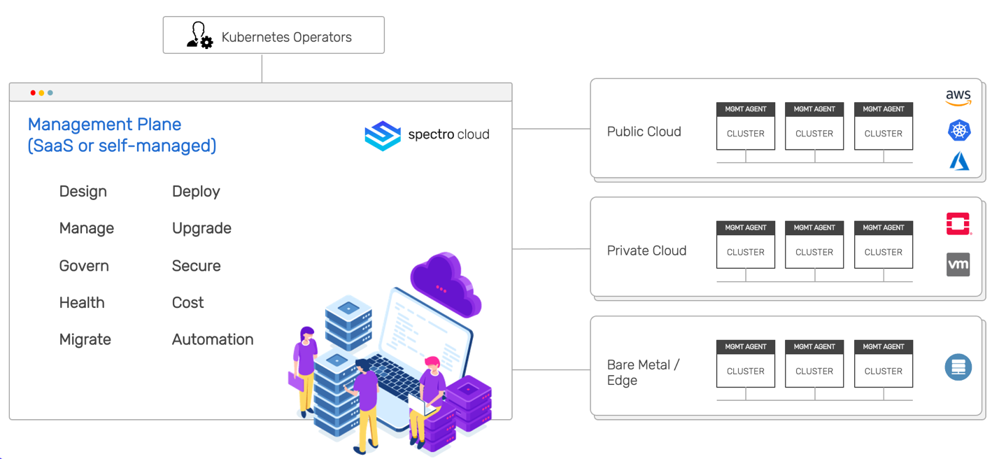

import SecurityWP from "shared/components/common/SecurityWP";
import Tabs from 'shared/components/ui/Tabs';
import WarningBox from 'shared/components/WarningBox';
import InfoBox from 'shared/components/InfoBox';
import PointsOfInterest from 'shared/components/common/PointOfInterest';
import Tooltip from "shared/components/ui/Tooltip";

# Security Introduction

Spectro Cloud is an enterprise, cloud-native infrastructure company focused on making cloud boundaryless and self-driving. Spectro Cloud's SaaS-based product brings the managed Kubernetes experience to your own unique enterprise Kubernetes distributions running in any public or private cloud. It provides an as-a-service experience to users by automating the deployment, management, and maintenance of multiple Kubernetes clusters based on user defined Kubernetes distros in public cloud, private cloud, and bare-metal environments.

 
 
 

Spectro Cloud implements the following Security Controls to manage security in its own platform and the tenant clusters:

  

* **Spectro Cloud Platform Security** - Designed to ensure the management platform itself is secure.

 

* **Spectro Cloud Tenant Cluster Security** - Designed to ensure the Kubernetes clusters deployed for customers through Spectro Cloud platform (Tenant Clusters) are secure, conformant, and compliant.

 

* **Spectro Cloud SaaS Operation Security Controls** - Designed to ensure secure operations of the Spectro Cloud SaaS platform. Spectro Cloud SaaS is SOC2 Type II compliant and audited annually.

 

* **Spectro Cloud Self-Managed Operation Security Controls** - Self-managed Spectro Cloud platform is typically deployed behind the firewall by the customer, and it will be the customer's own responsibility to ensure operation security controls.

 

 
 
 