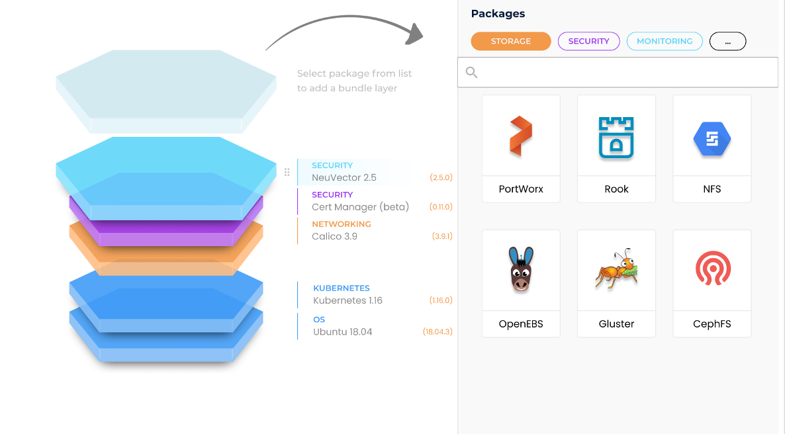

import SecurityWP from "shared/components/common/SecurityWP";
import Tabs from 'shared/components/ui/Tabs';
import WarningBox from 'shared/components/WarningBox';
import InfoBox from 'shared/components/InfoBox';
import PointsOfInterest from 'shared/components/common/PointOfInterest';
import Tooltip from "shared/components/ui/Tooltip";

# Spectro Cloud Tenant Cluster Security

Tenant clusters are Kubernetes clusters deployed by Spectro Cloud for customers (tenants). These clusters are launched in the environment of tenant's choice-public clouds, private clouds, or bare metal
environments. Spectro Cloud offers its customers complete flexibility and control for designing these tenant clusters through a construct called Cluster Profiles. Cluster Profiles are cluster, construction templates that enable customers to construct a blueprint for the tenant cluster. Spectro Cloud's provisioning engine takes this cluster profile and deploys a Kubernetes cluster as per the specifications in the Cluster Profile.

As you can see from the picture above, a cluster profile definition consists of various system layers like Operating System, Kubernetes Distro, Storage, Networking, Monitoring, Logging, and so on.

The OS and K8S layers are considered as **core layers** whereas layers like Logging, Monitoring, and so on are considered as **add-on layers**.

 

Several choices are presented for each layer in the profile in the form of **Packs**. Packs contain metadata that defines a technology, its version and optionally configuration parameters. For example, for the OS Layer, a couple of packs available are *Ubuntu 18.0.4*, *CentOS_7.7*. 

Similarly, for the Kubernetes layers, some of the choices are *Kubernetes 1.19.10*, *Kubernetes 1.20.4* etc. Spectro Cloud provides several packs out of the box, for all the layers, and at the same time, provides extensibility by allowing customers to bring their own packs. The flexibility and extensibility of the platform makes security of the tenant clusters a shared responsibility.

| **Layer**        | **Security Responsibility** |                 |
| :--------------- | :-------------------------- | --------------- |
|                  | **Out-of-the-box Pack**     | **Custom Pack** |
| Operating System | Spectro Cloud               | Customer        |
| Kubernetes       | Spectro Cloud               | Customer        |
| Storage          | Spectro Cloud               | Customer        |
| Networking       | Spectro Cloud               | Customer        |
| Add-Ons          | Spectro Cloud & Customer    | Customer        |

For the core layers, Spectro Cloud secures its out-of-the-box content. Customers are responsible for security if they bring their own packs. For the add-on layers, Spectro Cloud setups of defaults for
out-of-the-box packs based on 3rd party best practices. Customers have the flexibility to tune the configuration to best fit their needs making it a shared responsibility. 

 
Spectro Cloud also provides packs specifically for 3rd party security offerings like Sysdig Falco for runtime anomaly detection and Vault for managing secrets securely. These are configured out-of-the-box with 3rd party best practices. 

 
The following sections provide details of the security measures taken for security hardening of tenant clusters. 

 

## Cloud

Spectro Cloud adheres to best practices of the cloud environment by default when deploying tenant clusters. On Amazon Web Services for example, the control plane and worker nodes are placed into private subnets restricting public access. 

 
Similarly, nodes on Microsoft Azure are set up to not have public IPs by default. Where applicable, Spectro Cloud setups of cloud native Load Balancers which are preconfigured to prevent security attacks. For example, AWS Shield Standard prevents attacks like DDoS. Password based authentication is disabled when setting up nodes on VMWare. 

 

## Instance

Worker and Control plane instances created for the tenant clusters on cloud environments have network traffic controlled using cloud specific constructs like AWS Security Groups or Azure Network Security Groups.

 

The network access restrictions applied to these clusters are the same as those applied to the nodes of Spectro Cloud's SaaS Kubernetes cluster. 

 

## Operating System

Spectro Cloud provides an Ubuntu or CentOS image for all supported cloud environments. These images are hardened as per the relevant CIS Controls. 

 

The following tasks are performed by Spectro Cloud hardening utility: 

 

-   Apply the latest security updates available

-   Harden SSH server parameters.

-   Harden network parameters using `sysctl`.

-   Harden system files by ensuring proper file permissions are set.

-   Remove Legacy services and GUI packages.

**OS Patching**

Spectro Cloud allows users to set up OS patching policies. The base OS can be patched at the cluster deployment time and set an auto-patch policy at the scheduled time.pre-configured
This ensures the OS patches are always up-to-date to avoid any potential vulnerabilities.

 

## Kubernetes

All Kubernetes packs provided by Spectro Cloud are hardened according to the CIS Benchmarks. The procedure followed is the same as the one followed for hardening Spectro Cloud Platform Kubernetes cluster.

 
Spectro Cloud has a fully automated Kubernetes verification system and generally will add a new patch version of Kubernetes (1.x.y) to its public repository after two weeks from the release time. A major version (1.x.0) generally has more rigorous compatibility tests and will be available after 30 days from its release time.

 
Spectro Cloud's Cluster Profiles maintain the desired state for the tenant clusters including desired Kubernetes version. Updates to the cluster profile are displayed as notifications on all the Kubernetes tenant clusters. Clusters can also be auto-updated with automation solutions such as GitOps.

 

## Kubernetes Runtime Security

Kubernetes runtime security support is done through a variety of add-on packages such as Sysdig Falco, Palo Alto Network Prisma Cloud (Twistlock). These packs are optional and allow users to bring their own license to use commercial solutions. 

 
Spectro Cloud's add-on pack integration is extensible. If a user prefers a particular security solution that is not provided by Spectro Cloud out-of-box, it can be easily added as long as the solution supports Helm Charts, Kustomize, or Operators.

 

## Kubernetes Authentication and Authorization

Kubernetes cluster authentication can be optionally integrated with Kubelogin and with OIDC-based authentication/authorization against external IDP. This enables group membership based access control on different namespaces within the tenant Kubernetes cluster. Spectro Cloud's Terraform provider also supports automatically set role binding on namespaces with users or groups.

 

## Kubernetes Conformance and Compliance Test

Spectro Cloud allows users to run Kubernetes conformance and compliance tests, using Kubebench, Kubehunter, and Sonobuoy periodically based, on schedule. These tests ensure users that their tenant clusters are secure, compliant, conformant, and up to date.

 

 

