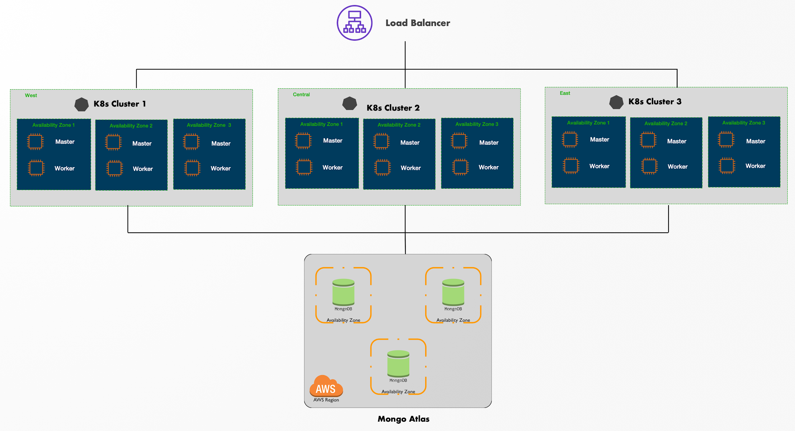
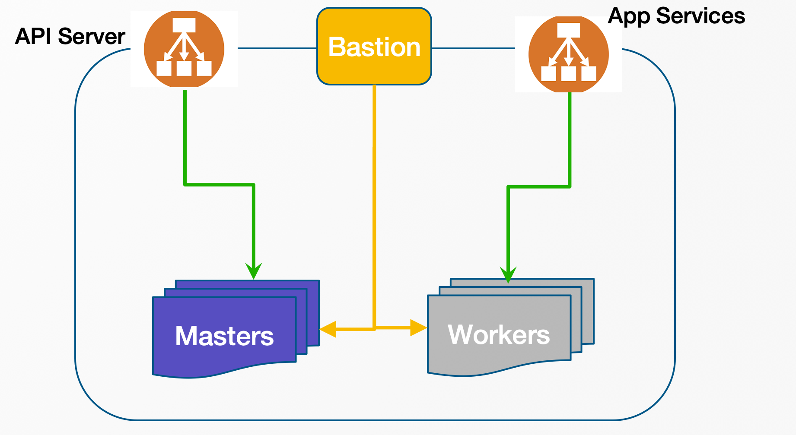
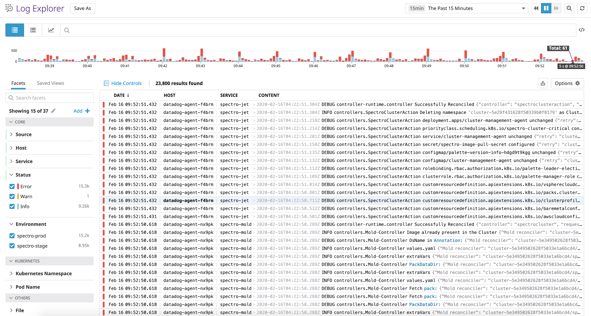
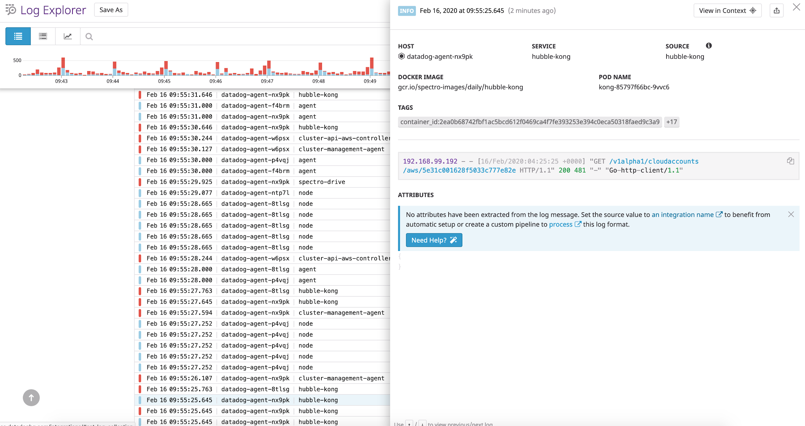
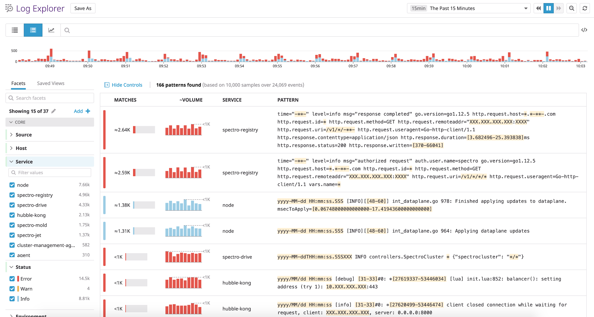
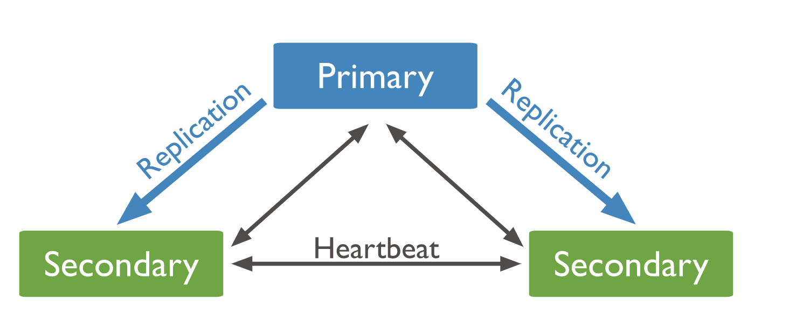
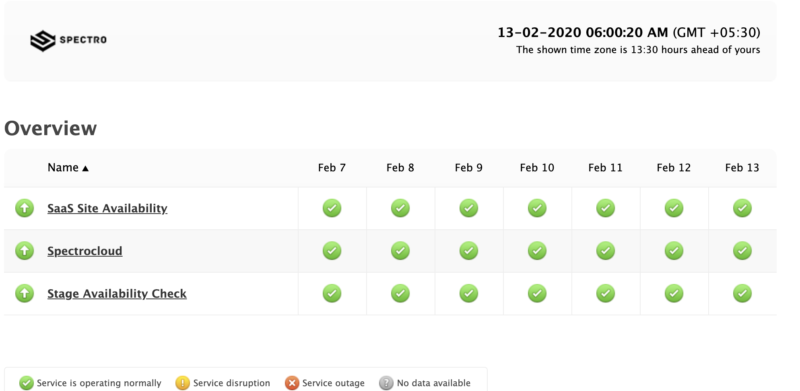
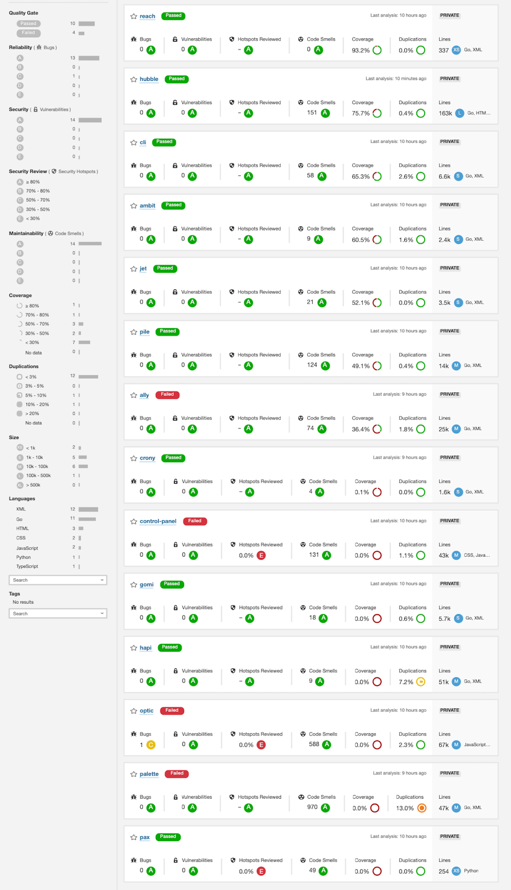

import SecurityWP from "shared/components/common/SecurityWP";
import Tabs from 'shared/components/ui/Tabs';
import WarningBox from 'shared/components/WarningBox';
import InfoBox from 'shared/components/InfoBox';
import PointsOfInterest from 'shared/components/common/PointOfInterest';
import Tooltip from "shared/components/ui/Tooltip";

# Spectro Cloud SaaS Operation Security Controls

The following sections describe various controls implemented for Spectro Cloud SaaS Platform security and operations.

 

## High Level Architecture

Spectro Cloud leverages public cloud infrastructure for its SaaS deployment. The security controls provided by the public cloud providers, coupled with its own security controls on top, are used to secure the SaaS infrastructure.

 
Spectro Cloud leverages AWS public cloud for its SaaS deployment. For high availability performance considerations, Spectro Cloud is deployed in a multi-region fashion. Three instances of the SaaS software running in their own Kubernetes clusters are deployed as follows:

 

-   AWS - US East

-   AWS - US East 2

-   AWS - West 2

The primary data store used for persistence is Mongo Atlas DB which is also setup as a multi node cluster with replication across multiple available zones in AWS cloud.

 
A geolocation aware load balancer services the primary SaaS Domain (console.spectrocloud.com) by forwarding requests to the cluster closest to the client.

 

## Infrastructure Security

Spectro Cloud Platform security covers security from OS, Container runtime, Kubernetes, and POD from the platform's perspective. The following sections describe the extra security measures taken for SaaS operation.

 

### Cloud Security

A logically isolated virtual network is created on the public cloud to host Spectro Cloud's SaaS infrastructure. This network is set up to have a private and a public subnet. The control plane and worker nodes for the Kubernetes cluster are launched into the private network. An additional bastion node is launched in the public subnet for troubleshooting purposes.

 

 

### Instance Security

Control Plane Nodes and Worker Nodes launched on the public clouds for the Kubernetes cluster that hosts Spectro Cloud's SaaS platform are protected from external access by launching them into private subnets.

All ports on the nodes are protected from external access.

**Control plane nodes security group rules**
 
| Type            | Protocol | Port Range | Source       | Description       |
| :-------------- | :------- | :--------- | :----------- | :---------------- |
| Custom TCP Rule | TCP      | 6443       | 0.0.0.0/0    | Kubernetes API    |
| SSH             | TCP      | 22         | bastion      | SSH               |
| Custom TCP Rule | TCP      | 2379       | controlplane | etcd              |
| Custom TCP Rule | TCP      | 2380       | controlplane | etcd peer         |
| Custom TCP Rule | TCP      | 179        | controlplane | bgp (calico)      |
| Custom TCP Rule | TCP      | 179        | worker node  | bgp (calico)      |
| Custom Protocol | IPv4 (4) | All        | controlplane | IP-in-IP (calico) |
| Custom Protocol | IPv4 (4) | All        | worker node  | IP-in-IP calico)  |

 
 

**Worker nodes security group rule**

| Type            | Protocol | Port Range | Source       | Description       |
| :-------------- | :------- | :--------- | :----------- | :---------------- |
| SSH             | TCP      | 22         | bastion      | SSH               |
| Custom TCP Rule | TCP      | 10250      | controlplane | Kubelet API       |
| Custom TCP Rule | TCP      | 10250      | workernode   | Kubelet API       |
| Custom TCP Rule | TCP      | 179        | controlplane | bgp (calico)      |
| Custom TCP Rule | TCP      | 179        | worker node  | bgp (calico)      |
| Custom Protocol | IPv4 (4) | All        | controlplane | IP-in-IP (calico) |
| Custom Protocol | IPv4 (4) | All        | worker node  | IP-in-IP calico)  |

The SSH public key deployed in the nodes is maintained by the Spectro Cloud SaaS Ops team.

 

### Cluster Roles Bindings

To manage the Kubernetes resources a separate service account is created with the following role bindings:

 

-   **ConfigMaps** - All permissions enabled.

 

-   **Deployments** - List & Watch permissions enabled.

 

-   **Services** - Get, List & Watch permissions enabled.

 

## Operations

Spectro Cloud has a dedicated SaaS operations team. The following sections describe various practices aopted to ensure secure, reliable, and resilient operations of Spectro Cloud service.

 

### Monitoring

Spectro Cloud's SaaS infrastructure is monitored by leveraging the monitoring solution from a 3rd party vendor Datadog. Datadog Service Monitoring Software provides data and insights into how the applications are working (or not). Datadog provides a layered set of data visualizations, to help correlate root cause and performance issues across multiple sets of disparate metrics.

Following infrastructure assets setup for monitoring by Datadog, along with key metrics being monitored:

-   Kube etcd

    -   Operations per second

    -   Bandwidth

-   Nginx (Ingress controller)

    -   Total number of requests

    -   Requests / second

-   Kube Controller Manager

    -   Replicas

    -   Queue Depth

-   Kube Api Server

    -   Total number of requests

    -   Requests / second

-   Kube Scheduler

    -   E22 Pod scheduling duration

    -   Scheduling attempts

-   All K8s nodes

    -   Allocated CPU Request

    -   Allocated Memory request

    -   CPU utilization

    -   Memory utilization

    -   Disk Utilization

-   Mongo Atlas

    -   Read per second

    -   Write per second

    -   Replication latency

    -   Healthy nodes

 

 

**Kubernetes Dashboard**

 

 

**Mongo Dashboard**

 
 

### Alerting

Alerts are set up in Datadog and Pingdom to watch for specific patterns in the monitoring data collected and raise alerts when certain thresholds are reached. Following are the rules (Metric Monitors) setup in Datadog:-

-   High CPU Load

-   Host Down

-   Critical containers down/restarting

-   Application synthetic tests failing

-   Application latency \> 500 msec

The alerts are sent to the globally distributed SaaS ops team to ensure 24\*7 coverage.

 
 

### Logging

Datadog decouples log ingestion from indexing enabling easy collection, processing, archival, and exploration for all the logs.

**Log Ingestion**: Logs from the following sources are ingested into DataDog.

-   Control plane Nodes

-   Worker Nodes

-   Application containers

**Log Exploration**: Logs can be filtered by a variety of aspects providing several ways to quickly isolate the desired logs.

-   Source

-   Host

-   Service

-   Status

-   Environment

-   Kubernetes Namespaces

-   Pod Names

The following are screenshots of the Spectro Cloud Log Management solution.

Facets are used to drill down to specific areas in logs.

 
 

Context is used to view logs from all components for any given event.

 
 

Patterns are used to analyze event recurrence and the frequency at which they occur.

 
 

**Log Archives**

Older logs are archived into Amazon S3 which serves a long-term cold storage.

 

### Backup / Restore

Data from the following persistent services of the Spectro Cloud SaaS Platform are backed up by various means. Kubernetes cluster and management service is stateless and can be easily redeployed.

**MongoDB**

-   Spectro Cloud leverages a 3rd party vendor called AtlasDB for Mongo database services.

-   Atlas DB's 'Continuous Backups' method is used for backing up data.

-   Incremental snapshots taken continuously to back up data.

-   Backup snapshots are typically just a few seconds behind operational
    system.

-   Backup snapshots stored in backup data center locations.

-   Restoring supported from snapshots.

**Public Pack Registry**

-   Registry service is setup as a stateful set in Kubernetes cluster.

-   AWS EBS is used for persistent data storage.

-   Daily snapshots of this EBS volumes are taken.

-   Additionally, the Registry content resides in a Git repository and egistry can be fully recovered from source code.

 

### Release Process

Spectro Cloud follows semantic versioning for releases where release versions follow the *Major*.*Minor*.*Patch* number pattern across all
components. Spectro Cloud maintains Integration, Stage and Production environments.

**CI/CD**

Spectro Cloud uses a tool called Prow for CI/CD. Prow is integrated with Spectro Cloud's source code repository (GitHub) to watch for Pull Requests (PR). Each PR triggers a build and unit tests for the relevant project.

**Daily Integration**

Daily build jobs that are set up in the CI system, pick up latest developer commits, run unit/integration cases, build the code and upload the container image artifacts to the container registry. End-to-end test cases are executed with the generated artifacts. The artifacts are then applied to the Integration environment as part of continuous deployment.

**Production Release**

Release jobs setup in the CI system are used to trigger product releases. This release job executes the following tasks:

-   Run Unit and Integration cases on the code.

-   Run compliance and source code analysis on the code.

-   Build code with artifacts location set to the release location.

-   Generate the artifacts and upload them to the release location.

-   Draft a new release in GitHub with the release version number.

-   Tag the release in GitHub.

-   Deploy the release in Integration and Stage environment.

-   Stage Environment is tested and signed off by QA.

-   The release is then deployed on Production environment.

 

### Cloud Account Management

Access to the integration, stage, and production environments are controlled via AWS IAM policies; each environment is isolated into its own unique AWS cloud account. Leveraging separate AWS Cloud Accounts allows us to have greater granularity in access permissions and operational visibility (cost spend, usage, and the like) for each environment.

AWS accounts:

-   Integration account (int_account)

-   Staging account (stage_account)

-   Production account (prod_account)

Access to each environment is controlled via IAM Roles. In each environment account, there is an IAM Role "Admin" - with AdministratorAccess permissions, which can be assumed by the Spectro Cloud operations "Team" cloud account.

Team's IAM Groups:

-   **spectro-integration-access** - AssumeRole (\"arn:aws:iam::\<int_account\>:role/Admin\")

-   **spectro-stage-access** - AssumeRole (\"arn:aws:iam::\<stage_account\>:role/Admin\")

-   **spectro-prod-access** - AssumeRole(\"arn:aws:iam::\<prod_account\>:role/Admin\")

No one other than Saas ops team has access to the environments above.

With access to the environments, users can "Switch Role" to the environment using the AWS UI or CLI. Access to integration, stage, and prod environments are audited and reviewed periodically.

 

### Password and Secret Management

Spectro Cloud SaaS environment has the following environment specific sensitive information that needs to be protected.

-   Sysadmin Password

-   Cloud Account Credentials

-   Kubernetes Config files

-   Node SSH Keys

-   GitHub access tokens used for GitOps

-   Root data Encryption Key

-   JWT Authorization encryption key

-   Database Credentials

The following security measures are taken to protect this sensitive information:

 

-   Unique system passwords, SSH keys, GitHub tokens, root keys, database passwords, and JWT authorization keys are created for all environments: Development, Integration, Stage, and Production.

 

-   None of these keys/passwords/tokens are kept in source code or wiki.

 

-   Passwords and Tokens that are required runtime are encrypted using the System Key or Tenant Key based on the context.

 

-   Sensitive information is only shared with members of the SaaS Ops team.

 

-   Password Management Vault Keeper is used to maintain and share credentials within the SaaS ops team.

 

-   K8s Secrets are used to share sensitive information across application services.

 

## Reliability

Spectro Cloud SaaS platform is designed for High Availability and Disaster Recovery to make its services highly reliable.

 

### High Availability

Components are deployed in a redundant and fault-tolerant fashion to provide service continuity.

**Application Services**

Application services are deployed as containers in Kubernetes clusters running on a public cloud. For redundancy purposes, three k8s clusters
are deployed; one each in AWS East, AWS Central and AWS West. All three clusters are active and serve the requests sent to them by a Geo aware
load balancer. This architecture ensures service continuity in event of a major failure of one of the AWS clouds regions.

Furthermore, each Kubernetes cluster is configured to have three worker nodes where all the application containers are deployed. These worker nodes are distributed across fault domains. This ensures that if a fault domain like an availability zone in AWS was to go down, worker nodes on other fault domains would not be impacted. Containers from the impacted worker nodes will be migrated over to the active worker nodes ensuring service continuity.

**Database Service**

Spectro Cloud uses MongoDB atlas as its primary database which ensures high availability with a fault-tolerant self-healing architecture. The database instance is set up as a multi node replica set with members distributed across availability zones. In the event of a failure, the leader election and failover process happens automatically without intervention.

**Registry Service**

Spectro Cloud registry service is used to host out-of-box content known as packs. This registry is deployed in Spectro Cloud SaaS Kubernetes clusters hosted on AWS. The registry service is fronted by AWS CloudFront, which is a fast content delivery network (CDN) service. The Content Delivery Network (CDN) offers a multi-tier cache with regional Edge caches that improve latency and lower the load on registry servers.

 

### Disaster Recovery

Spectro Cloud defines Recovery Time Objective (RTO) and Recovery Point Objective (RPO) goals for recovery from a disaster. RTO defines the maximum amount of time it takes to recover from a disaster. RPO defines the loss-tolerance measured in terms of hours of data loss. The backup frequency and failover routines ensure that recovery from a disaster meets both of these objectives.

 

-   Recovery Time Objective: eight hours

-   Recovery Point Objective: two hours

 

The following design choices and measures are taken to ensure that recovery from a disaster meets the Recovery Time and Recovery Point Objectives:

 

-   Continuous backup is set up for Spectro Cloud's database. Backup snapshots are typically just a few seconds behind the operational system. If the MongoDB cluster goes down, it can be easily restored with the latest backup using Atlas DBs latest restore procedures.

 

-   Application services running on the Kubernetes clusters are stateless. In the event of a failure of one of the Kubernetes clusters hosting application services, a new cluster will be created to replace it. Restoration of state from the impacted cluster is not required. Application services are re-installed on the new cluster.

 

-   Registry content is purely static metadata and non-transactional. In the event of a failure, the registry content can be restored back from the source code repository.

 

-   Message bus is set up without persistence. Platform components are designed to replay messages and sufficient retries in the event of failure. This eliminates the need for additional restore procedures in the event of a failure.

 

-   Alerting is set up to monitor critical services (Application Services, Database, Registry, Message bus). If any of these critical services go down, Spectro Cloud Ops team is alerted within a few minutes through various channels like Slack and email.

 

-   Spectro Cloud Ops team consists of members across North American and Indian time zones. This ensures that there is round the clock monitoring of various alert channels.

 

### Service Uptime

Spectro Cloud integrates with the Uptime Monitoring Service provided by a 3rd party vendor called Pingdom for service monitoring and reporting. This integration ensures that critical services of Spectro Cloud SaaS platform are continually monitored, and Spectro Cloud SaaS ops team is promptly notified in case of a failure. 

 
Service status and historical uptime reports are publicly available on the Pingdom portal. A link to this portal is provided on Spectro Cloud's website.

 
 

## Software Development Life Cycle Management

### Developer Security Training

Spectro Cloud maintains comprehensive guidelines around security and compliance. All engineers in the Spectro Cloud engineering team are required to go through and get well versed with these guidelines. Following are some of the important points emphasized:

 

**Logging**

-   Do not log sensitive information like credentials, keys etc.

-   Messages should be meaningful and clear.

-   All messages should include context of User ID and Tenant ID.

**Security**

-   Encrypt sensitive data when persisting

-   Per tenant encryption key for tenant isolation

-   Encrypt communication between services

-   API responses should redact sensitive data

**OWASP Top 10 Vulnerabilities**

Understand and avoid following vulnerabilities:

-   A1:2017 - Injection

-   A2:2017 - Broken Authentication

-   A3:2017 - Sensitive Data Exposure

-   A4:2017 - XML External Entities (XXE)

-   A5:2017 - Broken Access Control

-   A6:2017 - Security Misconfiguration

-   A7:2017 - Cross-Site Scripting (XSS)

-   A8:2017 - Insecure Deserialization

-   A9:2017 - Using Components with Known Vulnerabilities

-   A10:2017 - Insufficient Logging & Monitoring

**Compliance**

-   Do not copy and paste code from websites

-   Check licensing of any library you include in the code base

-   Maintain an inventory of all 3rd party libraries

### Static Analysis

Spectro Cloud scans all its source code on a daily basis using SonarQube, a continuous code inspection utility to ensure code reliability, application security, maintainability and code coverage. SonarQube scan reveals vulnerabilities and code quality issues through static analysis which are translated into bugs that developers address.

The following is a sample static analysis report:

### Testing

Spectro Cloud relies heavily on automation for product testing. There is no dedicated functional QA team and developers take the responsibility for product quality.

 

**Automation Tests**

 

-   **Unit Tests** - White box testing to test individual parts of the program. These tests are run every time the source code is built. Success of all unit tests is mandatory for any new code to be checked into the source code repository.

 

-   **Integration Tests** - Black box testing to test integrated modules. These tests are running daily. Failure from integration test runs is translated into high priority bugs that need to be fixed by developers.

 

-   **End-to-end tests** - Tests that mimic end user behavior and verify end to end use cases. Spectro Cloud has developed UI and API automation frameworks and tests are constantly added using these frameworks to improve coverage. These tests are run daily, and failures are translated into high priority bugs that need to be fixed by developers.

 

All the above tests need to pass successfully before new releases are deployed into production.

 

## Security and Compliance Scans

Spectro Cloud performs the following 3rd party scans to ensure its services are secure, compliant, and conformant. The following table provides details of all scans: 

 
| **Type**                                   | **Tool/Vendor**            | **Category** | **Resource**             | **Frequency**            |
| ------------------------------------------ | -------------------------- | ------------ | ------------------------ | ------------------------ |
| SAST (Static Application Security Testing) | FOSSA                      | Security     | Source Code Dependencies | Once every release       |
| 3rd Party License Scan                     | FOSSA                      | Compliance   | Source Code              | Once every release       |
| Open-Source Inventory                      | FOSSA                      | Compliance   | Source code              | Once every release       |
| Source Code Vulnerabilities                | SonarQube                  | Security     | Source code              | Daily                    |
| Static Analysis                            | SonarQube                  | Quality      | Source Code              | Daily                    |
| OS CIS Benchmark                           | Linux Bench                | Security     | OS                       | Once every release       |
| OS CVE                                     | Vuls                       | Security     | OS                       | Once every release       |
| Web Scan (Penetration Tests)               | Tenable Cloud              | Security     | Runtime                  | Weekly                   |
| Container CVE                              | Trivy (Aqua Security)      | Security     | Containers               | Daily                    |
| Kubernetes CIS Benchmark                   | Kube-Bench (Aqua Security) | Security     | Kubernetes               | Upon K8s version upgrade |
| Kubernetes Conformance                     | Sonobuoy                   | Conformance  | Kubernetes               | Upon K8s version upgrade |

 

The results from these scans are constantly monitored and fixes for issues detected by these scans are prioritized based on severity and rolled into subsequent product releases. 

 
