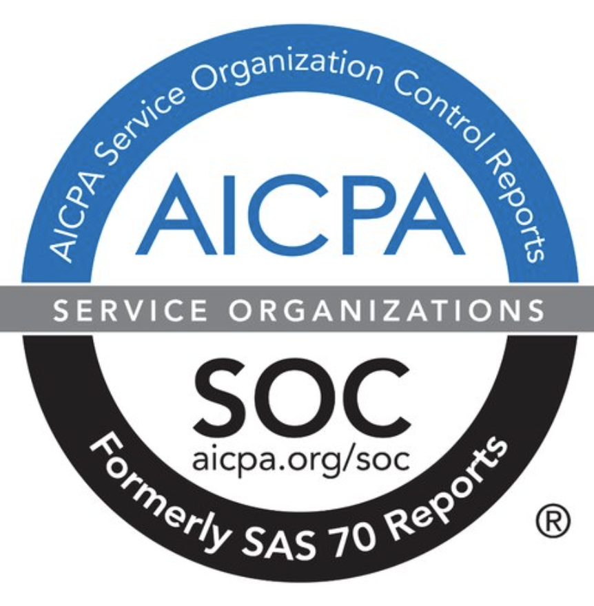
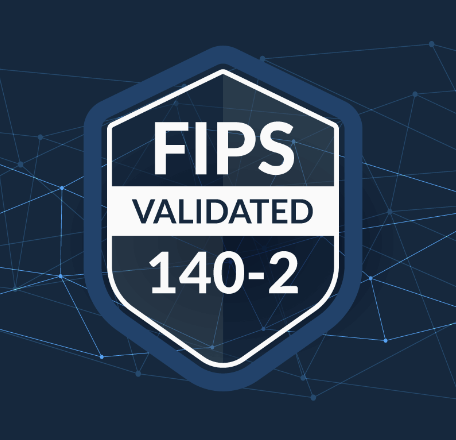

import Tabs from 'shared/components/ui/Tabs';
import WarningBox from 'shared/components/WarningBox';
import InfoBox from 'shared/components/InfoBox';
import PointsOfInterest from 'shared/components/common/PointOfInterest';
import Tooltip from "shared/components/ui/Tooltip";

# Compliance

Spectro Cloud has SOC 2 certification and a FIPS certificate for its Cryptographic Module. 

## SOC 2 Type II

Spectro Cloud is certified against SOC2 Type II, compliance with the AICPA’s (American Institute of Certified Public Accountants) TSC (Trust Services Criteria). 
* Spectro Cloud SOC 2 Type II audit report assures our organization’s:
   * Security
   * Availability
   * Processing integrity
   * Confidentiality
   * Privacy 
* SOC 2 audits are an important component in regulatory oversight, vendor management programs, internal governance, and risk management.
* These reports help the users and their auditors to understand the Spectro Cloud controls established to support operations and compliance. 
* The annual certification of SOC2 is Independent 3rd Party Auditor. 
* Spectro Cloud SOC 2 Type II report is available upon request for any customers or prospects with signed MNDA.

## FIPS 140-2

 

Spectro Cloud is certified against FIPS 140-2 with [Certificate number 4349](https://csrc.nist.gov/projects/cryptographic-module-validation-program/certificate/4349) in compliance with the Cryptographic Module Validation Program (CMVP).  

The Spectro Cloud Cryptographic Module is a general-purpose cryptographic library incorporated into the Kubernetes Management Platform and Kubernetes distributions for the protection of sensitive information.  

The module is tested against these configurations:  

* Red Hat Enterprise Linux 8 on Dell PowerEdge R440 with Intel Xeon Silver 4214R _with and without_ PAA
* SUSE Linux Enterprise Server 15 on Dell PowerEdge R450 with Intel Xeon Silver 4309Y _with and without_ PAA
* Ubuntu 18.04 on Dell PowerEdge R450 with Intel Xeon Silver 4309Y _with and without_ PAA
* Ubuntu 20.04 on Dell PowerEdge R450 with Intel Xeon Silver 4309Y _with and without_ PAA

Review the [FIPS Compliance](/compliance/fips-compliance) page to learn how to enable FIPS mode in Palette.

 

