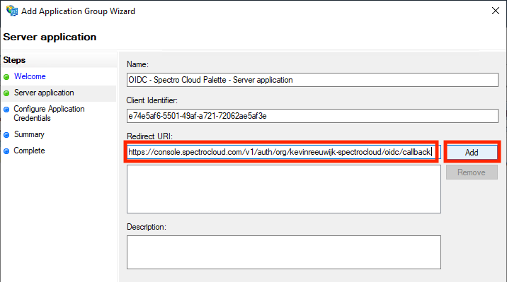
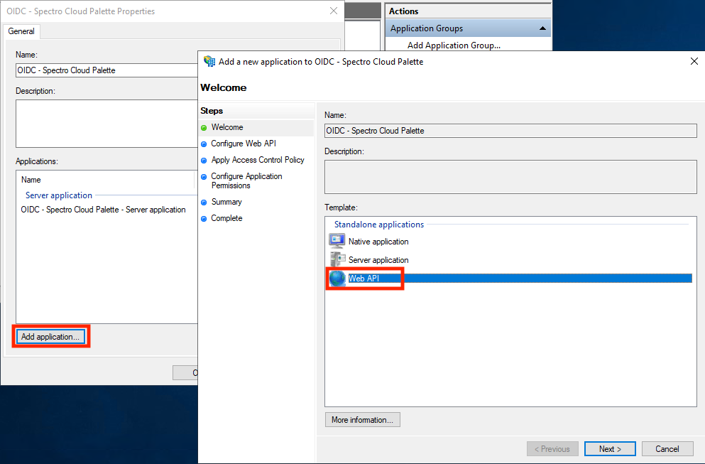
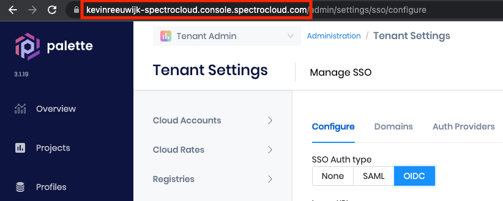
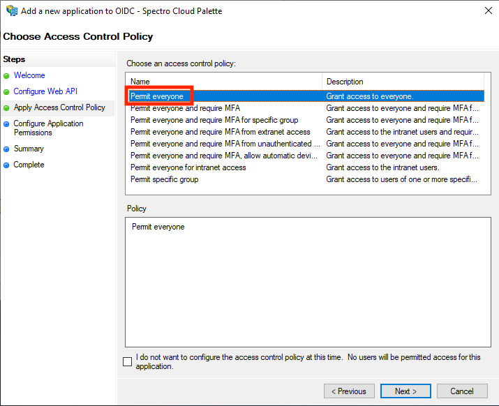
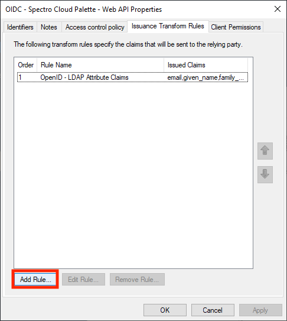
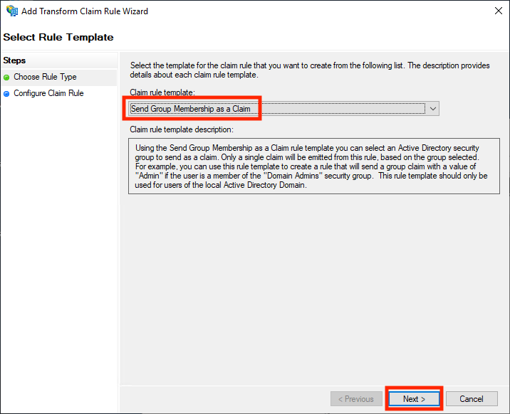
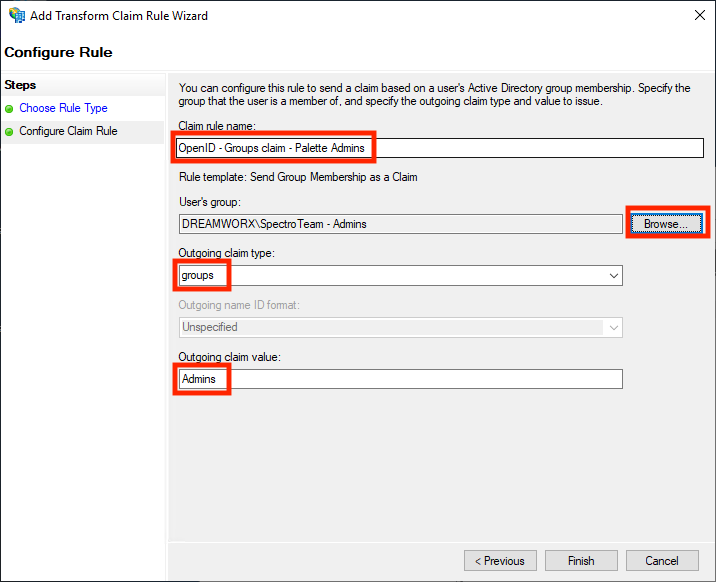
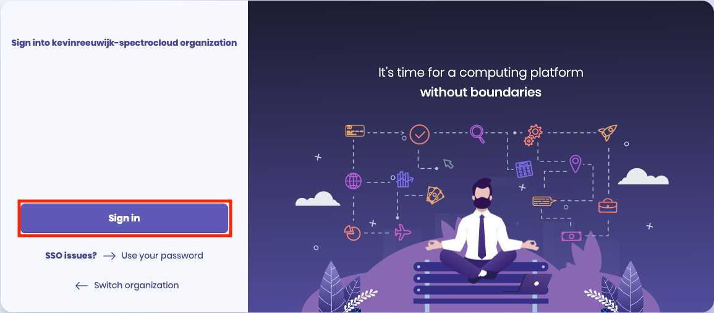
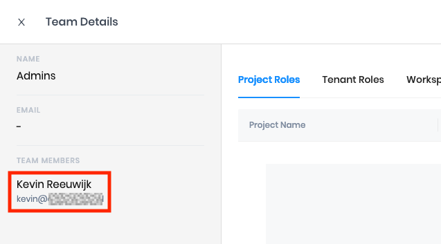

import Tabs from 'shared/components/ui/Tabs';
import WarningBox from 'shared/components/WarningBox';
import InfoBox from 'shared/components/InfoBox';

# Enable SSO with Microsoft Active Directory Federation Service (AD FS)
Single sign-on (SSO) is an authentication method that enables users to log in to multiple applications and websites with one set of credentials. SSO works upon a trust relationship established and maintained between the service provider (SP) and an identity provider (IdP) using certificates. Palette supports SSO based on either SAML or OIDC.

The following steps will guide you in how to enable Palette SSO with [Microsoft AD FS](https://docs.microsoft.com/en-us/windows-server/identity/ad-fs/development/ad-fs-openid-connect-oauth-concepts) based on OIDC.

<InfoBox>

 You cannot use Microsoft AD FS for SAML based SSO with Palette. Microsoft AD FS does not support the Canonical XML 1.1 standard that Palette employs. You can only use the OIDC based approach for Microsoft AD FS.

</InfoBox>

# Prerequisites
In order to setup OIDC based SSO with Microsoft AD FS, you need to use one of the following versions:
* Microsoft AD FS 2022 (comes with Windows Server 2022)
* Microsoft AD FS 2019 (comes with Windows Server 2019)
* Microsoft AD FS 2016 (comes with Windows Server 2016)

If you need to be able to your AD FS service from outside your corporate network, you will also need an AD FS Reverse Proxy. An official Microsoft tutorial for setting up an AD FS Reverse Proxy is not available, but you can use this blog post from [Matrixpost](https://blog.matrixpost.net/set-up-active-directory-federation-services-ad-fs-5-0-adfs-reverse-proxy-part-2/) for additional guidance.

# Enablement
## Create the AD FS Application Group for Palette

1. Open the AD FS Management console on your Windows Server and add a new Application Group for Palette:

Provide a suitable name for the application group and select **Server Application** from the list of templates. Then click **Next**:

The next screen displays the **Client Identifier** for this Application Group:

Copy the client identifier value and save it somewhere. You will need to enter this value into the Palette SSO configuration later. 

Next, open a web browser and navigate to your Palette subscription. Navigate to **Tenant Settings** --> **SSO** and click **OIDC**. Click the button next to **Callback URL** to copy this value into the clipboard:

Switch back to your AD FS Management console and paste the copied value into the **Redirect URI** field, then click **Add** to add it to the list:

The redirect URI is required for SSO to work with Palette. However, if you also want to use the same AD FS server for OIDC authentication into your Kubernetes clusters then add the following additional redirect URIs to the list as well:
| URL | Type of Access |
| --- | --- |
| http://localhost:8000 | Using kubectl with the kube-login plugin from a workstation |
| https://console.spectrocloud.com/v1/shelly | Using the web-based kubectl console |
| https://<fqdn-of-k8s-dashboard>/oauth/callback | Using OIDC authentication into Kubernetes Dashboard |
When you have completed entering redirect URLs, click **Next**. On the next page of the wizard, select **Generate a shared secret** and click **Copy to clipboard** to copy the secret value and save it somewhere. You will need to enter this value into the Palette SSO configuration later:

Click **Next** and on the Summary screen, click **Next** again to complete the wizard. You need to add another application to the application group. Select the newly created application group and click **Properties**:

In the Properties screen, click **Add application...**. In the wizard that opens, select **Web API** and click **Next**:

In the **Identifier** field, add the following entries one by one:
* The **Client Identifier** value you saved when creating the application group.
* The base URL of your Palette tenant. This is equal to the URL shown by your browser when logged into Palette minus the path. Example `https://johndoe-spectrocloud.console.spectrocloud.com`.

Click **Next** when done. On the next screen, select a suitable policy for who can use this SSO and under what circumstances. If you're not sure which policy to choose, select **Permit everyone**, then click **Next**:

On the next screen, by default only the **openid** scope is ticked. However, to only include the user's groups in the OIDC claim, you need to also enable the **allatclaims** scope. If your AD FS server does not yet have an **allatclaims** scope in the list, click **New scope...** and type `allatclaims` in the Name field, then click OK to add it. Ensure both scopes are enabled and then click **Next**:

On the Summary screen, click **Next** to finish the wizard. You need to set the **Issuance Transform Rules** for the Web API application. Open up the application again. Double-click on the Web API entry or click the **Edit** button to open it.

Navigate to the **Issuance Transform Rules** tab and click on **Add Rule**.

Select the **Send LDAP Attributes as Claims** template and click **Next**:

Name the rule `OpenID - LDAP Attribute Claims`. Select **Active Directory** as the Attribute store and add the following LDAP mappings:
* **E-Mail-Addresses** --> `email`
* **Given Name** --> `given_name`
* **Surname** --> `family_name`

You can select the items on the left from the list. You will need to type the items on the right manually. Ensure you use all lowercase characters for the values on the right:

Click **Finish** to add the rule. Now click on **Add Rule...** again to add the second rule:

Select the **Send Group Membership as Claims** template and click **Next**:

In the next screen, define the group claim as desired. In the following example, a group in Active Directory is called `SpectroTeam - Admins`. The desired behavior is for anyone that is a member of that group, to be issued a `groups` claim with the value `Admins`. In Palette this user will then automatically be mapped to a group with the same name, `Admins`. You can assign RBAC permissions to that group in Palette to give it the desired access.

Click **Finish** to add the rule. Click **OK** to save the changes to the Web API rule and click **OK** again to save the changes to the application group. 

Take note of your AD FS identifier, you will need this for Palette in the next step. Typically this is your AD FS name plus `/adfs`. You can also take the Federation Service identifier and remove `/services/trust` from that URL:

##  Enable OIDC SSO in Palette

Open a web browser and navigate to your [Palette](https://console.spectrocloud.com) subscription. 

Navigate to **Tenant Settings** --> **SSO** and click on **OIDC**. Enter the following information.
| Parameter         | Value                                                             |
|-------------------|--------------------------------------------------------------------|
| Issuer URL        | Your AD FS issuer URL, typically this is your AD FS name plus /adfs|
| Client ID         | the client identifier that you noted down in the beginning of the previous step |
| Client Secret     | the shared secret that you generated in the previous step |
| Default Teams     | leave empty if you don't want users without any groups claims to be assigned to a default group. If you do, enter the desired default group name here. If you use this option, be careful with how much access you give to that group. |
| Scopes            | set this to openid and allatclaims |
| Email             | leave at the default of email |
| First Name        | leave at the default of given_name |
| Last Name         | leave at the default of family_name |
| Spectro Team      | leave at the default of groups |

When all the information has been entered, click the **Enable** button to enable SSO. You will receive a message stating **OIDC configured successfully**.

## 3 - Create Teams in Palette

The remaining step is to create teams in Palette for the group claims that you configured in AD FS, and give them the appropriate permissions. For this example, you will create the `Admins` team and give it **Tenant Admin** permissions. You can repeat this for any other team that you have configured group claims.

Open a web browser and navigate to your Palette subscription. Navigate to **Tenant Settings** --> **Users & Teams** --> **Teams** tab. Click on the **+ Create Team** button.

Specify `Admins` in the **Team name** field. You don't need to set any members now, as this will happen automatically from the SSO. Click **Confirm** to create the team.

You will be returned back to the list of teams. Click on the newly created **Admins** team to review the details page. To give this team administrative access to the entire tenant and all the projects in it, assign the **Tenant Admin** role. Click on **Tenant Roles** --> **+ Add Tenant Role**:

Click on **Tenant Admin** to enable the role. Click **Confirm** to add the role.

You will receive a message stating **Roles have been updated**. Repeat this procedure for any other teams but ensure they are given the appropriate permissions. 

Click the **X** next to **Team Details** in the top left corner to exit this screen.

You have now successfully configured Palette SSO based on OIDC with Microsoft AD FS!

# Validation
Log in to Palette through SSO as a user that is a member of the `SpectroTeam - Admins` group in Active Directory to verify that users are automatically added to the `Admins` group in Palette.

If you're still logged into Palette with a non-SSO user, log out by clicking on the **User Menu** at the top right and selecting **Logout**.

The Palette login screen now displays a **Sign in** button and no longer presents a username and password field. Below the **Sign In** button, there is an **SSO issues? --> Use your password** link. This link can be used to bypass SSO and log in with a local Palette account in case there is an issue with SSO and you need to access Palette without SSO.

Click on the **Sign in** button to log in via SSO.

If this is the first time you are login in with SSO, you will be redirected to the Microsoft AD FS login page. Depending on your organization's SSO settings, this could be a simple login form or require MFA (Multi-Factor Authentication).

Make sure you log in as a user that is a member of the `SpectroTeam - Admins` group in Active Directory. Once authenticated, you will automatically be redirected back to Palette and logged into Palette as that user.

You are now automatically added to the `Admins` team in Palette. To verify, navigate to the left **Main Menu**, select **Tenant Settings** --> **Users & Teams** --> **Teams** tab. Click the **Admins** team and view the team members section.

The user you logged in with has automatically been added to this team.