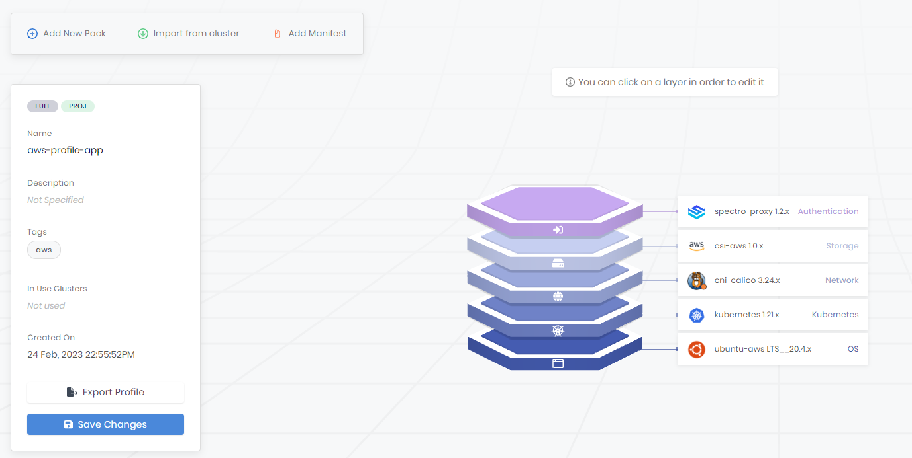
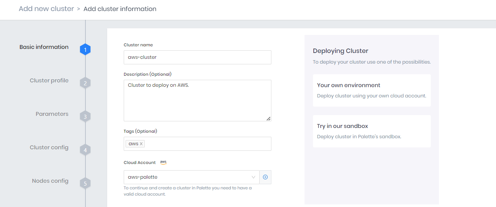
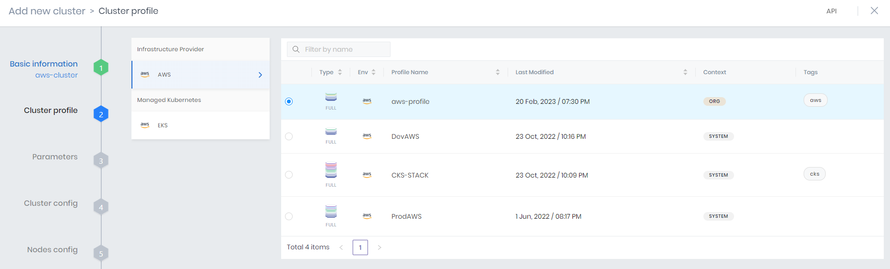
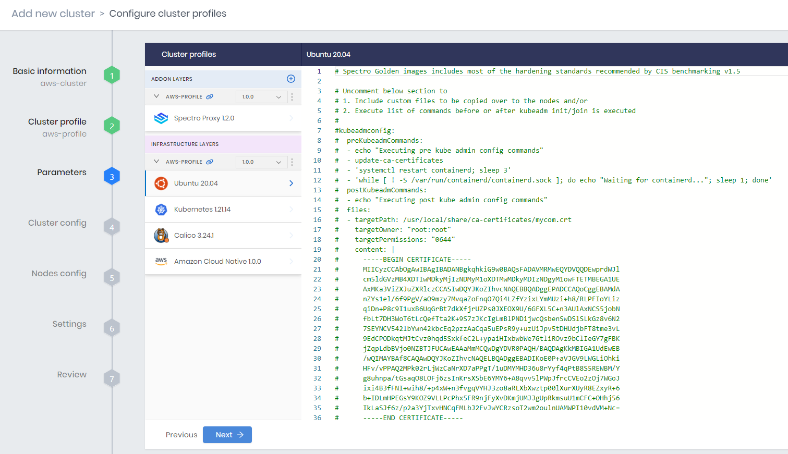
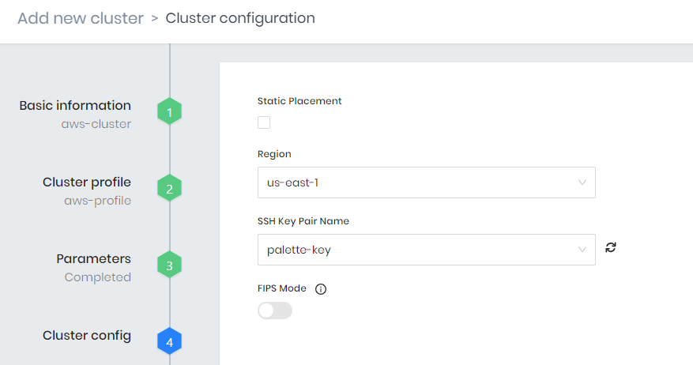
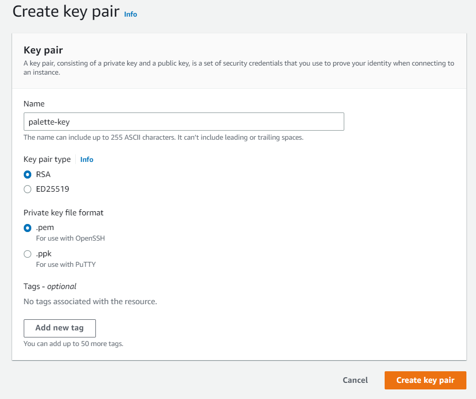
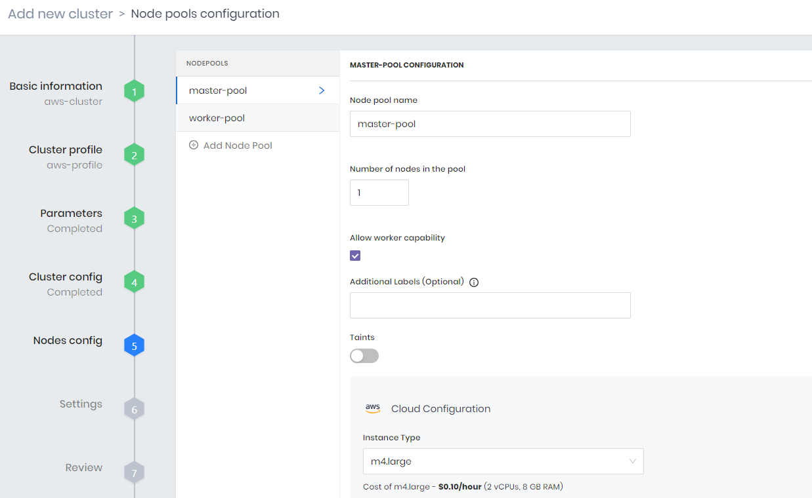
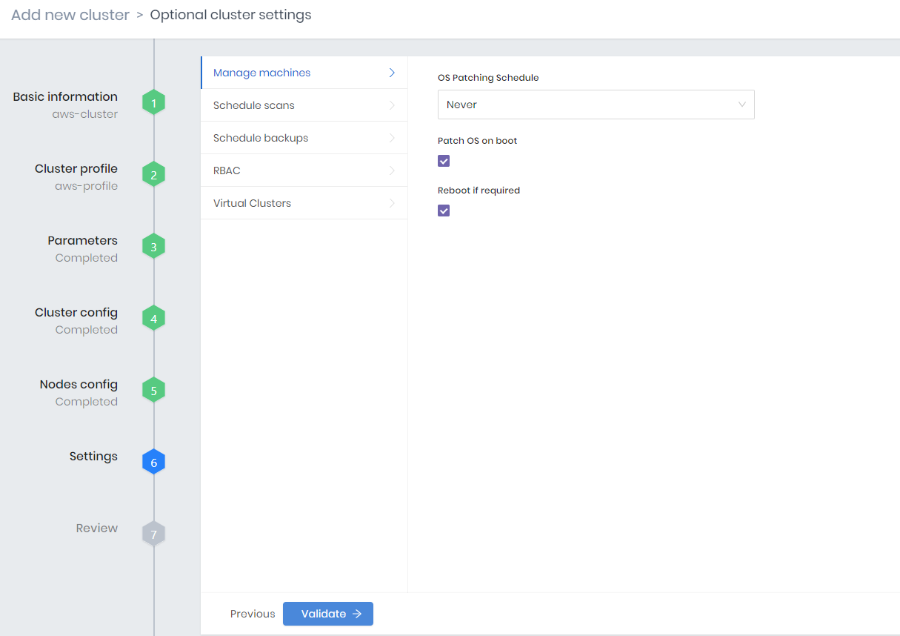
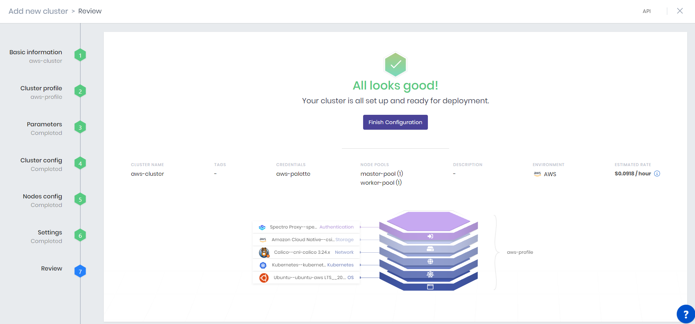
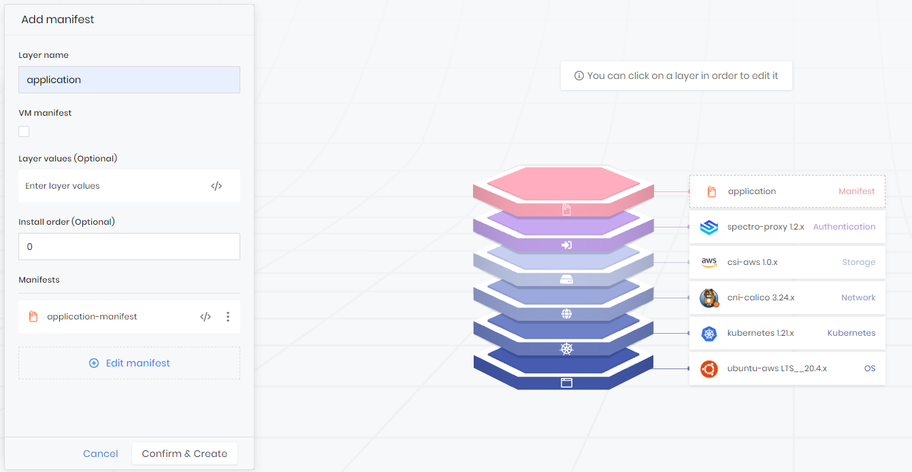

import Tabs from 'shared/components/ui/Tabs';
import WarningBox from 'shared/components/WarningBox';
import InfoBox from 'shared/components/InfoBox';
import PointsOfInterest from 'shared/components/common/PointOfInterest';

# Deploy a Kubernetes Cluster with Palette

Palette allows you to create and manage a Kubernetes host cluster in all major public cloud providers with minimal effort. Palette makes possible for software engineers, application developers, or system administrators that want to deploy a containerized application to interact with Kubernetes clusters with ease.

The *Cluster Profile* component allows you to customize the cluster infrastructure stack you prefer in a reusable and repetitible way on the main cloud providers.

This tutorial will teach you how to deploy a cluster with Palette . Yu will learn about *Cluster Mode*, *Cluster Profiles*, *Host Cluster* and understand how they enable you to deploy applications to Kubernetes quickly with minimal effort but with high degree of customization.

<br />
<br />

<Tabs>

<Tabs.TabPane tab="UI Workflow" key="UI">

## UI Workflow

## Prerequisites

To complete this tutorial, you will need the following items.

- A Spectro Cloud account. You can [sign up to Palette](https://console.spectrocloud.com/auth/signup) 
- Basic knowledge about containers.
- Create a Cloud account ([AWS](#providers), [Azure](#providers), [GCP](#providers))
- Basic knowledge of the main public cloud platforms

There are no expenses associated with this tutorial as everything shouldn’t exceed the free tier threshold of the cloud providers.

In case, you want to extend the experiments of this tutorial, exceeding the providers free tier threshold, you can request an authorization to the [Spectro Cloud Free Cloud Credit program](https://docs.spectrocloud.com/getting-started/palette-freemium#requestafreecloudaccount)


## Architecture 

todo ...

<br />

## Deploy the Environment

Start by log in to Palette. From the landing page, click on the user **drop-down Menu** and click on **Cluster Mode**.


<br />

The following steps will guide you through deploying the cluster infrastructure. You will start with the definition of the cluster profile, then you will create the cluster and launch the provision of the cluster.

From Palette, you will create the cluster and deploy the application. Each cluster will be hosted on a cloud service provider, i.e. AWS, Azure, GCP, and managed through Palette.

<div id="providers"></div>
<br />
<br />
<br />

<Tabs>

<Tabs.TabPane tab="AWS" key="1">

## Create AWS Account

Go to [AWS home page](https://aws.amazon.com) and follow the [page to create and activate a AWS account](https://aws.amazon.com/premiumsupport/knowledge-center/create-and-activate-aws-account).

When you create an AWS account, you begin with the AWS account root user that is a one sign-in identity with complete access to all AWS services and resources in the account.
We recommend to create another user, from the IAM service, to execute everyday tasks and give to that user sufficient rights to create the cluster, avoiding to use the root user credentials to perform it.

<br />


## Create Cluster Profile

[Cluster profiles](https://docs.spectrocloud.com/cluster-profiles) are templates that are created with preconfigured core layers (OS, Kubernetes orchestrator, Network, Storage) with the possibility to add several available add-on layers, such as security, monitoring, logging, and so forth.

Cluster profiles allows to create infrastructural stacks that can be customized in terms of number of layers, type of components, and version and offer a reproducible way to create clusters.

After the creation of a cluster profile, you can update it in any moment by adding/removing layers, editing the manifests, and so forth.

Here an example of cluster profile configuration.



For this tutorial, we use Ubuntu as OS, Calico as networking component, Amazon Elastic Block Store (EBS) Container Storage Interface (CSI) driver to manage the lifecycle of EBS volumes for persistent volumes, and Spectro-Proxy as reverse proxy to access the web application you are going to deploy later on.

<br />


## Create New Cluster

You can open the clusters overview by selecting the **Cluster ** tab on the Palette left panel.

From the clusters page, you can select **Add New Cluster**


and **Deploy New Cluster** from the pop-up menu.

Choose the cloud provider at your choice, AWS in this case, and **Start AWS Configuration**

This starts the procedure to create configure the cluster on AWS, whose steps are the following.

<br />


### Basic information

In the basic information section, you insert the general information about the cluster, such as the Cluster name, Description, Tags, the Cloud account.



<br />


### Cluster profile

From the Cluster profile section, you can select the profile you want to deploy on AWS.



On the right side there is a list of available and suitable profile you can choose for the deployment on the selected cloud provider.

<br />


### Parameters

The parameters section resumes the list of infrastructure layers and the list of add-on components.



For each component, there is a manifest with the deploy configurations.

The default manifest is already suitable for production environment since it already includes a working configuration and the most of the hardening standards recommended for production environments.
Despite that, you can edit the default manifest, customizing the deploy configuration.

<br />


### Cluster config

The cluster config section allows to select the Region where to deploy among the ones provided by the cloud providers and the SSH Key Pair to use.



Create an SSH key pair from the AWS dashboard.
Open the Amazon EC2 console at https://console.aws.amazon.com/ec2/ and, in the navigation panel, under Network & Security, choose Key Pairs.
Choose Create key pair and enter the information required to create the key pair:  a descriptive name for the key, the type of key pair, and the private key file format. Then, select to Create a key pair.



<br />


### Nodes config

The node config section allows to configure the type of nodes you will use as master and worker nodes in the Kubernetes configuration.

You can find the list and the explaination of all the paramerters in [Node Pool page](https://docs.spectrocloud.com/clusters/cluster-management/node-pool).

Among the multiple configuration you can set, be sure to consider:
- *Number of nodes in the pool* to set the right amount of nodes that compose the pool of either the master or worker nodes. For the tutorial we set 1 for the master pool and 2 for the worker pool
- *Allow worker capability* to allow the master node also to accept workloads. This option is particularly useful in case you select *spot instance* as worker nodes in order to guarantee a minimum number of available nodes on the cluster. For the tutorial we check it.
- *Instance Type* to select the amount of resources each node must have. Each instance type shows the amount of vCPU, RAM and the hourly cost of the instance.
- *Availability zones* to use within the Region seleted in the *Cluster config* section.
- *Instance Option* to choose between [on-demand instance](https://docs.aws.amazon.com/AWSEC2/latest/UserGuide/ec2-on-demand-instances.html) and [spot instance](https://aws.amazon.com/ec2/spot/) as worder nodes. 
  - (in case of spot instance) *Maximum spot bid price* to set the bid price threshold to get instances. For this tutorial, you can select spot instance to minimize cost but make sure you check the *Allow worker capability* flag.



<br />


### Settings

In the Settings section you can select advanced configurations about the management of the instances, such as when to patch the OS, enable security scans, manage backups, add role-based access control (RBAC), enable virtual clusters.



For the purpose of this tutorial, you can use the default settings configuration.

<br />


### Review

The review section resumes the cluster configuration as you have configured it in the previous steps.



Take a look of the overall setup and press *Finish Configuration* to deploy it.

<br />


</Tabs.TabPane>

<Tabs.TabPane tab="Azure" key="2">

## Create Azure Account

Go to [Azure home page](https://azure.microsoft.com/free) and follow the [page to create an Azure account](https://learn.microsoft.com/en-us/training/modules/create-an-azure-account).

When you create an Azure account, you begin with the AWS account root user that is a one sign-in identity with complete access to all Azure services and resources in the account.
We recommend to create another user, from the IAM service, to execute everyday tasks and give to that user sufficient rights to create the cluster, avoiding to use the root user credentials to perform it.

<br />


## Create Cluster Profile

todo ...


## Create New Cluster

todo ...


</Tabs.TabPane>

<Tabs.TabPane tab="GCP" key="3">

## Create GCP Account

Go to [GCP home page](https://cloud.google.com) 


## Create Cluster Profile

todo ...


## Create New Cluster

todo ...


</Tabs.TabPane>

</Tabs>

<br />

</Tabs.TabPane>

<Tabs.TabPane tab="Terraform" key="terraform">

##  Terraform

The [Spectro Cloud Terraform](https://registry.terraform.io/providers/spectrocloud/spectrocloud/latest/docs) provider enables you to create and manage Palette resources in a codified manner by leveraging Infrastructure as Code (IaC). There are many reasons why you would want to utilize IaC. A few reasons worth highlighting are; the ability to automate infrastructure, improve collaboration related to infrastructure changes, self-document infrastructure through codification, and track all infrastructure in a single source of truth. If you need to become more familiar with Terraform, check out the [Why Terraform](https://developer.hashicorp.com/terraform/intro) explanation from HashiCorp. 


## Prerequisites

To complete this tutorial, you will need the following items.

- A Spectro Cloud account
- Basic knowledge about containers.
- Terraform v1.3.6 or greater
- Git v2.30.0 or greater 
- A Spectro Cloud API key. To learn how to create an API key

There are no expenses associated with this tutorial as everything falls under the Palette Free Tier.


## Architecture 

The tutorial includes two scenarios, and for each scenario, you will deploy a separate Kubernetes environment. The following diagram illustrates the different layers that will power the tutorial environment.


The top layer is Palette, which is the product platform. Palette can be used in two modes: app mode or cluster mode. Each mode is intended for different use cases and personas, but for this tutorial, you will use app mode. For an in-depth explanation of each mode’s differences, check out the [App Mode and Cluster Mode](/introduction/palette-modes) documentation.

<br />

<Tabs>

<Tabs.TabPane tab="AWS" key="aws">

aws todo...

</Tabs.TabPane>

<Tabs.TabPane tab="Azure" key="azure">

aws todo...

</Tabs.TabPane>

<Tabs.TabPane tab="GCP" key="gcp">

aws todo...

</Tabs.TabPane>

</Tabs>


</Tabs.TabPane>

</Tabs>

<br />

## Deploy The Application

The following steps will guide you through deploying the application on the created cluster. You will start with the modification of the cluster profile with the addition of the manifest, then the configuration of the manifest, and the deploy of the application.

<br />

### Add The Manifest

Return to the *Profiles* tabs on the left panel and open the profile related to the cluster deployed.

Select *Add Manifest* at the top of the page and insert the data:
- *layer name*: name of the pack to add to the profile stack
- *Manifests*: add your manifest by giving it a name and click on the blue tick to confirm it.



<br />


### Customise The Manifest

From the *editor* icon next to the manifest you can switch between the text editor and the overview of the profile stack.

Click on the manifest to prompt a text file on the right side. Here you add the code to deploy the application.
The manifest example code to deploy the *hello-universe* application is the following.

<br />

```yaml
apiVersion: v1
kind: Service
metadata:
  name: hello-universe-service
spec:
  type: LoadBalancer
  selector:
    app: hello-universe
  ports:
  - protocol: TCP
    port: 8080
    targetPort: 8080
---
apiVersion: apps/v1
kind: Deployment
metadata:
  name: hello-universe-deployment
spec:
  replicas: 2
  selector:
    matchLabels:
      app: hello-universe
  template:
    metadata:
      labels:
        app: hello-universe
    spec:
      containers:
      - name: hello-universe
        image: ghcr.io/spectrocloud/hello-universe:1.0.9
        imagePullPolicy: IfNotPresent
        ports:
        - containerPort: 8080
```

In this code example, we deploy the [*hello-universe*](https://github.com/spectrocloud/hello-universe) demo application.

We set 2 replicas to simulate a minimal distributed environment with a redountant web application deployed on Kubernetes. In front of them, we add a load balancer service to route requests across all replica containers as best practice to maximize the workload and to expose a single access point to the web application.

For more information about the service LoadBalancer component you can refer to the [Kuberntes official documentation](https://kubernetes.io/docs/concepts/services-networking/service/#loadbalancer).

<br />

### Deploy

todo ...


<br />


## Validation

todo ...

<br />


## Clean-up

To remove all resources created in this tutorial, begin by navigating to the left **Main Menu** and click on the **Apps** link. For each application, click on the **three-dots Menu** to expand the options menu and click on the **Delete** button. Repeat this process for each application.

  


  

Next, in the left **Main Menu**, click on the **Cluster** link to access the clusters page.

Click on **cluster-1** to access its details page. Click on **Settings** from the details page to expand the settings menu. Click on **Delete** to delete the cluster. You will be asked to type in the cluster name to confirm the delete action. Go ahead and type the cluster name to proceed with the delete step. Repeat this process for cluster-2.

  


  
<br />


## Next Steps

In this tutorial, you learned about Palette’s Dev Engine and App Mode. You deployed two virtual clusters, each containing a different architecture and configuration of the Hello Universe application. Palette’s Dev Engine enables developers to quickly deploy applications into a Kubernetes environment without requiring Kubernetes knowledge. In a matter of minutes, you deployed a new Kubernetes cluster and all its applications without having to write Kubernetes configuration files. To learn more about Palette Dev Engine and its capabilities.
<br />

- [Palette Modes](/introduction/palette-modes)
- [App Profiles](/devx/app-profile)
- [App Services]()
- [Palette Virtual Clusters](/devx/palette-virtual-clusters) 
- [Hello Universe GitHub respository](https://github.com/spectrocloud/hello-universe)
