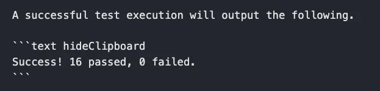

<!-- vale off -->

# Markdown and MDX

## Markdown Links and URLs

Markdown links use file path references to link to other documentation pages. The markdown link is composed of the file
path to the page in context from the current file. All references to a another documentation page must end with the
`.md` extension. Docusaurus will automatically remove the `.md` extension from the URL during the compile. The file path
is needed for Docuasurus to generate the correct URL for the page when versioning is enabled.

The following example shows how to reference a page in various scenarios. Assume you have the following folder structure
when reviewing the examples below:

```shell
.
└── docs
    └── docs-content
        ├── architecture
        │   ├── grpc.md
        │   └── ip-addresses.md
        ├── aws
        │   └── iam-permissions.md
        ├── clusters
        └── security.md
```

### Same Folder

To link to a file in the same folder, you can use the following syntax:

```md

```

Because the file is in the same folder, you do not need to specify the path to the file. Docusaurus will automatically
search the current folder for the file when compiling the markdown content.

So, if you are in the file `grpc.md` and want to reference the file `ip-addresses.md`, you would use the following
syntax:

```md

```

### Different Folder

If you want to link to a file in a different folder, you have to specify the path to the file from where the current
markdown file is located.

If you are in the file `security.md` and want to reference the file `iam-permissions.md`, you have to use the following
syntax:

```md

```

If you are in the file `grpc.md` and want to reference the file `iam-permissions.md`, you have to use the following
syntax:

```md

```

### A Heading in the Same File

To link to a heading in the same file, you can use the following syntax:

```md
[Link to a heading in the same file](#heading-name)
```

The `#` symbol is used to reference a heading in the same file. The heading name must be in lowercase and spaces must be
replaced with a `-` symbol. Docusaurs by default uses dashes to separate words in the URL.

### A Heading in a Different File

To link to a heading in a different file, you can use the following syntax:

```md
[Link to a heading in a different file](name_of_file.md#heading-name)
```

For example, if you are in the file `grpc.md` and want to reference the heading `Palette gRPC API` in the file
`security.md`, you would use the following syntax:

```md
[Link to a heading in a different file](../security.md#palette-grpc-api)
```

The important thing to remember is that the `#` comes after the file name and before the heading name.

### Exceptions

As of Docusarus `2.4.1`, the ability to link to documentation pages that belong to another plugin is unavailable. To
work around this limitation, reference a documentation page by the URL path versus the file path.

```md
[Link to a page in another plugin](/api-content/authentication#api-key)
```

> [!WARNING] Be aware that this approach will break versioning. The user experience will be impacted as the user will be
> redirected to the latest version of the page.

In future releases, Docusaurus will support linking pages from other Docusarus plugins. Once this feature is available,
this documentation will be updated.

## Redirects

To add a redirect to an existing documentation page you must add an entry to the [redirects.js](../../redirects.js)
file. Below is an example of what a redirect entry should look like.

```js
  {
    from: `/clusters/nested-clusters/`,
    to: `/clusters/sandbox-clusters`,
  },
```

## Images or other assets

All images must reside in the [`static/assets/docs/images`](../../static/assets/docs/images/) folder. All images must be
in webp format. You can save png, jpg, or jpeg to the directory. The commit hook will convert the images to webp format.
Or issue the command `make format-images` to convert the images to webp format.

```md

```

You can add a directory to to the images folder.

```md

```

**Image Loading** Image size loading can be customised. You can provide eager-load to images in the first fold of the
image with high priority as LCP (Largest contentful Paint) for the page will not be affected

```md

```

## Code Lines Highlighter

You can highlight specific lines in a block of code by adding **coloredLines** prop.

_Example_: ` ```js {2-4,5-7}`. This will color the lines from 2 to 4 and from 5 to 7.

_Components_:

- `2-4` - lines interval to be colored
- `,` - separator for different colored lines intervals

Example

https://docusaurus.io/docs/markdown-features/code-blocks#highlighting-with-comments

### Hide ClipBoard Button

The copy button is shown by default in all code blocks. You can disable the copy button by passing in the parameter
value `hideClipboard` in the markdown declaration of the code blocks.

Example 

Result


## Admonitions - Warning / Info / Tip / Danger / Tech Preview / Further Guidance / Deprecated

For guidance on using admonitions in our docs, refer to
[Spectro Cloud Internal Style Guide: Admonitions/Callouts](https://spectrocloud.atlassian.net/wiki/spaces/DE/pages/1765933057/Spectro+Cloud+Internal+Style+Guide#Admonitions%2FCallouts).

To learn more about admonitions in Docusaurus, refer to the
[Admonitions](https://docusaurus.io/docs/markdown-features/admonitions) guide.

The content must have a new line at the beginning and at the end of the tag.

### Warning

```mdx
:::warning

Some **content** with _Markdown_ `syntax`.

:::
```

### Info

```mdx
:::info

Some **content** with _Markdown_ `syntax`.

:::
```

### Tip

```mdx
:::tip

Some **content** with _Markdown_ `syntax`.

:::
```

### Danger

```mdx
:::danger

Some **content** with _Markdown_ `syntax`.

:::
```

### Tech Preview

The `:::preview` admonition is a custom admonition configured in `docusaurus.config.js` under `admonitions.keywords`.

Unlike other admonition types, you do not need to enter content in the admonition block. By default, the Tech Preview
admonition generates the message, "This is a Tech Preview feature and is subject to change. Do not use this feature in
production workloads." This message is hardcoded using `src/theme/Admonition/Type/TechPreview.js`. However, if you need
to deviate from the template text, you can provide a custom message.

```mdx
:::preview

Some **content** with _Markdown_ `syntax`.

:::
```

Files in `docs/docs-content` and `docs/api-content` are processed during the build phase. However, partials in the
`_partials` directory are dynamically imported at runtime. Because of this, custom admonitions defined in
`docusaurus.config.js` that are used in partials are not rendered, and the custom admonition is ignored.

As a workaround, when using custom admonitions in partials, import and reference the admonition with JSX syntax.

```mdx
import AdmonitionTypeTechPreview from '@theme/Admonition/Type/TechPreview'; # Import below front matter

<AdmonitionTypeTechPreview /> # Use instead of :::
```

Note that when used in partials, the default message cannot be overridden.

### Further Guidance

```mdx
:::further

Some **content** with _Markdown_ `syntax`.

:::
```

Like Tech Preview, the Further Guidance admonition is a custom admonition. To use this admonition in partials, you must
import and reference it with JSX syntax.

```mdx
import AdmonitionTypeFurtherGuidance from '@theme/Admonition/Type/FurtherGuidance'; # Import below front matter

<AdmonitionTypeFurtherGuidance /> # Use instead of :::
```

### Deprecated

The `:::deprecated` admonition is a custom admonition configured in `docusaurus.config.js` under `admonitions.keywords`.

Unlike other admonition types, you do not need to enter content in the admonition block. By default, the Deprecated
admonition generates the message, "This feature is deprecated and will no longer receive new updates. Refer to the
Announcements page for additional information, as well as alternatives." This message is hardcoded using
`src/theme/Admonition/Type/Deprecated.js`. However, you can provide a custom message when you need different text.

```mdx
:::deprecated

Some **content** with _Markdown_ `syntax`.

:::
```

Like Tech Preview and Further Guidance, the Deprecated admonition is a custom admonition. To use this admonition in
partials, import and reference it with JSX syntax.

```mdx
import AdmonitionTypeDeprecated from '@theme/Admonition/Type/Deprecated'; # Import below front matter

<AdmonitionTypeDeprecated /> # Use instead of :::
```

When you use the Deprecated admonition in partials, you cannot override the default message.
