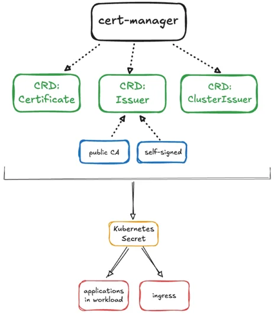

The Cert Manager pack automates the process of issuing, renewing and managing the use of TLS certificates for application and ingress workloads. These certificates can either be self-signed or sourced from certificate authorities, such as Let's Encrypt, and HashiCorp Vault. 

The architecture is divided between three main components: `Issuer`, `ClusterIssue` and `Certificate`. `CRD: Issuer` determines who to request a certificate from and how to request that certificate for a specific namespace. The `CRD: ClusterIssuer` addresses certificate requests at the cluster level. `CRD: Certificate` determines which certificate, secret name and DNS are to be used at a namespace level.  

## Supported Cluster Types

- Public Cloud
  - Infrastructure as a Service (IaaS):
    - AWS
    - Azure
    - GCP
  - Datacenter
    - MAAS
    - Nutanix
    - OpenStack
    - CloudStack
    - VMware

## Prerequisites

- New cluster built on 4.8.a
- existing cluster upgraded to 4.8.a before adding Cert Manager add-on pack.

## Enablement

1.  Log in to [Palette](https://console.spectrocloud.com/).

2.  From the left main menu, select **Clusters**. Select the cluster you want to provision the Spectro Kubernetes
    Dashboard on.

3.  Select the **Profile** tab and select the profile your desired cluster is using. If you are using the FIPS Spectro
    Kubernetes Dashboard, all profile layers must be FIPS compliant.

4.  From the version drop-down menu, select **Create new version**.

5.  Enter the semantic version number you wish to use for the updated profile and select **Confirm**.

6.  Select **Add New Pack**. The search field appears.

7.  Search for and select the **Cert Manager** pack. Ensure that you are selecting version 1.19.1.

8.  Click **Confirm** your changes.

9.  Leave the default values for the **Cert Manager** pack and select **Confirm & Create** on the pack
    customization screen.

    :::warning 

         You can do [customizations](https://cert-manager.io/docs/installation/configuring-components/), however, the following must be adhered to:

            - `crds.enabled` is set to `false`.
            - `cainjector.enabled` is set to `false` or `cainjector.replicas` is set to `0`.
            - `nodeSelector` or `nodeAffinity` is set to prevent scheduling of Cert Manager on control pane nodes.

    :::

10. The profile overview screen reflects that the `cert-manager` pack is now part of your cluster profile.
    Select **Save Changes**.

11. From the left main menu, select **Clusters**. Select the cluster you wish to update.

12. Select the **Profile** tab.

13. From the applicable **Infrastructure Layers** or **Addon Layers** version drop-down menu, select the profile version
    that contains the **Cert Manager** pack.

14. Click **Save Changes**.

## Validate

1. Log in to [Palette](https://console.spectrocloud.com/).

2. From the left main menu, select **Clusters**.

3. Select the cluster where you deployed the Cert Manager pack.

4. Select the **Namespaces** tab, and then the **Workloads** tab.

5. Click on the cert-manager namespace.
