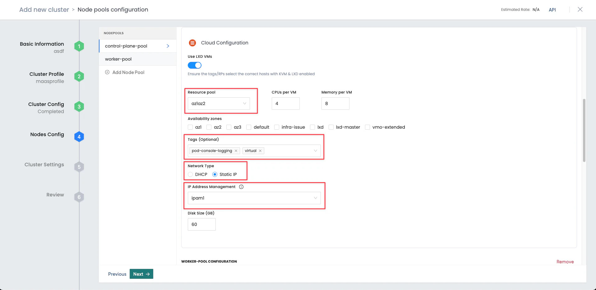

Palette supports creating and managing Kubernetes clusters deployed to a MAAS account with LXD Virtual Machines (VMs)
enabled. This section guides you through how to create a Kubernetes cluster in MAAS that uses LXD VMs and is managed by
Palette.

:::preview

:::

## Prerequisites

- A [MAAS account registered in Palette](register-manage-maas-cloud-accounts.md). All MAAS-registered Palette accounts
  must use either a System Private Gateway or Private Cloud Gateway (PCG) to connect to the MAAS environment. For more
  information on which PCG to use, refer to our MAAS [Architecture](./architecture.md) guide.

  - If you want to use a specific a static network range for the workload cluster, ensure you have configured an IP pool
    on the [IP Address Management (IPAM)](../../pcg/manage-pcg/create-manage-node-pool.md) tab of the PCG.

  - If your Palette instance does not have a direct connection to the MAAS environment, you must manually
    [deploy a PCG cluster](../../pcg/deploy-pcg/maas.md) to your MAAS environment.
  - If you are using a self-hosted Palette or Palette VerteX instance that has a direct connection to your MAAS
    environment, you can use Palette's [System Private Gateway](../../pcg/architecture.md#system-private-gateway).

- A [cluster profile](../../../profiles/cluster-profiles/cluster-profiles.md) for the MAAS environment. The Operating
  System (OS) image used in your cluster profile must be downloaded and available in your MAAS environment. Review
  [How to use standard images](https://canonical.com/maas/docs/about-images) for guidance on downloading OS images for
  MAAS.

- MAAS hosts that support KVM or LXD VMs.

- The **LxdMaas** feature flag enabled in the
  [system console](../../../enterprise-version/system-management/feature-flags.md).

:::info

<!-- prettier-ignore-start -->

By default, Palette registers a Domain Name System (DNS) record in MAAS for the deployed cluster and links it to the IP addresses of the
control plane nodes. However, you can use the <VersionedLink text="Palette eXtended Kubernetes (PXK)" url="integrations/packs/?pack=kubernetes&tab=custom#custom-api-server-endpoint-for-maas-clusters" /> pack to configure a custom API server endpoint for your cluster instead.

<!-- prettier-ignore-end -->

:::

## Deploy a MAAS Cluster with LXD-Enabled

Deploying a MAAS cluster with LXD enabled is a two-step process. First, you deploy your host cluster nodes on bare-metal
MAAS servers that have LXD enabled. Then, you deploy your workload cluster with its control plane nodes as LXD VMs that
are managed by the host cluster. The worker nodes are still deployed on bare-metal MAAS servers.

### Deploy a Host Cluster with LXD-Enabled MAAS Hosts

1.  Log in to [Palette](https://console.spectrocloud.com).

2.  Ensure you are in the correct project scope.

3.  From the left main menu, select **Clusters**, and choose either **Create Cluster** or **Add New Cluster**.

4.  In the **Data Center** section, select **MAAS**.

5.  In the bottom-right corner, click **Start MAAS Configuration**.

6.  Enter the basic information for your cluster, including the **Cluster name**, **Description**, and **Tags**.

7.  From the **Cloud Account** drop-down menu, select your MAAS cloud account, and click **Next**.

8.  <PartialsComponent category="cluster-templates" name="profile-vs-template" />

9.  <PartialsComponent category="profiles" name="cluster-profile-variables-deployment" />

10. Select a **Domain** from the drop-down menu.

11. To use a MAAS bare metal host as a hypervisor for your control plane components, activate the **Host LXD-Based
    Control Planes** switch. Select **Next**.

    

    :::warning

    We recommend specifying Network Time Protocol (NTP) servers to ensure that the cluster nodes have the correct time.
    If no NTP servers are specified, it could lead to time drift issues. You can specify this configuration in the
    **Cluster Config** step.

    :::

12. Configure the control plane and, optionally, worker node pools.

    The following input fields apply to MAAS control plane and worker node pools. For a detailed list of input fields
    that are common across environments and their usage, refer to our
    [Node Pools](../../cluster-management/node-pool.md#node-pool-configuration-settings) guide. Select **Next** when
    finished.

    #### Cloud Configuration

    | **Parameter**          | **Description**                                                                                                                                                                                                                                               |
    | ---------------------- | ------------------------------------------------------------------------------------------------------------------------------------------------------------------------------------------------------------------------------------------------------------- |
    | **Resource Pool**      | The MAAS resource pool from which to select available servers for deployment. Filter available servers to only those that have at least the amount of **CPU** and **Memory** selected.                                                                        |
    | **Availability zones** | Specify the Availability Zones.                                                                                                                                                                                                                               |
    | **Tags**               | Specify the MAAS machine tags so that Palette can deploy nodes onto the MAAS machines that match the provided tags. To learn more about MAAS tags, refer to the [MAAS Tags](https://canonical.com/maas/docs/about-machine-groups#p-22953-tags) documentation. |

<!-- prettier-ignore-start -->

13. On the **Optional cluster settings** page, select from among the items on the left menu to configure additional
    options. Refer to applicable guide for additional information.

    | **Left Menu Item** | **Additional Information** |
    | --- | --- |
    | **Manage machines** | [OS Patching](../../cluster-management/os-patching.md) |
    | **Schedule scans** | [Compliance Scan](../../cluster-management/compliance-scan.md#configuration-security) |
    | **Schedule backups** | [Backup and Restore](../../cluster-management/backup-restore/backup-restore.md) |
    | **RBAC** | - [Create Role Bindings](../../cluster-management/cluster-rbac.md#create-role-bindings)   - <VersionedLink text="Palette eXtended Kubernetes (PXK)" url="/integrations/packs/?pack=kubernetes&tab=custom" /> | 

<!-- prettier-ignore-end -->

14. Select **Validate** to review the cluster configuration and settings summary.

15. Select **Finish Configuration** to deploy the cluster. Provisioning can take several minutes.

To monitor the status of your cluster deployment, from the left main menu, select **Clusters** and choose your cluster.
The cluster **Overview** tab displays the status and health of your cluster, as well as deployment details. Refer to the
**Events** tab to monitor the deployment in real time.

### Deploy a Workload Cluster with LXD VMs as Control Plane Nodes

1.  Log in to [Palette](https://console.spectrocloud.com).

2.  Ensure you are in the correct project scope.

3.  From the left main menu, select **Clusters**, and choose either **Create Cluster** or **Add New Cluster**.

4.  In the **Data Center** section, select **MAAS**.

5.  In the bottom-right corner, click **Start MAAS Configuration**.

6.  Enter the basic information for your cluster, including the **Cluster name**, **Description**, and **Tags**.

7.  From the **Cloud Account** drop-down menu, select your MAAS cloud account, and click **Next**.

8.  <PartialsComponent category="cluster-templates" name="profile-vs-template" />

9.  <PartialsComponent category="profiles" name="cluster-profile-variables-deployment" />

10. Select a **Domain** from the drop-down menu.

11. When creating a workload cluster that will leverage MAAS LXD or will use an existing host LXD-based control plane,
    leave the **Host LXD-Based Control Planes** option disabled. Select **Next**.

    

12. Configure the control plane and worker node pools. The following input fields apply to MAAS control plane and worker
    node pools. For a detailed list of input fields that are common across environments and their usage, refer to our
    [Node Pools](../../cluster-management/node-pool.md#node-pool-configuration-settings) guide. Select **Next** when
    finished.

    #### Cloud Configuration

    | **Parameter**          | **Description**                                                                                                                                                                                                                                                                                                                                                              |
    | ---------------------- | ---------------------------------------------------------------------------------------------------------------------------------------------------------------------------------------------------------------------------------------------------------------------------------------------------------------------------------------------------------------------------- |
    | **Use LXD VMs**        | Select this option if you want your worker nodes' control plane to be deployed on MAAS LXD VMs instead of a MAAS bare metal server. This option is only displayed if you have KVM or LXD enabled on MAAS and you did _not_ select **Host LXD-Based Control Planes** on step 11.                                                                                              |
    | **Resource Pool**      | The MAAS resource pool from which to select available servers for deployment. Filter available servers to only those that have at least the amount of **CPU** and **Memory** selected.                                                                                                                                                                                       |
    | **Availability zones** | Specify the Availability Zones. These should match the same zones used by the Hosted LXD-Based Control Plane.                                                                                                                                                                                                                                                                |
    | **Tags**               | Specify the MAAS machine tags so that Palette can deploy nodes onto the MAAS machines that match the provided tags. If you are using a hosted LXD-based control plane, the resource pool, availability zones, and tags must match. To learn more about MAAS tags, refer to the [MAAS Tags](https://canonical.com/maas/docs/about-machine-groups#p-22953-tags) documentation. |
    | **Network Type**       | This option is only available when **Use LXD VMs** is enabled. Select **DHCP** or **Static IP**. For **Static IP**, select the **IP Address Management** drop-down menu, and choose the desired IP pool for the workload cluster.                                                                                                                                            |

    <!-- prettier-ignore-start -->

    :::danger

    Ensure that your **Resource Pool**, **Availability Zones**, and **Tags** selections match the same values used for
    the host cluster nodes. Failure to do so may result in LXD VMs created on MAAS hosts that do not have LXD
    initialized, which can lead to cluster provisioning failures.

    :::

    

13. On the **Optional cluster settings** page, select from among the items on the left menu to configure additional
    options. Refer to applicable guide for additional information.

    | **Left Menu Item**   | **Additional Information**                                                                                                                                                                                        |
    | -------------------- | ----------------------------------------------------------------------------------------------------------------------------------------------------------------------------------------------------------------- |
    | **Manage machines**  | [OS Patching](../../cluster-management/os-patching.md)                                                                                                                                                            |
    | **Schedule scans**   | [Compliance Scan](../../cluster-management/compliance-scan.md#configuration-security)                                                                                                                             |
    | **Schedule backups** | [Backup and Restore](../../cluster-management/backup-restore/backup-restore.md)                                                                                                                                   |
    | **RBAC**             | - [Create Role Bindings](../../cluster-management/cluster-rbac.md#create-role-bindings)   - <VersionedLink text="Palette eXtended Kubernetes (PXK)" url="/integrations/packs/?pack=kubernetes&tab=custom" /> |

<!-- prettier-ignore-end -->

14. Select **Validate** to review the cluster configuration and settings summary.

15. Select **Finish Configuration** to deploy the cluster. Provisioning can take several minutes.

To monitor the status of your cluster deployment, from the left main menu, select **Clusters** and choose your cluster.
The cluster **Overview** tab displays the status and health of your cluster, as well as deployment details. Refer to the
**Events** tab to monitor the deployment in real time.

## Validate

Use the following steps to You can validate your cluster is up and in **Running** state.

1. Log in to [Palette](https://console.spectrocloud.com).

2. Ensure you are in the correct project scope.

3. From the left main menu, select **Clusters**. The **Clusters** page displays a list of all available clusters that
   Palette manages.

4. Select the cluster you deployed. On the **Overview** tab, ensure the **Cluster Status** is **Running** and that the
   cluster has a **Health** status of **Healthy**.

## Update a MAAS Cluster

:::warning

Ensure that the OS image used in your cluster profile is downloaded and available in your MAAS environment before
attempting to update your cluster. Review [How to use standard images](https://canonical.com/maas/docs/about-images) for
guidance on downloading compatible OS images for MAAS.

:::

Updates can include changes to the cluster configuration, such as a Kubernetes upgrade, or a node configuration, such as
changing the CPU or memory requirements, or picking a different availability zone. These updates are orchestrated using
a rolling repave of the cluster nodes. To learn more about managing a MAAS cluster, refer to
[Manage Clusters](../../cluster-management/cluster-updates.md).

:::danger

Host cluster updates can cause critical disruptions in the workload clusters and should not be performed.

:::

Workload cluster updates function the same as regular MAAS clusters. Instead of provisioning new bare-metal hosts, new
LXD VMs are created for the control plane nodes.

To protect your data, we recommend creating a backup of your MAAS cluster before proceeding with any updates or
infrastructure changes. Review our [Backup and Restore](../../cluster-management/backup-restore/backup-restore.md) guide
for additional information.

## Delete a MAAS Cluster

:::warning

Before deleting a MAAS LXD cluster, consider the following:

- If the _host cluster_ currently runs LXD control planes for any workload clusters, you must first move the workload
  clusters to a different host cluster. Deleting a host cluster that hosts control planes will bring the workload
  clusters down. Once the host cluster is removed, or if the host cluster is not running on any LXD VMs, you can delete
  it the same way as regular MAAS clusters.

- _Workload clusters_ can be deleted the same way as regular MAAS clusters. Deleting a workload cluster that uses LXD
  will also delete the LXD VMs created for that workload cluster on the host cluster.

:::

Take the following steps to delete a MAAS cluster. Note that when you delete a MAAS cluster, all machines and associated
storage disks that were created for the cluster are removed.

1. Log in to [Palette](https://console.spectrocloud.com) as a tenant admin.

2. From the left main menu, select **Clusters**.

3. Select the cluster you want to delete.

4. In the top-right, select the **Settings** drop-down menu, and choose **Delete**.

The cluster status is updated to **Deleting** while cluster resources are being deleted. When all resources are
successfully deleted, the cluster status is updated to **Deleted** and the cluster is removed from the list. The delete
operation returns the hosts to the **Ready** state. All the artifacts related to the Kubernetes distribution are
removed.

## Next Steps

Now that you have deployed a MAAS cluster, you can start developing and deploying applications to your cluster. We
recommend you review the Day-2 operations and become familiar with the cluster management tasks. Check out the
[Manage Clusters](../../cluster-management/cluster-management.md) documentation to learn more about Day-2
responsibilities.
