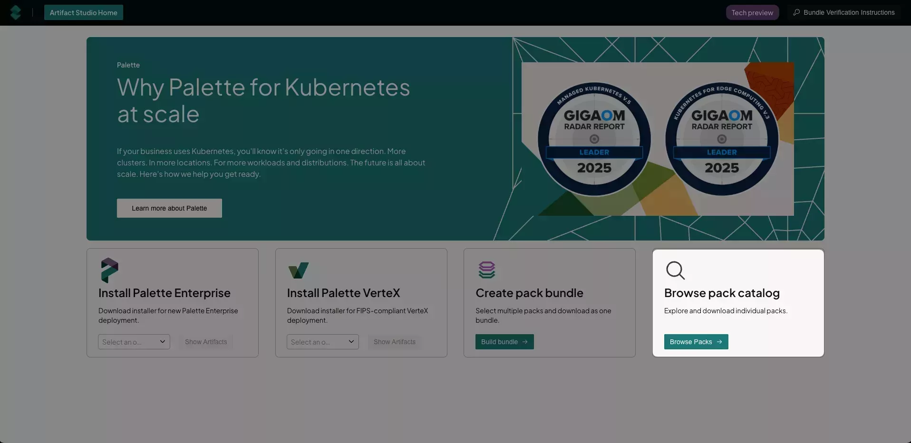

The Spectro Cloud [Artifact Studio](https://artifact-studio.spectrocloud.com/) is a unified platform that helps
airgapped, regulatory-focused, and security-conscious organizations populate their registries with bundles, packs, and
installers to be used with [self-hosted Palette](../self-hosted-setup/palette/palette.md) or
[Palette VerteX](../self-hosted-setup/vertex/vertex.md). It provides a single location for packs and images,
streamlining access and management.

## Use Cases

Use the Palette or VerteX Management Appliance or Helm chart to instantiate or upgrade your self-hosted environment.
Additionally, if you are using an airgapped environment, you can browse all available packs and download only the
components you wish to use. The integrity and authenticity of all bundles and ISOs downloaded from Artifact Studio can
be validated via signatures. These artifact bundles replace the self-extracting binaries we create for airgapped
environments with a more familiar Zstandard compressed format (`zst`) that can be moved and manipulated with the Palette
CLI.

There are four main artifact areas:

- Install Palette Enterprise (content bundle, ISO, or Helm chart).
- Install Palette VerteX (content bundle, ISO, or Helm chart).
- Create a pack bundle to download.
- Browse the pack catalog to download individual packs.

:::preview

:::

## Download Palette Enterprise

1. Navigate to [Artifact Studio](https://artifact-studio.spectrocloud.com/).

2. In the **Install Palette Enterprise** section, use the drop-down to select the version needed, and select **Show
   Artifacts**.

3. **Download** the appropriate **Content bundle**, **Palette management appliance ISO**, or **Helm installation** that
   is applicable to your environment and use case.

   | **Download Option**   | **Use Case**                                                                                                                                     |
   | --------------------- | ------------------------------------------------------------------------------------------------------------------------------------------------ |
   | **Content bundle**    | Used for traditional application install. A signature file (`sig.bin`) is included with the ZST bundle.                                          |
   | **ISO**               | Used to install from an ISO on a virtual machine, edge device, or bare-metal system. A signature file (`sig.bin`) is included with the ISO file. |
   | **Helm installation** | Used to install with Helm charts.                                                                                                                |

Once you have the file, you can deploy Palette as a self-hosted application. For ISO downloads, review the
[Palette Management Appliance Installation guide](../self-hosted-setup/vertex/management-appliance/install.md) for more
information on deploying Palette locally.

## Download Palette VerteX

1. Navigate to [Artifact Studio](https://artifact-studio.spectrocloud.com/).

2. In the **Install Palette VerteX** section, use the drop-down to select the version needed, and select **Show
   Artifacts**.

3. **Download** the appropriate **Content bundle**, **Palette management appliance ISO**, or **Helm installation** that
   is applicable to your environment and use case.

   | **Download Option**   | **Use Case**                                                                                                                                        |
   | --------------------- | --------------------------------------------------------------------------------------------------------------------------------------------------- |
   | **Content bundle**    | Used for traditional application install. A signature file (`sig.bin`) is included with the ZST bundle.                                             |
   | **ISO**               | Used for installation from ISO device in a virtual machine, edge device, or bare-metal. A signature file (`sig.bin`) is included with the ISO file. |
   | **Helm installation** | Used to install with Helm charts.                                                                                                                   |

Once you have the file, you can deploy Palette VerteX as a self-hosted application. For ISO downloads, review the
[VerteX Management Appliance Installation guide](../self-hosted-setup/vertex/management-appliance/install.md) for more
information on deploying Palette VerteX locally.

## Download a Pack Bundle

:::warning

Agent mode binaries cannot be downloaded at this time.

:::

1. Navigate to [Artifact Studio](https://artifact-studio.spectrocloud.com/).

2. In the **Create pack bundle** section, select **Build bundle**.

   :::tip

   Ensure that pop-ups are enabled in your browser for [Artifact Studio](https://artifact-studio.spectrocloud.com/) to
   allow for multiple artifact downloads.

   :::

   

3. On the **Select Product** page, select either **Palette Enterprise Appliance** or **Palette Vertex Appliance**.

4. On the **Current Version** page, select the version of Palette or Palette VerteX you want to install.

5. On the **Use case** page, select the use case for the bundle. The use case you select determines the options
   presented to you.

   | **Use Case**                     | **Definition**                                                                                           |
   | -------------------------------- | -------------------------------------------------------------------------------------------------------- |
   | **Controller mode**              | Download specific component packs for provisioning CAPI-based clusters on public clouds or data centers. |
   | **Agent mode or Appliance mode** | Get required packages for deploying Kubernetes at remote edge locations.                                 |
   | **Add-on only**                  | Download supplementary tools and features to enhance your clusters.                                      |

<Tabs>

<TabItem label="Controller Mode" value="controller">

6. Select the appropriate cloud type to deploy your cluster on. Public clouds include **AWS**, **GCP**, and **Azure**.
   Data centers include **MAAS**, **OpenStack**, and **vSphere**.

7. On the **Configure bundle** page, select the **OS** layer to begin building your bundle. Only the packs compatible
   with your previous selections are displayed. Choose an operating system and select **Next Layer**.

8. Choose your Kubernetes distribution and version and select **Next Layer**.

9. Choose your networking pack and select **Next Layer**.

10. Choose your storage pack and select **Next Layer**.

11. Add additional packs to your bundle as needed. When finished, select **Add to Bundle**.

12. Review your bundle. If any changes are needed, select the applicable layer, and add or remove packs as necessary.
    When finished, proceed to the **Next Step**.

13. Confirm that the bundle specifications and content are correct. If you need to make any changes, return to the
    applicable page using the left menu. To add additional packs, select **Explore additional add-ons**.

    When finished, select the **I'm not a robot** reCAPTCHA checkbox, and select **Download Bundle**. Alternatively, you
    can **Copy all URLs** so that you can download the applicable files later in an alternate manner of your choosing,
    such as via `curl`.

14. The download begins. Each pack is downloaded as a ZST file with an accompanying signature file (`.sig.bin`).

</TabItem>

<TabItem label="Agent Mode or Appliance Mode" value="agent-appliance">

:::info

When you select **Agent mode or Appliance mode**, you are automatically taken to the **Configure bundle** page. An
infrastructure type of **Edge Native** is assumed.

:::

6. On the **Configure bundle** page, select the **OS** layer to begin building your bundle. Only the packs compatible
   with your previous selections are displayed in each layer. Choose an operating system and select **Next Layer**.

7. Choose your Kubernetes distribution and version and select **Next Layer**.

8. Choose your networking pack and select **Next Layer**.

9. Choose your storage pack and select **Next Layer**.

10. Add additional packs to your bundle as needed. When finished, select **Add to Bundle**.

11. Review your bundle. If any changes are needed, select the applicable layer, and add or remove packs as necessary.
    When finished, proceed to the **Next Step**.

12. Confirm that the bundle specifications and content are correct. If you need to make any changes, return to the
    applicable page using the left menu. To add additional packs, select **Explore additional add-ons**. When finished,
    select the **I'm not a robot** reCAPTCHA checkbox, and select **Download Bundle**. Alternatively, you can **Copy all
    URLs** so that you can download the applicable files later in an alternate manner of your choosing, such as via
    `curl`.

13. The download begins. Each pack is downloaded as a ZST file with an accompanying signature file (`.sig.bin`).

</TabItem>

<TabItem label="Add-On" value="addon">

6. When you select **Add-on only**, you are automatically taken to the **Configure bundle** page. Here, you can search
   for and select any packs you want to download. Select **Next Step** once you have selected your desired packs.

7. Confirm that the bundle specifications and content are correct. If you need to make any changes, return to the
   applicable page using the left menu. To add additional packs, select **Explore additional add-ons**.

   When finished, select the **I'm not a robot** reCAPTCHA checkbox, and select **Download bundle**. Alternatively, you
   can **Copy all URLs** so that you can download the applicable files later in an alternate manner of your choosing,
   such as via `curl`.

8. The download begins. Each pack is downloaded as an individual ZST file (`<pack-name>.zst`) with an accompanying
   signature file (`<pack-name>.sig.bin`).

</TabItem>

</Tabs>

To create additional bundles, select **Artifact Studio Home** in the top-left corner, and repeat the above process. For
information on how to verify the authenticity and integrity of your bundles, refer to the
[Verify Signatures](#verify-signatures) section.

## Download a Specific Pack

1. Navigate to [Artifact Studio](https://artifact-studio.spectrocloud.com/).

2. In the **Create pack bundle** section, select **Browse Packs**.

   

3. On the left menu, choose any applicable pack filters, such as **Product**, product **Version**, **Cloud type**, and
   **Layer type**. Beside the search bar are additional filters: infrastructure type (**AMD64** or **ARM64**), and FIPS
   compliance (FIPS or non-FIPS).

4. After you have applied any necessary filters, navigate through the list of packs. Use the **Search** bar to filter
   your results further.

   

5. When finished, select the **I'm not a robot** reCAPTCHA checkbox, and select **Download Bundle**. Alternatively, you
   can **Copy all URLs** so that you can download the applicable files later in an alternate manner of your choosing,
   such as via `curl`.

6. The download begins. Each pack is downloaded as an individual ZST file (`<pack-name>.zst`) with an accompanying
   signature file (`<pack-name>.sig.bin`).

   

   :::tip

   Ensure that pop-ups are enabled in your browser for [Artifact Studio](https://artifact-studio.spectrocloud.com/) to
   allow for multiple artifact downloads.

   :::

To download additional packs, select **Artifact Studio Home** in the top-left corner, and repeat the above process. For
information on how to verify the authenticity and integrity of your bundles, refer to the
[Verify Signatures](#verify-signatures) section.

## Verify Signatures

All ZST bundles and ISO files downloaded from Artifact Studio are signed. An additional `.sig.bin` file accompanies each
artifact, which must be decrypted using Spectro Cloud's public key, `spectro_public_key.pem`. Images embedded within ZST
bundles that originate from a Spectro Cloud registry are also signed and can be verified using validation flows.

For additional information on how Spectro Cloud signs artifacts, refer to our
[Artifact Signatures guide](../security/artifact-signatures/artifact-signatures.md).

### Prerequisites

- ZST bundles or ISO files installed from [Artifact Studio](https://artifact-studio.spectrocloud.com/) with their
  accompanying signature files.

- [OpenSSL](https://www.openssl.org/) installed on the machine where the downloaded artifacts are located.

### Enablement

To verify the integrity and authenticity of your artifacts, you can do a checksum verification of the files downloaded.

<PartialsComponent category="security" name="artifact-studio-signature-verification" />

## Upload Packs to Management Appliances

For information on uploading packs to your self-hosted Palette or Palette VerteX instance, refer to the appropriate
guide:

- [Upload Packs to Palette](../self-hosted-setup/palette/management-appliance/upload-packs.md)

- [Upload Packs to Palette VerteX](../self-hosted-setup/vertex/management-appliance/upload-packs.md)
