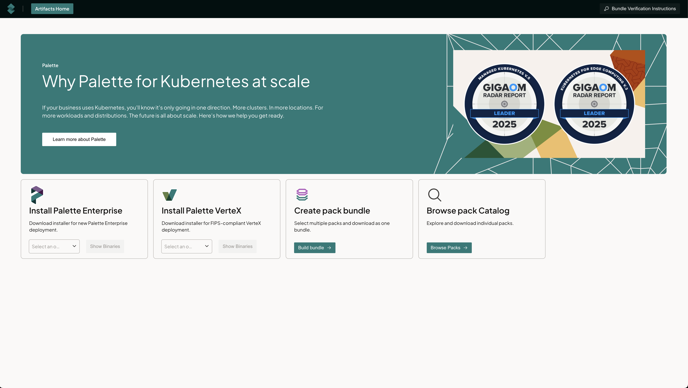
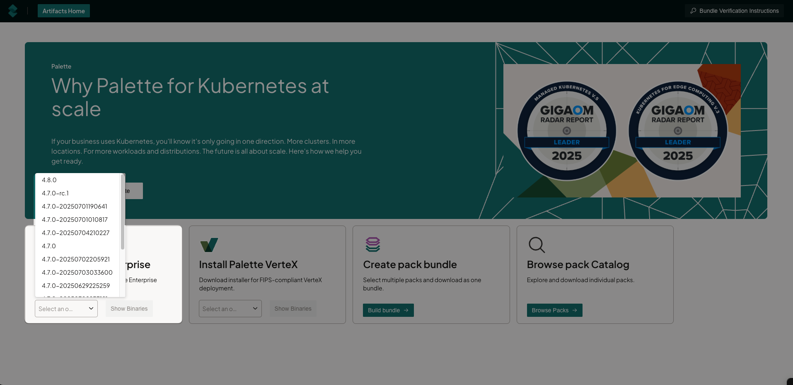
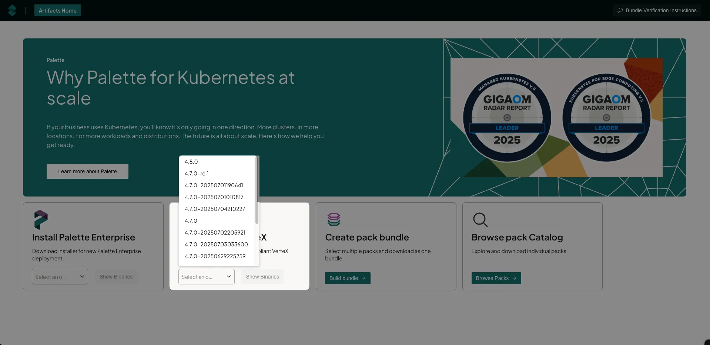
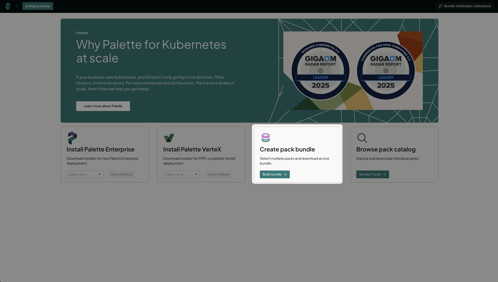
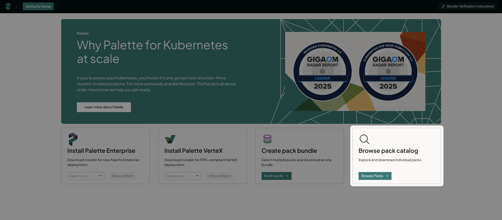
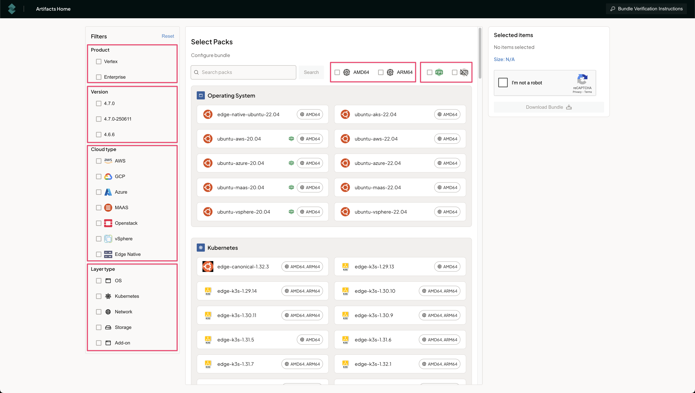
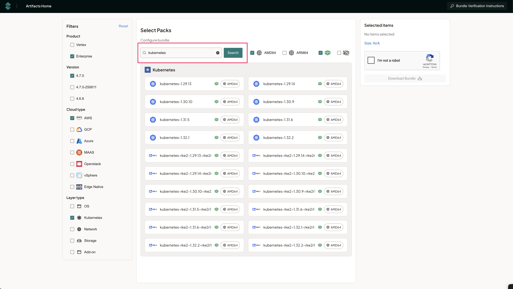
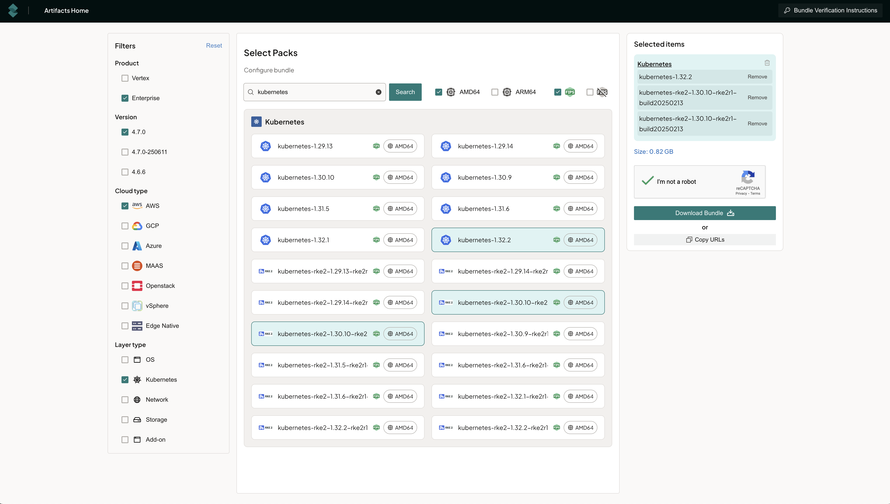

[Artifacts Studio](https://artifact-studio.internal.spectrocloud.com/) is a unified platform that helps airgapped and regulatory-focused organizations to populate their own internal registries with bundles, packs, and installers to be used with Palette or VerteX. It provides a single location for packs and images, streamlining access and management. There are four main areas for Artifacts:
	- Download of Palette Enterprise (binary or ISO).
	- Download of Palette VerteX (binary or ISO).
	- Create a pack bundle to download.
	- Browse pack Catalog to download individual packs. 

:::preview

:::



## Install Palette

1. Navigate to [Artifacts Studio](https://artifact-studio.internal.spectrocloud.com/).

2. From the drop-down, select the version needed, and click **Show Binaries**.

  

3. Click **Download** on **Enterprise Binary** or **Release ISO**, whichever file is appropriate for your environment. 


## Install Palette VerteX

1. Navigate to [Artifacts Studio](https://artifact-studio.internal.spectrocloud.com/).

2. From the drop-down, select the version needed, and click **Show Binaries**.

  

3. Click **Download** on **VerteX Binary** or **Release ISO**, whichever file is appropriate for your environment. 

## Create a Pack Bundle

1. Navigate to [Artifacts Studio](https://artifact-studio.internal.spectrocloud.com/).

2. Click on **Build bundle**.

:::tip

Ensure that pop-ups are enabled in your browser for [Artifacts Studio](https://artifact-studio.internal.spectrocloud.com/) to allow for multiple artifact downloads. 

:::



3. On the **Select Product** page select either **Palette Enterprise Appliance** or **Palette Vertex Appliance**. 

4. On the **Current Version** page select the version the pack bundle will run on. 

5. On the **Use case** page, select the use case for the bundle.

| Use Case   | Definition |
| ---------- | ---------- |
| Controller mode | Download specific component packs for your existing |
| Agent mode or Appliance mode | Get required packages for deploying Kubernetes at remote edge locations |
| Add-on only | Download just supplementary tools and features to enhance your clusters |
| FIPs? | TBA |
| additional? | TBA |

6. Select the Public Cloud or Data Center that you want to download bundles for.

7. On the **Build your bundle** page, select **OS**. This will start the process of building the bundle.

8. Select the Operating System and click **Next Layer**. 

9. Select the Kubernetes version and click **Next Layer**.

10. On the **Network** page select the Network pack to be used. Click **Next Layer**.

11. Select the Storage pack to be used and click **Next Layer**.

12. On the **Add Packs** page, select one or more add-on packs. Click **Add to Bundle**.

13. Click **Next Step**. 

14. Click the **I'm not a robot** reCAPTCHA to download the bundle. The bundle will download as individual pack files (`<filename>.zst`) and individual signature file (`<filename>.bin`). Ensure that all the files are saved in the same folder. 

15. Click on **Bundle Verification Instructions** found at the top right of the page. 

16. Download the public key file `public_key.pem`.

17. Use the following command to verify the individual pack integrity. 

```
openssl dgst -sha256 -verify public_key.pem -signature bundle-name.tar.sig.bin bundle-name.zst
```

18. A successful verification will show: **Verification OK**.

Alternatively, use the following sample script to check all the files downloaded in the same folder. Ensure that `REPLACE ME` is replaced with the name of the public key downloaded. 

```shell title="Example" {10}
 
# This script verifies the signatures of data files against a public key.
# It expects files named like `datafile.zst` and corresponding signatures `datafile.sig.bin`.
# Ensure you have OpenSSL installed to run this script and that the public key is in PEM format.
# Ensure the script has execute permissions: `chmod +x verify.sh`
# Usage: ./verify.sh 

#!/bin/bash

PUBKEY="REPLACE ME" # Enter path to public key file

for sigfile in *.sig.bin; do
  # Strip `.sig.bin` to get base filename and corresponding data file
  base="${sigfile%.sig.bin}"
  datafile="${base}.zst"

  if [[ ! -f "$datafile" ]]; then # Check if data file exists
    echo "$datafile: ❌ Data file not found" # Skip to next iteration  
    continue
  fi

  # Run signature verification
  if openssl dgst -sha256 -verify "$PUBKEY" -signature "$sigfile" "$datafile" > /dev/null 2>&1; then # Verify signature
    echo "$datafile: ✅ Signature valid" # Print success message
  else
    echo "$datafile: ❌ Signature invalid" # Print failure message
  fi
done
```

You should see the following output.

```shell title="Output Example"
cni-calico-3.29.2.zst: ✅ Signature valid
csi-aws-ebs-1.41.0.zst: ✅ Signature valid
kubernetes-1.32.3.zst: ✅ Signature valid
spectro-k8s-dashboard-7.11.1.zst: ✅ Signature valid
ubuntu-aws-22.04.zst: ✅ Signature valid
```

19. Click **Artifacts Home** to repeat the process for additional bundles.

## Download a Specific Pack

1. Click on **Browse Packs**.



2. Filter based on **Product**, **Version** (Product version), **Cloud type**, **Layer type**, CPU version and whether it is FIPS compliant or not. 



3. Enter your search terms and click **Search** to further filter. 



4. Select one or more packs, and click the **I'm not a robot** reCAPTCHA to download the bundle. The bundle will download as individual pack files (`<filename>.zst`) and individual signature file (`<filename>.bin`). Ensure that all the files are saved in the same folder.



5. Click on **Bundle Verification Instructions** found at the top right of the page. 

6. Download the public key file `public_key.pem`.

7. Use the following command to verify the individual pack integrity. 

```
openssl dgst -sha256 -verify public_key.pem -signature bundle-name.tar.sig.bin bundle-name.zst
```

8. A successful verification will show: **Verification OK**.

Alternatively, use the following sample script to check all the files downloaded in the same folder. Ensure that `REPLACE ME` is replaced with the name of the public key downloaded. 

```shell title="Example" {10}
 
# This script verifies the signatures of data files against a public key.
# It expects files named like `datafile.zst` and corresponding signatures `datafile.sig.bin`.
# Ensure you have OpenSSL installed to run this script and that the public key is in PEM format.
# Ensure the script has execute permissions: `chmod +x verify.sh`
# Usage: ./verify.sh 

#!/bin/bash

PUBKEY="REPLACE ME" # Enter path to public key file

for sigfile in *.sig.bin; do
  # Strip `.sig.bin` to get base filename and corresponding data file
  base="${sigfile%.sig.bin}"
  datafile="${base}.zst"

  if [[ ! -f "$datafile" ]]; then # Check if data file exists
    echo "$datafile: ❌ Data file not found" # Skip to next iteration  
    continue
  fi

  # Run signature verification
  if openssl dgst -sha256 -verify "$PUBKEY" -signature "$sigfile" "$datafile" > /dev/null 2>&1; then # Verify signature
    echo "$datafile: ✅ Signature valid" # Print success message
  else
    echo "$datafile: ❌ Signature invalid" # Print failure message
  fi
done
```

You should see the following output.

```shell title="Output Example"
cni-calico-3.29.2.zst: ✅ Signature valid
csi-aws-ebs-1.41.0.zst: ✅ Signature valid
kubernetes-1.32.3.zst: ✅ Signature valid
spectro-k8s-dashboard-7.11.1.zst: ✅ Signature valid
ubuntu-aws-22.04.zst: ✅ Signature valid
```
