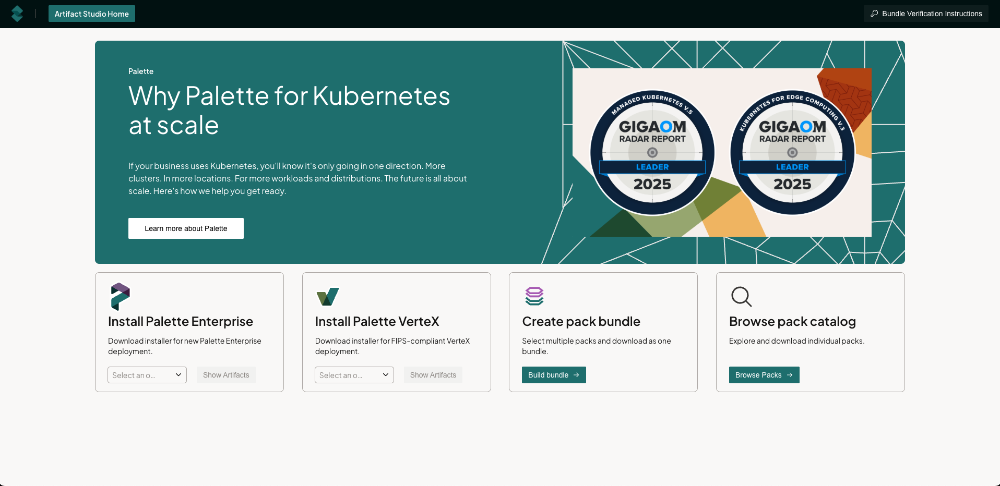
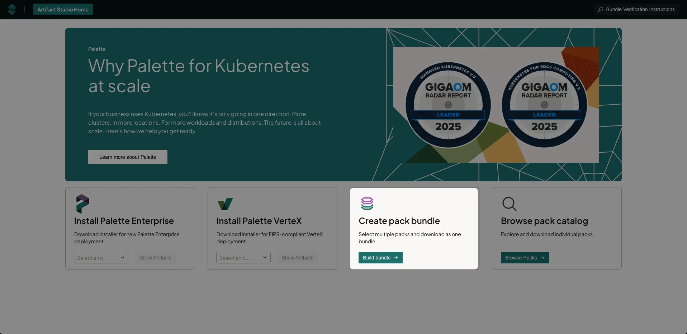
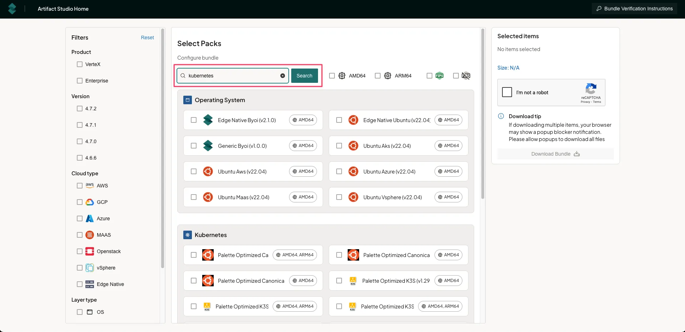
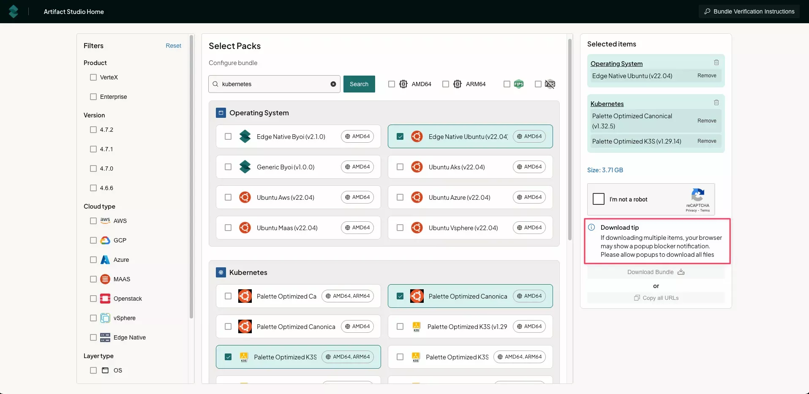

[Artifact Studio](https://artifact-studio.spectrocloud.com/) is a unified platform that helps airgapped,
regulatory-focused and security conscious organizations to populate their own internal registries with bundles, packs
and installers to be used with Palette or VerteX. It provides a single location for packs and images, streamlining
access and management.

**Who is this for?**

All self-hosted customers will be able to download the Palette or VerteX Management Appliance or Helm chart in order to
instantiate or upgrade their environment. Additionally, disconnected customers are able to browse through all available
packs, and download only the components you wish to use. You can also validate the integrity and authenticity of the
bundle via code signature. With these new artifact bundles, we are replacing the self-extracting binaries we create for
airgapped environments with a more familiar zstandard compressed format (`zst`) that can be moved and manipulated with
palette-cli.

There are four main artifact areas:

    - Install Palette Enterprise (content bundle, ISO or Helm chart).
    - Install Palette VerteX (content bundle, ISO or Helm chart).
    - Create a pack bundle to download.
    - Browse pack Catalog to download individual packs.

:::preview :::



## Install Palette Enterprise

1. Navigate to [Artifact Studio](https://artifact-studio.spectrocloud.com/).

2. From the drop-down, select the version needed, and click **Show Artifacts**.

3. Click **Download** on **Content bundle**, **Palette management appliance ISO**, or **Helm installation**, whichever
   file is appropriate for your environment.

Once you have the file, you can deploy Palette as a self-hosted application. Review the
[Self-Hosted Palette](../enterprise-version/install-palette/install-palette.md) for more information on deploying
Palette locally.

## Install Palette VerteX

1. Navigate to [Artifact Studio](https://artifact-studio.spectrocloud.com/).

2. From the drop-down, select the version needed, and click **Show Artifacts**.

3. Click **Download** on **Content bundle**, **VerteX management appliance ISO**, or **Helm installation**, whichever
   file is appropriate for your environment.

Once you have the file, you can deploy Palette VerteX as a self-hosted application. Review the
[VerteX Installation](../vertex/install-palette-vertex/install-palette-vertex.md) for more information on deploying
Palette VerteX locally.

## Create a Pack Bundle

:::warning Agent mode binaries are excluded from this release of Artifact Studio. They will be introduced in a later
release. :::

1. Navigate to [Artifact Studio](https://artifact-studio.spectrocloud.com/).

2. Click on **Build bundle**.

   :::tip

   Ensure that pop-ups are enabled in your browser for [Artifact Studio](https://artifact-studio.spectrocloud.com/) to
   allow for multiple artifact downloads.

   :::

   

3. On the **Select Product** page select either **Palette Enterprise Appliance** or **Palette Vertex Appliance**.

4. On the **Current Version** page select the version the pack bundle will installed on.

5. On the **Use case** page, select the use case for the bundle.

| **Use Case**                 | \*\*Definition                                                           |
| ---------------------------- | ------------------------------------------------------------------------ |
| Controller mode              | Download specific component packs for your existing environment.         |
| Agent mode or Appliance mode | Get required packages for deploying Kubernetes at remote edge locations. |
| Add-on only                  | Download just supplementary tools and features to enhance your clusters. |

6. On the **Configure cloud types**, select the appropriate cloud for your bundle. Depending on the use case, cloud
   types include **Public Clouds** (AWS, GCP, Azure), **Data Centers** (MAAS, OpenStack, vSphere) and **Bare Metal**
   (Edge Native)

7. On the **Configure bundle** page, select **OS**. This will start the process of building the bundle.

8. Select the Operating System and click **Next Layer**.

9. Select the Kubernetes version and click **Next Layer**.

10. On the **Network** page select the Network pack to be used. Click **Next Layer**.

11. Select the Storage pack to be used and click **Next Layer**.

12. On the **Add Packs** page, select one or more add-on packs. Click **Add to Bundle**.

13. Click **Next Step**.

14. On the **Review and download** page, click the **I'm not a robot** reCAPTCHA to download the bundle. The bundle will
    download as individual pack files (`<filename>.zst`) and individual signature file (`<filename>.bin`). Ensure that
    all the files are saved in the same folder. Alternatively, you click **Copy all URLs** to download the individual
    files via the individual URLs.

15. Click **Artifact Studio Home** to repeat the process for additional bundles.

### Bundle Download Verification

To verify the bundle integrity and authenticity, you can do a checksum verification of the files downloaded.

1. Click on **Bundle Verification Instructions** found at the top right of the page.

2. Download the public key file `spectro_public_key.pem`.

3. Use the following command to verify the individual pack integrity.

   ```
   openssl dgst -sha256 -verify spectro_public_key.pem -signature bundle-name.sig.bin bundle-name.zst
   ```

4. A successful verification will show: **Verification OK**.

   Alternatively, use the following sample script to check all the files downloaded in the same folder. Ensure that
   `REPLACE ME` is replaced with the path and name of the public key downloaded.

   ```shell title="Example" {10}

    # This script verifies the signatures of data files against a public key.
    # It expects files named like `datafile.zst` and corresponding signatures `datafile.sig.bin`.
    # Ensure you have OpenSSL installed to run this script and that the public key is in PEM format.
    # Ensure the script has execute permissions: `chmod +x verify.sh`
    # Usage: ./verify.sh

    #!/bin/bash

    PUBKEY="REPLACE ME" # Enter path to public key file

    for sigfile in *.sig.bin; do
      # Strip `.sig.bin` to get base filename and corresponding data file
      base="${sigfile%.sig.bin}"
      datafile="${base}.zst"

      if [[ ! -f "$datafile" ]]; then # Check if data file exists
        echo "$datafile: ❌ Data file not found" # Skip to next iteration
        continue
      fi

      # Run signature verification
      if openssl dgst -sha256 -verify "$PUBKEY" -signature "$sigfile" "$datafile" > /dev/null 2>&1; then # Verify signature
        echo "$datafile: ✅ Signature valid" # Print success message
      else
        echo "$datafile: ❌ Signature invalid" # Print failure message
      fi
    done
   ```

   You should see the following output.

   ```shell title="Output Example"
   cni-calico-3.30.1.zst: ✅ Signature valid
   csi-aws-ebs-1.43.0.zst: ✅ Signature valid
   kubernetes-1.32.4.zst: ✅ Signature valid
   spectro-k8s-dashboard-7.11.1.zst: ✅ Signature valid
   ubuntu-aws-22.04.zst: ✅ Signature valid
   ```

## Download a Specific Pack

1. Click on **Browse Packs**.

   

2. Filter based on **Product**, **Version** (Product version), **Cloud type**, **Layer type**, CPU version and whether
   it is FIPS compliant or not.

3. Enter your search terms and click **Search** to further filter.

   

4. Select one or more packs, and click the **I'm not a robot** reCAPTCHA to download the bundle. The bundle will
   download as individual pack files (`<filename>.zst`) and individual signature file (`<filename>.bin`). Ensure that
   all the files are saved in the same folder. Alternatively, you click **Copy all URLs** to download the individual
   files via the individual URLs.

   

   :::tip

   Ensure that pop-ups are enabled in your browser for [Artifact Studio](https://artifact-studio.spectrocloud.com/) to
   allow for multiple artifact downloads.

   :::

### Specific Pack Download Verification

To verify the bundle integrity and authenticity, you can do a checksum verification of the files downloaded.

1. Click on **Bundle Verification Instructions** found at the top right of the page.

2. Download the public key file `spectro_public_key.pem`.

3. Use the following command to verify the individual pack integrity.

   ```
   openssl dgst -sha256 -verify spectro_public_key.pem -signature bundle-name.sig.bin bundle-name.zst
   ```

4. A successful verification will show: **Verification OK**.

   Alternatively, use the following sample script to check all the files downloaded in the same folder. Ensure that
   `REPLACE ME` is replaced with the path and name of the public key downloaded.

   ```shell title="Example" {10}

    # This script verifies the signatures of data files against a public key.
    # It expects files named like `datafile.zst` and corresponding signatures `datafile.sig.bin`.
    # Ensure you have OpenSSL installed to run this script and that the public key is in PEM format.
    # Ensure the script has execute permissions: `chmod +x verify.sh`
    # Usage: ./verify.sh

    #!/bin/bash

    PUBKEY="REPLACE ME" # Enter path to public key file

    for sigfile in *.sig.bin; do
      # Strip `.sig.bin` to get base filename and corresponding data file
      base="${sigfile%.sig.bin}"
      datafile="${base}.zst"

      if [[ ! -f "$datafile" ]]; then # Check if data file exists
        echo "$datafile: ❌ Data file not found" # Skip to next iteration
        continue
      fi

      # Run signature verification
      if openssl dgst -sha256 -verify "$PUBKEY" -signature "$sigfile" "$datafile" > /dev/null 2>&1; then # Verify signature
        echo "$datafile: ✅ Signature valid" # Print success message
      else
        echo "$datafile: ❌ Signature invalid" # Print failure message
      fi
    done
   ```

   You should see the following output.

   ```shell title="Output Example"
   cni-calico-3.30.1.zst: ✅ Signature valid
   csi-aws-ebs-1.43.0.zst: ✅ Signature valid
   kubernetes-1.32.4.zst: ✅ Signature valid
   spectro-k8s-dashboard-7.11.1.zst: ✅ Signature valid
   ubuntu-aws-22.04.zst: ✅ Signature valid
   ```
