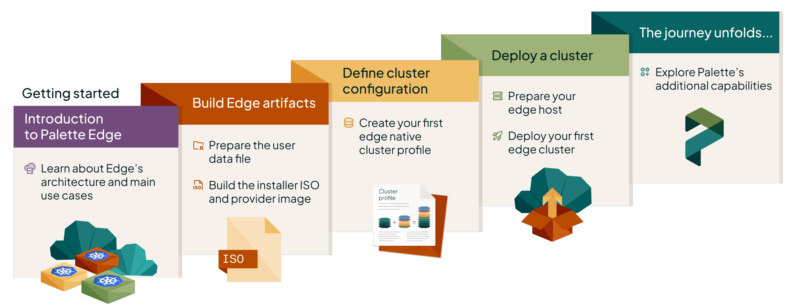

This section gives you an overview of how to get started with Palette Edge. You will learn how Palette simplifies the
deployment of Kubernetes clusters at the edge, along with all the steps required to deploy your first Edge cluster, such
as building the necessary artifacts and preparing the host. The concepts you learn about in the Getting Started section
are centered around a fictional case study company. This approach gives you a solution focused approach, while
introducing you to centrally managed Palette Edge workflows and capabilities.

## 🧑‍🚀 Spacetastic Journey Continues!

Spacetastic's platform had reached a steady state. Clusters in the cloud were stable, updates were predictable, and operational overhead had dropped significantly. 

The company is expanding into over 500 locations in the form of touch-screen kiosks. And this expansion has resulted into a new emerging requirement: applications needed to run closer to users. This means deploying infrastructure directly into schools, museums, airports, and other edge environments.

While the environments were new, the requirements were familiar:

- Consistent deployments across locations
- Strong security posture
- Minimal reliance on on-site expertise
- The ability to roll out updates quickly and safely

Each location effectively will become a small, self-contained environment. At scale, this introduces a new challenge: managing hundreds of distributed clusters without increasing operational complexity.

>Anya and Wren came into the office, vibrating with excitement. "We're going physical!", Anya exclaimed. 
>
>Meera peered over their screen, with a quizzical look. "Define physical."
>
>Wren, Founding Engineer, added, "We've partnered with over 500+ locations... And we can't treat these like cloud clusters."
>
>Kai nods knowingly. As a Platform Engineer, they recognize the challenges that comes with rapid growth. "What if we treat edge like cloud -- just smaller -- and manage everything centrally?" 

The meeting room whiteboard was filled. The discussion has highlighted some of the challenges that Spacetastic will face.

>"We cannot manage these manually," Wren emphasizes. "Too many locations, too great a distance, none of us onsite." 
>
>Meera nodded in agreement, and added, "We also need to maintain our security stance. We cannot sacrifice this just to deploy."

Explore the following tutorials to learn how to deploy your first centrally managed Edge cluster with Palette. Each
tutorial is designed to guide you step-by-step, building on the concepts introduced in the previous one.

<!-- vale off -->

<SimpleCardGrid
  cards={[
    {
      title: "Introduction to Edge",
      description: "Learn about Spectro Cloud Palette Edge.",
      buttonText: "Learn more",
      url: "/tutorials/getting-started/palette-edge/introduction-edge",
    },
    {
      title: "Prepare User Data",
      description: "Create a user data file for your Edge deployment.",
      buttonText: "Learn more",
      url: "/tutorials/getting-started/palette-edge/central-management/prepare-user-data",
    },
    {
      title: "Build Edge Artifacts",
      description: "Build the artifacts required for your Edge deployment.",
      buttonText: "Learn more",
      url: "/tutorials/getting-started/palette-edge/entral-management/build-edge-artifacts",
    },
    {
      title: "Create Edge Cluster Profile",
      description: "Create an Edge native cluster profile to deploy Edge workloads.",
      buttonText: "Learn more",
      url: "/tutorials/getting-started/palette-edge/entral-management/edge-cluster-profile",
    },
    {
      title: "Prepare Edge Host",
      description: "Install the Palette agent on your Edge host and register the host with Palette.",
      buttonText: "Learn more",
      url: "/tutorials/getting-started/palette-edge/entral-management/prepare-edge-host",
    },
    {
      title: "Deploy Edge Cluster",
      description: "Deploy an Edge cluster with Palette.",
      buttonText: "Learn more",
      url: "/tutorials/getting-started/palette-edge/entral-management/deploy-edge-cluster",
    },
  ]}
/>
