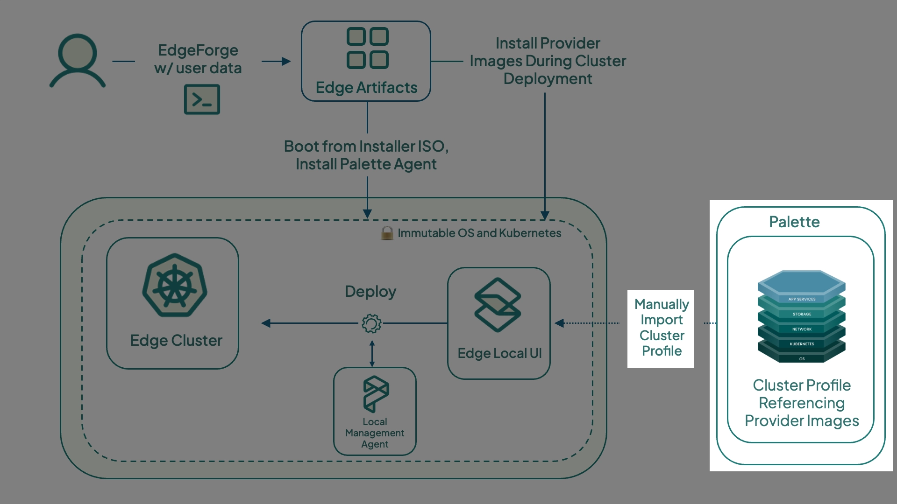

With locally managed Edge, you must export the
[cluster profile](../../../../../docs-content/profiles/cluster-profiles.md) from Palette as a
[cluster definition](../../../../clusters/edge/local-ui/cluster-management/export-cluster-definition.md) and upload it
to the Edge device. A cluster definition contains one or more cluster profiles, including their profile variables.

A [content bundle](../../../../clusters/edge/edgeforge-workflow/palette-canvos/build-content-bundle.md) is an archive
that includes all required container images for one or more profiles. It contains the Helm charts, packs, and manifest
files needed to deploy your Edge host cluster. In addition to core container images, the content bundle can also include
application artifacts that you want to deploy to the Edge cluster.

This tutorial teaches you how to create the content bundle you created in the
[Create Edge Cluster Profile](./edge-cluster-profile.md) tutorial using the
[Palette CLI](../../../../downloads/cli-tools.md#palette-cli).



## Prerequisites

- You have completed the steps in the [Create Edge Cluster Profile](./edge-cluster-profile.md) and
  [Prepare Edge Host](./prepare-edge-host.md) tutorials.
- A [Palette account](https://www.spectrocloud.com/get-started).
- A valid Palette [API key](../../../../user-management/authentication/api-key/create-api-key.md).
- The [ID of the project](../../../../tenant-settings/projects/projects.md#project-id) where you created your cluster
  profile.
- The
  [cluster profile ID](../../../../clusters/edge/local-ui/cluster-management/export-cluster-definition.md#enablement-1).
- A physical or virtual Linux machine with _AMD64_ (also known as _x86_64_) processor architecture. You can issue the
  following command in the terminal to check your processor architecture.

  ```bash
  uname -m
  ```

### Export and Download Cluster Profile

Download [Palette CLI](../../../../downloads/cli-tools.md#palette-cli) to your Linux machine. This tutorial uses Palette
CLI version 4.8.7.

<!-- vale off -->

```shell
wget https://software.spectrocloud.com/palette-cli/v4.8.7/cli/linux/palette
chmod +x palette
```

Then execute the `palette content build` command to export a cluster definition for the specified cluster profile within
a designated project. This command generates a TGZ cluster definition file in the `<current-directory>/output/` folder,
and a content bundle in the `<current-directory>/output/content-bundle/ folder` by default. The table below lists the
flags used in the command.

| **Flag**                           | **Description**                                                                                                                                                                                                                                                                                                       |
| ---------------------------------- | --------------------------------------------------------------------------------------------------------------------------------------------------------------------------------------------------------------------------------------------------------------------------------------------------------------------- |
| `--arch`                           | The architecture of the bundle to be built. The available options are `amd64` and `arm64`.                                                                                                                                                                                                                            |
| `--project-id`                     | The ID of the Palette project.                                                                                                                                                                                                                                                                                        |
| `--profile`                        | Comma-separated list of cluster profile IDs to download content for the content bundle. For this tutorial, only one cluster profile ID is needed.                                                                                                                                                                     |
| `--cluster-definition-name`        | The filename of the cluster definition TGZ file.                                                                                                                                                                                                                                                                      |
| `--cluster-definition-profile-ids` | A comma-separated list of cluster profile IDs to be included in the cluster definition. For this tutorial, only one cluster profile ID is needed.                                                                                                                                                                     |
| `--name`                           | The name of the content bundle. This is required to generate bundles with unique names. If not provided, the command generates a default name in the `<bundle>-<project-id>` format, which is not unique and may lead to issues, as bundles using the same default name can be overwritten during upload to Local UI. |

Execute the following Palette CLI command to generate the cluster profile compressed TGZ file.

```shell
./palette content build --arch <bundle-architecture> \
--project-id <project-id> \
--profiles <cluster-profile-id1,cluster-profile-id2...> \
--cluster-definition-name <cluster-definition-name> \
--cluster-definition-profile-ids <cluster-definition-profile-ids> \
--name <bundle-name>
```

Alternatively, use the interactive script below to be prompted for the required values when executing the Palette CLI
command. The API key appears blank for security reasons.

```shell
#!/usr/bin/env bash
set -euo pipefail

# --- Inputs ---
read -rsp "Enter Palette API key: " apikey
echo
read -rp "Enter Palette Project UID: " projectuid
read -rp "Enter Cluster Profile UID(s) (comma-separated if multiple): " profileuids
read -rp "Palette console URL [https://console.spectrocloud.com]: " console_url
read -rp "Enter custom tag (used for naming): " custom_tag
read -rsp "Enter Palette CLI encryption passphrase: " enc_pass
echo

# Default console URL
console_url=${console_url:-https://console.spectrocloud.com}

bundle_name="${custom_tag}-content-bundle"
definition_name="${custom_tag}-cluster-definition"

echo
echo "Logging into Palette CLI..."
palette login \
  --api-key "${apikey}" \
  --console-url "${console_url}" \
  --encryption-passphrase "${enc_pass}"

echo
echo "Building content bundle..."
echo "  Cluster definition: ${definition_name}"
echo "  Bundle name:        ${bundle_name}"
echo

palette content build \
  --arch amd64 \
  --project-id "${projectuid}" \
  --profiles "${profileuids}" \
  --cluster-definition-name "${definition_name}" \
  --cluster-definition-profile-ids "${profileuids}" \
  --name "${bundle_name}" \
  --include-core-palette-images-only \
  --progress

bundle_path="./output/content-bundle/${bundle_name}.tar.zst"

echo
echo "Done ✅"
echo
echo "Content bundle created:"
echo "  ${bundle_path}"
echo
echo "Transfer this file to the airgapped Edge device and upload it via:"
echo "  - Local UI"
echo "  - or: palette content upload (from a reachable system)"
echo
```

After it is built, upload the TGZ file to the locally managed Edge device using the Local UI. If you are accessing the
Local UI from a system other than the Linux system where the file was generated, download the TGZ file first. For
example, you can use `scp` to copy the file from the remote Linux system to your current directory.

```shell

scp <username>@<ip-of-linux-system>:/path/to/<filename>.tgz .

```

## Next Steps

In this tutorial, you learned how to create and download a cluster definition to be used on your Edge device. We
recommend proceeding to the [Deploy Cluster](./deploy-edge-cluster.md) tutorial to learn how to deploy the cluster on a
locally managed Edge device.
