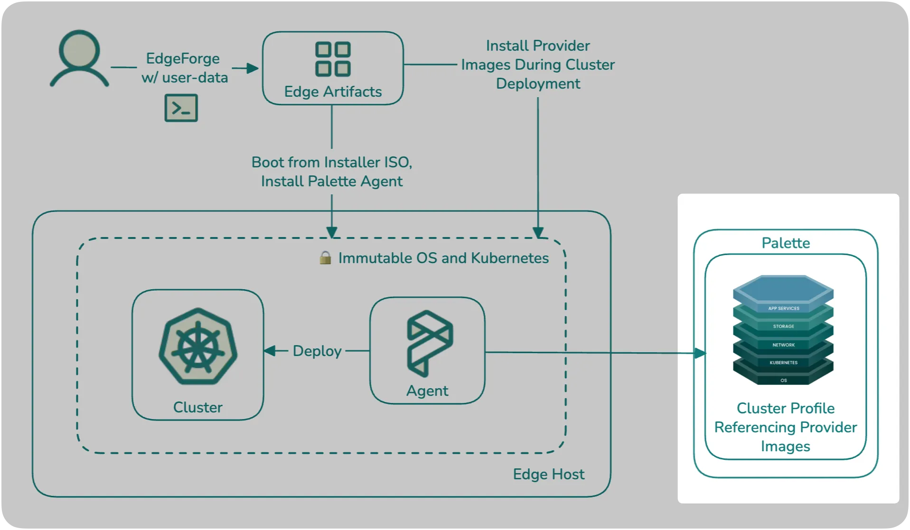

[Cluster profiles](../../../../profiles/profiles.md) are declarative, full-stack models that Palette uses to provision,
scale, and maintain Kubernetes clusters. They are composed of layers, which can be Kubernetes manifests, Helm charts, or
packs. [Packs](../../../../registries-and-packs/registries-and-packs.md) are a collection of files and configurations
deployed to a cluster to provide core infrastructure functionality or customize the cluster's behavior through add-on
integrations.

This tutorial teaches you how to create an Edge native cluster profile that includes the core infrastructure layers and
a demo application that you can access on your browser. You will learn about cluster profile layers and how to reference
the provider images that you built in the [Build Edge Artifacts](./build-edge-artifacts.md) tutorial. After creating the
cluster profile, you will proceed to the next tutorial, where you will use the installer ISO to bootstrap the Edge
installation on your host and use it as a node for deploying your first Edge cluster.



## Prerequisites

- You have completed the steps in the [Build Edge Artifacts](./build-edge-artifacts.md) tutorial, including building the
  installer ISO and provider image, and pushing the provider image to a registry.
- A [Palette account](https://www.spectrocloud.com/get-started) with
  [tenant admin](../../../../tenant-settings/tenant-settings.md) access.
- One available IP address on the same network as the Edge host for the MetalLB load balancer.

### Export and Download Cluster Profile

With the cluster profile created, you will need to export it as a compressed `.tgz` file. You will need to download the
[Palette Edge CLI](../../../../downloads/cli-tools.md#palette-edge-cli) to your Linux machine.

<!-- vale off -->

```shell
VERSION=<palette-edge-cli-version>
wget https://software.spectrocloud.com/stylus/v$VERSION/cli/linux/palette-edge
chmod +x palette-edge
```

<Tabs groupId="cli-options">

<TabItem label="Palette CLI" value="Palette CLI">

You will use the Palette Edge CLI tool to authenticate against Palette, and download a specific cluster profile from a
specific project. You will need the following values:

- [API Key](../../../../user-management/authentication/api-key/create-api-key.md)
- [Project ID](../../../../tenant-settings/projects/projects.md#project-id)
- [Cluster Profile ID](../../../../clusters/edge/local-ui/cluster-management/export-cluster-definition.md#enablement-1)

Use the following Palette Edge ClI to generate the cluster profile compressed `.tgz` file.

```shell
./palette-edge build --api-key <apikey> --project-id <project-id> \
--cluster-profile-ids <profile-id> --cluster-definition-profile-ids <profile-id> \
--palette-endpoint <https://api.yourpalette> --cluster-definition-name <cluster-profile-name> \
--outfile <cluster-profile-name.tgz> --include-palette-content
```

```shell
#!/usr/bin/env bash
set -euo pipefail

# --- Inputs ---
read -rsp "Enter Palette API key: " apikey
echo
read -rp "Enter Palette Project UID: " projectuid
read -rp "Enter Cluster Profile UID(s) (comma-separated if multiple): " profileuids
read -rp "Palette console URL [https://console.spectrocloud.com]: " console_url
read -rp "Enter custom tag (used for naming): " custom_tag
read -rsp "Enter Palette CLI encryption passphrase: " enc_pass
echo

# Default console URL
console_url=${console_url:-https://console.spectrocloud.com}

bundle_name="${custom_tag}-content-bundle"
definition_name="${custom_tag}-cluster-definition"

echo
echo "Logging into Palette CLI..."
palette login \
  --api-key "${apikey}" \
  --console-url "${console_url}" \
  --encryption-passphrase "${enc_pass}"

echo
echo "Building content bundle..."
echo "  Cluster definition: ${definition_name}"
echo "  Bundle name:        ${bundle_name}"
echo

palette content build \
  --arch amd64 \
  --project-id "${projectuid}" \
  --profiles "${profileuids}" \
  --cluster-definition-name "${definition_name}" \
  --cluster-definition-profile-ids "${profileuids}" \
  --name "${bundle_name}" \
  --include-core-palette-images-only \
  --progress

bundle_path="./output/content-bundle/${bundle_name}.tar.zst"

echo
echo "Done ✅"
echo
echo "Content bundle created:"
echo "  ${bundle_path}"
echo
echo "Transfer this file to the airgapped Edge device and upload it via:"
echo "  - Local UI"
echo "  - or: palette content upload (from a reachable system)"
echo
```

</TabItem>

<TabItem label="Palette Edge CLI" value="Palette Edge CLI">
Alternatively, you can use the script below to prompt you when doing the Palette Edge CLI command. The API key will
appear blank for security reasons.

```shell
#!/usr/bin/env bash

set -euo pipefail

# Prompt for variables
read -rsp "Enter API key: " apikey #hide the API when entered in
echo
read -rp "Enter Project UID: " projectuid
read -rp "Enter Profile UID: " profileuid
read -rp "Palette API endpoint [https://api.spectrocloud.com]: " apiendpoint
read -rp "Enter custom tag (used for naming): " custom_tag

# Default endpoint if empty
apiendpoint=${apiendpoint:-https://api.spectrocloud.com}

echo
echo "Building content bundle..."
echo "  Cluster definition: ${custom_tag}-cluster-definition"
echo "  Output file:        ${custom_tag}-content-bundle"
echo

./palette-edge build \
  --api-key "$apikey" \
  --project-id "$projectuid" \
  --cluster-profile-ids "$profileuid" \
  --cluster-definition-profile-ids "$profileuid" \
  --palette-endpoint "$apiendpoint" \
  --cluster-definition-name "${custom_tag}-cluster-definition" \
  --outfile "${custom_tag}-content-bundle" \
  --include-palette-content

echo
echo "Done ✅"
```

</TabItem>

</Tabs>

The `.tgz` file will need to be uploaded to the locally managed Edge device after it is built using the Edge UI. If you
are using a browser on a system other than your Linux system to access the Edge UI, you will need to download the `.tgz`
file.

```shell

scp <username>@<ip-of-linux-system>:/path/to/<filename>.tgz .

```

## Next Steps

In this tutorial, you learned how to install the Palette agent on your host and register the host with Palette. We
recommend proceeding to the [Build Content Bundle](./build-content-bundle.md) tutorial to learn how to build the cluster
content bundle to use on the locally managed Edge device.
