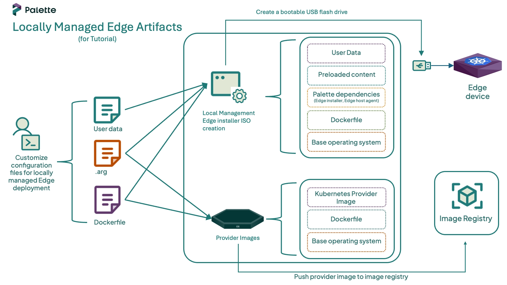

One of the first steps in deploying an Edge cluster is preparing your locally managed Edge host with all the required
artifacts. The process of building these artifacts is called
[EdgeForge](../../../../clusters/edge/edgeforge-workflow/edgeforge-workflow.md), and it is responsible for generating
the installer ISO and provider image artifacts.

- Installer ISO: An ISO image that installs the Palette Edge agent on the host.
- Provider Images: [Kairos-based](https://kairos.io/) images that include the Operating System (OS) and the desired
  Kubernetes versions. These images install an immutable OS and the software dependencies compatible with the selected
  Kubernetes version during cluster deployment.

This tutorial teaches you how to build the artifacts required for your Edge deployment. Once built, you will be ready to
learn how to reference them in Edge [cluster profiles](../../../../profiles/profiles.md) and how they are used to
install the Palette agent on hosts.



## Prerequisites

To complete this tutorial, ensure the following prerequisites are in place.

- You have completed the steps in the [Prepare User Data for Edge Installation](./prepare-user-data.md) tutorial,
  including cloning the CanvOS repository and creating and validating a user data file.
- A physical or virtual Linux machine with an AMD64 (also known as `x86_64`) processor architecture and the following
  minimum hardware configuration:
  - 4 CPUs
  - 8 GB memory
  - 300 GB storage
- Access to a public image registry and permissions to push images. This tutorial uses
  [Docker Hub](https://www.docker.com/products/docker-hub/) as an example. If you need to use a private registry, refer
  to the
  [Deploy Cluster with a Private Provider Registry](../../../../clusters/edge/site-deployment/deploy-custom-registries/deploy-private-registry.md)
  guide for instructions on how to configure the credentials.
- The following software installed on the Linux machine:
  - [Docker Engine](https://docs.docker.com/engine/install/) with
    [`sudo`](https://docs.docker.com/engine/install/linux-postinstall/) privileges. Alternatively, you can install
    [Earthly](https://earthly.dev/), in which case you do not need `sudo` privileges.
  - [jq](https://jqlang.org/download/), if you build the artifacts using the [script](#automate-edgeforge).
  - [Git](https://git-scm.com/book/en/v2/Getting-Started-Installing-Git)

## Define Build Arguments

Open a terminal window on your Linux machine and navigate to the `CanvOS` repository that you cloned in the
[Prepare User Data for Edge Installation](./prepare-user-data.md) tutorial. This repository contains the utilities
required to build the artifacts.

```shell
cd CanvOS
```

Check the available Git tags.

```shell
git tag --sort=v:refname
```

Check out the desired tag. We recommend using a CanvOS minor version that is the same as, or older than, Palette's minor
version. This tutorial uses the tag `v4.8.8` as an example.

```
git checkout v4.8.8
```

EdgeForge leverages [Earthly](https://earthly.dev/) to build the installer ISO and provider images artifacts. A `.arg`
file is used to pass the values of a few arguments, such as the provider image tag and registry name, to Earthly for the
build process.

:::info

While both the `.arg` file and [user-data](./prepare-user-data.md) file are configuration files used during the
EdgeForge process, they serve different purposes. The `.arg` file is used to customize the Edge artifact build process.
For example, you can specify the name of the installer ISO to be built, the Kubernetes distribution and version for the
provider images, the registry to push the images to, and more. The
[Edge Artifact Build Configurations](../../../../clusters/edge/edgeforge-workflow/palette-canvos/arg.md) page contains a
list of all the configurable parameters. In contrast, the `user-data` file focuses on customizing the installer ISO.
When the Edge host boots from the installer ISO, it applies the user data configuration to the host.

:::

Set a custom tag for the provider images. The tag must be an alphanumeric lowercase string. This tutorial uses
`local-edge` as an example. Additionally, replace `spectrocloud` with the name of your registry.

```bash
export CUSTOM_TAG=local-edge
export IMAGE_REGISTRY=spectrocloud
```

Next, issue the following command to create the `.arg` file using the custom tag and registry. The remaining arguments
use predefined values. For example, this tutorial uses [K3s](https://k3s.io/) version `1.32.3` as the Kubernetes
distribution and Ubuntu as the OS distribution. Review the `k8s_version.json` file in the CanvOS repository for all
supported Kubernetes versions.

:::warning

If you are using a CanvOS tag that is earlier than v4.4.12, the `k8s_version.json` file does not exist in those tags. In
that case, review the `Earthfile` file in the CanvOS repository for all supported Kubernetes versions.

:::

```bash
cat << EOF > .arg
CUSTOM_TAG=$CUSTOM_TAG
IMAGE_REGISTRY=$IMAGE_REGISTRY
OS_DISTRIBUTION=ubuntu
IMAGE_REPO=ubuntu
OS_VERSION=22.04
K8S_DISTRIBUTION=k3s
K8S_VERSION=1.32.3
ISO_NAME=palette-local-edge-installer
ARCH=amd64
UPDATE_KERNEL=false
EOF
```

Verify that the file was created correctly using the `cat` command.

```
cat .arg
```

## Build Artifacts

Issue the following command to build the Edge artifacts.

```bash
sudo ./earthly.sh +build-all-images
```

The build may take 15 to 20 minutes to complete, depending on the hardware resources available on the host machine. Once
complete, a success message appears.

```text hideClipboard title="Example Success Message"
========================== 🌍 Earthly Build  ✅ SUCCESS ==========================
```

The output also includes a manifest with predefined values required to create the Edge cluster profile. These parameters
reference the built provider image. Copy and save the manifest, as you will need it for the next tutorial.

<!-- prettier-ignore -->
```yaml
pack:
  content:
    images:
      - image: "{{.spectro.pack.edge-native-byoi.options.system.uri}}"
  # Below config is default value, please uncomment if you want to modify default values
  #drain:
    #cordon: true
    #timeout: 60 # The length of time to wait before giving up, zero means infinite
    #gracePeriod: 60 # Period of time in seconds given to each pod to terminate gracefully. If negative, the default value specified in the pod will be used
    #ignoreDaemonSets: true
    #deleteLocalData: true # Continue even if there are pods using emptyDir (local data that will be deleted when the node is drained)
    #force: true # Continue even if there are pods that do not declare a controller
    #disableEviction: false # Force drain to use delete, even if eviction is supported. This will bypass checking PodDisruptionBudgets, use with caution
    #skipWaitForDeleteTimeout: 60 # If pod DeletionTimestamp older than N seconds, skip waiting for the pod. Seconds must be greater than 0 to skip.
options:
  system.uri: "{{ .spectro.pack.edge-native-byoi.options.system.registry }}/{{ .spectro.pack.edge-native-byoi.options.system.repo }}:{{ .spectro.pack.edge-native-byoi.options.system.k8sDistribution }}-{{ .spectro.system.kubernetes.version }}-{{ .spectro.pack.edge-native-byoi.options.system.peVersion }}-{{ .spectro.pack.edge-native-byoi.options.system.customTag }}"


  system.registry: spectrodocs
  system.repo: edge
  system.k8sDistribution: k3s
  system.osName: ubuntu
  system.peVersion: v4.8.8
  system.customTag: local-edge
  system.osVersion: 22.04
```

Confirm that the Edge installer ISO and its checksum have been created correctly.

```bash
ls build
```

```text hideClipboard
palette-local-edge-installer.iso  palette-local-edge-installer.iso.sha256
```

List the container images to confirm that the provider images were built successfully.

```bash
docker images --filter=reference="*/*:*$CUSTOM_TAG"
```

```text hideClipboard
REPOSITORY            TAG                                          IMAGE ID       CREATED          SIZE
spectrocloud/ubuntu   k3s-1.32.3-v4.8.8-local-edge               d28750baa9a6   33 minutes ago   4.33GB
spectrocloud/ubuntu   k3s-1.32.3-v4.8.8-local-edge_linux_amd64   d28750baa9a6   33 minutes ago   4.33GB
```

## Push Provider Images

To use the provider image with your Edge deployment, push it to the image registry specified in the `.arg` file. Issue
the following command to log in to Docker Hub. Provide your Docker ID and password when prompted.

```bash
docker login
```

```text hideClipboard
Login Succeeded
```

Once authenticated, push the provider image to the registry so that your Edge host can download it during the cluster
deployment.

```bash
docker push $IMAGE_REGISTRY/ubuntu:k3s-1.32.3-v4.8.8-$CUSTOM_TAG
```

The output confirms that the image was pushed to the registry with the correct tag and is ready to be used in a cluster
profile.

```text hideClipboard
...
k3s-1.32.3-v4.8.8-local-edge: digest: sha256:518f937c3256e49c31b54ae72404812c99198281ddea647183b6ee8fc6938aaa size: 16576
```

## Automate EdgeForge

The following example script automates the EdgeForge process. It provides an alternative way to build the artifacts if
you have already learned the steps and want to replicate them quickly. You can skip this section if you have followed
the tutorial and built the artifacts manually.

The script clones the CanvOS repository, and uses the `user-data` and `.arg` files provided by the user. It then builds
the Edge artifacts. The script prompts the user to optionally push the provider images to the registry.

Follow the steps below to build the artifacts using the script.

<!-- vale off -->

<details>
<summary>EdgeForge Automation Example Script</summary>

1. Ensure you are in the CanvOS folder

   ```shell
   pwd
   ```

2. Open a terminal window on your Linux machine and issue the following command to create the script file.


      ```shell
        cat << EOF > edgeforge.sh
        #!/usr/bin/env bash
        set -Eeuo pipefail

        # -----------------------------
        # Tutorial expectations
        # -----------------------------
        REQUIRED_TAG="${REQUIRED_TAG:-v4.8.8}"
        USER_DATA_SRC="${USER_DATA_SRC:-./user-data}"
        ARG_FILE="${ARG_FILE:-./.arg}"

        # -----------------------------
        # Helpers
        # -----------------------------
        die() { echo "❌ $*" >&2; exit 1; }
        info() { echo "ℹ️  $*"; }
        ok() { echo "✅ $*"; }

        require_cmd() {
        for c in "$@"; do
            command -v "$c" >/dev/null 2>&1 || die "Missing required command: $c"
        done
        }

        # -----------------------------
        # Preconditions
        # -----------------------------
        require_cmd git sudo awk grep tee mktemp docker

        git rev-parse --is-inside-work-tree >/dev/null 2>&1 \
        || die "Run this from inside the CanvOS git repository."

        [ -f "./earthly.sh" ] \
        || die "earthly.sh not found. Run this script from the root of the CanvOS repository."

        CURRENT_TAG="$(git describe --tags --exact-match 2>/dev/null || true)"
        [ -n "$CURRENT_TAG" ] \
        || die "You are not on a release tag. Run: git checkout ${REQUIRED_TAG}"

        if [ "$CURRENT_TAG" != "$REQUIRED_TAG" ]; then
          die "You are on tag '${CURRENT_TAG}', but this tutorial expects '${REQUIRED_TAG}'. 
        Run: git checkout ${REQUIRED_TAG}"
        fi
        ok "Detected CanvOS tag: $CURRENT_TAG"

        [ -f "./k8s_version.json" ] \
        || die "k8s_version.json not found. Ensure you checked out ${REQUIRED_TAG} (or v4.4.12+)."

        # -----------------------------
        # Validate required input files
        # -----------------------------
        [ -f "$USER_DATA_SRC" ] \
        || die "user-data file not found at: $USER_DATA_SRC"

        [ -f "$ARG_FILE" ] \
        || die ".arg file not found at: $ARG_FILE"

        ok "Using user-data: $USER_DATA_SRC"
        ok "Using arg file: $ARG_FILE"

        # Ensure user-data is named correctly for build
        if [ "$USER_DATA_SRC" != "./user-data" ]; then
        cp -f "$USER_DATA_SRC" ./user-data
        ok "Copied user-data -> ./user-data"
        fi

        # -----------------------------
        # Validate user-data
        # -----------------------------
        info "Validating user-data..."
        VALIDATION_OUTPUT="$(sudo ./earthly.sh +validate-user-data 2>&1 || true)"

        if echo "$VALIDATION_OUTPUT" | grep -iEq \ 
        "Validation successful|user data validated successfully"; then
        ok "User data validation passed."
        else
        echo "$VALIDATION_OUTPUT" >&2
        die "User data validation failed. Please check ./user-data and try again."
        fi

        # -----------------------------
        # Build artifacts
        # -----------------------------
        info "Building Edge artifacts..."
        TEMP_BUILD_LOG="$(mktemp)"
        trap 'rm -f "$TEMP_BUILD_LOG"' EXIT

        sudo ./earthly.sh +build-all-images | tee "$TEMP_BUILD_LOG"
        ok "Artifacts built successfully."

        # Extract manifest profile YAML
        awk '/^pack:/{flag=1} flag' "$TEMP_BUILD_LOG" > manifest-profile.yaml

        if [ -s manifest-profile.yaml ]; then
        ok "Extracted manifest profile YAML -> ./manifest-profile.yaml"
        else
        die "Failed to extract manifest profile YAML from build output."
        fi

        # -----------------------------
        # Optional: push image (OFF by default for airgap)
        # -----------------------------
        read -r -p "Push provider image to a registry now? [y/N]: " PUSH_CHOICE
        PUSH_CHOICE="${PUSH_CHOICE:-N}"

        if [[ "$PUSH_CHOICE" =~ ^[Yy]$ ]]; then
        set -a
        # shellcheck disable=SC1091
        source "$ARG_FILE"
        set +a

        IMAGE_REPO="${IMAGE_REPO:-${OS_DISTRIBUTION:-}}"

        [ -n "${IMAGE_REGISTRY:-}" ] || die "IMAGE_REGISTRY is empty in .arg"
        [ -n "${IMAGE_REPO:-}" ] || die "IMAGE_REPO (or OS_DISTRIBUTION) is empty in .arg"
        [ -n "${K8S_DISTRIBUTION:-}" ] || die "K8S_DISTRIBUTION is empty in .arg"
        [ -n "${K8S_VERSION:-}" ] || die "K8S_VERSION is empty in .arg"
        [ -n "${CUSTOM_TAG:-}" ] || die "CUSTOM_TAG is empty in .arg"

        IMAGE_TAG="${K8S_DISTRIBUTION}-${K8S_VERSION}-${CURRENT_TAG}-${CUSTOM_TAG}"
        IMAGE_REF="${IMAGE_REGISTRY}/${IMAGE_REPO}:${IMAGE_TAG}"

        info "Pushing provider image: $IMAGE_REF"
        docker push "$IMAGE_REF"
        ok "Pushed: $IMAGE_REF"
        else
        info "Skipping registry push (recommended for airgap)."
        fi

        # -----------------------------
        # Outputs
        # -----------------------------
        echo
        ok "Build complete."
        echo "📦 Artifacts directory: $(pwd)/build"
        echo "🧾 Manifest profile YAML: $(pwd)/manifest-profile.yaml"
        EOF
      ```

3. Grant execution permissions to the script.

   ```shell
   chmod +x local-edgeforge.sh
   ```

4. Log in to the image registry that you will use to host the provider images. This tutorial uses Docker Hub as an
   example. Provide your Docker ID and password when prompted.

   ```bash
   docker login
   ```

   ```text hideClipboard
   Login Succeeded
   ```

5. Check available git tag versions and set the git tag.

   ```shell
   git tag --sort=v:refname
   git checkout v4.8.8
   ```

6. Invoke the script to build the artifacts, answering the prompts.

   ```shell
   ./local-edgeforge.sh
   ```

7. Once the build is complete, the script generates a manifest in `CanvOS/manifest-profile.yaml` with predefined values
   required to create the cluster profile. Ensure to save this manifest, as you will need it for the next tutorial.

8. Confirm that the Edge installer ISO and its checksum have been created correctly.

   ```bash
   ls CanvOS/build
   ```

   ```text hideClipboard
   palette-edge-installer.iso  palette-edge-installer.iso.sha256
   ```

</details>

## Next Steps

In this tutorial, you built the artifacts required for your Edge deployment. We recommend proceeding to the
[Create Edge Cluster Profile](./edge-cluster-profile.md) tutorial, where you will learn how to create an Edge native
cluster profile that references the built provider image. You will then learn how to use the installer ISO to bootstrap
the Edge installation on your host and use it as a node for deploying your first Edge cluster.
